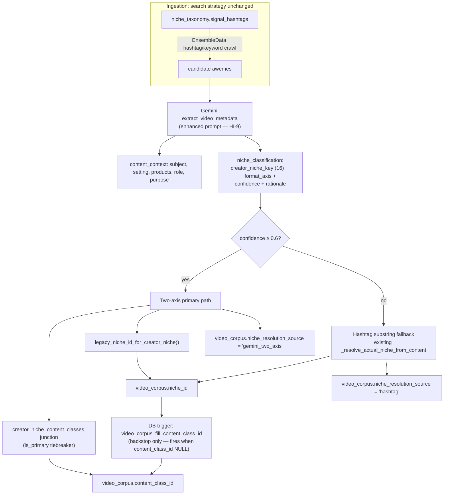
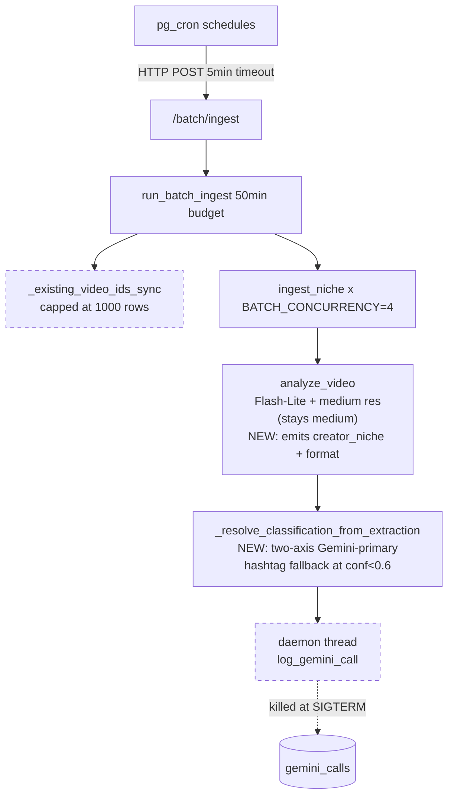
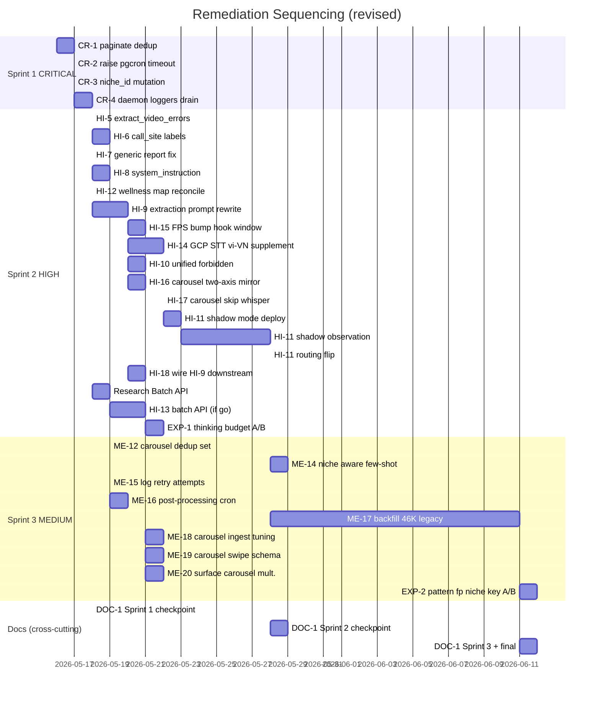

# Pipeline Audit Remediation Plan (revised — quality-first)

30 actionable items from the deep audit of `cloud-run/getviews_pipeline/` and the cross-pipeline conflict review: 14 surviving original audit findings (CR-1..CR-4 + HI-5..HI-11 + ME-12 + ME-14..ME-16; ME-13 dropped) + 15 follow-on items added through 5 rounds of stress-testing (HI-12 wellness mapping, research-batch-api gate, HI-13 conditional Batch API, HI-14 GCP STT supplement, HI-15 hook FPS bump, HI-16 carousel two-axis mirror, HI-17 carousel Whisper skip, **HI-18 wire HI-9 enrichment into downstream consumers**, EXP-1 thinking budget A/B, **EXP-2 pattern_fingerprint niche-key A/B**, ME-17 backfill, ME-18 carousel ingestion tuning, ME-19 carousel swipe schema, ME-20 surface carousel multiplier) + 1 cross-cutting docs sweep (DOC-1). Plus 5 deferred items in the appendix.

> **Note on HI-9 ↔ HI-18:** HI-9 upgrades **extraction** (richer JSON written to `analysis_json`). HI-18 upgrades **wiring** (downstream synthesis prompts + error extractor + few-shot prompts actually use the new fields). Without HI-18, HI-9 produces signal that consumers ignore — paid-for cost with no visible quality lift. Treat them as a paired investment.

## Revision note (2026-05-16)

User feedback: **"I don't want to lower the quality of the video extraction, in fact I need us to enhance the video extraction pipeline prompt to accurately capture the context of the video and analyze based on the context."** Hashtag-only niche assignment is producing wrong categorisations and therefore wrong recommendations.

Architectural decision: **Option A — two-axis Gemini classification** (selected 2026-05-16). Gemini outputs both axes natively (`creator_niche_key` + `format_axis`) so the existing two-axis model (creator_niches × content_classifications) is finally driven by the model's understanding instead of being reverse-derived from the legacy `niche_id` axis. See "Three-taxonomy reconciliation" section below.

Net effect on this plan:

- ME-13 (drop `media_resolution=low` in batch) — **removed**. Saving ~$5/mo at the cost of frame fidelity is the wrong trade.
- HI-9 — **expanded** into a full extraction-prompt upgrade: translate to Vietnamese + add `content_context` semantic block + add `niche_classification` outputting both axes (creator_niche + format) with confidence + rationale.
- HI-11 (new) — wire Gemini's two-axis classification as **primary**, derive `content_class_id` via the M:N junction, derive legacy `niche_id` for backward-compat, fall back to existing `signal_hashtag` substring resolver only when Gemini confidence < 0.6. Add `video_corpus.niche_resolution_source` for auditability.
- Honest cost estimate: enhanced extraction likely **adds ~$3–5/mo** (richer prompt = more output tokens), repaid by avoiding the much more expensive cost of wrong recommendations.

## Three-taxonomy reconciliation (read this before HI-9 / HI-11)

The system has three taxonomies. Until now, only one of them (`niche_taxonomy`) drove ingestion + classification, while the new two-axis model (`creator_niches` + `content_classifications`) was reverse-derived via a legacy mapping trigger. This plan flips that.

| Table | Buckets | Role today | Role after HI-9 + HI-11 |
|---|---|---|---|
| `niche_taxonomy` (legacy) | ~15 | Both ingestion search strategy AND classification truth | Ingestion search strategy ONLY (provenance: "this row was found via the Beauty hashtag pool") |
| `creator_niches` | 16 | UX picker + profile self-id | UX + analytical truth (Gemini-classified) |
| `content_classifications` | 74 | Reverse-derived from `(niche_id, format)` via trigger | Derived from Gemini's `(creator_niche_key, format_axis)` via the `creator_niche_content_classes` M:N junction; trigger remains as backstop |

Ingestion strategy does **not** change — we still crawl TikTok via `niche_taxonomy.signal_hashtags`. What changes is post-extraction: Gemini's two-axis classification reassigns the row to its true creator_niche + content_class, regardless of which hashtag pool discovered it.



## Risk register (from cross-pipeline audit, 2026-05-16)

Audited every consumer of the extraction `analysis` dict, every `WHERE niche_id = X` / `WHERE content_class_id = X` filter (Python + TS), every MV that aggregates the affected columns, and every prompt/synthesis path that touches niche metadata.

| # | Risk | Severity | Mitigation lands in |
|---|---|---|---|
| 1 | Pydantic `VideoAnalysis` (`models.py:293-322`) defaults to `extra='ignore'` — new JSON schema fields are silently dropped before storage unless the model is extended | CRITICAL | HI-9 |
| 2 | Plan's enum values were wrong — actual `creator_niches.slug` set is 16 specific values; `content_classifications.format_axis` has 12 granular values like `talking_head_advice` | HIGH | HI-9 (corrected enum lists) |
| 3 | Hardcoded `_content_class_for` ladder at `corpus_ingest.py:891-997` will disagree with Gemini's two-axis `content_class_id` if both run | HIGH | HI-11 (bypass ladder when source=gemini_two_axis) |
| 4 | Wellness creator_niche=10: Python maps to 26, TS returns null — pre-existing BE/FE mismatch | HIGH | New HI-12 (blocker for HI-11) |
| 5 | `creator_niche_id_for_legacy_niche()` inverse helper missing in Python + TS — needed for hashtag-fallback path | HIGH | HI-12 |
| 6 | Old corpus rows have NULL niche_classification — `model_validate` on cache hit explodes if new fields are required | CRITICAL | HI-9 (Optional + defaults) |
| 7 | `CAROUSEL_EXTRACTION_PROMPT` is separate but writes to same `video_corpus`; without parallel update, corpus becomes bimodal | HIGH | HI-9 (mirror in carousel prompt + schema) |
| 8 | Live SSE shares `VIDEO_EXTRACTION_PROMPT` via `routers/intent.py:379` — extra ~300-500 output tokens per cold-cache live diagnosis | MED | **Decision: share single prompt** (one source of truth, ~$0.001 per cold live video, negligible) |
| 9 | 25+ `WHERE niche_id = X` filters across BE + FE will see redistributed row sets after HI-11 (`compute_pulse`, `morning_ritual`, `report_pattern_compute`, `script_data`, `corpus_context`, `channel_diagnose`, `video_analyze.py:238` KPIs, plus `useVideoCorpus`, `useTopPatterns`, `ExploreScreen`, `useTrendsRailVideos`) | HIGH | HI-11 (shadow mode + manual sample audit before flip) |
| 10 | MV refresh is ingest-driven (`corpus_ingest.py:2142` RPC); CR-1 abort or ME-16 split can skip it; MVs stale after HI-11 deploy until next refresh | MED | HI-11 deploy gate (manual refresh) + ME-16 |
| 11 | `niche_spread` on patterns drifts after HI-11 (`pattern_fingerprint.py:324-352`); cross-niche pattern decks noisier until backfill | MED | ME-17 (backfill) + accept short-term drift |
| 12 | `hook_effectiveness` table churns as `content_class_id` redistributes (`hook_effectiveness_compute.py:73-162`) | MED | recompute after stabilization (in HI-11 deploy gate) |
| 13 | `cross_format.py` references `vlog_destination` label not in seed | LOW | fix in pass with HI-9 |
| 14 | `pattern_id` (`compute_signature` 7-key hash) unaffected by new fields — stable | OK | none |
| 15 | `pulse.adequacy` count-based — adapts under redistribution; tier flags may flip more often (cosmetic) | LOW | observe |

**Architectural decisions (locked 2026-05-16):**
- Live SSE uses the **same** enriched prompt as batch (single source of truth; ~$0.001/cold-cache live video is acceptable)
- HI-11 ships in **shadow mode for 3-7 days** before routing flip; manual 100-row agreement audit gates the flip

## Estimated impact if all critical+high are shipped

- Stops daily Gemini bleed (dedup re-extraction, CR-1): **~$30/mo saved**
- `extract_video_errors` thinking-token leak (HI-5): **~5–30% per diagnosed video saved**
- Context caching `_DOMAIN_KNOWLEDGE` etc. (HI-8): **~$8–10/mo saved**
- Vietnamese-only + enhanced extraction prompt (HI-9): **~$3–5/mo added**, but eliminates niche-mismatch class of errors
- Wire HI-9 enrichment into downstream consumers (HI-18): **~$0/mo added** (prompt tokens only, no extra Gemini calls); without HI-18, HI-9's investment is invisible — paid for, ignored
- Gemini-primary niche resolver (HI-11): **quality lift**; expected impact = fewer "wrong niche → wrong peers → wrong analysis" cascades
- Batch API for corpus ingest (HI-13, conditional on research): **~$15–25/mo saved** on the batch path if research green-lights; fully offsets HI-9's added cost
- Vietnamese ASR supplement (HI-14): **~$3-8/mo added**; material accuracy lift on `audio_transcript` and `hook_phrase` for music-heavy videos
- Gemini FPS bump for hook window (HI-15): **~$1-2/mo added**; ~20% more sub-second hook events captured
- Carousel two-axis classification mirror (HI-16): **~$0.5-1/mo added**; carousels participate in classification on equal footing with videos
- Skip Whisper for carousels (HI-17): **~$0.50-1/mo saved** (free win)
- Carousel schema enrichment (ME-19): **~$0.5/mo added**; captures swipe psychology
- Carousel ingestion volume tuning (ME-18): **~$1-2/mo added**; better corpus representation in carousel-heavy niches
- Surface carousel multiplier insight (ME-20): **$0**; existing computation, just plumb to UI prompts
- ME-17 backfill of legacy 46K rows: **one-time ~$10** spread over 14 nights
- Net (research lands "go"): **~$45–55/mo saved + restored cost observability + 4 silent quality bugs fixed + niche-mismatch class of errors eliminated + Vietnamese transcription accuracy lift + sub-second hook capture + corpus self-funded**
- Net (research lands "no-go"): **~$25–35/mo saved**, same quality lift but HI-9+HI-14+HI-15 added cost stays out-of-pocket
- Tradeoff framing: this plan trades **~$10-15/mo of quality investments** (HI-9 + HI-14 + HI-15) for systematic accuracy lift on Vietnamese transcription, hook capture, and niche classification — on top of **~$50/mo of pure cost reductions** that fully fund those investments

## Architecture context



The dashed nodes are the two structural defects causing most of the unexplained spend. The `resolver` node is the new quality-defense gate.

---

## Sprint 1 — CRITICAL (1–2 dev-days)

Stops daily bleed and restores cost observability. Each is independently revertable.

### CR-1: Paginate dedup query + lift to single snapshot per run

[cloud-run/getviews_pipeline/corpus_ingest.py](cloud-run/getviews_pipeline/corpus_ingest.py) line 2097

Current: `client.table("video_corpus").select("video_id").execute()` returns max 1000 rows from a 46K-row corpus. Re-runs per niche in parallel. Re-extracts thousands of videos nightly at ~$0.005 each.

Fix: Add `_load_all_existing_video_ids()` helper paginating via `.range()` in 1000-row chunks. Call once at top of `run_batch_ingest`. Pass snapshot into `ingest_niche` instead of refetching.

### CR-2: Raise pg_cron HTTP timeout to match wall-clock budget

[supabase/migrations/20260509000001_pg_cron_data_pipeline.sql](supabase/migrations/20260509000001_pg_cron_data_pipeline.sql) line 80

Current: `timeout_milliseconds := 300000` (5 min). New Python budget is 50 min. pg_cron severs the request long before the Python guard fires.

Fix: Update live pg_cron job via Supabase MCP `cron.alter_job(job_id, timeout_milliseconds := 3120000)`. Write a new migration documenting the new value. Verify with `SELECT * FROM cron.job WHERE jobname = 'cron-batch-ingest';`.

### CR-3: Replace mid-loop `niche_id` mutation with per-aweme local

[cloud-run/getviews_pipeline/corpus_ingest.py](cloud-run/getviews_pipeline/corpus_ingest.py) lines 1929 and 2002

Current: `niche_id = _niche_override` rebinds the enclosing function variable. Every subsequent aweme in the batch gets attributed to the override niche. Poisons downstream peer benchmarks.

Fix: Use `effective_niche_id = _niche_override or niche_id` per-aweme local. Pass `effective_niche_id` to `_ingest_candidate_awemes`.

### CR-4: Drain daemon-thread cost loggers on SIGTERM

[cloud-run/getviews_pipeline/gemini_cost.py](cloud-run/getviews_pipeline/gemini_cost.py) lines 319-325 and [cloud-run/getviews_pipeline/ensemble.py](cloud-run/getviews_pipeline/ensemble.py) lines 257-261

Current: `threading.Thread(daemon=True)` per call. Cloud Run SIGTERM kills in-flight daemons after 10s grace. Up to 16 telemetry rows lost per scaling/redeploy.

Fix: Maintain module-level pending-thread set; register `atexit.register(drain_pending)` in both modules; drain joins with 8s deadline (under Cloud Run's 10s grace).

---

## Sprint 2 — HIGH (9–11 dev-days; HI-11 shadow phase adds 5 calendar days of observation)

Fixes silent quality bugs **and the niche-mismatch root cause**, wires the new extraction signal into downstream synthesis prompts (HI-18), plus the accuracy lifts (Vietnamese ASR, hook FPS bump, carousel two-axis) and the conditional Batch API path.

### HI-5: `extract_video_errors` should use extraction model + thinking_budget=0

[cloud-run/getviews_pipeline/services/extraction.py](cloud-run/getviews_pipeline/services/extraction.py) line 484

Currently uses `GEMINI_SYNTHESIS_MODEL` and inherits default thinking budget. Comment at `gemini.py:118-123` documents ~6× output-token inflation when thinking is left on for extraction-style calls. Runs on every diagnosed video.

Fix: Switch to `GEMINI_EXTRACTION_MODEL`, add `thinking_budget=0`, add `call_site="extract_video_errors"`.

### HI-6: Add `call_site=` label to 19 unlabeled Gemini call sites

19 call sites log to `gemini_calls.call_site = "unknown"` (~60% of cost invisible by site). Locations: `services/extraction.py:484`, `script_generate.py:512`, `morning_ritual.py:523`, `pattern_deck_synth.py:329`, `pattern_fingerprint.py:281`, `report_compare.py:260`, `report_diagnostic_gemini.py:112`, `report_ideas_gemini.py:142`, `report_lifecycle_gemini.py:98`, `report_pattern_gemini.py:250`, `report_timing_gemini.py:99`, `pipelines.py:753`, `pipelines.py:2537`, `layer0_hashtag.py:289`, `layer0_migration.py:146`, `thumbnail_analysis.py:72`, `douyin_translator.py:183`, `douyin_synth.py:280`, `douyin_patterns_synth.py:341`.

Fix: One-line change per call site — add a descriptive `call_site=` kwarg matching the function name. ~30 minute PR.

### HI-7: Fix silently-broken `gemini_text_only` call in Generic report

[cloud-run/getviews_pipeline/report_generic_gemini.py](cloud-run/getviews_pipeline/report_generic_gemini.py) line 104

Calls `gemini_text_only(prompt=..., max_output_tokens=320)` but signature is `gemini_text_only(message, session_context)`. Surrounding `try/except Exception` swallows the `TypeError` and returns `[]`. Every off-taxonomy Generic report has been silently falling back to deterministic copy.

Fix: Either change the call site to `gemini_text_only(prompt, {})` OR extend `gemini_text_only` signature to accept `max_output_tokens`. Add a unit test asserting the call no longer raises.

### HI-8: Move static system prompts to `system_instruction` + Gemini context cache

[cloud-run/getviews_pipeline/prompts.py](cloud-run/getviews_pipeline/prompts.py) line 128 (`_DOMAIN_KNOWLEDGE`, ~1500 tok), [cloud-run/getviews_pipeline/voice_guide.py](cloud-run/getviews_pipeline/voice_guide.py) line 14 (~2000 tok), [cloud-run/getviews_pipeline/channel_diagnose_prompts.py](cloud-run/getviews_pipeline/channel_diagnose_prompts.py) line 22 (~1400 tok)

Currently re-sent on every synthesis call. No use of `system_instruction`, no `cachedContents`.

Fix in two phases:
- Phase A: refactor synthesis call sites to pass static blocks via `GenerateContentConfig(system_instruction=...)`.
- Phase B: implement `cachedContents` keyed by content-hash via the Gemini SDK's caching helper.

### HI-9: Rewrite `VIDEO_EXTRACTION_PROMPT` — Vietnamese + semantic context + two-axis niche classification (REVISED)

[cloud-run/getviews_pipeline/prompts.py](cloud-run/getviews_pipeline/prompts.py) lines 29-65 + corresponding Pydantic schema in [cloud-run/getviews_pipeline/services/extraction.py](cloud-run/getviews_pipeline/services/extraction.py)

This is now a **quality investment**, not a cost cut. Three things land in one prompt rewrite + one schema bump:

**(a) Translate prompt to pure Vietnamese.** Mixed English instructions degrade `audio_transcript` quality (the #1 known pre-launch quality issue). Keep field names + enum values in English (they live in the schema).

**(b) Add `content_context` block** — semantic understanding the model currently produces only by accident:

```
content_context: {
  subject_matter: string  // ONE Vietnamese sentence: "Video review serum vitamin C cho da dầu"
  primary_subjects: list<string>  // ["serum vitamin C", "creator nữ tuổi 20-25", "kệ skincare"]
  setting: string  // "phòng ngủ ánh sáng tự nhiên" | "studio đèn ring" | "ngoài trời quán cà phê"
  products_mentioned: list<{name, brand?, category}>  // explicit named products
  creator_role: enum  // "expert" | "user_reviewer" | "storyteller" | "performer" | "tutorial_host"
  dominant_actions: list<string>  // ["bôi serum lên mặt", "so sánh trước/sau", "trỏ vào camera"]
  content_purpose: enum  // "educate" | "entertain" | "sell" | "inspire" | "review" | "react"
  language_register: enum  // "casual" | "formal" | "youth_slang" | "expert_jargon"
  topical_hashtags_implied: list<string>  // hashtags the content WOULD warrant, even if absent from caption
}
```

**(c) Add `niche_classification` block — TWO AXES native to the post-PR1 model.**

The actual current schema (verified against live seed migrations) uses `creator_niches.slug` (not `niche_key`) and `content_classifications.format_axis` has 12 granular values. Plan body now lists the canonical sets:

```
niche_classification: {
  creator_niche_slug: enum  // one of 16 creator_niches.slug values:
                            // "beauty" | "fashion" | "food" | "lifestyle" | "comedy" |
                            // "family" | "education" | "tech_gaming" | "business" | "wellness" |
                            // "travel" | "auto" | "pets_home" | "gym_fitness" | "music_dance" | "real_estate"
  format_axis: enum         // ~12 distinct content_classifications.format_axis values
                            // (final list pulled from live SELECT at prompt build time —
                            //  examples: "talking_head_advice", "tutorial_step_by_step",
                            //  "product_review", "vlog_destination" if seed updated, etc.)
  confidence: float         // 0.0–1.0 — joint confidence over both axes
  rationale: string         // ONE Vietnamese sentence justifying both choices
  alternative_creator_niche_slug: enum | null  // second-best bucket if confidence < 0.8, else null
}
```

The two-axis output is what enables HI-11's deterministic derivation of `content_class_id` via the `creator_niche_content_classes` junction.

**(d) MIRROR in `CAROUSEL_EXTRACTION_PROMPT`** — carousels write to the same `video_corpus` table at [cloud-run/getviews_pipeline/prompts.py:67](cloud-run/getviews_pipeline/prompts.py:67). Without a parallel update, the corpus becomes bimodal (videos have classification, carousels don't). Mirror both `content_context` and `niche_classification` in the carousel prompt.

**(e) Pydantic model extension** — this is the part that makes the new fields actually persist.

[cloud-run/getviews_pipeline/models.py](cloud-run/getviews_pipeline/models.py) line 293-322: `VideoAnalysis` defaults to `extra='ignore'`. Adding fields to the JSON schema and prompt **without** extending this model means `extraction.py:572,621-622,689-691` and `analysis_core.py:81-162` silently drop the new keys via `model_validate` / `model_dump`.

Required changes:
- Add `ContentContext` and `NicheClassification` sub-models with **all fields Optional[…] = None** so old `analysis_json` rows continue to validate (corpus cache hit path at `analysis_core.py:511-527` replays stored dicts)
- Add `content_context: ContentContext | None = None` and `niche_classification: NicheClassification | None = None` to `VideoAnalysis`
- Update `VideoAnalysis.model_json_schema()` callers — Gemini schema must match the Pydantic model exactly
- Add explicit `extra='ignore'` to be defensive (no behavior change, just makes it grep-able)

**Pre-work for prompt accuracy:** before drafting the prompt body, generate a Vietnamese label glossary from the live tables:

```sql
SELECT id, slug, vi_label, vi_description, display_order
FROM creator_niches
WHERE active = true
ORDER BY display_order;

SELECT DISTINCT format_axis FROM content_classifications;

SELECT cn.slug AS creator_niche_slug, cc.format_axis, cc.id, cc.label_vn
FROM creator_niche_content_classes ccc
JOIN creator_niches cn ON cn.id = ccc.creator_niche_id
JOIN content_classifications cc ON cc.id = ccc.content_class_id
ORDER BY cn.display_order, cc.format_axis;
```

Inline the human-meaningful Vietnamese labels in the prompt so the model classifies against names creators understand, not snake_case enum keys.

**Junction coverage check:** before flipping HI-11 routing, verify every `(creator_niche_id × format_axis)` combination Gemini might emit has at least one row in `creator_niche_content_classes`. If a Beauty creator does `vlog_destination` and the junction has no Beauty→vlog_destination row, the resolver returns NULL `content_class_id` and the trigger backstop fires with `(legacy_niche_id, content_format)` from the legacy axis — producing a row internally inconsistent with Gemini's intent. Add the missing junction rows or accept a logged downgrade per case.

**Few-shot examples:** include 3 worked examples in the prompt (Beauty review, Food vlog, Comedy skit) showing the full two-axis classification + rationale, sourced from the highest-view videos already in `video_corpus` for those niches. Refresh quarterly.

**Why one call, not two:** Gemini already has the video frames in context. A second call would re-pay video token cost (~256 tok/frame × N frames = the dominant cost). Enriching the existing single call adds ~300–500 output tokens, ~$0.001 per video.

**Live SSE impact:** `routers/intent.py:379 → pipelines.py:1689 → gemini.analyze_video` shares this prompt for cold-cache live diagnosis. Locked decision: **same enriched prompt for live and batch** — single source of truth, +1-2s live latency on cold cache, ~$0.001 per cold-cache live video. Live diagnoses also get the richer context as a side benefit.

**Why keep `thinking_budget=0`:** classification + structured fact extraction are deterministic schema-fill tasks. Thinking-mode billed at full output rate would inflate cost ~6× per `gemini.py:118-123`, with no measured quality lift on this class of task. We invest in prompt clarity + few-shot, not in thinking tokens.

**Acceptance:**
- Unit test asserts every successful extraction returns non-null `content_context.subject_matter`, `niche_classification.creator_niche_slug`, `niche_classification.format_axis`
- Unit test asserts old corpus rows with NULL new fields still validate via `VideoAnalysis.model_validate` (Optional + defaults)
- Pydantic validator rejects `creator_niche_slug` not in the live `creator_niches.slug` set (loaded at app startup, refreshed on `SIGHUP`)
- Pydantic validator rejects `format_axis` not in the live `content_classifications.format_axis` set
- Carousel ingest path produces identical schema shape (same sub-models, same Optional discipline)
- Junction coverage probe: integration test that asserts `creator_niche_content_classes` has at least one row for each `(creator_niche × format_axis)` combination Gemini's enum can emit; missing combinations produce explicit warnings, not silent NULLs

### HI-10: Unify forbidden-phrase block across 8 prompts

Sources of truth divergence: `voice_lint.py:30-57` (canonical), `voice_guide.py:35-46`, `channel_diagnose_prompts.py:41-42`, `morning_ritual.py:251`, `douyin_synth.py:270`, `douyin_patterns_synth.py:330`, `services/extraction.py:470`, `layer0_prompts.py:274`. Each list differs.

Fix: Add `voice_lint.build_forbidden_phrases_prompt_block()` returning a Vietnamese-language injectable string built from canonical `FORBIDDEN_OPENERS + FORBIDDEN_WORDS`. Inject in every prompt that needs copy rules.

### HI-12: Reconcile creator_niche → legacy mapping BE/FE + add inverse helper (NEW, blocker for HI-11)

[cloud-run/getviews_pipeline/profile_niches.py:41](cloud-run/getviews_pipeline/profile_niches.py:41) and [src/lib/profileNiches.ts:102](src/lib/profileNiches.ts:102)

Pre-existing bug surfaced by HI-11 audit: Python `legacy_niche_id_for_creator_niche()` maps creator_niche `10 (wellness) → 26`, TS returns `null` for the same input. Cloud Run can query `niche_id = 26` while FE-side niche-scoped queries skip the same data — silent bimodal behavior.

**Decision required (one-line):** is wellness's legacy_niche_id `26`, or is wellness intentionally legacy-orphan? Verify that `niche_taxonomy.id = 26` exists and represents wellness; if so, fix TS to mirror Python. If wellness is intentionally legacy-orphan, fix Python to mirror TS (return None) and accept that wellness corpus rows will fall through to default in HI-11's hashtag-fallback path.

**Inverse helper to add (new in this task):**
- Python `creator_niche_id_for_legacy_niche(legacy_niche_id: int) -> int | None` — wraps the existing SQL `map_legacy_niche_to_creator_niche` or implements the inverse table directly in `profile_niches.py`
- TS `creatorNicheIdForLegacyNiche(legacyNicheId: number): number | null` mirror in `src/lib/profileNiches.ts`
- Unit tests asserting BE/FE return identical values for all 16 creator_niche IDs and all 15 legacy niche_taxonomy IDs (round-trip property test)

Required to land **before** HI-11 because HI-11's hashtag-fallback branch uses this helper to populate `creator_niche_id` regardless of source.

### HI-11: Two-axis niche resolver — shadow mode → routing flip (NEW)

[cloud-run/getviews_pipeline/corpus_ingest.py](cloud-run/getviews_pipeline/corpus_ingest.py) lines 1175-1206 (current `_resolve_actual_niche_from_content`), call site at line 1656, `_build_corpus_row` at line 1209, and the `_content_class_for` ladder at lines 891-997 (must be bypassed for the gemini path).

Current behaviour: caption + `hook_phrase` substring matched against `niche_taxonomy.signal_hashtags`. Default niche only flips if another niche leads by ≥2 hits. Pure lexical, no semantics. `content_class_id` is then computed from `(possibly-flipped niche_id, content_format from Gemini)` via the legacy `_content_class_for` ladder + DB trigger backstop.

**Locked rollout: shadow mode 3-7 days, then routing flip after 100-row manual agreement audit.**

**Phase 1 — Shadow mode (deploy first):**
- Extraction populates new fields on every row (HI-9 already shipped)
- New `_resolve_classification_from_extraction` runs but **only logs** what it would have routed
- Legacy `_resolve_actual_niche_from_content` keeps writing the canonical `niche_id` and `content_class_id`
- New columns `niche_resolution_source` + `niche_resolution_confidence` are populated as observational data
- Daily admin query: agreement rate between Gemini classification and legacy resolver, by source confidence bucket
- Sample 100 rows manually after 3-7 days; classify each as `agree | gemini_better | legacy_better | both_wrong`. Sign-off threshold: `gemini_better + agree >= 80%` of sampled rows

**Phase 2 — Routing flip (after sign-off):**
Switch `corpus_ingest._build_corpus_row` to use `_resolve_classification_from_extraction`. Gate behind env flag `NICHE_RESOLVER_MODE = shadow | route` for instant revert.

New behaviour (depends on HI-9 two-axis schema):

```python
def _resolve_classification_from_extraction(
    analysis, caption, niche_signal_hashtags_by_id, default_niche_id,
) -> ResolvedClassification:
    """Returns the canonical classification for a corpus row.

    ResolvedClassification holds: creator_niche_id (FK), content_class_id (FK),
    legacy_niche_id (FK for backward compat), source enum, source_confidence.
    """
    cls = (analysis or {}).get("niche_classification") or {}
    confidence = float(cls.get("confidence") or 0.0)

    # 1. Gemini two-axis primary path
    if confidence >= 0.6 and cls.get("creator_niche_slug") and cls.get("format_axis"):
        creator_niche_id = creator_niche_id_for_slug(cls["creator_niche_slug"])
        if creator_niche_id is not None:
            content_class_id = content_class_for_creator_niche_and_format(
                creator_niche_id, cls["format_axis"],
            )  # uses creator_niche_content_classes; is_primary tiebreaker
            legacy_niche_id = legacy_niche_id_for_creator_niche(creator_niche_id)
            # CRITICAL: when source = gemini_two_axis we BYPASS _content_class_for ladder
            # at corpus_ingest.py:891-997. The ladder uses (legacy_niche_id, content_format)
            # which would disagree with the junction-derived content_class_id.
            return ResolvedClassification(
                creator_niche_id=creator_niche_id,
                content_class_id=content_class_id,  # if None, _build_corpus_row writes NULL
                                                    # and trigger fills via legacy path —
                                                    # log a warning so junction gaps are visible
                legacy_niche_id=legacy_niche_id or default_niche_id,
                source="gemini_two_axis",
                source_confidence=confidence,
            )

    # 2. Hashtag fallback — existing _resolve_actual_niche_from_content + ladder
    legacy_nid, _hits = _resolve_actual_niche_from_content(
        analysis, caption, niche_signal_hashtags_by_id, default_niche_id,
    )
    creator_niche_id = creator_niche_id_for_legacy_niche(legacy_nid)  # HI-12 helper
    # Hashtag path keeps using the existing _content_class_for ladder via the trigger
    # backstop — preserves today's behaviour for low-confidence rows
    return ResolvedClassification(
        creator_niche_id=creator_niche_id,
        content_class_id=None,  # let DB trigger fill from (legacy_nid, content_format)
        legacy_niche_id=legacy_nid,
        source="hashtag" if legacy_nid != default_niche_id else "default",
        source_confidence=0.0,
    )
```

**Carousel parallel path:** The same resolver wraps the carousel ingest path. `CAROUSEL_EXTRACTION_PROMPT` (HI-9 mirror) emits the same `niche_classification` block; the resolver call site is identical.

**Ladder bypass detail:** `_build_corpus_row` currently calls `_content_class_for(niche_id, content_format)` unconditionally. Change: only call the ladder when `source != "gemini_two_axis"`. When source = gemini_two_axis, write the junction-derived `content_class_id` directly. The DB trigger at [supabase/migrations/20260630000001_auto_fill_content_class_id_trigger.sql](supabase/migrations/20260630000001_auto_fill_content_class_id_trigger.sql) is a no-op when the column is already set.

Confidence threshold of `0.6` is conservative — only confident Gemini classifications win. Low-confidence and missing-classification cases keep current safe behaviour. The DB trigger at [supabase/migrations/20260630000001_auto_fill_content_class_id_trigger.sql](supabase/migrations/20260630000001_auto_fill_content_class_id_trigger.sql) remains as a backstop for any path that produces NULL `content_class_id`.

**Schema additions (one migration):**
- `ALTER TABLE video_corpus ADD COLUMN niche_resolution_source TEXT CHECK (niche_resolution_source IN ('gemini_two_axis', 'hashtag', 'default'))`
- `ALTER TABLE video_corpus ADD COLUMN niche_resolution_confidence REAL CHECK (niche_resolution_confidence BETWEEN 0 AND 1)`
- (optional, deferred to ME) `ALTER TABLE video_corpus ADD COLUMN creator_niche_id INTEGER REFERENCES creator_niches(id)` — denormalised pointer for cross-axis queries; today the same info is reachable through `content_class_id → creator_niche_content_classes`, but the direct column makes admin/audit queries simpler.

**Helper functions to add (shared SQL + Python):**
- `creator_niche_id_for_slug(slug TEXT) → INT` — wraps `SELECT id FROM creator_niches WHERE slug = $1 AND active`
- `content_class_for_creator_niche_and_format(creator_niche_id INT, format_axis TEXT) → INT | NULL` — joins `creator_niche_content_classes → content_classifications`, picks `is_primary` first then highest-coverage match
- `creator_niche_id_for_legacy_niche(legacy_niche_id INT) → INT | NULL` — provided by HI-12

**Deploy gate (must execute in this order):**
1. HI-12 lands first (BE/FE wellness mapping reconciled, inverse helper available)
2. HI-9 lands (Pydantic + JSON schema + prompts updated; carousel mirror; backward compat for old rows verified)
3. HI-11 deploys in **shadow mode** (`NICHE_RESOLVER_MODE=shadow`)
4. Wait 3-7 days; sample 100 rows manually; sign-off
5. Set `NICHE_RESOLVER_MODE=route` in batch + user pod env
6. **Immediately after flip:** manually trigger MV refresh —
   `SELECT public.refresh_niche_intelligence();`
   `SELECT public.refresh_content_class_intelligence();`
   then re-run `hook_effectiveness_compute` once
7. ME-17 backfill cron starts the night after the flip (re-classifies the 46K legacy rows over ~14 nights)

**Acceptance:**
- Migration adds `niche_resolution_source` + `niche_resolution_confidence` (+ optional `creator_niche_id` denorm)
- Unit tests for: high-confidence Gemini wins (source = gemini_two_axis, ladder bypassed, junction-derived content_class_id); low-confidence Gemini ignored (source = hashtag, ladder used); missing classification (source = default); junction returns NULL → explicit warning logged then trigger backstop fires
- Integration test: insert row with full Gemini classification, assert `video_corpus.creator_niche_id`, `content_class_id`, `niche_id` all populated and consistent with the M:N junction (no row violates `EXISTS (SELECT 1 FROM creator_niche_content_classes WHERE creator_niche_id = vc.creator_niche_id AND content_class_id = vc.content_class_id)`)
- Carousel ingest path tested with the same fixtures
- Daily admin query: `SELECT niche_resolution_source, COUNT(*), AVG(niche_resolution_confidence) FROM video_corpus WHERE created_at > now() - '24h' GROUP BY 1` for tuning visibility
- After 14 days post-flip, sample 50 rows per source; manual audit; consider tuning the 0.6 threshold based on observed false-positive rate

### RESEARCH (gate for HI-13): Verify Gemini Batch API fits our extraction shape

Output: `artifacts/integrations/gemini-batch-api.md` with explicit go/no-go on each criterion below. Dispatch via `research-agent` (Mode 1: external integration research).

Must confirm before HI-13 implementation begins:

| Criterion | Why it matters | Pass condition |
|---|---|---|
| `google-genai` SDK supports the batch endpoint | We use this SDK throughout `gemini.py` | SDK exposes `client.batches.create()` or equivalent for `models.generateContent`-style calls |
| **Files API videos work in batch mode** | `analyze_video` uploads videos via Files API before calling generateContent | Batch jobs accept Files API URIs as parts |
| `response_json_schema` works in batch | Our extraction is schema-strict, not free-form | Batch supports structured output with same JSON schema input as sync API |
| `thinking_budget=0` + `system_instruction` pass through | Cost defense + HI-8 caching depend on these | Both fields preserved in batch config |
| Per-video failure semantics | We need to know which row failed so we can retry just that one, not the whole batch | Job result contains per-input success/error status; failed inputs identifiable |
| **Actual measured latency** | Nightly ingest budget is bounded — we can't wait 24h for results | P95 < 4h on a 100-video test batch (allows a 22:00 UTC submit → 02:00 UTC results → post-processing at 23:30 UTC the next day; effectively 1-day delay on corpus freshness, acceptable for batch path) |
| **50% pricing on video frame tokens** | Video frames are the dominant cost — discount must apply to them, not just text I/O | Documented or empirically confirmed by submitting a test batch + comparing usage to sync equivalent |
| Compatible with the `cachedContents` from HI-8 | HI-8 caches static system prompts; batch must honor cached content | Confirm via docs or test |

Abort criteria (any one is a no-go):
- Files API videos NOT supported in batch
- 50% discount excludes video tokens
- P95 latency > 8h (would push corpus freshness past 36h, breaks daily ritual cadence)
- Per-video failures opaque (one bad video tanks the whole batch with no row-level visibility)

If research lands "no-go," document the specific blocker and remove HI-13 from the plan. If "go," proceed with HI-13 below.

### HI-13 (TENTATIVE): Route batch corpus ingest through Gemini Batch API

[cloud-run/getviews_pipeline/gemini.py](cloud-run/getviews_pipeline/gemini.py) `analyze_video` + [cloud-run/getviews_pipeline/corpus_ingest.py](cloud-run/getviews_pipeline/corpus_ingest.py) ingest loop

**Conditional on research-batch-api landing "go".**

The Gemini Batch API offers 50% off input + output tokens for async workloads. Our nightly batch ingest is async by design (no user is waiting for a row to land). Live `/stream` cold-cache video diagnosis stays on the real-time path.

**Why this fits cleanly with HI-9:** the enriched extraction prompt adds ~$3-5/mo on the sync API; routing batch through Batch API gives back ~$15-25/mo on the batch path. Net result: HI-9's quality investment is fully self-funding, with margin left over.

**Implementation outline (executed only after research green-lights):**

1. Add `use_batch_api: bool = False` parameter to `analyze_video()`
2. When `True`, build a `batch_job_request` containing the Files API video URI, the same schema config (with `thinking_budget=0` and `system_instruction`), and the prompt
3. `corpus_ingest.py` accumulates per-video batch requests during the niche loop, submits one batch job per niche (or one per run, depending on what the SDK favors)
4. Poll the batch job in a daemon-thread (mirrors existing log_gemini_call pattern but with HI-CR-4's atexit drain hook)
5. On completion, retrieve per-video results and feed them through the existing `_build_corpus_row` flow as if they came from sync
6. Per-video failures route back into the existing 503 retry path on the SYNC API as a fallback
7. Update `gemini_cost.py` `MODEL_PRICING_USD_PER_MTOK` with batch-tier pricing keyed by `(model, batch=True)`; update `log_gemini_call` to capture the `is_batch` flag for cost attribution

**Constraints inherited from existing architecture:**
- Wall-clock budget (CR-2's 50min Python budget) — batch submission must fit. Polling for results can extend beyond if needed; the cron timeout (CR-2's 3120000ms) absorbs it
- `is_processing` flag (TD-3) — batch flow uses different concurrency model; the existing in-memory in-flight set still applies for the user-facing analyze pipeline
- Cost observability (CR-4) — `gemini_calls.is_batch` column lets us slice cost by sync vs batch path; `cost_usd` calculation must use batch-tier pricing when `is_batch=true`

**Acceptance:**
- `cron-batch-ingest` end-to-end run completes with batch path; `gemini_calls` rows show `is_batch=true` and `cost_usd` ≈ 50% of equivalent sync run
- Per-video failure injection test: kill 1 of 10 batch inputs, assert remaining 9 land in `video_corpus`, the 1 failure routes to sync retry, no whole-batch loss
- Latency observability: log batch submission timestamp + completion timestamp on every `batch_job_runs` row to track P95 over time

**Schema delta:**
- `gemini_calls.is_batch BOOLEAN DEFAULT false`
- `MODEL_PRICING_USD_PER_MTOK[(model, "batch")]` table entry per used model

### HI-14: Google Cloud Speech-to-Text supplemental ASR pass (NEW, accuracy lift)

[cloud-run/getviews_pipeline/services/extraction.py](cloud-run/getviews_pipeline/services/extraction.py) (new pre-Gemini step) + [cloud-run/getviews_pipeline/prompts.py](cloud-run/getviews_pipeline/prompts.py) (supplemental block in VIDEO_EXTRACTION_PROMPT)

**Problem:** Vietnamese ASR is a known weak spot in general-purpose vision-language models. TikTok background music routinely buries the speaker; diacritics get destroyed (`khoẻ` → `khoe`); regional accents (Bắc/Trung/Nam) get mistranscribed. The `audio_transcript` field is documented at [prompts.py:32](cloud-run/getviews_pipeline/prompts.py:32) as a CRITICAL RULE and the #1 known pre-launch quality issue.

**Approach: SUPPLEMENT, not REPLACE.** Send video (with audio intact) to Gemini AND inject a pre-extracted Vietnamese ASR transcript as prompt context. Gemini retains its native cross-modal binding (timing, prosody, non-speech audio cues) while getting Vietnamese-specialized ground truth for transcription.

```
SUPPLEMENTAL VIETNAMESE ASR (use as ground truth for audio_transcript and
hook_phrase; correct only if it disagrees with what you actually hear):
[GCP STT vi-VN output with timestamps]
```

**Why Google Cloud STT vi-VN (locked):**
- Stays inside our existing GCP relationship (Cloud Run already runs on GCP; same billing surface)
- No new vendor onboarding; reuses GCP service account
- vi-VN locale is well-supported with diacritic preservation
- ~$0.024/min = $0.012 per 30s video → ~$3-8/mo at current ingest volume
- Cloud Run service can call STT API directly; no proxy needed

**Architecture:**

1. New module `cloud-run/getviews_pipeline/services/asr_vietnamese.py`:
   - `async transcribe_vi(video_url: str) -> ASRTranscript`
   - Downloads video audio track via ffmpeg (already in container)
   - Calls GCP STT v2 with `vi-VN` locale, `model="latest_long"`, enable timestamps
   - Returns timestamped transcript dataclass
2. **Cache by `video_id`** in a new Supabase table `vietnamese_asr_cache (video_id PK, transcript JSONB, created_at)` so multiple downstream Gemini calls (extraction, classification, follow-up diagnosis) share one ASR pass
3. `services/extraction.py` calls `transcribe_vi` BEFORE `gemini.analyze_video`; injects transcript into the prompt via a new `supplemental_asr_block(transcript)` helper in `prompts.py`
4. Apply to **both** batch and live SSE paths (locked decision)
5. Cache hit on existing transcript = no STT call; only Gemini extraction runs
6. STT failure (rare) → log warning, skip the supplemental block, proceed with Gemini-only audio understanding (graceful degradation)

**New env / infrastructure:**
- `GOOGLE_APPLICATION_CREDENTIALS` already on Cloud Run (used for Files API); same SA needs `roles/speech.editor`
- Enable `speech.googleapis.com` API on GCP project
- Migration: `vietnamese_asr_cache` table

**Cost / latency:**
- $0.012 per video × ~600 new videos/night = $7.20/mo (batch); live SSE adds marginally
- Latency: +1-2s sequential before Gemini call; **acceptable for batch** (no user waiting); **trade-off accepted for live** (cold-cache user diagnosis pays this for measurably better Vietnamese transcript quality)

**Acceptance:**
- `vietnamese_asr_cache` row created on first extraction; reused on subsequent calls
- Sampled 50 music-heavy videos: `audio_transcript` accuracy improvement measurable (manual evaluation against ground truth)
- STT failure → warning logged, extraction completes without supplemental block (graceful degradation)
- Cost row in `gemini_calls` includes `gcp_stt_cost_usd` field for total-cost visibility

### HI-15: Gemini native FPS bump for hook window (NEW, accuracy lift)

[cloud-run/getviews_pipeline/gemini.py](cloud-run/getviews_pipeline/gemini.py) `analyze_video` video config

**Problem:** TikTok hooks routinely flash text overlays for 0.3-0.8s (promo codes, hooks like "BÍ MẬT", "ĐỪNG XEM" before reveal). Gemini's default 1 FPS video sampling misses these. Our `hook_timeline` schema requires sub-second event capture (`text_overlay`, `face_enter`, `first_word`).

**Wrong fix (rejected):** manually slice video into N images at 3-5 FPS. Loses motion semantics, audio-visual sync, inflates input tokens 3×.

**Right fix:** use Gemini 3.x `video_metadata` config to request higher effective FPS **only in the hook window**. Native API support, no infrastructure overhead, no token inflation outside the critical 3-second window.

**Implementation:**

```python
# cloud-run/getviews_pipeline/gemini.py — _video_analysis_config
def _video_analysis_config() -> types.GenerateContentConfig:
    config = ...  # existing
    # NEW: dual-window FPS config — high FPS for hook, default for rest
    video_metadata = types.VideoMetadata(
        fps=1.0,  # default for full video
        # Optional: hook-window override at higher fps (3-5)
        # Implemented via two video parts in the request:
        # part 1 = full video at fps=1
        # part 2 = same video clipped to 0-3s at fps=4
    )
    config.video_metadata = video_metadata
    return config
```

Two implementation options to research at build time:
- **Option A:** Send the video twice — once with `fps=1` for the full clip, once clipped to 0-3s with `fps=4`. Higher token cost (~2× hook-window frames) but cleanest API call.
- **Option B:** Use `fps=2` for the entire video (compromise). Simpler, but doubles frames everywhere instead of just the critical window.

Pick A if Gemini 3.x supports two video parts in one generateContent call; B as fallback.

**Apply to both batch and live SSE (locked decision)** — single source of truth, consistent extraction shape everywhere. Aggressive caching (HI-8 context cache + the existing video_corpus dedup) means a video is processed at high FPS exactly once.

**Cost:** Option A adds ~10-15 frames in the hook window per cold-cache video (~3K input tokens, ~$0.001). Option B doubles all frames (~$0.002 per video). Negligible at scale.

**Latency:** +200-500ms on cold-cache extraction. Live SSE pays this once per video; subsequent diagnoses hit cache.

**Acceptance:**
- Sampled 30 hook-heavy videos: comparison shows ≥20% more `hook_timeline[]` events captured at 0.1-0.8s positions (currently missed)
- `face_appears_at` precision improves on videos where face enters at 0.3-0.7s
- No regression on `scenes[].motion` enum accuracy (motion semantics preserved by native FPS, unlike manual slicing)
- Cost per extraction increases by < $0.002 documented in `gemini_calls` cost rows

### EXP-1: A/B test thinking_budget for niche_classification (NEW, decision experiment)

[cloud-run/getviews_pipeline/gemini.py](cloud-run/getviews_pipeline/gemini.py) `_extraction_json_config`

Runs **after** HI-9 + HI-14 + HI-15 are stable (~7 days post-deploy).

**Question being tested:** for the new HI-9 `niche_classification` field, does enabling `thinking_budget=low` (~50-200 reasoning tokens, ~1.5-2× output cost) measurably improve classification accuracy vs the current `thinking_budget=0`?

**Background:** existing `thinking_budget=0` rationale at [gemini.py:119-123](cloud-run/getviews_pipeline/gemini.py:119-123) is correct for **deterministic schema fill** (transcription, scene detection). HI-9's niche_classification is borderline — has a small reasoning component (cross-reference audio + visual + caption to assign one of 16 buckets) but also follows a defined enum. Empirical question, not theoretical.

**Method:**
1. Sample 100 videos that have shipped through HI-9 with niche_classification populated
2. Manual labeling — human assigns each to one of 16 creator_niches with confidence rating
3. Re-run extraction on the same 100 videos with `thinking_budget=low` (separate column to avoid overwriting production data)
4. Measure agreement: production (thinking=0) vs experimental (thinking=low) vs human ground truth
5. Report: agreement rate per source, confidence calibration, cost delta

**Decision criteria:**
- thinking=low **agreement lift > 5%** AND **cost increase < 50%** of base extraction → promote to HI item, enable for niche_classification step
- Otherwise → keep at thinking=0, document the experiment in `artifacts/integrations/`

**Effort:** 0.5 day for manual labeling + scripted A/B run. Output: `artifacts/integrations/niche-classification-thinking-budget-experiment.md`.

### EXP-2: A/B test pattern_fingerprint with niche-key as 8th hash key (NEW)

[cloud-run/getviews_pipeline/pattern_fingerprint.py:281](cloud-run/getviews_pipeline/pattern_fingerprint.py) `compute_signature`

Runs **after** HI-18 + ME-17 backfill is complete (~30-45 days post-HI-11 flip).

**Question being tested:** does adding `creator_niche_slug` as an 8th key to `compute_signature` produce sharper, more useful patterns — or does it just fragment the historical pattern table for no quality gain?

**Background:** today `compute_signature` hashes 7 fields from extraction (`hook_type`, `content_arc`, `tone`, `energy_level`, `transitions_per_second_bucket`, `text_overlay_density_bucket`, `cta_present`). Patterns cluster across niches — e.g. "duet talking_head_advice high_energy" pattern includes Beauty + Tech + Wellness videos. Sometimes that's a strength (truly cross-niche format insight); sometimes it's noise (a Beauty review pattern shouldn't share a bucket with a Tech tutorial).

**Method:**

1. Snapshot current pattern table after ME-17 backfill is complete (`pattern_id` distribution stable)
2. Compute "experimental" signatures with 8th key = `creator_niche_slug` for the same 200 video sample
3. For each cluster (control 7-key vs experimental 8-key):
   - Measure intra-cluster cosine similarity on hook_phrase embeddings (more similar = tighter cluster)
   - Measure cross-niche fragmentation: how many control patterns split into N>1 experimental patterns?
   - Manual rating: 50 random pattern theses scored 1-5 for "actionable for the recommended niche"
4. Report: tightness gain (Δ cosine sim), fragmentation cost (avg patterns-per-control-pattern), thesis quality lift

**Decision criteria:**
- Tightness gain ≥ 0.1 cosine similarity AND fragmentation ≤ 1.5× (i.e. each control pattern splits into ≤1.5 experimental patterns on average) AND manual rating lift ≥ 0.5 → promote to permanent change
- Otherwise → keep at 7 keys, document the experiment

**If promoted:** schema migration to invalidate old `pattern_id` values, recompute `hook_effectiveness` table, refresh pattern-related MVs. This is destructive enough that the experiment must clearly justify the cost.

**Effort:** 1 day (sampling + scripting + manual rating + writeup). Output: `artifacts/integrations/pattern-fingerprint-niche-key-experiment.md`.

### HI-16: Carousel two-axis classification mirror (NEW, parallel to HI-9 for videos)

[cloud-run/getviews_pipeline/prompts.py](cloud-run/getviews_pipeline/prompts.py) `CAROUSEL_EXTRACTION_PROMPT` (line 67-82) + [cloud-run/getviews_pipeline/models.py](cloud-run/getviews_pipeline/models.py) `CarouselAnalysis` (line 353)

**Why this needs its own item rather than just being part of HI-9:** carousel format_axis values are different from video format_axis. A carousel is `tutorial_carousel | listicle_carousel | story_carousel | comparison_carousel | gallery_carousel` (mirrors `content_arc` enum we already extract). Video format_axis values like `talking_head_advice` make no sense for static images. The M:N junction `creator_niche_content_classes` needs explicit coverage for every `(creator_niche × carousel_format_axis)` combination, otherwise junction lookups return NULL and the trigger backstop fires inconsistently.

**Schema additions to `CarouselAnalysis`:**
- `content_context: ContentContext | None = None` (same sub-model as VideoAnalysis from HI-9 — reused)
- `niche_classification: CarouselNicheClassification | None = None` — new sub-model with `creator_niche_slug` (16 enum), `carousel_format_axis` (5 enum), `confidence`, `rationale`

**Prompt additions to `CAROUSEL_EXTRACTION_PROMPT`:**
- Same Vietnamese label glossary as HI-9 (creator_niches.slug list with vi_label)
- New section explaining carousel_format_axis enum with worked examples
- Same "no markdown, no preamble" system instruction discipline as HI-9

**Junction migration (must precede HI-11 routing flip):**
- Verify `content_classifications` has rows for all 5 carousel format_axis values; add seed rows if missing
- Verify `creator_niche_content_classes` covers each `(creator_niche, carousel_format)` combination; add seed rows if missing (e.g. `beauty + tutorial_carousel`, `fashion + comparison_carousel`)
- Migration: `20260516000010_carousel_format_axis_junction_coverage.sql`

**Acceptance:**
- Unit test asserts every carousel extraction returns non-null `content_context.subject_matter` and `niche_classification.carousel_format_axis`
- Pydantic validator rejects `carousel_format_axis` not in the canonical 5-value set
- Integration test: ingest a tutorial carousel; assert `(creator_niche_id, content_class_id)` resolves to a tutorial-flavored content_class via the junction
- Junction coverage probe: `SELECT COUNT(*) FROM creator_niche_content_classes ccc JOIN content_classifications cc ON ccc.content_class_id = cc.id WHERE cc.format_axis IN (5 carousel formats) GROUP BY ccc.creator_niche_id` returns 16 rows (one per creator_niche)

### HI-17: Skip Whisper for carousels + document FPS as video-only (NEW, free)

[cloud-run/getviews_pipeline/services/extraction.py](cloud-run/getviews_pipeline/services/extraction.py) HI-14 integration point + [cloud-run/getviews_pipeline/gemini.py](cloud-run/getviews_pipeline/gemini.py) HI-15 docstring

**Two free wins bundled:**

1. **Skip HI-14 (GCP STT) for carousels.** Carousels have music tracks but no spoken word relevant to extraction. Running ASR on a carousel produces useless lyric snippets at $0.012 per call. Saves ~$0.50-1.00/mo and removes a noise input. Implementation:
   ```python
   # services/extraction.py — early return in transcribe_vi caller
   if content_type == "carousel":
       return None  # carousels skip ASR; no supplemental_asr_block injected
   ```

2. **Document HI-15 (FPS bump) as video-only.** Add an explicit assert in the analyze_carousel path that `video_metadata.fps` is never set; add a code comment in `_video_analysis_config` clarifying the config doesn't apply to image-only inputs.

**Acceptance:**
- Carousel extraction never triggers a GCP STT bill (verify in usage logs after HI-14 ships)
- Code comment + acceptance test in `gemini.py` documenting FPS as video-only

### HI-18: Wire HI-9 enrichment into downstream consumers (NEW, makes HI-9 valuable)

[cloud-run/getviews_pipeline/output_redesign.py:569-714](cloud-run/getviews_pipeline/output_redesign.py) + [cloud-run/getviews_pipeline/services/extraction.py:392-444](cloud-run/getviews_pipeline/services/extraction.py) + [cloud-run/getviews_pipeline/morning_ritual.py:284-295](cloud-run/getviews_pipeline/morning_ritual.py) + [cloud-run/getviews_pipeline/pattern_deck_synth.py:275-308](cloud-run/getviews_pipeline/pattern_deck_synth.py)

**Why this is a separate item from HI-9:** HI-9 builds the data (richer JSON written to `analysis_json`). HI-18 builds the wiring (downstream prompts actually USE the new fields). Without HI-18, the new `content_context` + `niche_classification` fields are physically present in `json.dumps(user_analysis)` but the synthesis prompt instructions never reference them — Gemini ignores signal it isn't told to use. Cost paid, quality flat.

**Cross-pipeline gap audit (2026-05-16) confirmed four consumers with this pattern:**

#### (a) `output_redesign.build_diagnosis_narrative_prompt` — primary live SSE diagnosis path

This is the prompt that drives `services/diagnosis.run_video_diagnosis_core` → `synthesize_diagnosis_v2` → user-visible diagnosis narrative. Today it does `json.dumps(user_analysis)` and the new HI-9 keys land in the prompt body, but the prompt instructions don't mention them.

Add explicit prompt directives after the existing "INPUT DATA" block:

```
KHI ĐƯA RA CHẨN ĐOÁN:
1. Đọc `content_context.subject_matter` để hiểu video nói về cái gì — không chẩn đoán dựa trên hashtag hoặc giả định.
2. Áp dụng tiêu chuẩn theo `niche_classification.creator_niche_slug`:
   - Beauty/Fashion review: thiếu close-up sản phẩm = nghiêm trọng
   - Food vlog: thiếu shot món ăn = nghiêm trọng; chỉ talking head = trung bình
   - Comedy: hook timing < 0.5s = nghiêm trọng; product close-up không quan trọng
   - Education/Tech: thiếu visual aid hoặc demo = nghiêm trọng
3. Nếu `niche_classification.confidence < 0.6` HOẶC `alternative_creator_niche_slug` không null, ghi chú: "Niche của video này hơi mơ hồ — chẩn đoán theo cả hai góc"
4. Trích `content_context.products_mentioned` vào phần fix nếu video bán hàng/review
5. Dùng `content_context.creator_role` để cá nhân hóa lời khuyên (expert vs user_reviewer vs storyteller)
```

#### (b) `services/extraction.extract_video_errors` (Call 2 in diagnosis flow)

Today's `VideoErrorsExtractionInput` only contains `hook_phrase` + scene summary. Error detection is one-size-fits-all: "missing product close-up" flagged identically for a Beauty review and a Comedy skit (where it's irrelevant).

Schema change to `VideoErrorsExtractionInput` (`models.py`):

```python
class VideoErrorsExtractionInput(BaseModel):
    hook_phrase: str | None = None
    scenes_summary: str
    duration_sec: float | None = None
    # NEW from HI-9 enrichment
    subject_matter: str | None = None      # from content_context.subject_matter
    creator_niche_slug: str | None = None  # from niche_classification.creator_niche_slug
    creator_role: str | None = None        # from content_context.creator_role
    content_purpose: str | None = None     # from content_context.content_purpose
```

`extract_video_errors_prompt` ([services/extraction.py:392-417](cloud-run/getviews_pipeline/services/extraction.py)) gains a niche-rules block:

```
QUY TẮC LỖI THEO NICHE (creator_niche_slug):
- beauty | fashion: phải có close-up sản phẩm trong 3s đầu, phải có before/after hoặc demo
- food: phải có shot món ăn trong 3s đầu (không chỉ talking head)
- comedy | family: hook < 0.5s, không cần close-up sản phẩm
- education | tech_gaming: phải có visual aid (slide, screen recording, demo) trong 5s đầu
- gym_fitness | wellness: phải có demo động tác hoặc trước/sau, không chỉ nói
- (rest: dùng default rule set)
```

#### (c) `morning_ritual._build_prompt` ([morning_ritual.py:284-295](cloud-run/getviews_pipeline/morning_ritual.py))

Today passes only hook summaries to Gemini for ritual generation. With HI-9 shipped, each grounding video has a `content_context.subject_matter` Vietnamese sentence. Inject 1 line per grounding video into the prompt:

```python
grounding_block = "\n".join(
    f"- @{v['author']} ({v['views']:,} views): {v['hook_phrase']}\n"
    f"  Chủ đề: {v.get('content_context', {}).get('subject_matter', 'N/A')}"
    for v in top_grounding_videos
)
```

This grounds the ritual generator in actual subject matter rather than just hook strings, sharpening few-shot quality.

#### (d) `pattern_deck_synth._build_prompt` ([pattern_deck_synth.py:275-308](cloud-run/getviews_pipeline/pattern_deck_synth.py))

Same pattern as (c) — pattern deck synthesis sees `(video_id, creator, views, hook_type, hook_phrase)` per video. Add `subject_matter` and `creator_niche_slug` to make the cross-pattern thesis more specific.

#### Deferred to EXP-2: `pattern_fingerprint.compute_signature` change

`compute_signature` ([pattern_fingerprint.py:281](cloud-run/getviews_pipeline/pattern_fingerprint.py)) builds a 7-key hash that defines pattern identity. Adding `creator_niche_slug` as an 8th key would sharpen niche-specific patterns but **fragment historical patterns** (every existing pattern's signature changes; cross-niche pattern stats reset). Decision-gate experiment, not a default change. See EXP-2.

#### Frontend defer: `api-types.ts VideoEnrichment`

[src/lib/api-types.ts:184-193](src/lib/api-types.ts) doesn't need to change unless we surface "Subject matter" / "Detected niche" on the FE diagnosis screen. Wait for product decision; safe to defer.

**Acceptance:**
- Sample 20 cold-cache live diagnoses pre-HI-18 vs post-HI-18: post-HI-18 narrative copy must reference `subject_matter` text and apply niche-specific quality bars (manual evaluation against rubric)
- `extract_video_errors` produces different error sets for the same video framed as different niches in a controlled test (Beauty review vs Comedy skit fixture): Beauty flags missing close-up as severe; Comedy doesn't
- `morning_ritual` output samples 10 random rituals: each cites at least one grounding video's subject matter in the synthesis (not just hook strings)
- `pattern_deck_synth` output samples 5 pattern decks: each pattern thesis references niche-specific subject matter, not generic hook patterns

**Cost:** negligible — prompt instructions add ~150 tokens, no extra Gemini calls. The existing extraction already produces the data; we just consume it.

**Sequencing:** Lands **after HI-9** ships (extraction must be producing the new fields). Lands **before EXP-1** (so the thinking_budget A/B has the wiring in place to evaluate quality lift). HI-9 + HI-18 should be reviewed as a paired PR or two PRs back-to-back so the gap doesn't ship.

### ME-18: Audit + tune carousel ingestion ratio per niche (NEW)

[cloud-run/getviews_pipeline/settings.py](cloud-run/getviews_pipeline/settings.py) line 116 (`batch_carousels_per_niche: int = Field(default=3, ge=0)`) + [cloud-run/getviews_pipeline/corpus_ingest.py](cloud-run/getviews_pipeline/corpus_ingest.py) line 122

Current setting: **3 carousels per niche per night, uniform across all 16 creator_niches.** With 16 niches × 3 = ~48 carousels/night vs ~600 videos. This is fine if carousels are ~7% of trending content uniformly. They aren't — carousels skew heavily toward beauty/fashion/lifestyle and away from gaming/auto.

**Investigation step (~0.5 day):**
1. Query: `SELECT n.name_vn, COUNT(*) FILTER (WHERE vc.content_type = 'carousel') AS carousels, COUNT(*) FILTER (WHERE vc.content_type = 'video') AS videos, COUNT(*) FILTER (WHERE vc.content_type = 'carousel') * 100.0 / COUNT(*) AS carousel_pct FROM video_corpus vc JOIN niche_taxonomy n ON vc.niche_id = n.id WHERE vc.indexed_at > now() - interval '14 days' GROUP BY n.name_vn ORDER BY carousel_pct DESC` — current corpus carousel ratio
2. EnsembleData sample: pull top 100 trending posts per niche; compute carousel_pct of trending content
3. Compare: where corpus carousel_pct < trending carousel_pct, we're under-sampling

**Tuning step (~0.5 day):**
- Convert `BATCH_CAROUSELS_PER_NICHE` from uniform int to per-niche dict via env var (e.g. `BATCH_CAROUSELS_BY_NICHE = "1=8,2=6,3=2,..."`)
- Beauty/fashion/lifestyle: 6-10 carousels/night; gaming/auto: 1-2; rest: 3
- Document tuning rationale in `artifacts/docs/changelog.md`

**Acceptance:**
- Carousel corpus ratio per niche after 14 days roughly matches trending real-world ratio (within ±3pp)
- Total carousel ingest volume increases ~30-50% with marginal cost (carousels are already cheap; HI-13 batch discount applies if green-lit)

### ME-19: Carousel schema enrichment for swipe psychology (NEW)

[cloud-run/getviews_pipeline/models.py](cloud-run/getviews_pipeline/models.py) `SlideAnalysis` (line 324) + `CarouselAnalysis` (line 353) + [cloud-run/getviews_pipeline/prompts.py](cloud-run/getviews_pipeline/prompts.py) `CAROUSEL_EXTRACTION_PROMPT`

Today's schema captures **what's on each slide** but not **what makes someone swipe**. New fields capture swipe psychology — material lift in carousel diagnosis quality.

**New per-slide fields (`SlideAnalysis`):**
- `swipe_anchor: SwipeAnchorType | None = None` — enum: `cliffhanger_image | incomplete_text | numbered_progression | curiosity_question | none`. What makes the viewer swipe to the NEXT slide.
- `layout: SlideLayoutType | None = None` — enum: `single_image | split_screen | text_only | photo_with_caption | infographic | meme_format`

**New carousel-level fields (`CarouselAnalysis`):**
- `audio_track_role: AudioTrackRoleType | None = None` — enum: `trending_sound | original_music | silent | spoken_overlay`. Trending sound + carousel is a known viral pattern.
- `dominant_color_palette: str | None = None` — short Vietnamese description of color story (e.g. "pastel hồng + nude")
- `slide_pacing_score: float | None = None` — 0-1, evenness of text distribution across slides; uneven pacing predicts swipe drop-off

**Prompt additions to `CAROUSEL_EXTRACTION_PROMPT`:**
- Per-slide `swipe_anchor`: "Tại sao khán giả lại swipe sang slide tiếp theo? Nếu slide này có hình ảnh chưa hoàn chỉnh hoặc text bỏ lửng, đó là 'cliffhanger_image' hoặc 'incomplete_text'."
- `audio_track_role`: explanation of trending sound vs original music vs silent
- `slide_pacing_score`: "Điểm phân bổ text — slide nào dày text, slide nào trống? Pacing đều = 0.8-1.0; pacing lệch = 0.3-0.5"

**Backward compat:** all new fields are `Optional[…] = None`. Old corpus rows continue to validate via the same Pydantic discipline as HI-9. ME-17 backfill picks these up alongside `content_context` + `niche_classification`.

**Acceptance:**
- Unit test asserts new fields populated on every fresh carousel extraction
- Old corpus row replay through `model_validate` still succeeds with NULL new fields
- Sample 20 viral carousels (>500K views): manual evaluation that `swipe_anchor` correctly identifies the swipe mechanism per slide; `audio_track_role` correctly classifies trending vs original

### ME-20: Surface carousel performance multiplier in user-facing diagnoses (NEW)

[cloud-run/getviews_pipeline/corpus_context.py:485](cloud-run/getviews_pipeline/corpus_context.py:485) computes `multiplier = round(carousel_avg / video_recent_avg, 1)` per creator. **This is a high-value insight we already compute but don't surface.**

**Investigation step:**
1. Audit `channel_diagnose.py`, `report_diagnostic.py`, `output_redesign.py` for any reference to `multiplier` or `carousel_avg_views` — confirm whether it's already piped into Gemini synthesis
2. Check user-facing diagnosis output samples: do creators see "your carousels get 3.2× the views of your videos" insights today?

**Implementation step (if absent):**
- Inject the multiplier as an explicit insight line in `build_carousel_diagnosis_narrative_prompt` and the corresponding video diagnosis prompt
- Vietnamese phrasing: "Carousel của bạn đang đạt {multiplier}x view so với video gần đây — nên dồn lực vào format này" (high multiplier) OR "Video của bạn đang vượt carousel {1/multiplier}x — carousel chưa phải thế mạnh" (low)
- Trigger only when `multiplier >= 1.5` or `<= 0.7` (clear signal); skip for ambiguous middle range

**Acceptance:**
- Sample 10 user diagnoses where multiplier >= 1.5: insight line appears in output
- Sample 10 user diagnoses where multiplier in 0.8-1.2 range: insight line is correctly omitted (no noise)

### ME-17: Backfill content_context + niche_classification for legacy 46K rows (NEW)

[cloud-run/getviews_pipeline/routers/admin.py](cloud-run/getviews_pipeline/routers/admin.py) (new endpoint) + new daily cron schedule

After HI-11 ships, new ingests have the two new fields; the existing 46K corpus rows do not. Without backfill the corpus stays bimodal for months — `niche_spread` on patterns drifts, MV recomputes are noisy, and the content_context block is unavailable for retrieval/grounding.

**Approach:** text-only Gemini call (no video re-fetch) that takes the existing `analysis_json` for a row and asks Gemini to classify it. Cheap (~$0.0002/row) and fast (~1s/row). Total: ~$10 for full backfill spread over 14 nights at 3000 rows/night.

**New admin endpoint:** `POST /admin/backfill-classification` with `{batch_size: int = 500}`. Picks rows where `niche_resolution_source IS NULL ORDER BY indexed_at DESC LIMIT batch_size` (newest-first so user-facing benchmarks improve fastest). Calls Gemini text-only with the existing `analysis_json` + the same classification instructions HI-9 added to the live prompt. Writes back `content_context`, `niche_classification`, `niche_resolution_source`, `niche_resolution_confidence`. Idempotent.

**New cron:** `cron-backfill-classification` at 04:00 UTC daily (after batch ingest, before user load). Calls the endpoint with `batch_size=3500`. Auto-stops when no rows match the WHERE clause.

**Acceptance:**
- `SELECT COUNT(*) FROM video_corpus WHERE niche_resolution_source IS NULL` trends to 0 over ~14 days
- After completion, MV refresh produces same row counts as a full reprocess (sanity check)

---

## Sprint 3 — MEDIUM (3–4 dev-days, pre-launch polish + carousel + docs)

### ME-12: Use `set` for O(N) carousel dedup instead of O(N²) `any(...)`

[cloud-run/getviews_pipeline/corpus_ingest.py](cloud-run/getviews_pipeline/corpus_ingest.py) line 1984 — fine today, breaks at `deep_pool=True`.

### ME-14: Niche-aware few-shot for morning ritual

[cloud-run/getviews_pipeline/morning_ritual.py](cloud-run/getviews_pipeline/morning_ritual.py) line 200 — hard-coded Beauty few-shot biases generation across all 10 active niches.

Fix: Implement `_build_few_shot(niche_key, grounding)` picking the highest-view grounding video from the same niche.

### ME-15: Log failed Gemini retry attempts as zero-token rows

[cloud-run/getviews_pipeline/gemini.py](cloud-run/getviews_pipeline/gemini.py) line 243 — Google bills input tokens on every API attempt including 503-retries; we only log the success row.

Fix: After each failed transient attempt inside `_generate_content_models`, fire `log_gemini_call(..., tokens_in=tokens_in, tokens_out=0, success=false, error_code='503', attempt=N)`.

### ME-16: Move post-processing tasks to a separate cron schedule (was ME-11, renumbered)

[cloud-run/getviews_pipeline/corpus_ingest.py](cloud-run/getviews_pipeline/corpus_ingest.py) lines 2618-2654

When wall-clock budget aborts on Sunday, MV refresh + video_dang_hoc + layer0_sound + weekly analytics all skip. Whole week of analytics goes missing.

Fix: Add `cron-batch-postprocessing` at 23:30 UTC; separate `/batch/post-processing` endpoint.

### ME-13 — REMOVED

Dropping `media_resolution=low` for batch was estimated at ~$5/mo savings. Per user feedback, frame fidelity is required for accurate scene + product detection. Stay on `medium`.

### DOC-1: Documentation sweep (NEW, cross-cutting)

Living docs must stay coherent with what shipped. This task runs as a **rolling responsibility** (entries appended to `changelog.md` as items land) plus **three checkpoint commits** at Sprint boundaries and **one final consolidation** after the HI-11 routing flip.

**Files to update:**

| File | What changes | When |
|---|---|---|
| [artifacts/docs/system-design.md](artifacts/docs/system-design.md) | Component map (HI-14 GCP STT, HI-15 FPS config, two-axis classifier in extraction); data-flow diagram for Gemini-driven niche resolution; Batch API path if HI-13 lands; new `vietnamese_asr_cache` table | End of Sprint 2 + after HI-11 flip |
| [CLAUDE.md](CLAUDE.md) | "Niche model — two-axis (since 2026-05-13)" section: update to reflect Gemini-primary resolver and `niche_resolution_source` provenance; "LLM rules" section: add HI-14 ASR + HI-15 FPS config; "Critical invariants" section: add TD-6 (junction coverage required for content_class_id derivation) and TD-7 (live SSE shares enriched extraction prompt with batch) | End of each Sprint |
| [.cursor/rules/project.mdc](.cursor/rules/project.mdc) | "Key constraints" section mirrors CLAUDE.md updates; "LLM rules" section adds GCP STT vi-VN as approved supplemental ASR; cost ceiling adjusted (was $70/mo, now $80-90/mo with HI-14+HI-15 adds; net still under cap with CR-1 + HI-13 savings) | End of each Sprint |
| [artifacts/docs/changelog.md](artifacts/docs/changelog.md) | One entry per landed CR/HI/ME item with date, commit ref, observed impact (cost delta, accuracy lift, bug fix description). Append-only. | Per-item, on commit |
| [artifacts/docs/two-axis-niche-cutover-runbook.md](artifacts/docs/two-axis-niche-cutover-runbook.md) | Add "Phase 7: Gemini-driven classification (HI-9 + HI-11)" section with shadow→flip procedure, deploy gate, manual sample audit template, MV refresh sequence, rollback via `NICHE_RESOLVER_MODE` env flag | Before HI-11 shadow deploy |
| [artifacts/plans/project-plan.md](artifacts/plans/project-plan.md) | Phase tracker: mark Sprint 1/2/3 completion; reflect new feature surfaces (Vietnamese ASR cache, batch API integration if shipped) | End of each Sprint |
| [artifacts/integrations/gemini-batch-api.md](artifacts/integrations/gemini-batch-api.md) | Created by `research-batch-api` task; final go/no-go disposition documented before HI-13 starts or is dropped | After research lands |
| [artifacts/integrations/niche-classification-thinking-budget-experiment.md](artifacts/integrations/niche-classification-thinking-budget-experiment.md) | Created by EXP-1; A/B results + decision to promote or stay at thinking=0 | After EXP-1 runs |
| [agent-workspace/ACTIVE_CONTEXT.md](agent-workspace/ACTIVE_CONTEXT.md) | Update active workstream pointer at each Sprint shift | Every Sprint boundary |

**Three Sprint-checkpoint commits (in addition to the per-item changelog appends):**

1. **End of Sprint 1** (`docs(sprint1): cost-bleed remediation complete`) — changelog entries for CR-1..CR-4; CLAUDE.md "Key constraints" section updated to reflect new pg_cron timeout + atexit drain pattern
2. **End of Sprint 2** (`docs(sprint2): two-axis classification + accuracy lifts complete`) — system-design.md component map refresh; CLAUDE.md niche model section rewrite; project.mdc constraints update; two-axis-niche-cutover-runbook.md Phase 7 added; changelog batch
3. **End of Sprint 3** (`docs(sprint3): pre-launch polish + carousel + post-flip consolidation`) — final consolidation pass; system-design.md re-verified against shipped code; all tech-debt items re-counted; carousel architecture documented separately if material; ETHOS.md unchanged unless we discover a new principle

**Discipline:** every CR/HI/ME/EXP commit must include a `changelog.md` entry as part of the same commit (per AGENTS.md "Commit Convention" — bisect-friendly rule). Sprint checkpoint commits are then a consolidation + cross-doc reconciliation, not the only place docs touch.

**Acceptance:**
- After Sprint 2 commit: `system-design.md` component map shows two-axis Gemini resolver, GCP STT block, video FPS config, and `vietnamese_asr_cache` table
- After HI-11 flip + ME-17 backfill complete: CLAUDE.md "Niche model" section reads as canonical (no "until HI-11 lands" caveats)
- changelog.md has ≥25 entries (one per landed item) with dates and observed impact
- two-axis-niche-cutover-runbook.md Phase 7 has been validated against the actual shadow→flip execution

---

## Tracking

For each finding, create `artifacts/issues/<kebab-name>.md` per AGENTS.md convention:

```
artifacts/issues/
  cr1-paginate-dedup-query.md
  cr2-raise-pgcron-timeout.md
  cr3-niche-id-mutation.md
  cr4-drain-daemon-loggers.md
  hi5-extract-video-errors-thinking-budget.md
  hi6-call-site-labels.md
  hi7-gemini-text-only-broken-kwarg.md
  hi8-system-instruction-context-cache.md
  hi9-extraction-prompt-vietnamese-context-classification.md
  hi10-unified-forbidden-phrases.md
  hi11-niche-resolver-two-axis-shadow-then-flip.md
  hi12-creator-niche-mapping-reconcile-be-fe.md
  hi13-tentative-batch-api-corpus-ingest.md
  hi14-vietnamese-asr-supplement.md
  hi15-gemini-fps-bump-hook-window.md
  hi16-carousel-two-axis-classification.md
  hi17-skip-whisper-for-carousels-fps-video-only.md
  hi18-wire-hi9-enrichment-into-downstream-consumers.md
  exp1-thinking-budget-niche-classification.md
  exp2-pattern-fingerprint-niche-key.md
  me12-carousel-dedup-set.md
  me14-niche-aware-few-shot.md
  me15-log-failed-retry-attempts.md
  me16-post-processing-cron-split.md
  me17-backfill-legacy-corpus-classification.md
  me18-carousel-ingestion-ratio-tuning.md
  me19-carousel-schema-swipe-psychology.md
  me20-surface-carousel-multiplier-insight.md
  doc1-documentation-sweep.md
```

Standard template: Status / Severity / Sprint / Discovered / Location / Symptom / Root cause / Proposed fix / Estimated effort / $ impact / Verification.

## Appendix — Deferred (LOW)

- `_check_no_active_run` fail-open pattern — fine once CR-1 lands
- Sunday detection uses container TZ — works in UTC
- 14 "non-fatal" except blocks — audit-pass needed but no symptoms today
- O(N²) niche dedup with `any(...)` — fine at current scale
- `_existing_video_ids` global SELECT vs per-niche — intentional cross-niche dedup; CR-1 paginates it

## Architectural bright spots (do not change)

- 503-only retry policy with `(1,2,4)s` backoff at `gemini.py:144-147`
- `runtime.py` global `asyncio.Semaphore(4)`
- 75 MB Files API inline ceiling
- Thin-niche adequacy tiers passed to Gemini
- TD-1 atomic credit deduction + TD-2 PayOS webhook idempotency

## Sequencing



## Verification (after 7 days post-deploy)

- `gemini_calls`: 0 rows with `call_site='unknown'`; total daily $ within 10% of GCP console
- `batch_job_runs`: no rows stuck `running` for >1h
- `video_corpus.niche_resolution_source`: ≥70% rows from `'gemini_two_axis'` after HI-11 deploy + 7 days (the rest split between `hashtag` and `default`); track misclassification by sampling 50 random rows per source
- Cross-axis consistency: `SELECT COUNT(*) FROM video_corpus vc JOIN creator_niche_content_classes j ON vc.content_class_id = j.content_class_id WHERE vc.creator_niche_id <> j.creator_niche_id` should be 0 — every row's `(creator_niche_id, content_class_id)` must be a valid junction edge
- Schema validation: `content_context.subject_matter NOT NULL` and `niche_classification.creator_niche_slug NOT NULL` for all rows ingested after HI-9 deploy