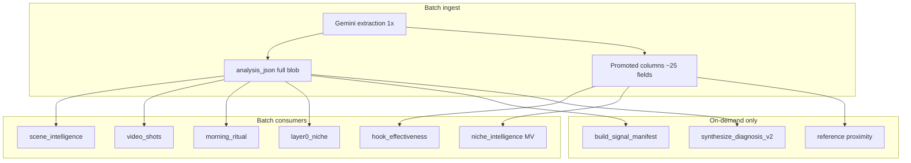

# Corpus Gemini Utilization Audit

**Last updated:** 2026-05-21 (`6a69ab3` + dead-field recalibration)  
**Status:** Audit complete (audit-only — no implementation scope).  
**Related:** [`feature-map.md`](feature-map.md) (routes/jobs) · [`system-design.md`](system-design.md) §12 (two-core invariants) · embedded tiles out of scope (answer `video_diagnostics` path).

---

## Kết luận ngắn

| Câu hỏi | Trả lời |
|---------|---------|
| Gemini ingest làm gì? | **1 call extraction** / video (hoặc carousel): JSON `VideoAnalysis` / `CarouselAnalysis` — không diagnosis, không synthesis. |
| Có lưu hết không? | **Có** — toàn bộ blob trong `video_corpus.analysis_json`. |
| Có **dùng hết** không? | **Không.** Ước lượng ~**50–65%** field có **đường đi sản phẩm rõ**; phần còn lại chủ yếu nằm trong JSON, chỉ phát huy khi (a) user diagnosis qua cache corpus, hoặc (b) vài job batch đọc subset. |

---

## 1. Ingest: Gemini làm gì vs lưu gì

**Entry:** `cloud-run/getviews_pipeline/corpus_ingest.py` → `services/extraction.py` `async_run_extraction_core` → `gemini.py` `analyze_video` / `analyze_carousel`.

**Promote sang cột** (trích từ `_build_corpus_row`, ~L1698–1754): `hook_type`, `hook_phrase`, `face_appears_at`, `first_frame_type`, `video_duration`, `transitions_per_second`, `tone`, `text_overlay_count`, `scene_count`, `target_audience`, `pain_points`, `promotion_type`, `style_tags`, `content_format` (regex `classify_format`), `content_class_id`, `cta_type`, `is_commerce`, `dialect`, `topics`, `transcript_snippet` (500 ký tự), + cột ED (`views`, `sound_*`, `hashtags`, …) + HI-11 (`niche_resolution_*`, `inferred_creator_niche_id`).

**Không promote:** phần lớn object lồng nhau vẫn chỉ trong `analysis_json`.

---

## 2. Tier utilization (field → ai đọc)

### Tier A — Dùng mạnh ngay sau ingest (corpus là “sản phẩm”)

| Nguồn Gemini | Consumer | Ghi chú |
|--------------|----------|---------|
| `hook_analysis.*` | Cột `hook_*`; `hook_effectiveness_compute.py`; `signal_classifier`; UI trends (`hook_phrase`) | Chủ lực benchmark hook |
| `scenes[]` | `scene_count`, `video_duration`; R2 `video_shots/`; `scene_intelligence_refresh.py`; `video_shots_writer.py` | Chỉ **type + timing** aggregate |
| `scenes` + `tone` + `topics` + transcript | `classify_format()` regex → `content_format` → `niche_intelligence`, Layer 0, synthesis format weights | Deterministic, không Gemini lần 2 |
| `audio_transcript` | `transcript_snippet`; guards; proximity ref (200 ký tự); `corpus_context` mô tả ref | |
| `topics` | Cột + ref desc; một số signal sound | |
| `cta`, `promotion_type`, `commerce_intent` (một phần) | `cta_type`, `is_commerce` | `commerce_intent` đầy đủ → diagnosis signals |
| `niche_classification` + `content_context` | HI-11 shadow/route; ME-17 backfill; `morning_ritual` **`subject_matter` only** | `NICHE_RESOLVER_MODE=shadow` (default): **không** đổi `niche_id` canonical |
| `style_tags`, `pain_points`, `target_audience` | Cột DB; **`ContextStrip.tsx`** trên `/app/answer` (`video_analyze` enrichment) | Explore/Trends list **không** select (`useVideoCorpus.ts`) — không phải “abandoned” |

### Tier B — Chủ yếu khi **user diagnosis**

`build_signal_manifest` + `diagnose_sections.py` when `GETVIEWS_DIAGNOSIS_SECTION_MODE=1` (production default since v6 cutover):

- **Hook:** `hook_timeline`, layering, body contract — `signals/hook.py`
- **Commerce:** `commerce_intent`, role mismatch — `signals/commerce.py`
- **Metadata / editing / sound / persona / engagement / script** — respective `signals/*` modules
- **Douyin §8:** null lúc ingest; `douyin_match` enrich **chỉ on-demand**

**Quan trọng:** Tier B **không** aggregate từ full corpus cho Trend/Pattern — chỉ trên video user đang xem.

### Tier C — Lưu nhưng **ít / không** có consumer production

| Field | Tình trạng |
|-------|------------|
| `key_messages` | **Gần dead** — chỉ `models.py` + test fixtures; an toàn ứng viên trim |
| `key_timestamps` | Schema compat; không reader chính |
| `content_direction`, `energy_level` | Chủ yếu `pattern_fingerprint.py` |
| `persona_consistency_signals` | Không có signal extractor đọc object này (chỉ `creator_persona`, dialect) |
| `content_context` subfields (trừ `subject_matter`) | Tests + `pattern_deck_synth.py` |
| `niche_classification` trên **corpus peer** | **Không** dùng trong ref score — peer `niche_classification` ignored |
| `douyin_origin` trên TikTok corpus | Null lúc extract |

**Không xếp Tier C (đã có consumer — đừng gọi “dead”):**

| Field | Consumer thực tế |
|-------|------------------|
| `text_overlays[]` | `text_overlay_count` ingest; `pattern_fingerprint.py`; `output_redesign.py` (format weights); `vietnamese_slang.py`; `score_entry_cost`; §5 fields `text_overlay_font_size_tier` / `text_overlay_color_emphasis` → `signals/editing.py` |
| `audio_track_role` | `diagnose_sections._video_has_audible_sound_track()` — **gate** section `sound` (không đọc trong `signals/sound.py` trực tiếp) |
| `commerce_intent` | **Tier B** — `signals/commerce.py`, `compliance.py`, `editing.py`, `engagement.py`, `performance.py`, `script.py` |

**Ref proximity (2026-05-20):** [`_content_proximity_score`](../../cloud-run/getviews_pipeline/pipelines.py) dùng hashtag overlap, `desc` 200 chars, **`content_context.subject_matter`** (promoted từ ingest), và `topics`. Vẫn **không** đọc `niche_classification` hai trục từ peer row.

### Tier D — Frontend corpus explorer

`useVideoCorpus` select ~20 cột — **không** fetch `analysis_json`. Explore/Trends không surface ~80% semantic extraction.

**Search:** `search_vector` = `hook_phrase` + `creator_handle` only — **không** index `transcript_snippet` / `topics` / `subject_matter`.

---

## 3. Hai ngữ cảnh dễ nhầm

| Ngữ cảnh | Utilization |
|----------|-------------|
| **Corpus row làm “bộ nhớ ngách”** (refs, MV, hook stats) | Cột promote + hook/format/scenes thô + transcript ngắn + `subject_matter` trong proximity |
| **Cùng video_id khi user paste URL** | Gần **full blob** → diagnosis + v6 signals (Tier B) |

→ **Build corpus:** không dùng hết. **Analyze cùng video:** gần hơn. **Peer UX:** vẫn thiếu HI-9 trên ranking + FE corpus explorer.

---

## 4. Invariant đã cố ý

Từ [`system-design.md` §12](system-design.md):

- Batch **không** gọi `run_video_diagnosis_core` / `synthesize_diagnosis_v2`.
- `classify_format` **cố ý** regex.
- §8 Douyin null at extract.

---

## 5. Tóm tắt theo nhóm prompt (HI-9)

| Nhóm extract | Corpus aggregate | User diagnosis |
|--------------|------------------|----------------|
| Hook + timeline | Mạnh | Mạnh |
| Scenes | Trung | Trung |
| Transcript | Trung | Mạnh |
| content_context | Yếu (ritual `subject_matter`) | Trung |
| niche_classification | Shadow/route; không ref score | HI-18 errors |
| commerce / script | `is_commerce` | Mạnh (manifest) |
| metadata, editing, sound | Hầu như không | Mạnh |
| share/save, loop | Không | Có signal |
| persona + slang | Không | Có signal |
| §8 douyin | Pipeline riêng | on-demand |

---

## 6. Rủi ro / phí token

- Prompt extraction dài (`prompts.py` HI-9 glossary) vs corpus peer path đọc subset.
- HI-11 shadow: telemetry mỗi đêm, `niche_id` canonical vẫn hashtag (runbook cutover).
- Optional HI-13 Batch API ingest (`CORPUS_INGEST_USE_GEMINI_BATCH`) — see `system-design.md` §6.

**Giả thuyết chi phí (billing DB / ops — không chứng minh từ repo):** extraction spend >> synthesis spend khi synthesis call volume thấp ⇒ **under-synthesize**, chưa phải “synthesis inherently cheap.” Reframe provider (e.g. DeepSeek) chỉ có ý nghĩa **sau** khi tăng volume section synthesis.

---

## 7. Dead vs misclassified (recalibration 2026-05-21)

Review ngoài từng gắn nhãn “6 field dead” — đối chiếu grep `cloud-run/` + `src/`:

| Field | Verdict | Evidence |
|-------|---------|----------|
| `key_messages` | **Dead (trim-safe)** | Không consumer production ngoài schema/tests |
| `audio_track_role` | **Misclassified as dead** | `diagnose_sections.py` L129–141 — bật sound section khi role ≠ `silent` |
| `text_overlays` | **Misclassified as dead** | Ingest count + fingerprint + output_redesign + slang + entry_cost; editing signals dùng derived overlay tiers |
| `style_tags` | **Partial** | DB column + `ContextStrip`; **không** mạnh trong signal manifest / corpus aggregate |
| `target_audience`, `pain_points` | **Misclassified as abandoned** | DB + `ContextStrip.tsx` + `persona.py` |
| `commerce_intent` | **Heavily used** | Toàn bộ §0 + nhiều `signals/*` — **không** trim |

### “Heuristic-only, không tới UI” — hiệu chỉnh

Nhiều field HI-9 (metadata, editing, persona, engagement, script) **không** aggregate trên Trends/Pattern nhưng **có thể tới UI** qua:

`user_analysis` → `build_signal_manifest` → `select_sections_to_emit` → `synthesize_diagnosis_v2` (v6) → `DiagnosisSectionRenderer`

Ví dụ: `safe_zone_status`, `color_grading_style`, `creator_persona`, `share_trigger_type` — fire rate và salience quyết định section có xuất hiện hay không. Đúng hơn: **conditional diagnosis UI**, không phải **zero consumer**.

### v6 synthesis — không phải “8 field = 80%”

Luồng thật (`diagnose_prompts.build_diagnosis_v6_user_prompt`):

1. **`SIGNAL_MANIFEST`** — distilled từ nhiều field qua `signals/registry.py`
2. **`USER_ANALYSIS_JSON`** — truncate ~24 top-level keys (không phải chỉ hook/scenes/transcript)
3. Corpus citation, reference IDs, channel context, errors head

Hook + transcript + scenes + `commerce_intent` là **trục**, không phải toàn bộ input. Đo impact trim bằng **diff synthesis output**, không bằng đếm field trong prompt JSON.

---

## 8. Chiến lược trim / tăng utilization (tham khảo)

| Bước | Hành động | Rủi ro |
|------|-----------|--------|
| 1 | Trim **`key_messages` only** (+ prompt/schema regen); diff v6 trên sample corpus | Thấp |
| 2 | **Signal ablation** — log fire rate per signal id trong `registry.py`; trim field nguồn cho signals &lt;1% | Trung — cần metric trước khi cắt |
| 3 | **Không** batch-trim `audio_track_role`, `text_overlays`, `commerce_intent` without replacement | Cao — regression section gates |
| 4 | Tăng synthesis (commerce/compliance/persona sections) **hoặc** rút prompt ingest — chọn một; DeepSeek chỉ sau bước 4 | Product decision |

Ước lượng $ tiết kiệm khi trim (ví dụ ~$2/mo cho vài field nhỏ) **chưa audit từ `gemini_calls`** — coi là hypothesis cho đến khi query billing.

---

## Follow-up (tham khảo, không cam kết)

| # | Hướng | Trạng thái |
|---|--------|------------|
| 1 | Ref proximity: `subject_matter` + topical overlap | **Partial** — `subject_matter` shipped `6a69ab3`; peer `niche_classification` still unused |
| 2 | `search_vector`: thêm `transcript_snippet` / `topics` | Open |
| 3 | HI-11 flip `route` sau audit 100-row | Open (runbook) |
| 4 | Rút prompt ingest để giảm cost | Open — **sau** signal ablation; không gom “6 dead fields” đã recalibrate |
| 5 | Signal fire-rate dashboard / ablation harness | Open |
| 6 | Provider cost (DeepSeek vs Flash-Lite) | Open — chỉ khi synthesis volume tăng ~10× |

**Out of scope:** embedded evidence tiles on `/app/answer` (`video_diagnostics` cache) — separate fix shipped `6a69ab3`.
