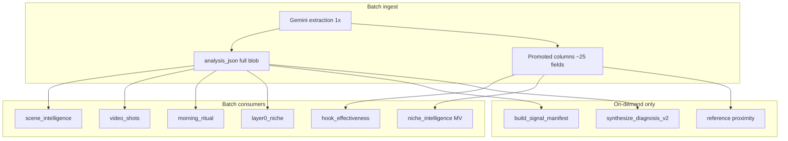
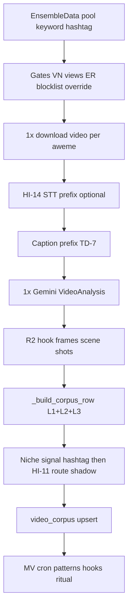

# Corpus Gemini Utilization Audit

> **Pivot SSOT (2026-05-21+):** Ingest loop + class cohort — [`system-design.md`](system-design.md) §9. §9 structural evaluation unchanged; batch now loops `content_class_ingest_targets` by default.

**Last updated:** 2026-05-19 (§9 pipeline + §10 Gemini config & extraction prompt)  
**Status:** Audit complete — §9 adds structural evaluation; implementation scope unchanged unless noted.  
**Related:** [`feature-map-v1.md`](feature-map-v1.md) §8.6–§8.8 (pre-launch gate) · [`data-utilization-map-v1.md`](data-utilization-map-v1.md) (FIELD × F1–F8) · [`feature-map.md`](feature-map.md) (routes/jobs) · [`system-design.md`](system-design.md) §6 HI-13, §10 TD-7 · embedded tiles out of scope (answer `video_diagnostics` path).

---

## Kết luận ngắn

| Câu hỏi | Trả lời |
|---------|---------|
| Gemini ingest làm gì? | **1 call extraction** / video (hoặc carousel): JSON `VideoAnalysis` / `CarouselAnalysis` — không diagnosis, không synthesis. |
| Có lưu hết không? | **Có** — toàn bộ blob trong `video_corpus.analysis_json`. |
| Có **dùng hết** không? | **Không.** Ước lượng ~**50–65%** field có **đường đi sản phẩm rõ**; phần còn lại chủ yếu nằm trong JSON, chỉ phát huy khi (a) user diagnosis qua cache corpus, hoặc (b) vài job batch đọc subset. |
| Pre-launch: so sánh on-demand vs batch? | **Không meaningful** — chưa traffic; batch = **mua kho** trước launch. Utilize qua F6/STU/MV (§9.4), không cắt feature UI để giảm extract. |



---

## 1. Ingest: Gemini làm gì vs lưu gì

**Entry:** `cloud-run/getviews_pipeline/corpus_ingest.py` → `services/extraction.py` `async_run_extraction_core` → `gemini.py` `analyze_video` / `analyze_carousel`.

**Promote sang cột** (trích từ `_build_corpus_row`, ~L1698–1754): `hook_type`, `hook_phrase`, `face_appears_at`, `first_frame_type`, `video_duration`, `transitions_per_second`, `tone`, `text_overlay_count`, `scene_count`, `target_audience`, `pain_points`, `promotion_type`, `style_tags`, `content_format` (regex `classify_format`), `content_class_id`, `cta_type`, `is_commerce`, `dialect`, `topics`, `transcript_snippet` (500 ký tự), + cột ED (`views`, `sound_*`, `hashtags`, …) + HI-11 (`niche_resolution_*`, `inferred_creator_niche_id`) + pivot provenance (`ingest_loop_niche_id`, `ingest_loop_content_class_id`, `class_assignment_tier`, `score_cohort_mismatch`).

**Không promote:** phần lớn object lồng nhau vẫn chỉ trong `analysis_json`.

### 1.1 Ba lớp lưu trữ (không phải một schema duy nhất)

| Lớp | Vị trí | Vai trò | Launch P0 (§[`feature-map-v1`](feature-map-v1.md) §8.7) |
|-----|--------|---------|--------------------------------------------------------|
| **L1 — Blob** | `analysis_json` = full `VideoAnalysis` / `CarouselAnalysis` | Diagnosis corpus-hit, signals Tier B, peer context | Sau launch; demo 1 URL-in-corpus |
| **L2 — Promoted** | ~25 cột từ `_build_corpus_row` | MV, Explore/Trends, filters, claim tiers | **Bắt buộc** — hook, format, views, `content_class_id`, transcript_snippet |
| **L3 — Derived** | `classify_format()` regex, `annotate_distribution()`, `breakout_ratio`, `pattern_id` | Aggregates không Gemini lần 2 | Patterns, niche_intelligence, distribution copy |

**Hai trục taxonomy (data):** `creator_niches` (16 UX) × `content_classifications` (74) qua junction — **không** nhầm với video depth basic/deep. Ingest ghi:

- **Canonical:** `niche_id` (legacy) + `content_class_id` (ladder hoặc HI-11 `route`)
- **Telemetry:** `niche_resolution_*`, `inferred_creator_niche_id` (`NICHE_RESOLVER_MODE=shadow` mặc định)
- **Post-extract:** `_resolve_actual_niche_from_content` — haystack **chỉ** `caption` + `hook_phrase` (cố ý bỏ `topics`, khớp SQL backfill)

**Tài sản ngoài row:** R2 `frames/`, `thumbnails/`, `videos/`, `video_shots/`; `frame_urls` trên row sau extract.

---

## 2. Tier utilization (field → ai đọc)

### Tier A — Dùng mạnh ngay sau ingest (corpus là “sản phẩm”)

| Nguồn Gemini | Consumer | Ghi chú |
|--------------|----------|---------|
| `hook_analysis.*` | Cột `hook_*`; `hook_effectiveness_compute.py`; `signal_classifier`; UI trends (`hook_phrase`) | Chủ lực benchmark hook |
| `scenes[]` | `scene_count`, `video_duration`; R2 `video_shots/`; `scene_intelligence_refresh.py`; `video_shots_writer.py` | Chỉ **type + timing** aggregate |
| `scenes` + `tone` + `topics` + transcript | `classify_format()` regex → `content_format` → `niche_intelligence`, Layer 0, synthesis format weights | Deterministic, không Gemini lần 2 |
| `audio_transcript` | `transcript_snippet`; guards; proximity ref (200 ký tự); `corpus_context` mô tả ref | |
| `topics` | Cột + ref desc; một số signal sound | |
| `cta`, `promotion_type`, `commerce_intent` (một phần) | `cta_type`, `is_commerce` | `commerce_intent` đầy đủ → diagnosis signals |
| `niche_classification` + `content_context` | HI-11 shadow/route; ME-17 backfill; `morning_ritual` **`subject_matter` only** | Pre-pivot: `niche_id` ingest loop. Post-pivot promote: **`content_class_id`** cohort for score/benchmark/browse (see `CORPUS_SCORE_COHORT`) |
| `style_tags`, `pain_points`, `target_audience` | Cột DB; **`ContextStrip.tsx`** trên `/app/answer` (`video_analyze` enrichment) | Explore/Trends list **không** select (`useVideoCorpus.ts`) — không phải “abandoned” |

### Tier B — Chủ yếu khi **user diagnosis**

`build_signal_manifest` + `diagnose_sections.py` when `GETVIEWS_DIAGNOSIS_SECTION_MODE=1` (production default since v6 cutover):

- **Hook:** `hook_timeline`, layering, body contract — `signals/hook.py`
- **Commerce:** `commerce_intent`, role mismatch — `signals/commerce.py`
- **Metadata / editing / sound / persona / engagement / script** — respective `signals/*` modules
- **Douyin §8:** null lúc ingest; `douyin_match` enrich **chỉ on-demand**

**Quan trọng:** Tier B **không** aggregate từ full corpus cho Trend/Pattern — chỉ trên video user đang xem.

### Tier C — Lưu nhưng **ít / không** có consumer production

| Field | Tình trạng |
|-------|------------|
| `key_messages` | **Gần dead** — chỉ `models.py` + test fixtures; an toàn ứng viên trim |
| `key_timestamps` | Schema compat; không reader chính |
| `content_direction`, `energy_level` | Chủ yếu `pattern_fingerprint.py` |
| `persona_consistency_signals` | Không có signal extractor đọc object này (chỉ `creator_persona`, dialect) |
| `content_context` subfields (trừ `subject_matter`) | Tests + `pattern_deck_synth.py` |
| `niche_classification` trên **corpus peer** | **Không** dùng trong ref score — peer `niche_classification` ignored |
| `douyin_origin` trên TikTok corpus | Null lúc extract |

**Không xếp Tier C (đã có consumer — đừng gọi “dead”):**

| Field | Consumer thực tế |
|-------|------------------|
| `text_overlays[]` | `text_overlay_count` ingest; `pattern_fingerprint.py`; `output_redesign.py` (format weights); `vietnamese_slang.py`; `score_entry_cost`; §5 fields `text_overlay_font_size_tier` / `text_overlay_color_emphasis` → `signals/editing.py` |
| `audio_track_role` | `diagnose_sections._video_has_audible_sound_track()` — **gate** section `sound` (không đọc trong `signals/sound.py` trực tiếp) |
| `commerce_intent` | **Tier B** — `signals/commerce.py`, `compliance.py`, `editing.py`, `engagement.py`, `performance.py`, `script.py` |

**Ref proximity (2026-05-20):** [`_content_proximity_score`](../../cloud-run/getviews_pipeline/pipelines.py) dùng hashtag overlap, `desc` 200 chars, **`content_context.subject_matter`** (promoted từ ingest), và `topics`. Vẫn **không** đọc `niche_classification` hai trục từ peer row.

### Tier D — Frontend corpus explorer

`useVideoCorpus` select ~20 cột — **không** fetch `analysis_json`. Explore/Trends không surface ~80% semantic extraction.

**Search:** `search_vector` = `hook_phrase` + `creator_handle` only — **không** index `transcript_snippet` / `topics` / `subject_matter`.

---

## 3. Hai ngữ cảnh dễ nhầm

| Ngữ cảnh | Utilization |
|----------|-------------|
| **Corpus row làm “bộ nhớ ngách”** (refs, MV, hook stats) | Cột promote + hook/format/scenes thô + transcript ngắn + `subject_matter` trong proximity |
| **Cùng video_id khi user paste URL** | Gần **full blob** → diagnosis + v6 signals (Tier B) |

→ **Build corpus:** không dùng hết. **Analyze cùng video:** gần hơn. **Peer UX:** vẫn thiếu HI-9 trên ranking + FE corpus explorer.

---

## 4. Invariant đã cố ý

Từ [`system-design.md` §12](system-design.md):

- Batch **không** gọi `run_video_diagnosis_core` / `synthesize_diagnosis_v2`.
- `classify_format` **cố ý** regex.
- §8 Douyin null at extract.

---

## 5. Tóm tắt theo nhóm prompt (HI-9)

| Nhóm extract | Corpus aggregate | User diagnosis |
|--------------|------------------|----------------|
| Hook + timeline | Mạnh | Mạnh |
| Scenes | Trung | Trung |
| Transcript | Trung | Mạnh |
| content_context | Yếu (ritual `subject_matter`) | Trung |
| niche_classification | Shadow/route; không ref score | HI-18 errors |
| commerce / script | `is_commerce` | Mạnh (manifest) |
| metadata, editing, sound | Hầu như không | Mạnh |
| share/save, loop | Không | Có signal |
| persona + slang | Không | Có signal |
| §8 douyin | Pipeline riêng | on-demand |

---

## 6. Rủi ro / phí token

- Prompt extraction dài (`prompts.py` HI-9 glossary) vs corpus peer path đọc subset.
- HI-11 shadow: telemetry mỗi đêm, `niche_id` canonical vẫn hashtag (runbook cutover).
- Optional HI-13 Batch API ingest (`CORPUS_INGEST_USE_GEMINI_BATCH`, default **off**) — see `system-design.md` §6; prod thường chỉ `video_extraction` sync, không `video_extraction_batch`.

**Chi phí quan sát được (`gemini_calls`, pre-launch window):**

| `call_site` | Vai trò | Ghi chú ops |
|-------------|---------|-------------|
| `video_extraction` | 1× vision / video ingest + on-demand extract | ~**97%** spend; ~**$0.0088**/call; ~**$20–32/ngày** khi ingest full |
| `video_extraction_filesapi` | File > inline size cap | Phụ |
| `diagnosis_synthesis_v6_*` | User Answer | Volume thấp pre-launch → **under-synthesize** bình thường |
| `extract_video_errors` | Call 1 errors (on-demand path) | Không chạy batch ingest |

→ **Under-synthesize** ≠ lãng phí extract; = chưa có traffic. **Over-extract vs browse** = trả full schema trong khi F6/STU chỉ đọc L2 + MV — xử lý bằng nightly aggregate (§9.4), không bằng cắt V1 UI.

**Cost drivers trong một lần `analyze_video`:**

| Driver | Env / code | Ghi chú |
|--------|------------|---------|
| Dual hook window | `GEMINI_HOOK_WINDOW_DUAL_PART` (default **true**) | Full clip + hook window @ higher FPS — nhân token vision |
| HI-14 STT | `sync_prepare_vietnamese_asr_supplement` | Prefix trước vision; carousel skip |
| TD-7 caption | `build_tiktok_caption_extraction_prefix` | Cùng call batch + live |
| Model | `GEMINI_EXTRACTION_MODEL` → `gemini-3.1-flash-lite` | Một schema `VideoAnalysis` — không có “lite ingest” profile trong code |

Reframe provider (e.g. DeepSeek) chỉ có ý nghĩa **sau** khi synthesis volume tăng ~10×.

---

## 7. Dead vs misclassified (recalibration 2026-05-21)

Review ngoài từng gắn nhãn “6 field dead” — đối chiếu grep `cloud-run/` + `src/`:

| Field | Verdict | Evidence |
|-------|---------|----------|
| `key_messages` | **Dead (trim-safe)** | Không consumer production ngoài schema/tests |
| `audio_track_role` | **Misclassified as dead** | `diagnose_sections.py` L129–141 — bật sound section khi role ≠ `silent` |
| `text_overlays` | **Misclassified as dead** | Ingest count + fingerprint + output_redesign + slang + entry_cost; editing signals dùng derived overlay tiers |
| `style_tags` | **Partial** | DB column + `ContextStrip`; **không** mạnh trong signal manifest / corpus aggregate |
| `target_audience`, `pain_points` | **Misclassified as abandoned** | DB + `ContextStrip.tsx` + `persona.py` |
| `commerce_intent` | **Heavily used** | Toàn bộ §0 + nhiều `signals/*` — **không** trim |

### “Heuristic-only, không tới UI” — hiệu chỉnh

Nhiều field HI-9 (metadata, editing, persona, engagement, script) **không** aggregate trên Trends/Pattern nhưng **có thể tới UI** qua:

`user_analysis` → `build_signal_manifest` → `select_sections_to_emit` → `synthesize_diagnosis_v2` (v6) → `DiagnosisSectionRenderer`

Ví dụ: `safe_zone_status`, `color_grading_style`, `creator_persona`, `share_trigger_type` — fire rate và salience quyết định section có xuất hiện hay không. Đúng hơn: **conditional diagnosis UI**, không phải **zero consumer**.

### v6 synthesis — không phải “8 field = 80%”

Luồng thật (`diagnose_prompts.build_diagnosis_v6_user_prompt`):

1. **`SIGNAL_MANIFEST`** — distilled từ nhiều field qua `signals/registry.py`
2. **`USER_ANALYSIS_JSON`** — truncate ~24 top-level keys (không phải chỉ hook/scenes/transcript)
3. Corpus citation, reference IDs, channel context, errors head

Hook + transcript + scenes + `commerce_intent` là **trục**, không phải toàn bộ input. Đo impact trim bằng **diff synthesis output**, không bằng đếm field trong prompt JSON.

---

## 8. Chiến lược trim / tăng utilization (tham khảo)

| Bước | Hành động | Rủi ro |
|------|-----------|--------|
| 1 | Trim **`key_messages` only** (+ prompt/schema regen); diff v6 trên sample corpus | Thấp |
| 2 | **Signal ablation** — log fire rate per signal id trong `registry.py`; trim field nguồn cho signals &lt;1% | Trung — cần metric trước khi cắt |
| 3 | **Không** batch-trim `audio_track_role`, `text_overlays`, `commerce_intent` without replacement | Cao — regression section gates |
| 4 | Tăng synthesis (commerce/compliance/persona sections) **hoặc** rút prompt ingest — chọn một; DeepSeek chỉ sau bước 4 | Product decision |

Ước lượng $ tiết kiệm khi trim schema alone (~**1–3%** bill) — **không** thay thế giảm ingest volume. Coi trim §8 là post-launch ablation, không pre-launch cost lever chính.

---

## 9. Pipeline evaluation — cấu trúc data & phương thức extract

Đánh giá as-built `corpus_ingest.py` → `async_run_extraction_core` → `gemini.analyze_video` / `analyze_carousel`. Bổ sung cho §1–§2; quyết định product: [`feature-map-v1.md`](feature-map-v1.md) §8.6–§8.8.

### 9.1 Luồng end-to-end (batch shard / niche)

**2026-05-20:** Pre-Gemini **selection** is instructiveness-ranked in `shadow`/`purity` modes (`corpus_instructiveness.py`); **extraction contract unchanged** (TD-7). See [`corpus-ingest-criteria-v1.md`](corpus-ingest-criteria-v1.md).



| Bước | File / symbol | Ghi chú |
|------|---------------|---------|
| Pool | `_fetch_niche_pool`, `_fetch_carousel_pool` | ED keyword + hashtag; adaptive yield |
| Gates | `ingest_niche` L2505+ | VN region/chars, `BATCH_MIN_VIEWS`, min ER, blocklist, handle override |
| Video path | `_analyze_one` → `async_run_extraction_core` | **Không** `include_diagnosis`; shared download → extract + frames |
| Carousel path | `analyze_aweme(..., include_diagnosis=False)` | Slides in memory; `CarouselAnalysis` / HI-16 |
| HI-13 | `_analyze_videos_gemini_batch_for_corpus` | Khi `CORPUS_INGEST_USE_GEMINI_BATCH=true`; fail → sync fallback |
| Post-row | `compute_and_upsert_pattern`, R2 video/thumb upload | `pattern_id` trên row |

**Invariant (TD-7):** batch và on-demand live dùng cùng `analyze_video` / caption prefix / HI-9 prompt — không fork ingest-only schema.

**Invariant (batch economics):** batch **không** gọi `synthesize_diagnosis_v2`, `extract_video_errors` (ingest path), hay `run_video_diagnosis_core` — đúng thiết kế §4.

### 9.2 Phương thức extraction — trả tiền cho gì

| Content | Method | Output | Diagnosis at ingest? |
|---------|--------|--------|----------------------|
| Video file | `analyze_video(local_path)` — inline bytes hoặc Files API | `VideoAnalysis` JSON validate | **No** |
| Carousel | `analyze_carousel(slide images)` | `CarouselAnalysis` | **No** |
| On-demand (sau) | Corpus-hit → synthesis only; miss → same extract | Reuse L1 blob | Errors + v6 **later** |

**Một call = toàn schema prompt** — model cố điền ~70 field groups; billing không tách Tier A vs Tier B. Tier B “inactive” trên browse **không** giảm token ingest.

**Sau extract (không Gemini):** `extract_and_upload` hook frames; `extract_and_upload_scene_frames` cần `scenes[]` boundaries — chạy **sau** extract khi file còn trên disk.

### 9.3 Điểm mạnh kiến trúc (giữ)

1. **Một contract TD-7** — shadow telemetry + diagnosis comparable.  
2. **Tách extract / synthesis** — corpus ~$0.009/video vs multi-call diagnosis.  
3. **L2 promoted + L3 regex `content_format`** — MV/SQL không parse JSON path.  
4. **`async_run_extraction_core`** — boundary testable; corpus + douyin ingest.  
5. **Ingest quality warnings** — coarse scenes, transcript VN, hook paraphrase (không block row).  
6. **HI-11 shadow** — mua kho trước flip `route` ([`two-axis-niche-cutover-runbook.md`](two-axis-niche-cutover-runbook.md)).

### 9.4 Utilization gap (có cấu trúc — không phải bug)

| | Batch trả (L1+L2) | Launch browse cần (P0) |
|--|-------------------|-------------------------|
| **Dùng ngay** | `hook_*`, views/ER, `content_format`, `subject_matter`, scene timing | F6 kho + patterns + STU ritual |
| **Lưu, browse chưa đốt** | commerce, sound, editing, persona blocks, `key_messages` | F1 signals — corpus-hit diagnosis |
| **Đúng thiết kế** | Tier B trong blob | Không aggregate full corpus cho Trend |

**Kết luận:** pipeline **over-extract so với Xu hướng/Studio**, **under-aggregate** nếu cron MV chưa đủ trên **ngách hero**. ROI pre-launch = §[`feature-map-v1`](feature-map-v1.md) §8.7 (patterns, hooks, ritual, `corpus-health`), **không** cắt F6 surface.

### 9.5 Điểm căng & hướng xử lý

| ID | Vấn đề | Hệ quả | Hướng (tách khỏi feature scope) |
|----|--------|---------|----------------------------------|
| **C1** | Full schema 1 call | ~35–50% field chưa có consumer browse | Ablation post-launch; giữ TD-7 |
| **C2** | Dual hook window on | Token vision ↑ | `GEMINI_HOOK_WINDOW_DUAL_PART=false` **chỉ batch pod** + sample QA |
| **C3** | HI-14 mọi video | +STT line item | Hero-only hoặc giữ nếu transcript critical |
| **C4** | HI-13 off | Sync full price | Bật staging → prod khi stable |
| **C5** | Niche reassignment post-extract | MV/pattern gắn `route_nid` ≠ loop niche | Health SQL theo **final** `niche_id`; chốt 5–8 hero niches |
| **C6** | `content_format` regex ≠ `format_axis` | MV vs HI-9 lệch nhẹ | Chấp nhận; `route` dùng junction khi flip |
| **C7** | Scene frames post-extract | F7 phụ thuộc `video_shots` coverage | Monitor non-fatal failures |

### 9.6 Khuyến nghị pre-launch (utilize > trim)

**Giữ:** L1+L2+L3 + một extract call (§9.3).

**Utilize (ROI cao):**

1. 5–8 ngách hero — tier `niche_norms` / `hook_effectiveness` ([`claim_tiers.py`](../../cloud-run/getviews_pipeline/claim_tiers.py), [`corpus-health.sql`](../sql/corpus-health.sql)).  
2. Verify nightly: `video_patterns`, `hook_effectiveness`, `morning_ritual`, `niche_intelligence`.  
3. Demo corpus-hit Answer (1 URL/kho) — Tier B không cần thêm extract.  
4. Copy humility khi dưới tier — không số corpus marketing cố định.

**Cost (không cắt V1 UI):**

1. `BATCH_PRIORITY_NICHE_IDS` + cap `BATCH_VIDEOS_PER_NICHE` ngách phụ.  
2. `GEMINI_DAILY_USD_MAX` + enforce batch pod.  
3. HI-13 + optional dual-hook off trên batch.

**Chưa nên pre-launch:**

- Fork prompt “lite extract” (phá TD-7).  
- Flip `NICHE_RESOLVER_MODE=route` trước 100-row audit.  
- Trim Tier B fields vì F6 không hiển thị.

### 9.7 Quyết định mở (Tech Lead)

| # | Câu hỏi | Options |
|---|---------|---------|
| P1 | Danh sách **ngách hero** (5–8 `niche_id` hoặc `creator_niche_id`) | Chưa trong repo — product chốt → ghi vào `feature-map-v1` §8.7 |
| P2 | Bật HI-13 trên batch staging? | A) Thử 1 niche/shard B) Giữ sync đến sau launch |
| P3 | Tắt dual hook window batch-only? | A) A/B 50 video quality B) Giữ default |

---

## 10. Gemini configuration & extraction prompt — evaluation

Nguồn: [`config.py`](../../cloud-run/getviews_pipeline/config.py), [`gemini.py`](../../cloud-run/getviews_pipeline/gemini.py), [`prompts.py`](../../cloud-run/getviews_pipeline/prompts.py), [`two_axis_taxonomy.py`](../../cloud-run/getviews_pipeline/two_axis_taxonomy.py).

### 10.1 Tóm tắt đánh giá

| Khía cạnh | Verdict | Lý do ngắn |
|-----------|---------|------------|
| **Model split** | ✅ Đúng | Extract = Flash-Lite (`0.2` temp); synthesis tách model/temp — không lẫn |
| **Structured output** | ✅ Đúng | `response_json_schema` + `thinking_budget=0` — tránh reasoning tax |
| **Prompt ↔ schema** | ✅ Chặt | `_VIDEO_EXTRACTION_CORE_VI` map field-by-field; glossary HI-9/HI-16 enum-closed |
| **TD-7 parity** | ✅ | Caption + ASR prefix cùng path batch/live; system_instruction cached (HI-8) |
| **Cost / chất lượng** | ⚠️ Tradeoff | Dual Part (HI-15) + full schema + HI-14 STT = bill cao; defaults aggressive cho quality |
| **`.env.example` drift** | ⚠️ | Example `GEMINI_SYNTHESIS_MODEL=gemini-3-flash-preview` — production default code = `gemini-3.1-flash-lite` |

### 10.2 Cấu hình runtime (extract-only)

| Biến | Default (code) | Vai trò extract | Đánh giá |
|------|----------------|-----------------|----------|
| `GEMINI_MODEL` | `gemini-3.1-flash-lite` | Base cho mọi path nếu không override | ✅ GA 3.x; khớp project rules |
| `GEMINI_EXTRACTION_MODEL` | → `GEMINI_MODEL` | Primary `analyze_video` / carousel | ✅ Tách synthesis (`GEMINI_SYNTHESIS_MODEL`) |
| `GEMINI_EXTRACTION_FALLBACKS` | `""` (empty) | Failover comma-separated | ⚠️ Prod nên set 1 fallback preview nếu GA blip |
| `GEMINI_EXTRACTION_TEMPERATURE` | **0.2** | Transcript/scene determinism | ✅ Khác synthesis 0.8 |
| `GEMINI_VIDEO_MEDIA_RESOLUTION` | `""` (API default) | Top-level `media_resolution` only | ○ Tùy chọn; hook FPS là per-Part (HI-15) |
| `GEMINI_EXTRACTION_CONTEXT_CACHE` | **true** (HI-8) | `client.caches.create` system_instruction | ✅ Giảm input $ khi glossary ổn định; TTL default 3600s |
| `GEMINI_CONTEXT_CACHE_TTL_SEC` | 3600 | Cache slot refresh margin | ✅ Batch poll max 2400s — margin 600s trong code |
| `GEMINI_HOOK_WINDOW_DUAL_PART` | **true** (HI-15) | 2× video Part: full @ base FPS + hook @ 3–5 FPS | ⚠️ **Cost lever #1** — ~2× vision sampling hook window |
| `GEMINI_VIDEO_BASE_FPS` | 1.0 | Full-clip Part (clamp 0.1–24) | ✅ Hợp lý corpus (structure, scenes) |
| `GEMINI_HOOK_WINDOW_FPS` | 4.0 | Hook Part (clamp 3–5) | ✅ Đọc overlay 0–3s |
| `GEMINI_HOOK_WINDOW_END_SEC` | 3.0 | Hook window end (clamp 0.5–10) | ✅ Khớp prompt hook_timeline 0–3s |
| `GCP_STT_VI_ENABLED` | **true** (HI-14) | STT trước vision; cache `vietnamese_asr_cache` | ⚠️ **Cost lever #2** — không chạy carousel |
| `GCP_STT_VI_PRICE_PER_MIN_USD` | 0.024 | Ghi `gemini_calls` khi có STT | ✅ |
| `CORPUS_INGEST_USE_GEMINI_BATCH` | **false** (HI-13) | JSONL batch ~50% tier | ⚠️ **Cost lever #3** — prod đang sync full price |
| `GEMINI_DAILY_USD_MAX` | 0 (unlimited) | Cap + `GEMINI_DAILY_USD_ENFORCE` | ⚠️ Pre-launch nên set + enforce trên batch pod |
| `GEMINI_CONCURRENCY` | 4 (`settings`) | Semaphore per Cloud Run instance | ✅ I/O-bound; tune theo vCPU |
| `MAX_INLINE_SIZE_BYTES` | 75 MiB | Inline bytes vs Files API upload | ✅ Large videos → `video_extraction_filesapi` |
| `GEMINI_VIDEO_ANALYSIS_HARD_TIMEOUT_SEC` | 120 | Wrapper timeout | ✅ |

**API call shape (`analyze_video`):**

```text
system: build_video_extraction_system_instruction()  [cached HI-8 | inline]
config: temperature=0.2, response_mime_type=application/json,
        response_json_schema=VideoAnalysis.model_json_schema(),
        thinking_config.thinking_budget=0
user:   [optional ASR block] + [CAPTION_TIKTOK] + build_video_extraction_user_turn_vi()
parts:  [video full @ base_fps] + [video 0–N s @ hook_fps]   # if HI-15 on
        OR single Part if HI-15 off
call_site: video_extraction | video_extraction_filesapi
```

**Không có trong extract prompt:** `build_voice_domain_system_instruction`, diagnosis examples, corpus benchmarks — đúng; voice chỉ synthesis.

### 10.3 Prompt architecture — video

| Thành phần | Nội dung ước lượng | Mục đích | Cost/quality |
|------------|-------------------|----------|--------------|
| `_VIDEO_EXTRACTION_CORE_VI` | ~100 dòng quy tắc VI | Hook, scenes, commerce §0, persona §11, sound §6, metadata §1, editing §5, share/save §7, affiliate §4 | **Lớn** — định nghĩa toàn Tier A+B schema |
| `_HI9_ENRICHMENT_VIDEO` | `content_context` + `niche_classification` | subject_matter, two-axis slugs | **P0 launch** + shadow/route |
| `_HI9_VIDEO_FEW_SHOT_VI` | 3 ví dụ JSON | Giảm lệch enum / format_axis | Token cố định mỗi call — đáng giữ |
| `build_extraction_niche_glossary_block()` | 16 niches + 12 format_axis × mô tả VI | Closed enum — junction parity | **~lớn** — cached qua HI-8; đổi glossary → invalidate cache sig |
| User turn (dual) | “Hai đoạn video…” + FPS labels | Align model với 2 Part | Chỉ khi HI-15 on |
| `CAPTION_TIKTOK` (dynamic) | desc + hashtags (max chars) | TD-7 tagline vs hook | ✅ Nhỏ; high value |
| HI-14 ASR block (dynamic) | Timestamped vi-VN lines | Bổ trợ `audio_transcript` | Variable length; cache theo `video_id` |

**Carousel** (`build_carousel_extraction_system_instruction`): core slide rules + HI-16 `carousel_format_axis` (5 values) + glossary — **không** HI-15, **không** HI-14; image Parts + index mapping block.

**Schema enforcement:** Pydantic `VideoAnalysis` / `CarouselAnalysis` → `model_json_schema()` — `extra="ignore"` trên model; invalid JSON → fail row.

### 10.4 Alignment prompt ↔ utilization (§2)

| Nhóm prompt | Tier | Ghi chú |
|-------------|------|---------|
| Hook + timeline + layering | A + B | Prompt bắt buộc chi tiết — justify cost |
| `content_context` / HI-9 | A (ritual, proximity) + shadow | Glossary + few-shot — tốn token nhưng P0 |
| commerce §0, persona, sound, metadata, editing | B chủ yếu | **Vẫn bắt buộc điền** trong prompt → trả $ dù F6 không show |
| §8 douyin null at extract | C (by design) | Khớp §4 invariant |
| `key_messages` | C orphan | **Không** có rule riêng trong core VI — candidate trim §8 |

**Mismatch có chủ đích:** prompt yêu cầu **đầy đủ** diagnosis-grade fields; browse chỉ đọc subset L2. Không phải prompt “sai” — là **product amortization** (§9.4).

### 10.5 Điểm mạnh cấu hình

1. **`thinking_budget=0`** — comment trong code ghi nhận ~6× output inflation nếu bật; critical cho $/video.  
2. **Temperature 0.2** tách khỏi synthesis 0.8 — transcript/hook ổn định giữa batch nights.  
3. **HI-8 context cache** trên system_instruction (glossary + core) — input discount khi ingest hàng loạt.  
4. **HI-15** tách base vs hook FPS — quality hook/overlay without raising full-clip FPS to 4.  
5. **Caption + STT** ở **user turn**, không system — dynamic per video; cache STT DB.  
6. **Enum glossary** — `creator_niche_slug` / `format_axis` closed set → junction WARN + HI-11 route.  
7. **Carousel guard** — assert không `video_metadata` trên image Parts.

### 10.6 Điểm căng & khuyến nghị cấu hình

| ID | Issue | Recommendation | Completeness |
|----|-------|----------------|--------------|
| **G1** | HI-15 default on | Batch pod: `GEMINI_HOOK_WINDOW_DUAL_PART=false` + QA 50 video (`hook_phrase`, `hook_timeline`) | 7/10 — cần A/B |
| **G2** | HI-14 default on | `GCP_STT_VI_ENABLED=false` trên batch **hoặc** hero-only — measure transcript quality | 7/10 |
| **G3** | HI-13 off | `CORPUS_INGEST_USE_GEMINI_BATCH=true` staging → prod | 9/10 khi API ổn |
| **G4** | No daily cap | `GEMINI_DAILY_USD_MAX=35` + `GEMINI_DAILY_USD_ENFORCE=true` batch | 10/10 |
| **G5** | Empty extraction fallbacks | `GEMINI_EXTRACTION_FALLBACKS=gemini-3.1-flash-lite-preview` (1 name) | 8/10 |
| **G6** | Prompt size / Tier B fields | **Không** cắt pre-launch; post-launch ablation `key_messages` + signal fire-rate | 6/10 trim only |
| **G7** | `.env.example` synthesis model | Align example với `gemini-3.1-flash` optional override doc | 10/10 doc |

**RECOMMENDATION:** Giữ prompt schema + TD-7; tune **env levers G1–G4** trên **batch pod only** trước khi rút prompt. Live on-demand giữ HI-15/HI-14 cho diagnosis quality.

### 10.7 Quyết định mở (config)

| # | Câu hỏi | Options |
|---|---------|---------|
| C1 | Dual hook window trên batch? | A) Off batch / on user pod B) On cả hai C) Off cả hai |
| C2 | HI-14 trên batch? | A) Off B) On all C) Hero niches only |
| C3 | `GEMINI_VIDEO_MEDIA_RESOLUTION=low` thử batch? | A) Staging A/B B) Giữ default — risk scene detail |
| C4 | Bật extraction context cache prod? | Mặc định true — chỉ tắt nếu cache API lỗi |

---

## Follow-up (tham khảo, không cam kết)

| # | Hướng | Trạng thái |
|---|--------|------------|
| 1 | Ref proximity: `subject_matter` + topical overlap | **Partial** — `subject_matter` shipped `6a69ab3`; peer `niche_classification` still unused |
| 2 | `search_vector`: thêm `transcript_snippet` / `topics` | Open |
| 3 | HI-11 flip `route` sau audit 100-row | Open (runbook) |
| 4 | Rút prompt ingest để giảm cost | Open — **sau** signal ablation; không gom “6 dead fields” đã recalibrate |
| 5 | Signal fire-rate dashboard / ablation harness | Open |
| 6 | Provider cost (DeepSeek vs Flash-Lite) | Open — chỉ khi synthesis volume tăng ~10× |
| 7 | §9.7 P1–P3 — hero niches, HI-13, dual-hook batch | Open — [`feature-map-v1`](feature-map-v1.md) §8.8 ingest policy |
| 8 | Sync `system-design.md` §17 với ~$20–32/ngày extract baseline | Open — doc drift từ `gemini_calls` |
| 9 | §10.7 C1–C4 — dual-hook, HI-14, media_resolution, cache | Open — batch pod env only |

**Out of scope:** embedded evidence tiles on `/app/answer` (`video_diagnostics` cache) — separate fix shipped `6a69ab3`.
