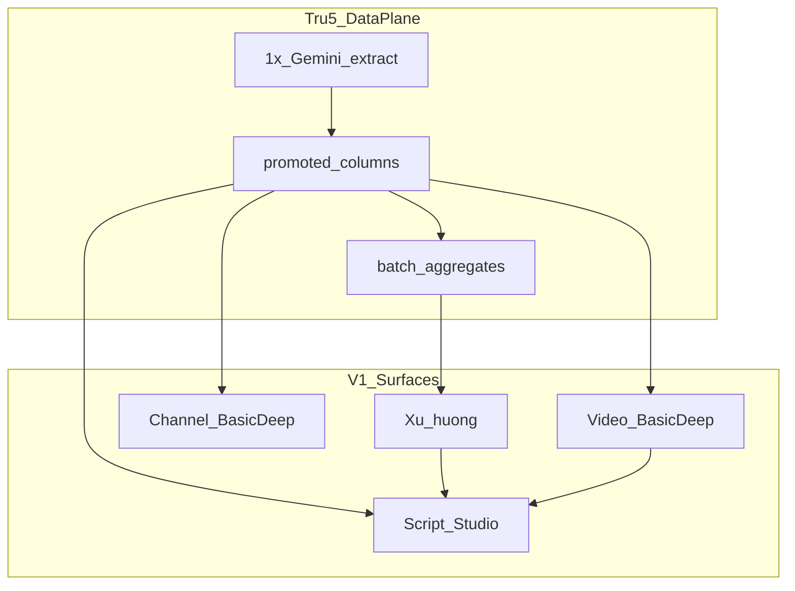
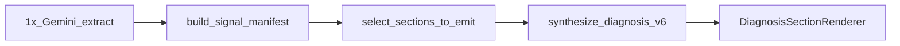
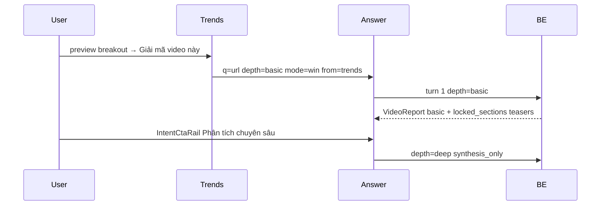
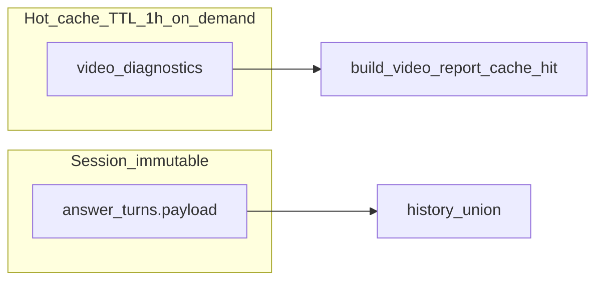
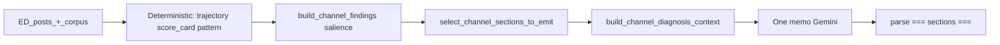
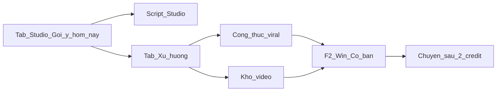

# Product Vision V1 — GetViews.vn

**Version:** 2.0 — **FINAL (GTM scope)**  
**Last updated:** 2026-05-24 (vision correction — composer pill channel, không khối Studio riêng)  
**Codebase ref:** 2026-05-24 — composer pill channel (Option A) shipped; `/app/channel` full page  
**Status:** W0–W5 ✅ · Channel UX ✅ — composer pill **Khám Kênh** → `/app/channel` full page

> **Pivot SSOT (2026-05-21+, prod defaults ON):** Class-first ingest/browse/benchmark — [`system-design.md`](system-design.md) §9. **`content_class_intelligence`** + tier/stats MVs canonical; legacy `niche_intelligence` refresh **skipped** in prod (bridge only for unmigrated percentile paths).

**Related docs:**

| Doc | Role |
|-----|------|
| [`feature-map.md`](feature-map.md) | Inventory as-built + **Post-V1 backlog** — synced `162abc26` |
| [`two-axis-niche-model.md`](two-axis-niche-model.md) | Taxonomy SSOT (16 niches × 82 classes, junction, MV chain) |
| [`product-value-audit.md`](product-value-audit.md) | Value → data audit, gaps, PVA backlog |
| [`corpus-gemini-utilization-audit.md`](corpus-gemini-utilization-audit.md) | Extract field tiers, trim rules |
| [`data-utilization-map-v1.md`](data-utilization-map-v1.md) | **FIELD × feature** matrix (F1–F8 + Studio) — pre-implement gate |
| [`incremental-v1-roadmap.md`](../plans/incremental-v1-roadmap.md) | Wave sequencing + **architecture invariants** (composer + intent-router SSOT) |
| [`system-design.md`](system-design.md) | Architecture, invariants TD-1–TD-7 — **sync §4.12** khi ship depth/cache |
| [`emotional-design-system.md`](emotional-design-system.md) | Persona Minh, tone, authority |
| [`bao-cao-flop-video-kenh-toan-dien-v5.md`](bao-cao-flop-video-kenh-toan-dien-v5.md) | Taxonomy flop (§1.8 Seeding & Ads) — signal engineering reference |

**Maintenance:** Chỉ ghi **trong V1** ở file này. Cắt khỏi V1 → **xóa** khỏi vision doc, **thêm** dòng vào [`feature-map.md`](feature-map.md) § Post-V1 backlog. Khi ship: cập nhật cùng commit (1) vision, (2) `feature-map.md`, (3) [`system-design.md`](system-design.md), (4) [`changelog.md`](changelog.md).

---

## 1. North star V1

> Thay phần lớn thời gian doomscroll bằng **Creator Studio**: **gợi ý quay hôm nay** + **công thức/kho video** đã có sẵn, rồi **khám video/kênh** (cơ bản hoặc chuyên sâu) và **kịch bản** — mọi insight dùng **cùng một lớp extract corpus**, không pipeline rời.

**Ba câu hỏi sản phẩm (GTM):**

1. *Hôm nay nên quay gì?* → **Tab Studio** — khối **Gợi ý hôm nay** (3 tầng, §3.1) + **Tab Xu hướng** — công thức viral + kho video (§3.2)  
2. *Làm như thế nào?* → Script Studio (pill) + video/kênh **Cơ bản**  
3. *Tại sao video trước flop / video kia chạy?* → Video **Chuyên sâu** + kênh **Sâu** (composer pills)  

### 1.1 V1 launch freeze (đã chốt — giữ nguyên UI as-built)

Hai surface **browse** không reshape cho GTM — chỉ fix handoff / billing / depth ở luồng phân tích:

| Surface | Route | **Giữ nguyên V1** | **V1 build** (không đổi layout freeze) |
|---------|-------|-------------------|----------------------------------------|
| **Studio** | `/app` | **Gợi ý hôm nay** — 3 tầng [`HomeSuggestionsToday.tsx`](../../src/routes/_app/home/components/HomeSuggestionsToday.tsx): I Hôm nay quay ngay · II Công thức nền · III Cảm hứng | Composer **4 pill** + Cơ bản/Chuyên sâu; URL-only; §4 |
| **Xu hướng** | `/app/trends` | **Công thức từ video viral trong ngách** [`TrendsPatternGrid`](../../src/routes/_app/trends/TrendsPatternGrid.tsx) + **Kho video** [`ExploreScreen`](../../src/routes/_app/trends/ExploreScreen.tsx) § II | Card → Answer: `depth=basic&mode=win&from=trends` (§4.10) |

**Không yêu cầu V1:** segment TikTok/Douyin riêng trên Xu hướng; duplicate “Hôm nay” trên Trends; reshape F6. Các block phụ (âm thanh, `TrendsDouyinCard`, `TrendsRail`, `CrossNicheBreakoutLane`, thesis hero) — **giữ nếu code đã có**, không block launch → [`feature-map.md`](feature-map.md) § Post-V1.

---

## 2. V1 scope — năm mục tiêu → năm trụ

| # | Mục tiêu kinh doanh | Trụ V1 | Surface chính |
|---|---------------------|--------|----------------|
| 1 | Phân tích video flop/win — **cơ bản + chuyên sâu** | **Video Intelligence** | Tab Studio — pill Khám Video flop / win |
| 2 | Phân tích kênh creator — **cơ bản + chuyên sâu** | **Channel Intelligence** | Tab Studio — pill **Khám Kênh** trong composer → intent-router → `/app/channel` |
| 3 | Corpus + công thức ngách — thay doomscroll | **Xu hướng** | Tab Xu hướng — công thức + kho video (§3.2, freeze) |
| 4 | Kịch bản chi tiết để quay | **Script Studio** | Tab Studio — pill Tạo kịch bản |
| 5 | Data extract & utilize **đều** cho mọi feature trên | **Data plane** | Ingest + batch + claim tiers; pre-launch gate §8.6–§8.7 |



---

## 3. Navigation V1 — Creator Studio (2 tab)

**Platform:** **Creator Studio** (giữ shell / brand hiện tại). V1 **không** tách thành nhiều app — gom dưới **hai tab cấp 1**. Bốn trụ sản phẩm (§2) vẫn giữ; khác ở **cách user điều hướng**.

**Landing mặc định (đã chốt):** Sau đăng nhập / mở app → **Tab Studio** (composer + 4 pill). **Không** mở thẳng Tab Xu hướng hay `/app/trends`. User sang Xu hướng bằng tab cấp 1 (1 tap). Route gốc authenticated: `/app` → shell Studio; Xu hướng: `/app/trends` (hoặc alias tương đương trong layout).

```mermaid
flowchart TB
  open[Mở_app] --> ST
  subgraph cs [Creator_Studio]
    ST[Tab_Studio_default]
    XH[Tab_Xu_huong]
  end
  subgraph pills [Studio_composer_pills]
    P1[Khám_Video_flop]
    P2[Khám_Video_win]
    P3[Khám_Kênh]
    P4[Tạo_kịch_bản]
  end
  subgraph xh [Xu_huong_freeze]
    X1[Cong_thuc_viral]
    X2[Kho_video]
  end
  ST --> pills
  XH --> xh
  pills --> depth[Cơ_bản_·_Chuyên_sâu_trong_composer]
  depth --> router[intent_router_planAnswerEntry]
  router --> answer[/app/answer_·_/app/channel]
```

### 3.0 App shell — sidebar + mobile chrome (2026-05-24)

| Surface | Chrome | Ghi chú |
|---------|--------|---------|
| **Desktop sidebar** | [`AppLayout.tsx`](../../src/components/AppLayout.tsx) | Nav: Studio / Xu Hướng / Kho Douyin. Kho Douyin: accent pill ``🇨🇳 N MỚI`` (video indexed sau baseline visit; cap 99+). Ngách Của Bạn + **+ ĐỔI** → Cài đặt. Gần đây + Ghim + nhãn thời gian (`formatSessionRecencyFromIso`). Footer: UsageArc + profile. |
| **Mobile row 1** | [`TopBar`](../../src/components/v2/TopBar.tsx) | Per-screen sticky header (56px + safe area). Không có trên Settings / History / checkout — dùng standalone bar. |
| **Mobile row 2** | [`MobileShellBar`](../../src/components/mobileShell.tsx) | Hamburger → drawer sidebar; 3 tab: Studio / Xu Hướng / Kho Douyin. **Gỡ** `BottomTabBar` 4-tab cố định đáy. |
| **Mobile no-TopBar** | [`MobileShellStandalone`](../../src/components/MobileShellStandalone.tsx) | Pricing, checkout, payment-success, learn-more, Settings, History. |

Douyin badge fetch: lazy — chỉ khi desktop (`useMediaMinLg`) hoặc drawer mở; seed baseline lần đầu feed load để tránh badge whole-corpus.

**Architecture invariant (incremental V1 — giữ nguyên):** Entry Studio/handoff **prefill `?q=`** (URL, @handle, script brief) → [`intent-router.ts`](../../src/routes/_app/intent-router.ts) (`detectIntent` → `planAnswerEntry`). **Turn tiếp theo trong Answer:** **CTA intent pill** (nhãn cố định, `intent_type` explicit) — **không** `FollowUpComposer` chat tự do. **`QueryComposer`** = entry Studio (4 pill); **IntentCtaRail** = follow-up trong session. Giữ toàn bộ `INTENT_DESTINATIONS`; feature mới = thêm row router + thêm hàng CTA matrix §4.10.2. Deprecate `/app/script` shell (✅ W2-1a). Chi tiết: [`incremental-v1-roadmap.md`](../plans/incremental-v1-roadmap.md) Wave 2 #5–#7.

### 3.1 Tab Studio (`/app`)

**Trang mặc định sau đăng nhập** — TopBar “Sảnh Sáng Tạo” ([`HomeScreen.tsx`](../../src/routes/_app/home/HomeScreen.tsx)).

#### 3.1.1 Gợi ý hôm nay — **freeze UI (V1)**

Giữ nguyên khối **GỢI Ý HÔM NAY** — 3 tầng, không reshape layout/copy ladder:

| Tầng | Tag | Nội dung | Component |
|------|-----|----------|-----------|
| **I** | HÔM NAY QUAY NGAY | 3 kịch bản ritual | [`StudioHero`](../../src/routes/_app/home/components/StudioHero.tsx) (`GET /home/daily-ritual`) — Morning Signal strip gỡ khỏi Home (2026-05-24) |
| **II** | CÔNG THỨC NỀN | Hook/pattern đứng sau gợi ý | [`HooksTable`](../../src/routes/_app/home/components/HooksTable.tsx) embedded (`useTopPatterns`) |
| **III** | CẢM HỨNG | 3 video breakout **trong ngách** (creator khác) | [`BreakoutGrid`](../../src/routes/_app/home/components/BreakoutGrid.tsx) (`useTopBreakouts` — `content_class_id IN` junction) → link `/app/trends` |

*Layout freeze preserved — Wave 3a/3b added sub-blocks inside existing tiers, no reshape.*

Tier III = within-niche teaser → Tab Xu hướng (kho + công thức đầy đủ). **Cross-format** inspiration = `CrossNicheBreakoutLane` on Trends only (§3.2.2) — **không** duplicate ritual trên Trends.

#### 3.1.2 Composer + pills — **V1 build**

Giữ shell composer hiện tại; đổi **pill** thành **4 mục** (thay chip/intent tự do):

| Pill (tiếng Việt) | Job | Route / surface | Ghi chú |
|-------------------|-----|-----------------|--------|
| **Khám Video flop** | Vì sao video flop, fix nhanh | `/app/answer` (video) | Preset `mode=flop` khi submit từ pill này |
| **Khám Video win** | Vì sao video chạy, công thức tái tạo | `/app/answer` (video) | Preset `mode=win` |
| **Khám Kênh** | Soi kênh @handle | `/app/channel?handle=…` | F4 Sâu / F5 Nhanh — §5; **không** khối Studio riêng |
| **Tạo kịch bản** | Kịch bản đủ quay | `/app/answer` (`format=script`) | F7; legacy `/app/script` → redirect |

**Composer (entry Tab Studio — turn 1):**

- Input **theo pill** — URL TikTok, `@handle`, hoặc brief kịch bản; **không** câu hỏi text tự do (§4.10.1).
- **Hai nút Cơ bản / Chuyên sâu** — chọn `analysis_depth` trước submit video/kênh (§4.11.2). ✅ W3 @ `9cd0957`
- Pill flop/win preset `mode` **chỉ khi input có TikTok URL**; depth độc lập qua nút Cơ bản/Chuyên sâu.
- Submit → [`planStudioComposerSubmit()`](../../src/lib/studioComposer.ts) (Studio) hoặc [`planAnswerEntry()`](../../src/routes/_app/intent-router.ts) (Answer CTAs).
- Pill **Khám Kênh:** placeholder `@handle`; `analysisDepth` → `?depth=basic|deep` (Cơ bản = Nhanh, Chuyên sâu = Sâu).
- Handoffs: [`answerHandoff.ts`](../../src/lib/answerHandoff.ts); kênh: [`channelStudioHandoff.ts`](../../src/lib/channelStudioHandoff.ts) → `/app/channel`.

**As-built (2026-05-24):** ✅ 4 pill **chỉ** trên [`QueryComposer`](../../src/components/v2/QueryComposer.tsx) — không hàng Phím tắt trùng bên dưới; [`HomeScreen`](../../src/routes/_app/home/HomeScreen.tsx) submit qua `planStudioComposerSubmit`. Intent knowledge (xu hướng, format, ngách con…) → **follow-up CTA pill** trên Answer §4.10.2.

**Follow-up trong Answer:** sau mỗi báo cáo → **CTA intent pill** (2–3 nút / format): xu hướng tuần, format đang chạy, ngách con, brief… — không mở lại composer chat tự do — §4.10.1–§4.10.2.

#### 3.1.3 Channel — composer pill only

| | **V1 (shipped 2026-05-24)** |
|---|------------------------------|
| Entry | Pill **Khám Kênh** + `@handle` submit |
| Surface | `/app/channel` — full [`ChannelStudioPanel`](../../src/routes/_app/channel/components/ChannelStudioPanel.tsx) |
| Router | `planStudioComposerSubmit` / `planAnswerEntry` → `buildChannelStudioPath` → **`/app/channel`** |
| Depth | Studio composer **Cơ bản / Chuyên sâu** → `?depth=basic\|deep` (không `ChannelDepthPicker` trên page) |
| Nav tab Khám kênh | ❌ Không tab riêng |

**Depth trên `/app/channel`:** Nhanh (F5) = quick-peek + `ChannelBenchmarkStrip`; Sâu (F4) = SSE memo. Billing §10 unchanged.

**Trends (W5-4):** `ChannelQuickPeekTeaser` trên pattern card — giữ; không thay composer pill.

### 3.2 Tab Xu hướng (`/app/trends`)

Tab riêng — **không** gộp pill Studio. TopBar as-built: “Xu Hướng Tuần Này” ([`ExploreScreen.tsx`](../../src/routes/_app/trends/ExploreScreen.tsx)).

#### 3.2.1 Hai khối chính — **freeze UI (V1)**

| # | Tiêu đề user-facing | Phần | Component | Data |
|---|---------------------|------|-----------|------|
| **1** | **Công thức từ video viral trong ngách** | Phần I — Pattern | [`TrendsPatternGrid`](../../src/routes/_app/trends/TrendsPatternGrid.tsx) + `PatternModal` | `useTopPatterns`, `video_patterns` |
| **2** | **Kho video** (kicker `II — KHO VIDEO`) | Tìm trong corpus + filter | `ExploreScreen` grid + `ExploreCorpusVideoModal` | `video_corpus`, `applyVideoCorpusNicheFilter` (`content_class_id IN` junction), `useContentClassIntelligence` (thin banner) |

**CTA V1 (build, không đổi 2 khối trên):** tap tile / breakout / “Giải mã” → `/app/answer?q=…&depth=basic&mode=win&from=trends` (§4.10).

#### 3.2.2 Phụ trên trang — giữ as-built, không gate launch

| Block | V1 |
|-------|-----|
| `TrendsNichePills`, `TrendsPatternThesisHero` | ✅ Giữ |
| `TrendingSoundsSection`, `TrendsDouyinCard` | ✅ Giữ — **không** bắt buộc QA segment Douyin |
| `CrossNicheBreakoutLane` | ✅ Shipped (Wave 3b) — cap 3, `content_class_id NOT IN` junction; distinct from Home Tier III |
| `TrendsRail` (desktop + mobile inline) | ✅ Class-first 14d breakouts, `reference_eligible` first; preview → analyze (1 credit) — distinct from Home Tier III rotation |
| Segment cấp 1 **TikTok \| Douyin** | ❌ **Không** ship requirement — Post-V1 |

**Ritual “hôm nay quay gì”** chỉ ở **Studio §3.1.1** — không thêm block ritual trên Xu hướng cho V1.

### 3.3 Map trụ sản phẩm → navigation

| Trụ (§2) | Tab | Điểm vào |
|----------|-----|----------|
| Video Intelligence | **Studio** | Pill Khám Video flop · Khám Video win |
| Channel Intelligence | **Studio** | Pill **Khám Kênh** → `/app/channel` |
| Script Studio | **Studio** | Pill Tạo kịch bản |
| Xu hướng | **Xu hướng** | Công thức + Kho video (§3.2.1) |
| Data plane | — | `/batch/*`, ingest (không user-facing) |

---

## 4. Trụ 1 — Video Intelligence (flop / win)

### 4.0 Nguyên tắc: cùng V6 (salient), khác số block

**Cơ bản và Chuyên sâu dùng chung một kiến trúc** — không tách prompt legacy vs v6, không extract lần hai:



| Lớp | Cơ bản & Chuyên sâu |
|-----|---------------------|
| Extract | Cùng `analysis_json` + promoted columns (corpus hoặc on-demand) |
| Signals | Cùng `build_signal_manifest` — **Chuyên sâu** đưa nhiều signal hơn vào synthesis (§4.8) |
| Synthesis | Cùng `synthesize_diagnosis_v6_section_pool` + schema `diagnosis_vi` |
| UI | Cùng `VideoBody` — render theo `sections[]` trong payload |

**Hai trục độc lập (V1):** Win vs Flop **không** fork pipeline; **Cơ bản vs Chuyên sâu** cũng không. Kết hợp tạo bốn ô sản phẩm (§4.1).

| Trục | Field | Ai set | Ảnh hưởng |
|------|--------|--------|-----------|
| **Depth** | `analysis_depth` ∈ `basic` \| `deep` | User (default theo entry §4.10) | Whitelist §4.2, cap signal 3/5 (§4.8), billing 1×/2× (§10), **cache** `(video_id, analysis_depth)` |
| **Framing** | `report.mode` `win` \| `flop` + `performance_tier` `hit` \| `flop` \| `average` \| `unknown` | Query heuristics ([`report_video.py`](../../cloud-run/getviews_pipeline/report_video.py)) + corpus refine | Title `diagnosis`, `extract_video_errors` mode, FE chrome [`VideoBody.tsx`](../../src/components/v2/answer/video/VideoBody.tsx), salience signal Win (§4.8.3 `tier_gate=hit`) |

**Khác biệt depth (V1):** `analysis_depth` điều khiển **danh sách `section_id` đưa vào `SECTIONS_TO_EMIT`** trước khi gọi Gemini.

- **Cơ bản** ≈ V6 “đủ dùng hàng ngày” — **whitelist** ~5 khối (Win & Flop **cùng** whitelist).  
- **Chuyên sâu** = mọi block applicable + `boost_attribution` khi có signal §4.7.

**Không pipeline Win riêng** — cùng `extract` → `build_signal_manifest` → `select_sections_to_emit` → `synthesize_diagnosis_v6`. Chi tiết JTBD Win: §4.9.

**As-built (W3 @ `9cd0957`):** [`diagnose_sections.py`](../../cloud-run/getviews_pipeline/diagnose_sections.py) + `analysis_depth` product param; cache **`(video_id, analysis_depth)`** ([`video_analyze.py`](../../cloud-run/getviews_pipeline/video_analyze.py)); billing 1×/2× ([`answer_session.py`](../../cloud-run/getviews_pipeline/answer_session.py)).

### 4.1 Định nghĩa hai mức depth + ma trận Win/Flop

#### 4.1.1 Depth (Cơ bản vs Chuyên sâu)

| | **Cơ bản** | **Chuyên sâu** |
|---|------------|----------------|
| **Use case (chung)** | Verdict + hook + ngách + bước tiếp — thay doomscroll / FYP stop | Brief, agency, video phức tạp (commerce, sound, editing…) |
| **Cấu trúc báo cáo** | **V6** — cùng section components | **V6** — nhiều block hơn |
| **Section policy** | Whitelist sau `applies()` (§4.2) | Full [`select_sections_to_emit`](../../cloud-run/getviews_pipeline/diagnose_sections.py) |
| **Số block điển hình** | ~3–5 (`diagnosis` + `next_video` luôn có) | ~5–12 |
| **Extract** | Cùng 1 lần | Cùng 1 lần — **không** re-extract khi đổi depth |
| **Cache key (V1)** | `(video_id, analysis_depth=basic)` | `(video_id, analysis_depth=deep)` — **không** share payload |
| **Billing (§10)** | **1×** `decrement_credit` | **2×** |
| **Trạng thái code** | ✅ W1+W3 | ✅ W3 @ `9cd0957` |

#### 4.1.2 Ma trận sản phẩm (depth × framing)

| | **Cơ bản** | **Chuyên sâu** |
|---|------------|----------------|
| **Win** (`mode=win` / tier `hit`) | **JTBD Xu hướng:** “vì sao chạy + quay tiếp” — default entry Trends (§4.10) | Brief viral, agency, công thức tái tạo (sound, editing, persona…) |
| **Flop** (`mode=flop` / tier `flop`) | Paste “vì sao flop” — verdict + hook + fix nhanh | Audit đầy đủ + `boost_attribution` (§4.7) khi suspect ads/seeding |

**Ghi chú:** `performance_tier` do metric (views vs ngách, channel context); `report.mode` có thể lệch tier khi user hỏi “vì sao flop” về video views cao — BE ưu tiên query `mode` khi explicit (§4.10).

### 4.2 Whitelist Cơ bản ✅

**Trạng thái:** ✅ **Done** — W1+W3 whitelist + §4.11.3 upsell teasers; QA `test_analysis_depth.py`, `VideoDeepUpsell`.

**Áp dụng cho cả Win và Flop** — cùng `BASIC_SECTION_ALLOWLIST`; khác **copy** trong section `diagnosis` / CTA (theo `report.mode` + `performance_tier`), không khác whitelist.

**Compliance:** giữ trong whitelist khi `applies()` (an toàn pháp lý) — **Win Basic không rút gọn**; V1.1 ẩn khi không flag **closed** (product 2026-05-23).

Sau khi chạy `select_sections_to_emit` như hiện tại, **giữ lại** (theo `display_order`):

| `section_id` | Luôn / có điều kiện | Lý do V1 |
|--------------|---------------------|----------|
| `diagnosis` | Luôn (`always_emit`) | Verdict Win/Flop + fix — Q3 core |
| `compliance` | Khi `applies` (flags / manifest) | Rủi ro pháp lý — không ẩn ở bản rẻ |
| `hook_analysis` | Khi salience ≥ 0.7 | Pay-signal hook |
| `niche_pattern` | Khi có `reference_videos` | Benchmark ngách + refs |
| `next_video` | Luôn (`always_emit`) | Cầu nối Q1 → Script Studio |

**Không có trong Cơ bản** (chỉ Chuyên sâu): `distribution`, `boost_attribution`, `douyin_origin`, `channel_pattern`, `commerce`, `metadata`, `editing`, `sound`, `persona`, `script_structure`.

**Upsell UX:** ✅ sau Cơ bản — teaser section bị khóa (“Âm thanh”, “Editing”, “Douyin”…) từ manifest qua `locked_sections`; không synthesize cho đến Chuyên sâu. BE: [`upsell_locked_sections`](../../cloud-run/getviews_pipeline/diagnose_sections.py) + [`_attach_depth_upsell_metadata`](../../cloud-run/getviews_pipeline/video_analyze.py); FE: [`VideoDeepUpsell`](../../src/components/v2/answer/video/VideoDeepUpsell.tsx).

**As-built:**

```python
# diagnose_sections.py — shipped
BASIC_SECTION_ALLOWLIST = frozenset({
    "diagnosis", "compliance", "hook_analysis", "niche_pattern", "next_video",
})

def select_sections_to_emit(manifest, ctx, *, depth: str = "basic") -> list[str]:
    full = _select_sections_full(manifest, _ctx_with_emit_threshold(ctx, depth=depth))
    if depth == "deep":
        return full
    return [s for s in full if s in BASIC_SECTION_ALLOWLIST]
```

### 4.3 Chuyên sâu — full pool + signal dày ✅

**Trạng thái:** ✅ **Done** — F1 @ W3+W4+S4; deep relax salience default on (`879938bf`).

- Gọi `select_sections_to_emit(..., depth="deep")` → **không** lọc whitelist.  
- Mỗi section trong [`SECTION_POOL`](../../cloud-run/getviews_pipeline/diagnose_sections.py) vẫn phải pass `applies()` + ngưỡng salience riêng (vd. `editing` ≥ 0.4, `hook_analysis` ≥ 0.7).  
- **Độ dày nội dung:** không chỉ thêm section — xem **§4.8** (signal backlog + `manifest_for_prompt` cap 5 khi deep).  
- **Deep relax salience:** `getviews_deep_relax_salience` **default true** — hạ `SECTION_EMIT_THRESHOLD` 0.5→0.45 **chỉ** khi deep; opt-out `GETVIEWS_DEEP_RELAX_SALIENCE=false`.  
- **Thin niche:** `claim_tiers` + prompt guardrails (`should_cite_niche_norms`) — **không** expose `ConfidenceStrip` cho user (product 2026-05-23); BE vẫn gate copy khi mẫu thưa.

### 4.4 Feature IDs

| ID | Tên | Tier | Trạng thái | Evidence (as-built) |
|----|-----|------|------------|---------------------|
| **F1** | Phân tích video Chuyên sâu | Deep | ✅ W3 | `analysis_depth=deep`; cap 5/section; `boost_attribution` F1-only @ W4-2 |
| **F2** | Phân tích video Cơ bản | Basic | ✅ W1+W3 | Whitelist §4.2 + cache `(video_id, analysis_depth)` + Win handoff §4.10 |

### 4.5 Luồng người dùng ✅

**Trạng thái:** ✅ **Done** — W1+W3 entry/depth + W5-1 CTA rail + §4.11.3 upsell; QA `AnswerScreen.test.tsx`, `VideoDeepUpsell`, `intentCtaSuggestions`.

Chi tiết entry, query params, UI: **§4.10–§4.11**.

```mermaid
flowchart TD
  tabXH[Tab_Xu_huong_CTA] -->|depth=basic_mode=win| answer[/app/answer]
  studio[Tab_Studio_pills] --> picker[Nut_Co_ban_Chuyen_sau]
  studio --> answer
  picker -->|basic_or_deep| answer
  answer --> basicReport[Bao_cao_Co_ban]
  basicReport --> upsell[CTA_Chuyen_sau_+_teaser]
  upsell -->|2x_credit| deepReport[Bao_cao_Chuyen_sau]
```

1. **Tab Xu hướng** (TikTok) → CTA card → Answer `basic` + `win` (§4.11.4). ✅ [`ExploreScreen`](../../src/routes/_app/trends/ExploreScreen.tsx), [`TrendsRail`](../../src/routes/_app/trends/TrendsRail.tsx), [`answerHandoff.ts`](../../src/lib/answerHandoff.ts).
2. **Tab Studio** → pill flop/win/kênh/script + nút **Cơ bản** / **Chuyên sâu** trong [`QueryComposer`](../../src/components/v2/QueryComposer.tsx) trước submit. ✅ [`HomeScreen`](../../src/routes/_app/home/HomeScreen.tsx) + `planStudioComposerSubmit`; Khám Kênh → `/app/channel` (§4.10).
3. **Cơ bản** → V6 whitelist; [`VideoDeepUpsell`](../../src/components/v2/answer/video/VideoDeepUpsell.tsx) teaser + [`IntentCtaRail`](../../src/components/v2/answer/IntentCtaRail.tsx) “Phân tích chuyên sâu (2 credit)” (§4.2).
4. **Chuyên sâu** → cùng `AnswerScreen` / `VideoBody`, full pool — **phiên mới** qua `navigate(buildAnswerHandoffPath({ depth: "deep" }))` (`replace: true`), không `append_turn` (§4.12 on-demand synthesis-only khi cache basic có).

**Multi-turn:** ✅ `TimelineRail` + `append_turn` — turn 2+ chỉ qua **CTA intent pill** (`showIntentCtaRail` khi `turnCount > 0`); `FollowUpComposer` chỉ turn 0 chưa có báo cáo — §4.10.1.

**Acceptance (§4.5):**

- [x] Xu hướng handoff `depth=basic&mode=win&from=trends`
- [x] Studio composer depth pills + 4 pill entry
- [x] Basic report → locked-section teasers + deep CTA (2 credit)
- [x] Deep upgrade = new handoff session (`depth=deep`), not follow-up turn
- [x] Turn 2+ → `IntentCtaRail`, no free-text follow-up

### 4.6 Data contract (Trụ 5) ✅

**Trạng thái:** ✅ **Done** — depth-split cache + manifest caps + on-demand upgrade @ S4-1; QA `test_analysis_depth.py`, `test_on_demand_depth_upgrade.py`, §4.12.2.

| Field / aggregate | Cơ bản | Chuyên sâu | As-built |
|-------------------|--------|------------|----------|
| `build_signal_manifest` (full) | ✓ tính; prompt cap **3**/section | ✓ tính + emit full; cap **5**/section (§4.8) | ✅ [`registry.py`](../../cloud-run/getviews_pipeline/signals/registry.py) `manifest_for_prompt` |
| `analysis_depth` | `basic` | `deep` | ✅ echo on `VideoPayload` + cache key |
| `source_entry` | `trends` \| `trends_douyin` \| `composer` \| `evidence` \| `intent_cta` | same | ✅ turn-1 [`VideoPayload`](../../cloud-run/getviews_pipeline/report_types.py) via [`append_turn`](../../cloud-run/getviews_pipeline/answer_session.py) + URL `from` handoff |
| `locked_sections` | deep-only teasers from manifest | — | ✅ basic only — [`upsell_locked_sections`](../../cloud-run/getviews_pipeline/diagnose_sections.py) |
| `hook_effectiveness`, refs, `performance_tier` | ✓ whitelist sections | ✓ full pool | ✅ |
| `embedded_tiles` | ✓ `niche_pattern` khi có refs | ✓ + sections khác | ✅ embed repair + tile contract |
| Sections: sound, editing, commerce, douyin, … | manifest có, **không synthesize** | synthesize khi `applies` | ✅ §4.2 whitelist |
| On-demand extract | khi chưa corpus | khi chưa corpus | ✅ `run_video_analyze_on_demand` |
| Đổi depth (basic→deep) | **không** re-extract; synthesis-only khi basic cache có `extract_json` | — | ✅ `_try_on_demand_basic_upgrade_source` (§4.12.2) |
| Cache `video_diagnostics` | `(video_id, basic)` | `(video_id, deep)` | ✅ composite PK — §4.12 |
| `boost_attribution`, `reference_eligible` | đọc khi có; không section riêng | section + lọc ref (§4.7) | ✅ W4-2 |
| Win signals (§4.8.3) | tính trong manifest; salience khi `tier=hit` | synthesize nếu section emit | ✅ [`signals/win.py`](../../cloud-run/getviews_pipeline/signals/win.py) |

**Acceptance (§4.6):**

- [x] Full manifest always built; depth controls **emit** + prompt cap (3/5)
- [x] Separate `video_diagnostics` rows per `analysis_depth`
- [x] Basic→deep on-demand skips re-extract when fresh basic row has `extract_json`
- [x] Deep-only sections excluded from basic synthesis; `locked_sections` teasers on basic payload
- [x] `source_entry` persisted on turn-1 `VideoPayload` inside `answer_turns.payload`

### 4.7 Boost attribution & corpus reference hygiene (V5 §1.8) ✅

**Trạng thái:** ✅ **Done** — P0 M1+M2 @ W0-5a/W4-4; P1 M3+M4 @ W4-2 + Phase 2b; P2 M5 @ S4-2; FE `BoostAttributionBlock` + `StatsHistoryStrip` (F1 deep only). QA `test_corpus_boost_w0.py`, `test_stats_history_m4.py`, `test_seeding_comment_signal.py`, §4.7.7.

**Vấn đề (pre-V1):** Báo cáo flop V5 mô tả Seeding / Spark Ads / seeding mồi là “con dao hai lưỡi”. Trước §4.7 pipeline **không** phân biệt view organic vs view đẩy trả phí → benchmark và chẩn đoán có thể lệch.

**As-built:** inference **tự động** từ dữ liệu công khai — cohort percentiles (M1 batch + M3 live), `reference_eligible` ref hygiene (M2), `stats_history` + `distribution_shape` (M4), comment-radar seeding pattern (M5). Copy contract *“có dấu hiệu”* + số đo; **không** OAuth / user declare / khẳng định 100%.

**Ràng buộc V1 (đã chốt — vẫn enforce):**

| Không làm | Lý do |
|-----------|--------|
| TikTok OAuth / Analytics / Ads API | Ngoài scope sản phẩm |
| UI khai báo “đã chạy ads/seeding” | Không đưa trách nhiệm lên user |
| Khẳng định **100%** (“chắc chắn đã chạy ads”, “đã seeding”) | Không có cờ promoted; inference có thể sai |

**Phạm vi ship (M1–M5):**

| Method | As-built |
|--------|----------|
| **M1** batch heuristic | ✅ [`corpus_boost_suspect.py`](../../cloud-run/getviews_pipeline/corpus_boost_suspect.py) → `video_corpus.boost_attribution` |
| **M2** ref hygiene | ✅ [`corpus_context.py`](../../cloud-run/getviews_pipeline/corpus_context.py) `.eq("reference_eligible", true)` + channel peers W4-4 |
| **M3** live diagnose | ✅ [`signals/distribution.py`](../../cloud-run/getviews_pipeline/signals/distribution.py) `extract_live_boost_attribution_signals` |
| **M4** stats time-series | ✅ [`stats_history_m4.py`](../../cloud-run/getviews_pipeline/stats_history_m4.py) + cron `20260827000003` |
| **M5** comment shape | ✅ `seeding_comment_pattern` @ S4-2 (optional; fires when `comment_radar` present) |

#### 4.7.0 Ngôn ngữ nhận định (copy contract)

**Được phép:** nhận định **có căn cứ số đo**, dùng *“có dấu hiệu”* / *“khó coi là viral organic thuần”* / *“nhiều khả năng view đến từ ads hoặc seeding vì …”* — kèm views, comments, ER, so với median/p90 ngách.

**Không được:** tuyệt đối hóa; bịa metric chỉ có trên TikTok Analytics (FYP %, organic sau campaign, demographics Ads).

| `evidence_strength` | Điều kiện (M1/M3) | Cách nói (ví dụ) |
|---------------------|-------------------|------------------|
| `weak` | `suspect_low` | *“View cao hơn trung vị ngách nhưng ER thấp hơn p25 — cần xem thêm hook/format.”* |
| `medium` | `suspect_medium` | *“Video **có dấu hiệu** được đẩy view (ads/seeding) để đạt mức này: ~{views} view, ER {er}% (median ngách ~{med}%), comment/view thấp bất thường.”* |
| `strong` | `suspect_medium` **và** (comments = 0 với views ≥ max(10k, p75 views ngách) **hoặc** ER &lt; p10 với views ≥ p90) | *“~100k view nhưng **0 comment** — pattern khớp view đẩy trả phí hơn viral organic; benchmark ngách thường ~{med_comments} comment ở mức view tương đương.”* |

**Ví dụ ✅ (synthesis / `claim` trong signal):**

- *“Video **có dấu hiệu chạy ads hoặc seeding** để đạt ~{views_fmt} view: ER chỉ ~{er}% (ngách ~{med_er}%), {comments} comment — tương tác không theo quy mô view.”*  
- *“Breakout ~{breakout}× so với TB kênh nhưng ER dưới p25 ngách — **khó** giải thích bằng FYP organic thuần.”*

**Ví dụ ❌:** *“Chắc chắn đã chạy Spark Ads.”* · *“Organic giảm 50% sau dừng ads.”* (không có data) · nhận định ads **không** kèm số.

Mỗi signal `boost_*` export `evidence_strength` + `claim`; synthesis **bắt buộc** giữ số từ manifest.

#### 4.7.1 Hai mục tiêu (chỉ phương pháp tự động)

| # | Mục tiêu | Deliverable khả thi |
|---|----------|---------------------|
| G1 | Giải thích **khi metric user** giống pattern boost/seeding (lợi/hại theo V5, có số đo) | Section `boost_attribution` (Chuyên sâu) + `signals/boost.py` |
| G2 | Peer benchmark **organic-shaped** | `reference_eligible` + lọc ref pool / MV / channel picks |

#### 4.7.2 Phương pháp tự động — in scope V1

| # | Phương pháp | Input (đã có / thêm) | Output | Phase |
|---|-------------|----------------------|--------|-------|
| **M1** | **Cross-section heuristic** | `views`, `likes`, `comments`, `engagement_rate`, `breakout_multiplier` vs phân vị cohort (post-pivot: **`content_class_intelligence`** / class-tier where available; legacy `niche_intelligence` bridge until M1 migrates) | `boost_attribution`: `organic_confident` · `suspect_low` · `suspect_medium` | **P0** ✅ |
| **M2** | **Reference hygiene** | `reference_eligible = false` khi `suspect_medium`; sort ref: proximity → ER **nếu** ER ≥ median ngách; breakout chỉ khi pass ER guard | G2 | **P0** ✅ |
| **M3** | **Live video (on diagnose)** | Cùng rule M1 trên `user_stats` + `niche_meta` percentiles | Signal vào manifest; có thể emit `boost_attribution` | **P1** ✅ |
| **M4** | **Stats time-series** | `video_corpus.stats_history` JSONB: snapshot lúc ingest + batch re-fetch T+6h, T+24h (ED `fetch_post_info`) | `distribution_shape`: `spike_then_flat` → tăng salience suspect (gợi ý seeding/ads backfire **pattern**) | **P1** ✅ |
| **M5** | **Comment shape** (optional) | Sample comments qua ED ([`comment-sentiment.md`](features/comment-sentiment.md)) — công thức, spike 1h đầu | `seeding_pattern_suspect` — chỉ khi M5 ship | **P2** ✅ |

**M1 — quy tắc batch (sau `/batch/analytics`, Chủ nhật):**

- `suspect_medium` khi **cả hai**: (a) `views` ≥ p90 ngách **và** (b) `engagement_rate` &lt; p25 **hoặc** `comments/views` &lt; p10.  
- `suspect_low` khi chỉ (a) hoặc chỉ (b).  
- `organic_confident` khi `views` &lt; p75 **và** ER ≥ p50 (hoặc mặc định `unknown` nếu thiếu sample ngách).  
- **`evidence_strength`:** `strong` khi `suspect_medium` + (`comments == 0` và views ≥ max(10k, p75 views ngách) **hoặc** ER &lt; p10); else `medium` / `weak` theo bảng §4.7.0.

**M4 — spike_then_flat (không cần OAuth):** views tăng ≥2× giữa t0→t+6h nhưng ER hoặc comments/view **giảm** ≥30% tại t+24h so với t+6h → flag shape; copy được: *“có dấu hiệu đẩy view sớm rồi tương tác không theo”* — không gọi “ads poisoning đã xác nhận”.

**Ngoài scope V1 (không ghi vào backlog product):** FYP %, organic traffic sau campaign, demographics Ads, cờ promoted chính thức. `promotion_type` trong Gemini = **commerce content**, không thay M1–M4.

#### 4.7.3 Schema data plane (F8)

| Column | Type | Ý nghĩa |
|--------|------|---------|
| `boost_attribution` | `text` | `unknown` · `organic_confident` · `suspect_low` · `suspect_medium` |
| `reference_eligible` | `boolean` | `false` iff `suspect_medium` (mặc định `true`) |
| `stats_history` | `jsonb` | `[{ "at": ISO, "views", "likes", "comments", "shares" }, …]` — phục vụ M4 |
| `distribution_shape` | `text` nullable | `null` · `spike_then_flat` · … (chỉ set khi M4 đủ điểm) |

Không field request-body / không cột `user_declared_*`.

#### 4.7.4 V6 — section & signals (Chuyên sâu only)

| `section_id` | `applies()` |
|--------------|-------------|
| `boost_attribution` | Video user `suspect_medium` (M3) **hoặc** manifest có signal `boost_*` / `distribution_shape` |

| Signal id | Kích hoạt | `claim` (theo §4.7.0) |
|-----------|-----------|------------------------|
| `boost_views_er_mismatch` | M1 / M3 | Nhận định *có dấu hiệu* ads/seeding + views, ER, comments vs ngách |
| `boost_breakout_low_engagement` | breakout cao + ER thấp | *“Breakout view nhưng ER không theo — khó coi organic thuần”* + số |
| `distribution_spike_then_flat` | M4 | Spike view sớm + tương tác phẳng; timestamps từ `stats_history` |
| `boost_tradeoff_education` | `evidence_strength ≥ medium` | Lợi/hại V5 §1.8 (mồi, poisoning tệp) — **gắn** nhận định phía trên, không tách “nếu có thể” khi đã `medium+` |
| `seeding_comment_pattern` | M5 | *“Có dấu hiệu seeding ảo”* + mẫu comment (khi có radar) |

**Không ship:** `*_confirmed`, `user_declared_*`, metric Analytics không có trong manifest.

**Prompt synthesis (`boost_attribution`):** Ưu tiên câu mở = nhận định có số (vd. views/comment/ER); block `recommendations` = hành động (tách benchmark, chỉnh hook, không dừng ads đột ngột nếu đang poison — checklist, không bịa % organic).

**Cơ bản:** không synthesize `boost_attribution`. Upsell teaser: *“Chuyên sâu: kiểm tra phân phối bất thường & benchmark đã lọc outlier”*.

#### 4.7.5 Reference selection — G2

| Call site | Sửa V1 |
|-----------|---------|
| `fetch_corpus_reference_pool` | Filter `reference_eligible = true`; order ER desc nhưng pick qua proximity + ER ≥ `median_er` |
| `_select_by_proximity_then_er` | Deprioritize / skip `suspect_medium` rows còn sót |
| `select_top_performers` | Sort `breakout_multiplier` với ER guard, không raw `views` |
| `niche_intelligence` MV | Aggregate từ `reference_eligible = true` — **bridge**; canonical aggregates → class MVs post-pivot |
| Home / ticker | ✅ Ưu tiên breakout **và** `reference_eligible` first + thin fallback (S4-3) |

Video user `suspect_medium`: narrative nói refs là **corpus organic-shaped**; so sánh format/hook, không gọi peer là “viral mẫu mực” nếu peer bị loại.

#### 4.7.6 Thứ tự build

| Phase | Scope | Trạng thái |
|-------|--------|------------|
| **P0** | M1 + M2: columns, nightly job, ref pool + channel sort | ✅ W0-5a/W4-4 |
| **P1** | M3 + M4: `stats_history` cron re-fetch, `boost_attribution` section + signals | ✅ W4-2 + Phase 2b |
| **P2** | M5 nếu comment-sentiment ship | ✅ S4-2 |

#### 4.7.7 Acceptance (bổ sung §13)

- [x] `reference_eligible` backfill + ref pool không pick `suspect_medium` (trừ thin corpus &lt; 5 — disclaimer) — ✅ W0-5a + W4-4  
- [x] `boost_attribution` chỉ Chuyên sâu; chỉ khi M3/M4 fire — ✅ W4-2  
- [x] Claim boost: *“có dấu hiệu”* + ≥2 số đo vs ngách; **không** “chắc chắn / 100%” — ✅ copy contract in `distribution.py`  
- [x] Channel top performers: không sort thuần `views` (P0) — ✅ W4-4 peer sort + `reference_eligible` filter  

### 4.8 Signal layer — làm dày Chuyên sâu (V5 taxonomy)

**Bản chất Chuyên sâu:** cùng extract 1 lần, cùng [`build_signal_manifest`](../../cloud-run/getviews_pipeline/signals/registry.py) — khác ở (1) **nhiều section** được synthesize (§4.2) và (2) **nhiều signal/section** vào prompt + **signal backlog** dưới đây. Map taxonomy: [`bao-cao-flop-video-kenh-toan-dien-v5.md`](bao-cao-flop-video-kenh-toan-dien-v5.md).

#### 4.8.1 Basic vs Deep — tại tầng signal

**Trạng thái:** ✅ **Done** — W3 @ `9cd0957` (cap 3/5 + whitelist); deep salience relax §4.3; `boost_attribution` deep-only @ W4-2; upsell manifest teasers §4.11.3 @ W5 (`upsell_locked_sections` + `VideoDeepUpsell`). QA: `test_analysis_depth.py`, `test_analysis_depth_486_sample.py`, `VideoDeepUpsell.test.tsx`.

| Knob | Cơ bản | Chuyên sâu (V1) | As-built |
|------|--------|-----------------|----------|
| `build_signal_manifest` | Tính **đủ** (mọi extractor) | Giống Cơ bản | ✅ [`registry.py`](../../cloud-run/getviews_pipeline/signals/registry.py) |
| `select_sections_to_emit` | Whitelist §4.2 | Full pool + `boost_attribution` (§4.7) | ✅ [`diagnose_sections.py`](../../cloud-run/getviews_pipeline/diagnose_sections.py) |
| `manifest_for_prompt` | Top **3** signal/section | Top **5** khi `analysis_depth=deep` | ✅ `registry.py` + caps [`salience.py`](../../cloud-run/getviews_pipeline/signals/salience.py) |
| `SECTION_EMIT_THRESHOLD` | 0.5 | 0.45 default deep (`getviews_deep_relax_salience`; opt-out `GETVIEWS_DEEP_RELAX_SALIENCE=false`) | ✅ `section_emit_threshold(depth=)` @ `diagnose_sections.py` |
| Corpus trong `ctx` | `niche_meta`, `hook_effectiveness`, refs đã lọc §4.7 | Giống + percentiles p10/p25/p50/p90 cho M1/M3 | ✅ `boost_percentiles_from_niche_intel` + class-tier MV (§4.8.4) |

```python
# salience.py — caps; registry.py — manifest_for_prompt(depth=)
MAX_SIGNALS_PER_SECTION_IN_PROMPT = 3   # basic
MAX_SIGNALS_PER_SECTION_DEEP = 5        # deep

def manifest_for_prompt(manifest, *, depth: str = "basic") -> dict[str, list[Signal]]:
    cap = MAX_SIGNALS_PER_SECTION_DEEP if depth == "deep" else MAX_SIGNALS_PER_SECTION_IN_PROMPT
    return {sid: lst[:cap] for sid, lst in manifest.items()}
```

**Upsell Cơ bản:** ✅ `upsell_locked_sections` → `locked_sections` → `VideoDeepUpsell` — full manifest (không qua cap) teaser *“+N finding trong Âm thanh / Editing…”*; không gọi synthesis deep.

#### 4.8.2 Đã ship — extractors → `section_id` (as-built)

**Trạng thái:** ✅ **Done** — W0–S4 (`signals/win.py` W0; Phase 2a/2c P0–P1; S4 M5 `seeding_comment_pattern`). **15** `section_id` · **~79** `signal.id` trong `_EXTRACTORS`. QA: `test_phase2a_p1_video_signals.py`, `test_phase2c_p1_p2_video_signals.py`, `test_seeding_comment_signal.py`, `test_wave4_signals.py`.

Nguồn: [`signals/registry.py`](../../cloud-run/getviews_pipeline/signals/registry.py) `_EXTRACTORS`. Mỗi dòng = `signal.id` đã có code (không liệt kê backlog §4.8.3).

| `section_id` | Signal IDs (shipped) | Ghi chú |
|--------------|----------------------|---------|
| `diagnosis` | `diagnosis_baseline`, `hook_dialect_*`, `trigger_*`, `engagement_save_trigger_weak`, `win_er_above_niche_p75` | W0 win @ `win.py`; triggers share/save + sự thật trần trụi |
| `compliance` | `compliance_restricted_phrase`, `compliance_price_anchor_inflated`, `compliance_ad_law_disclosure_missing`, `compliance_shadowban_cheo_signature`, `compliance_hit`, `hook_gia_soc_price_anchor_risk` | §10 V5 |
| `hook_analysis` | `hook_first_frame_non_product`, `hook_type_niche_mismatch`, `hook_layering_single`, `hook_body_contract_violated`, `hook_timeline_pacing_sparse`, `hook_pacing_cut_frequency`, `hook_vague_specificity`, `niche_hook_percentile_gap`, `win_hook_aligns_niche_top` | §3 V5 + P1 pacing/specificity @ Phase 2c |
| `distribution` | `caption_thin`, `hashtag_generic_cluster`, `sound_original`, `engagement_*`, `context_golden_hour_miss`, `context_tuong_tac_cheo_heuristic`, `distribution_posted_at_ritual_hint` | §1.5–1.7; P2 ritual hint @ Phase 2c |
| `niche_pattern` | `niche_reference_anchor`, `niche_format_underrepresented`, `win_format_in_growth` | + `reference_videos` tiles; W0 `win_format_*` |
| `douyin_origin` | `douyin_origin_peer`, `douyin_migration_poor_fit` | §Douyin |
| `channel_pattern` | `channel_baseline_available`, `channel_pattern_break_risk`, `channel_video_vs_eligible_peers`, `win_breakout_vs_channel` | §2 kênh; P2 peer compare @ Phase 2c |
| `commerce` | `commerce_conversion_objective`, `commerce_verbal_cta_missing`, `commerce_price_tier_hook_mismatch`, `commerce_disclosure_missing`, `commerce_creator_type_inconsistent`, `commerce_promotion_detected`, `commerce_cta_missing`, `commerce_silent_cta`, `commerce_price_tier_structure`, `commerce_performance_conversion_override` | §0 V5 + P1 silent/price @ Phase 2c |
| `metadata` | `metadata_safe_zone_bottom_risk`, `metadata_business_vpop_cml_friction`, `metadata_hashtag_volume_gap`, `metadata_caption_density` | §1.6; P1 hashtag/caption @ Phase 2c |
| `editing` | `editing_color_grading_niche_mismatch`, `editing_text_overlay_readability`, `editing_cut_pace_outlier`, `editing_broll_ratio_low` | §1.3; P1 cut/B-roll @ Phase 2c |
| `sound` | `sound_lifecycle_phase`, `sound_cml_strip_risk`, `sound_dialect_audio_mismatch`, `sound_layering_thin_mukbang`, `sound_trending_mismatch`, `sound_no_audio_hook_window` | §1.4 + `trending_sounds`; P1 @ Phase 2c |
| `persona` | `persona_channel_baseline_mismatch`, `persona_authenticity_weak_negative_markers`, `persona_slang_dated`, `persona_dialect_expert_tension`, `persona_tone_distribution_gap` | §1.2; P1 tone gap @ Phase 2c |
| `script_structure` | `script_affiliate_five_phase_gap`, `script_livestream_demo_too_complete`, `script_zero_value_stretch` | §1.1 / §1.7; P1 zero-value @ Phase 2c |
| `boost_attribution` | `boost_views_er_mismatch`, `boost_breakout_low_engagement`, `distribution_spike_then_flat`, `boost_tradeoff_education`, `seeding_comment_pattern` | **Deep-only** @ W4-2 + S4 M5; live in [`distribution.py`](../../cloud-run/getviews_pipeline/signals/distribution.py) — **không** `signals/boost.py` riêng |
| `next_video` | `win_replicable_cta` | W0 win @ `win.py`; **gap:** chưa có signal flop cho “quay tiếp” (section vẫn `always_emit`) |

**Depth gate:** `boost_attribution` + full `win_*` synthesize chỉ khi `analysis_depth=deep` (hoặc manifest teaser basic — §4.11.3). `win_*` salience gated `tier=hit` (§4.8.3).

#### 4.8.3 Backlog signal — V1 scope (closed)

**Trạng thái:** ✅ **Backlog trống** — toàn bộ W0 + P0/P1/P2 dưới đây đã ship @ §4.8.2 (W0 @ `win.py`; P0/P1 @ Phase 2a/2c; P2 @ Phase 2c + S4 M5). Bảng giữ làm **archive + tier_gate reference**, không còn work item V1.

**Win — Phase W0** — ✅ shipped @ `signals/win.py`:

| Phase | `signal.id` | `section_id` | `tier_gate` | JTBD / Data |
|-------|-------------|--------------|-------------|-------------|
| **W0** ✅ | `win_er_above_niche_p75` | `diagnosis` | `hit` | ER / comment rate ≥ p75 ngách — “vì sao tương tác theo view” |
| **W0** ✅ | `win_hook_aligns_niche_top` | `hook_analysis` | `hit` | `hook_type` ∈ top `hook_distribution` |
| **W0** ✅ | `win_breakout_vs_channel` | `channel_pattern` | `hit` | `breakout_multiplier` vs median kênh (deep section; basic teaser) |
| **W0** ✅ | `win_format_in_growth` | `niche_pattern` | `hit` | `content_format` trong bucket Growth `format_distribution` |
| **W0** ✅ | `win_replicable_cta` | `next_video` | `hit` | CTA + format lặp lại được (extract + corpus) |

Flop-tier video: các signal `win_*` salience &lt; 0.5 hoặc không export — không synthesize “cơ chế thắng” trên video flop.

**Flop / shared — P0/P1/P2** — ✅ shipped (xem §4.8.2):

| Phase | `signal.id` | `section_id` | `tier_gate` | V5 / JTBD | Data |
|-------|-------------|--------------|-------------|-----------|------|
| **P0** ✅ | `boost_views_er_mismatch` | `boost_attribution` | `any` | §1.8 Ads/seeding | `user_stats` + `niche_meta` percentiles (§4.7 M3) |
| **P0** ✅ | `boost_breakout_low_engagement` | `boost_attribution` | `any` | §1.8 | `breakout_multiplier`, ER vs ngách |
| **P0** ✅ | `niche_format_underrepresented` | `niche_pattern` | `any` | Format gap | `content_format` vs `format_distribution` |
| **P0** ✅ | `niche_hook_percentile_gap` | `hook_analysis` | `any` | Hook vs ngách | `hook_type` vs `hook_distribution` + sample ≥30 |
| **P1** ✅ | `distribution_spike_then_flat` | `boost_attribution` | `any` | Seeding backfire | `stats_history` (§4.7 M4) |
| **P1** ✅ | `boost_tradeoff_education` | `boost_attribution` | `any` | Lợi/hại ads | `evidence_strength` ≥ medium (§4.7.0) |
| **P1** ✅ | `hook_vague_specificity` | `hook_analysis` | `any` | Vague hook | `hook_phrase` / transcript |
| **P1** ✅ | `hook_pacing_cut_frequency` | `hook_analysis` | `any` | Pacing / cut | `transitions_per_second` vs ngách |
| **P1** ✅ | `commerce_silent_cta` | `commerce` | `any` | Silent CTA | `verbal_cta_present` + overlays |
| **P1** ✅ | `commerce_price_tier_structure` | `commerce` | `any` | Price tier | `commerce_intent.price_tier` |
| **P1** ✅ | `metadata_hashtag_volume_gap` | `metadata` | `any` | Hashtag §1.6 | `hashtag_count` vs ngách |
| **P1** ✅ | `metadata_caption_density` | `metadata` | `any` | Caption | caption len vs `pct_has_caption_text` |
| **P1** ✅ | `editing_cut_pace_outlier` | `editing` | `any` | Cut frequency | `transitions_per_second` p25/p75 |
| **P1** ✅ | `editing_broll_ratio_low` | `editing` | `any` | B-roll §1.3 | `scenes[]` mix |
| **P1** ✅ | `sound_trending_mismatch` | `sound` | `any` | Sound trend | `sound_id` vs `trending_sounds` |
| **P1** ✅ | `sound_no_audio_hook_window` | `sound` | `any` | Audio hook §1.4 | transcript 0–3s |
| **P1** ✅ | `persona_tone_distribution_gap` | `persona` | `any` | Tone mismatch | `tone` vs `tone_distribution` |
| **P1** ✅ | `script_zero_value_stretch` | `script_structure` | `any` | Zero-value pacing | `scenes` vs `video_duration` |
| **P1** ✅ | `engagement_comment_hook_missing` | `distribution` | `any` | Comment hook §1.7 | Transcript thiếu CTA hỏi |
| **P1** ✅ | `engagement_save_trigger_weak` | `diagnosis` | `hit` | Save architecture | `trigger_save_archetype` + proxy |
| **P2** ✅ | `seeding_comment_pattern` | `boost_attribution` | `any` | Seeding ảo | Comment radar (§4.7 M5) |
| **P2** ✅ | `distribution_posted_at_ritual_hint` | `distribution` | `any` | Audience offline | `posted_at` vs heatmap |
| **P2** ✅ | `channel_video_vs_eligible_peers` | `channel_pattern` | `any` | Video vs kênh | vs **reference_eligible** peers |

**Post-V1 product gap (nhỏ):** `next_video` — chỉ `win_replicable_cta` (hit-gated); chưa có flop signal cho “bước quay tiếp”.

**Out of scope V1** (cần Analytics / không đo được): FYP %, retention 3s thật, cart CTR, shadowban xác nhận, demographics post-ads.

#### 4.8.4 Corpus utilization — bắt buộc cho signal mới

**Trạng thái:** ✅ **Done** — `enrich_niche_meta_for_signals()` + widen CCI fetch + `format_distribution` derive; evidence ref pool **`content_class_id` → junction → niche** ladder (`fetch_corpus_reference_pool*`); tier axis merge class MV trước `build_diagnosis_ctx`.

| Key trong `niche_meta` | Dùng cho signal | MV / batch | Live `build_diagnosis_ctx` |
|------------------------|-----------------|------------|---------------------------|
| `hook_distribution`, `sample_size` | `hook_type_niche_mismatch`, `niche_hook_percentile_gap` | ✅ `content_class_intelligence` | ✅ `build_niche_benchmark_payload` → enrich |
| `format_distribution` | `niche_format_underrepresented`, `win_format_in_growth` | ⚠️ omit trên class MV (format = axis) | ✅ junction `video_corpus.content_format` aggregate |
| `tone_distribution` | `persona_tone_distribution_gap` | ✅ class MV | ✅ enrich |
| `median_er`, `p25_er`, `p90_views` | `boost_*`, `context_tuong_tac_cheo_heuristic` | ⚠️ MV: `median_er`/`p75_views`; p90 derived | ✅ enrich + `boost_percentiles_from_niche_intel` |
| `avg_transitions_per_second`, `avg_hashtag_count`, `pct_has_caption_text` | editing / metadata (§4.8.2) | ✅ class MV | ✅ enrich |
| `reference_eligible` filter trên refs | `niche_reference_anchor`, peer tiles | ✅ eligible-first + class→junction→niche ladder | ✅ |

**Refresh (as-built):** nightly `refresh_content_class_intelligence` (+ tier MV); legacy `niche_intelligence` refresh **skipped** prod (bridge only). Không query full corpus mỗi request — `format_distribution` capped 2k rows / junction filter.

**Tests:** `test_niche_meta_signal_wiring.py`, `test_corpus_reference_pool_class.py`.

#### 4.8.5 Thứ tự implement (gắn §11)

*Depth/cache + W0 Win + P0/P1/P2 boost shipped @ W3/W4/S4; **M5 `seeding_comment_pattern`** ✅ S4-2.*

| Sprint | Deliverable |
|--------|-------------|
| **W0 (F2 Win)** | ✅ `signals/win.py`: 2 signal P0 `win_er_*`, `win_hook_*`; salience `tier_gate=hit`; unit tests |
| **S1 (F8 P0)** | ✅ §4.7 M1/M2 + `niche_meta` percentiles + 2 signal `niche_*` |
| **S2 (F1 P1)** | ✅ `boost_attribution`, `manifest_for_prompt(depth)` cap=5, `analysis_depth` + cache composite (§4.12) |
| **S3 (F1 P1)** | ✅ Backlog §4.8.3 **P1** + Win W0 còn lại (`win_breakout_*`, `win_format_*`) |
| **S4 (F8 P2)** | ✅ M5 `seeding_comment_pattern` + on-demand `comment_radar` sidecar (§4.7 M5) |

#### 4.8.6 Acceptance (bổ sung §13)

- [x] `analysis_depth=deep` → `manifest_for_prompt` cap **5**/section; basic cap **3** — ✅ W3-2 @ `9cd0957`  
- [x] ≥**8** signal backlog P0/P1 có test unit trong `cloud-run/tests/test_*_signals*.py` — ✅ Phase 2a/2c + S4 M5 (`PHASE2C_IDS` 15/15)
- [x] Signal mới có `taxonomy_ref` + `evidence[]` với số từ ctx — ✅ Launch Phase 2a/2c new signals (`test_phase2a_p1_video_signals.py`, `test_phase2c_p1_p2_video_signals.py`)
- [x] Deep report trung bình ≥**2** signal/section trong prompt so với basic (sample 10 video QA) — ✅ `test_analysis_depth_486_sample.py` + `launch-phase2-signal-density-486.json` @ `b479f64`

### 4.9 Video Win — JTBD & quyết định kiến trúc ✅

**Trạng thái:** ✅ **Done** — W0 Win signals + W1 handoff + W3 depth/cache + `VideoBody` chrome @ `9cd0957` / W1-1 / `f3054f5`. Acceptance §4.9.1; entry contract §4.10.

**JTBD:** User thấy video nổi (Xu hướng / FYP / đối thủ) → **chắt lọc insight một lần đọc** (“vì sao chạy”, “công thức gì”, “quay tiếp thế nào”) — thay doomscroll xem đi xem lại.

**Quyết định V1 (đã chốt — shipped):**

| Câu hỏi | Trả lời | Trạng thái |
|---------|---------|------------|
| Pipeline Win riêng? | **Không** — cùng V6 §4.0 | ✅ `video_analyze` → `synthesize_diagnosis_v6` |
| Cơ bản / Chuyên sâu cho Win? | **Có** — cùng whitelist §4.2; default **Cơ bản** từ Xu hướng | ✅ W3 `analysis_depth`; Trends `depth=basic` @ W1-1 |
| Cache | `(video_id, analysis_depth)` — **không** nhân theo `performance_tier` (§4.12) | ✅ W3-1 migration + `video_analyze.py` |
| Signal Win | §4.8.3 **W0** — `tier_gate=hit` | ✅ `signals/win.py` (5 signals) + unit tests |

**Pipeline (một đường):** `extract` → tier refine → `build_signal_manifest` → `select_sections_to_emit(depth)` → `synthesize_diagnosis_v6` → `VideoBody`. ✅ As-built — không fork Win.

**Win vs Flop trong code (không fork):**

| Knob | Flop | Win (`tier` ≈ `hit`) | Trạng thái |
|------|------|----------------------|------------|
| `extract_video_errors` | `extraction_mode=flop` | `extraction_mode=win` | ✅ `video_analyze.py` |
| Title `diagnosis` | “VẤN ĐỀ CHÍNH” | “CƠ CHẾ CHẠY ĐÚNG” | ✅ `diagnose_sections.py` |
| FE chrome | `FlopDiagnosisStrip`, view scenarios | Lessons, breakout chip, `goWinScript` | ✅ `VideoBody.tsx` |
| Signals | flop-heavy §4.8.2 | + `win_*` §4.8.3 W0 | ✅ `signals/registry.py` |

**Entry as-built vs V1 target:** §4.10 — ✅ shipped.

**Post-V1 (nhỏ, không block §4.9):** `next_video` chưa có flop signal “quay tiếp” (§4.8.3); `mode` win↔flop không share cache row — full recompute on override (§14 **D9**, V1.1 polish).

#### 4.9.1 Acceptance (→ §13)

- [x] Không `/stream` pipeline thứ hai cho Win — ✅ cùng V6 §4.0  
- [x] `hit` vs `flop`: khác title + FE mode; **cùng** `diagnosis_vi` schema — ✅ `diagnose_sections.py` + `VideoBody.tsx`  
- [x] Xu hướng: 1 tap → `depth=basic`, `mode=win`, `from=trends` — ✅ W1-1 `answerHandoff.ts`  
- [x] Win W0 signals `tier_gate=hit` — ✅ `signals/win.py` @ W0 + W3 backlog signals  
- [x] `extraction_mode=win` vs `flop` — ✅ `video_analyze.py`  
- [x] FE: lessons + breakout chip + `goWinScript` vs `FlopDiagnosisStrip` — ✅ `VideoBody.tsx` + tests  

### 4.10 Entry points & navigation contract ✅

**Trạng thái:** ✅ **Done (V1 core)** — W1 handoffs + W3 Studio composer + W5-1 CTA rail @ `f3054f5` + W5-2 headline parity @ `d9e4628`. Post-V1: Douyin video handoff, `script_save_draft` CTA pill, `studio_pill` URL param (hiện telemetry-only).

**Shell:** §3 — Tab **Studio** (gợi ý 3 tầng + 4 pill) · Tab **Xu hướng** (công thức + kho).

| Entry | Route / handoff V1 | Default `depth` | Default `mode` | `source_entry` | Trạng thái |
|-------|-------------------|-----------------|----------------|----------------|------------|
| Studio pill **Khám Video win** | `/app/answer?q={url}` | nút composer (default `basic`) | `win` (từ pill) | `composer` | ✅ `studioComposer.ts` |
| Studio pill **Khám Video flop** | `/app/answer?q={url}` | nút composer (default `basic`) | `flop` (từ pill) | `composer` | ✅ |
| Studio pill **Khám Kênh** | `/app/channel?handle=…` | depth picker → Nhanh/Sâu | — | `composer` + `planAnswerEntry` | ✅ @ 2026-05-24 |
| Studio pill **Tạo kịch bản** | `/app/answer?q=…` (composer prefill) | — | — | `composer` | ✅ |
| Tab Xu hướng (TikTok) — “Giải mã video này” | `/app/answer?q={url}&depth=basic&mode=win&from=trends` | `basic` (fixed) | `win` | `trends` | ✅ `trendsVideoHandoffPath` · `TrendsRail` |
| Tab Xu hướng (Douyin) — card tương tự | handoff video nếu có URL VN map | `basic` | `win` | `trends_douyin` | ⏳ Wave 2 — card → `/app/douyin` only |
| Evidence tile, SceneIntel | `prefillUrl` / `inheritHandoffFromSearch` → `?q=` | inherit depth/mode | inherit | `evidence` | ✅ `GenericEvidenceGrid`, `SceneIntelligencePanel` |
| IdeaBlock drill-down | `?q=` aweme_id / URL | `basic` | `win` | `ideas` | ✅ (analytics `from=ideas`, không `evidence`) |

**Implementation status (incremental V1):**

| File | V1 contract | Status |
|------|-------------|--------|
| [`studioComposer.ts`](../../src/lib/studioComposer.ts), [`HomeScreen.tsx`](../../src/routes/_app/home/HomeScreen.tsx) | 4 pill + depth → handoff path | ✅ W3-0 |
| [`AnswerScreen.tsx`](../../src/routes/_app/answer/AnswerScreen.tsx) | Turn 1: pill/params; turn 2+: **IntentCtaRail** (ẩn `FollowUpComposer` free text) | ✅ W1 + W3 + **W5-1** @ `f3054f5` |
| [`IntentCtaRail.tsx`](../../src/components/v2/answer/IntentCtaRail.tsx), [`intentCtaSuggestions.ts`](../../src/lib/intentCtaSuggestions.ts) | Matrix §4.10.2 + compare URL mini-prompt | ✅ W5-1 + unit tests |
| [`intent-router.ts`](../../src/routes/_app/intent-router.ts) | Turn 1: `detectIntent` → `planAnswerEntry`; turn 2+ CTA: **`intent_type` explicit** | ✅ W2-1a |
| [`answer_session.py`](../../cloud-run/getviews_pipeline/answer_session.py) | `append_turn`: `source_entry=intent_cta` + `intent_type_override` skip classify | ✅ W5-1 |
| [`QueryComposer.tsx`](../../src/components/v2/QueryComposer.tsx) | Entry Studio: 4 pill + Cơ bản/Chuyên sâu — **không** follow-up slot chat | ✅ W3-0 |
| [`answerHandoff.ts`](../../src/lib/answerHandoff.ts), [`ExploreScreen.tsx`](../../src/routes/_app/trends/ExploreScreen.tsx) | `depth=basic&mode=win&from=trends` | ✅ W1-1 |
| [`channelStudioHandoff.ts`](../../src/lib/channelStudioHandoff.ts), [`/app/channel`](../../src/routes/_app/channel/route.tsx) | Pill Khám Kênh + `@handle` → `/app/channel` | ✅ 2026-05-24 |
| `TrendsRail`, `PatternModal`, `GenericEvidenceGrid`, `SceneIntelligencePanel`, `IdeaBlock` | Handoff helpers align entry table | ✅ W1-1/W1-2 (`PatternModal` dùng `from=pattern`) |

**Query param contract:**

| Param | Values | Default nếu omit | Ghi chú | Trạng thái |
|-------|--------|------------------|---------|------------|
| `depth` | `basic` \| `deep` | `basic` | Invalid → `basic` | ✅ `parseAnswerHandoffParams` |
| `mode` | `win` \| `flop` | BE: `detect_mode_from_query` → `is_flop_mode` | Explicit `mode` ưu tiên heuristic | ✅ |
| `from` | `trends` \| `trends_douyin` \| `composer` \| `evidence` \| `intent_cta` \| `ideas` \| `pattern` | `composer` | Analytics; không đổi pipeline | ✅ (`trends_douyin` chưa set từ FE) |
| `studio_pill` | `video_flop` \| `video_win` \| `channel` \| `script` | theo pill §3.1 | **Telemetry** (`logUsage`) — chưa trên URL handoff | ⚠️ post-V1 nếu cần deep-link analytics |
| `q` | URL hoặc aweme_id | — | Existing | ✅ |

**UI labels (tiếng Việt):** “Cơ bản” / “Chuyên sâu” — không English trong product. ✅

#### 4.10.1 Intent scope — giữ router; follow-up = CTA pill

| | V1 (đã chốt) | Build | Trạng thái |
|---|-----|-------|------------|
| **`INTENT_DESTINATIONS`** | **Giữ nguyên** mọi intent trong router — không xóa row | Thêm intent = thêm row + CTA matrix §4.10.2 | ✅ |
| **Turn 1 (entry)** | Studio 4 pill · handoff `?q=` · depth/mode/from → `detectIntent` → `planAnswerEntry` | W1–W3 | ✅ |
| **Turn 2+ (follow-up)** | **CTA intent pill** — nhãn tiếng Việt cố định, `intent_type` + payload known; **không** composer chat tự do | `IntentCtaRail` thay `FollowUpComposer` khi `turnCount > 0` | ✅ W5-1 @ `f3054f5` |
| **`TimelineRail`** | Giữ — xem/lui giữa các turn trong session | — | ✅ |
| **Output format** | Mỗi `AnswerSessionFormat` body riêng | **W5-2:** `narrative_vi.headline_vi` BE + `ReportNarrativeHeadline` (generic/video/script); pattern/timing/ideas giữ headline component riêng | ✅ headline parity @ `d9e4628` |

**Không làm:** free-text follow-up trong Answer; thu hẹp router; xóa intent khỏi matrix.

#### 4.10.2 Intent CTA matrix (follow-up — gợi ý theo format hiện tại)

Sau mỗi báo cáo, FE render **2–4 CTA pill** từ [`intentCtaSuggestions.ts`](../../src/lib/intentCtaSuggestions.ts) (lọc theo URL, `mode`, `depth`, prerequisites). Tap CTA → `append_turn` cùng session với `intent_type` explicit — **không** qua classify câu hỏi tự do. ✅ As-built @ W5-1.

| Sau format / turn | CTA pill (ví dụ user-facing) | `intent_type` / hành vi | Trạng thái |
|-------------------|------------------------------|-------------------------|------------|
| **`video`** (flop/win) | **Tạo kịch bản** | `shot_list` → turn script trong session | ✅ |
| | **So sánh với video khác** | `compare_videos` → dual URL trên `/app/answer` (format `compare`) | ✅ (không redirect `/app/compare`) |
| | **Phân tích chuyên sâu** | Cùng URL, `depth=deep` — handoff / billing 2× | ✅ |
| | *(flop)* **Sửa hook — tạo biến thể** | `hook_variants` → `answer:ideas` | ✅ |
| | *(win)* **Giờ đăng tốt** | `timing` → `answer:timing` | ✅ |
| **`script`** | **Quay kịch bản** | shoot panel in Answer (`?shoot=`) | ✅ |
| | **Phân tích video mẫu** | `video_diagnosis` handoff + URL session | ✅ |
| | **Lưu bản nháp** | persist `draft_scripts` (W2-1c) | ⏳ post-V1 — id trong types, chưa trong matrix UI |
| **`pattern`** | **Tạo kịch bản theo công thức** | `shot_list` | ✅ |
| | **Giải mã video viral** | handoff `video_diagnosis` + URL evidence | ✅ |
| **`timing`** | **Lên lịch tuần này** | `content_calendar` | ✅ |
| | **Tạo kịch bản slot hot** | `shot_list` | ✅ |
| **`ideas`** | **Viết kịch bản đủ quay** | `shot_list` | ✅ |
| | **So sánh hook A/B** | `compare_videos` (2 URL) | ✅ |
| **`compare`** | *(none)* | Session đã side-by-side | ✅ matrix rỗng |

**Quy tắc product:**
- Mỗi format **≥2, ≤4** CTA visible; ưu tiên JTBD sau turn vừa xong. ✅
- Copy CTA = **động từ + object** — không câu hỏi mở. ✅
- CTA disabled khi thiếu prerequisite (compare → mini prompt **chỉ URL**). ✅
- Analytics: `source_entry=intent_cta` + `cta_id` + `intent_type`. ✅

**As-built:** FE — `intentCtaSuggestions.ts`, `IntentCtaRail.tsx`; BE — `answer_session.py` `intent_type_override` @ W5-1.

**Post-V1 (không block §4.10):** Douyin `from=trends_douyin` video handoff; pill **Lưu bản nháp** trên format `script`; `studio_pill` trên URL nếu cần attribution deep-link.

#### 4.10.3 Acceptance (→ §13)

- [x] Studio 4 pill → đúng route (`/app/answer` hoặc `/app/channel`) + `from=composer` — ✅ `studioComposer.ts`  
- [x] Xu hướng TikTok 1 tap → `depth=basic`, `mode=win`, `from=trends` — ✅ `answerHandoff.ts` + `TrendsRail`  
- [x] Turn 2+ không free-text follow-up — `IntentCtaRail` khi `turnCount > 0` — ✅ `AnswerScreen.tsx` @ W5-1  
- [x] CTA tap → `intent_type` explicit, BE skip classify — ✅ `answer_session.py` + `useSessionStream`  
- [x] Compare CTA → dual URL compare session (không chat) — ✅ `IntentCtaRail` mini-prompt  
- [x] Evidence / SceneIntel inherit depth/mode — ✅ `inheritHandoffFromSearch`  
- [ ] Douyin card → answer handoff `trends_douyin` — ⏳ Wave 2  
- [ ] Script CTA **Lưu bản nháp** — ⏳ post-V1  

### 4.11 UI/UX — Video Intelligence ✅

**Trạng thái:** ✅ **Done (V1 core)** — Win/Flop `VideoBody` chrome @ W0/W1 · depth composer W3 @ `9cd0957` · locked-section teasers W3-5 · deep upgrade CTA in `IntentCtaRail` @ W5-1 (`f3054f5`). Post-V1: auto-focus Tab Studio sau handoff.

Tham chiếu [`artifacts/uiux-reference/`](../../artifacts/uiux-reference/) + [`VideoBody.tsx`](../../src/components/v2/answer/video/VideoBody.tsx).

#### 4.11.1 Chrome theo framing (Win vs Flop)

| UI | Win | Flop | Trạng thái |
|----|-----|------|------------|
| Tier chip | `performance_tier=hit` breakout | Flop / unknown humility | ✅ `PerformanceTierChip.tsx` |
| Section `diagnosis` | “CƠ CHẾ CHẠY ĐÚNG” | “VẤN ĐỀ CHÍNH” | ✅ `diagnose_sections.py` → `DiagnosisSectionRenderer` |
| Strip / scenarios | `winLessons`, BREAKOUT chip | `FlopDiagnosisStrip`, `viewScenarios` | ✅ `VideoBody.tsx` |
| In-body primary CTA | “Tạo kịch bản từ video này” + Copy hook | *(none in header)* | ✅ Win-only header actions |
| Post-report CTAs | §4.10.2 pills (`IntentCtaRail`) | §4.10.2 pills (So sánh · Sửa hook · …) | ✅ W5-1 — không sticky trong body |

#### 4.11.2 Nút Cơ bản / Chuyên sâu (composer — Tab Studio)

| Element | Spec | Trạng thái |
|---------|------|------------|
| Vị trí | **Composer Tab Studio** — visible khi pill **Khám Video flop/win** hoặc **Khám Kênh** | ✅ `QueryComposer.tsx` + `HomeScreen.tsx` |
| Không áp dụng | Pill **Tạo kịch bản** (ẩn depth picker; URL không có `depth`); handoff Tab Xu hướng (`from=trends` → `depth=basic` cố định) | ✅ `QueryComposer` + `includeDepth: false` @ script pill |
| UI | Hai **nút** (không modal): **Cơ bản** · **Chuyên sâu** | ✅ |
| Copy gợi ý | Video: “Giải mã nhanh · 1 credit” / “Đầy đủ góc · 2 credit”; kênh: “Đọc corpus · 0 credit” / “Memo SSE · 3 credit” | ✅ `composerDepthTitles()` |
| Default | Cơ bản | ✅ `analysisDepth` state |
| Pill flop/win | Chỉ preset `mode`; **không** thay nút depth | ✅ `videoModeForPill()` |

#### 4.11.3 Post–Cơ bản upsell

| Element | Spec | Trạng thái |
|---------|------|------------|
| Deep upgrade CTA | “Phân tích chuyên sâu (2 credit)” — cùng URL, `depth=deep` | ✅ **`IntentCtaRail`** @ W5-1 (không sticky trong `VideoBody`) |
| Teaser cards | Locked sections từ manifest (Âm thanh, Editing, …) — §4.2; không synthesize sẵn | ✅ `VideoDeepUpsell.tsx` + `locked_sections` @ W3-5 |

**As-built (W5-1):** `VideoDeepUpsell` = teaser pills only; deep tap → `onRequestDeepAnalysis()` / CTA `video_deep` trong rail.

#### 4.11.4 Tab Xu hướng — card CTA

| Element | Spec | Trạng thái |
|---------|------|------------|
| Context | Tab **Xu hướng** (rail / kho), không Studio composer | ✅ |
| Label | **“Giải mã video này”** | ✅ `TrendsRail`, `ExploreScreen` → `analyzeLabel` |
| Handoff | 1 tap → `depth=basic&mode=win&from=trends` — không depth picker | ✅ `TrendsRail`, `ExploreScreen` |
| Auto-focus Tab Studio khi stream | V1.1 polish | ⏳ post-V1 |



#### 4.11.5 Acceptance (→ §13)

- [x] Win vs Flop chrome không fork pipeline — ✅ `VideoBody.tsx` + `diagnose_sections.py`  
- [x] Studio composer Cơ bản/Chuyên sâu + credit tooltips — ✅ `QueryComposer.tsx`  
- [x] Basic report → locked-section teasers (không full synthesize) — ✅ `VideoDeepUpsell` @ W3-5  
- [x] Deep upgrade qua CTA rail, không sticky body button — ✅ W5-1  
- [x] Xu hướng 1 tap → basic win handoff — ✅ §4.10 / `trendsVideoHandoffPath`  
- [x] Pill **Tạo kịch bản** ẩn depth picker — ✅ `QueryComposer` `studioPill === "script"`  
- [x] Trends dialog label “Giải mã video này” — ✅ `TrendsRail`, `ExploreScreen`  
- [ ] Auto-focus Tab Studio sau Trends handoff — ⏳ V1.1  


### 4.12 Data & API contract ✅

**Trạng thái:** ✅ **Done (V1 core)** — W3-1 cache PK `(video_id, analysis_depth)` · W3-2 whitelist/cap · W3-4 upsert/lookup · basic→deep synthesis-only @ `9cd0957`. Post-V1: `last_analysis_depth` column (optional); corpus dual `video_diagnostics` row on upgrade (on-demand đã có).

#### 4.12.1 Persistence layers



| Store | V1 key | Payload / columns | Trạng thái |
|-------|--------|-------------------|------------|
| `video_diagnostics` | **`PK (video_id, analysis_depth)`** | `cached_response` JSONB (on-demand); corpus path dùng `video_corpus.analysis_json` | ✅ W3-1 migration |
| `answer_turns` | per turn | `ReportV1` JSONB — echo `analysis_depth`, `source_entry`, `mode` trong payload | ✅ không cột riêng |
| `answer_sessions` | optional | `last_analysis_depth` — resume | ⏳ deferred — ưu tiên query params |

#### 4.12.2 As-built vs V1

| Topic | V1 spec | Trạng thái |
|-------|---------|------------|
| Cache lookup | `.eq("video_id").eq("analysis_depth", depth)` | ✅ `video_analyze.py` |
| `mode` win↔flop switch | Skip cache → recompute (**D9**) | ✅ `bypass_cache = mode_override` — intentional |
| Extract | 1× / video; không re-extract basic→deep | ✅ on-demand `extract_json`; corpus `analysis_json` |
| Basic → Deep | Synthesis-only upgrade | ✅ `_try_on_demand_basic_upgrade_source` · `test_on_demand_depth_upgrade.py` |
| On-demand cache shape | `extract_json` + `extract_schema_version` on basic persist | ✅ W3-4 |

#### 4.12.3 Migration — W3-1 (shipped)

**Applied:** [`20260827000000_video_diagnostics_analysis_depth.sql`](../../supabase/migrations/20260827000000_video_diagnostics_analysis_depth.sql)

- Column `analysis_depth` `basic` \| `deep`, default `deep`, backfill existing rows
- **PK** `(video_id, analysis_depth)` (spec sketch dùng UNIQUE INDEX — cùng invariant)
- Index `(tiktok_url, analysis_depth)` for on-demand URL lookup
- On-demand upsert: `on_conflict="video_id,analysis_depth"` + `analysis_depth` from request ✅
- Corpus upgrade: synthesis từ `video_corpus.analysis_json` — **không** duplicate row trong `video_diagnostics` (on-demand path có basic+deep rows riêng)

#### 4.12.4 API surface (BE)

| Surface | Parameters | Default | Trạng thái |
|---------|------------|---------|------------|
| `build_video_report` / `append_turn` | `analysis_depth`, `mode?`, `source_entry?`; CTA: `intent_type`, `source_entry=intent_cta` | §4.10 | ✅ |
| Compare builder (`run_video_diagnosis` ×2) | same | internal | ✅ |
| `manifest_for_prompt` | `depth` | cap 3 / 5 | ✅ `signals/registry.py` |
| `select_sections_to_emit` | `depth` | whitelist if `basic` | ✅ `BASIC_SECTION_ALLOWLIST` |
| Billing | `decrement_credit` | ×1 basic, ×2 deep video primary | ✅ `answer_session.py` |

#### 4.12.5 Acceptance (→ §13)

- [x] Cache partition `(video_id, analysis_depth)` — ✅ W3-1 migration  
- [x] `basic` sections ⊆ `deep` (cùng URL) — ✅ W3-2 · `test_analysis_depth.py`  
- [x] Cache basic/deep không trả nhầm payload — ✅ W3-4 · on-demand depth tests  
- [x] Basic→deep không re-extract (on-demand) — ✅ `_try_on_demand_basic_upgrade_source`  
- [x] Billing ×1 / ×2 theo depth — ✅ `answer_session.py`  
- [ ] `answer_sessions.last_analysis_depth` — ⏳ post-V1 (optional)  

**Cross-ref:** Win + depth UX acceptance §4.9.1 · handoff §4.10 · composer §4.11.

---

## 5. Trụ 2 — Channel Intelligence

### 5.1 Định nghĩa hai mức

**Trạng thái: ✅ Done (V1 core)** — audit 2026-05-23; gaps 1–3 patched same session.

| | **Cơ bản (Nhanh)** | **Chuyên sâu (Sâu)** |
|---|-------------------|----------------------|
| **Use case** | “Kênh @x đang thế nào?” trước khi follow | Audit kênh mình / đối thủ cho brief |
| **Input** | `@handle` | `@handle` + optional `video_url`, `force_refresh` |
| **Output** | Median views, ER, cadence vs ngách (`ChannelBenchmarkStrip`); findings teaser; optional breakout tile | Score card v2, peers, narrative SSE, trajectory + **`ChannelFindingsStrip`** (V5 §2) |
| **Cache** | Corpus rollup only (no full SSE) | `channel_diagnoses` **7 ngày**; replay **0 credit**; `force_refresh=1` bypasses cache + **3 credit** fresh |
| **Billing (§10)** | **0×** (Launch Phase 1 D2) | **3×** `decrement_credit` on cache miss — ✅ FE/BE aligned @ W0-1 |
| **Trạng thái code** | ✅ pill **Khám Kênh** → `/app/channel` quick-peek + `ChannelBenchmarkStrip` | ✅ pill / intent → `/app/channel?depth=deep` SSE memo + findings tile |

**Entry:** Pill **Khám Kênh** + Cơ bản/Chuyên sâu → [`planStudioComposerSubmit`](../../src/lib/studioComposer.ts) / [`planAnswerEntry`](../../src/routes/_app/intent-router.ts) (depth-aware channel redirect) → [`buildChannelStudioPath`](../../src/lib/channelStudioHandoff.ts) → `/app/channel`. Legacy `/app?handle=` redirects. `force_refresh` wired FE→`POST /channel/diagnose`. Migration `20260830000002_channel_diagnoses_findings.sql`.

### 5.2 Feature IDs

| ID | Tên | Tier | Trạng thái | Evidence |
|----|-----|------|------------|----------|
| **F4** | Soi kênh Sâu | Deep | ✅ | [`ChannelScreen`](../../src/routes/_app/channel/ChannelScreen.tsx) + `POST /channel/diagnose` SSE |
| **F5** | Soi kênh Nhanh | Basic | ✅ | `GET /channel/quick-peek` + strip; Trends peek W5-4 @ `98814cbf` |

### 5.3 V5 Phần 2 (Channel) → Soi kênh Chuyên sâu (F4)

**Có thể bổ sung** — taxonomy [`bao-cao-flop-video-kenh-toan-dien-v5.md`](bao-cao-flop-video-kenh-toan-dien-v5.md) **Phần 2** map trực tiếp vào **F4** (`POST /channel/diagnose`). Khác video (§4.8): channel **không** dùng `build_signal_manifest` / V6 sections; dùng **SSE narrative** (`verdict`, `what_worked`, `what_falling`, …) + **`score_card` deterministic** ([`channel_diagnose.py`](../../cloud-run/getviews_pipeline/channel_diagnose.py), [`channel_diagnose_prompts.py`](../../cloud-run/getviews_pipeline/channel_diagnose_prompts.py)).

**Ràng buộc giống §4.7:** không TikTok OAuth, không user khai báo. Nhận định kiểu *“có dấu hiệu … vì …”* + số từ ED/corpus — không “chắc chắn shadowban” / không FYP %.

#### 5.3.1 Đã có (as-built) vs V5 §2

**Trạng thái: ✅ Done (V1 core)** — audit 2026-05-23; §5.3.1 refreshed + Vòng 1 copy @ findings tile.

| V5 §2 | F4 as-built | Độ phủ | Finding / surface |
|-------|-------------|--------|-------------------|
| **2.1 Shadowban / bot / device** | Proxy only — không FYP % | **⚠️ Proxy** | `channel_view_ceiling_300`, `channel_boost_outlier_share` → `ChannelFindingsStrip` + optional `account_health` SSE |
| **2.2 Niche inconsistency** | Entropy + drift + narrative | **✅ Mostly** | `channel_format_entropy_high`, `channel_persona_drift`, trajectory `bursty`/`stagnant` |
| **2.2 Audience mismatch** | Recent vs peak ER/views | **⚠️ Partial** | `channel_recent_vs_peak_er_drop` + `what_falling`; không Following traffic |
| **2.3 Format saturation** | Peer corpus % rule | **✅ Mostly** | `channel_peer_format_saturation` (≥70% top 7d) + `competitive_landscape` |
| **2.3 Mega Sale cannibalization** | Static ICT sale window | **✅ Shipped (P2)** | `channel_mega_sale_dip` |
| **2.4 Compliance (kênh)** | Corpus roll-up | **✅ Shipped (P1)** | `channel_compliance_aggregate` + restricted / ad-law / mute → `policy_risk` SSE |
| **2.5 Persona / signature** | Persona + score card + drift | **⚠️ Partial–Mostly** | `channel_persona`, cadence/hour findings; chưa profile-visit proxy |
| **2.5 Slang staleness** | Corpus `slang_freshness_score` | **✅ Data-dependent** | `channel_slang_staleness` — fire khi batch extract có field |
| **Audit flow Vòng 0–4** | Trajectory + score card + findings | **⚠️ Partial UX** | Vòng 1 hint khi ceiling finding (`ChannelFindingsStrip` footnote); chưa full Vòng 2–4 map |

**14/14 finding IDs** trong [`channel_findings.py`](../../cloud-run/getviews_pipeline/channel_findings.py) — chi tiết phase @ §5.3.3. Deep UI: [`ChannelFindingsStrip`](../../src/routes/_app/channel/components/ChannelFindingsStrip.tsx) (SSE `channel_findings`, cache `20260830000002`).

#### 5.3.2 Cơ chế bổ sung (không đổi UX shell)

**Trạng thái: ✅ Done (V1 core)** — audit 2026-05-23. Ba consumer cùng nguồn `build_channel_findings()` — giống tinh thần “dày signal” video nhưng implement khác:

| Lớp | Cách làm F4 | Consumer |
|-----|-------------|----------|
| **A — Prompt inject** | `format_findings_for_prompt()` → `<<<CHANNEL FINDINGS>>>` trong `channel_diagnose_prompts.py` (top 8) | LLM memo: `verdict`, `what_falling`, `recommendations` |
| **A′ — SSE tile** | `serialize_findings_for_api()` → event `channel_findings`; persist JSONB @ `20260830000002` | FE [`ChannelFindingsStrip`](../../src/routes/_app/channel/components/ChannelFindingsStrip.tsx) (Vòng 1 footnote khi ceiling/boost) |
| **B — Section SSE (tùy chọn)** | `optional_memo_sections_from_findings()` gate; prompt yêu cầu `=== account_health ===` / `=== policy_risk ===`; `_parse_sections_from_narrative`; fallback `synthesize_optional_section_from_findings()` nếu LLM bỏ sót | FE `SectionRenderer` (prose generic — chưa tile riêng compliance) |

**Không** fork sang V6 `VideoBody` — channel giữ memo SSE.

#### 5.3.3 Registry finding — Chuyên sâu kênh (V1)

**Trạng thái: ✅ Done (V1 core)** — audit 2026-05-23; **14/14** @ [`build_channel_findings()`](../../cloud-run/getviews_pipeline/channel_findings.py) (P0 C1/W4-1 · P1 C2/Phase 2a–2c · P2 C3).

Mỗi dòng = một entry trong `channel_findings[]` (`id`, `taxonomy_ref`, `strength`, `claim`, `evidence`, `section_hint`).

| Phase | `finding.id` | V5 | Data / rule |
|-------|--------------|-----|-------------|
| **P0** | `channel_view_ceiling_300` | §2.1 shadowban *proxy* | ≥3 video 90d: views ≤300 **và** ER không bù (ngưỡng `er_threshold_pct`) → *“có dấu hiệu trần phân phối ~300 view”* — **không** gọi shadowban chắc |
| **P0** | `channel_format_entropy_high` | §2.2 niche inconsistency | Shannon entropy ≥2.2 trên `content_format`; so `format_distribution` ngách |
| **P0** | `channel_recent_vs_peak_er_drop` | §2.2 audience mismatch | `recent_avg` views + ER proxy vs `peak` window (view drop ≥25% hoặc ER drop ≥1pp) |
| **P0** | `channel_peer_format_saturation` | §2.3 format saturation | Top 20 corpus 7d cùng `content_format` ≥70% → saturated |
| **P1** | `channel_compliance_aggregate` | §2.4 | Roll-up `compliance_*` từ `analysis_json` N video gần nhất trên corpus handle |
| **P1** | `channel_restricted_keyword_exposure` | §2.4 OCR/audio | ≥2 video có `compliance_restricted_phrase` / OCR flags |
| **P1** | `channel_ad_law_disclosure_gap` | §2.4 VN 2025 | ≥2 video `brand_deal`/`affiliate` thiếu disclosure signal |
| **P1** | `channel_copyright_mute_risk` | §2.4 copyright | ≥2 video `sound_cml_strip_risk` trên handle corpus |
| **P1** | `channel_posting_cadence_vs_peer` | Macro cadence | `posts_per_week` lag ≥20% vs `niche_channel_benchmarks` (score card) |
| **P1** | `channel_best_hour_underused` | §1.5 timing (kênh) | `best_hour_ratio` ≥1.5 nhưng ≤35% post 30d trong khung mạnh |
| **P1** | `channel_boost_outlier_share` | §1.8 (kênh) | ≥2 video hoặc ≥25% handle corpus `boost_attribution=suspect_medium` (§4.7 M1) |
| **P2** | `channel_mega_sale_dip` | §2.3 cannibalization | View 7d overlap sale calendar (static ICT dates) + dip ≥40% |
| **P2** | `channel_persona_drift` | §2.5 cross-niche drift | `content_class` đổi ≥2 lần 90d **hoặc** ≥2 video `persona_consistency` drift (backdrop/costume/catchphrase/camera/speech) |
| **P2** | `channel_slang_staleness` | §2.5 slang | ≥2 video handle corpus `analysis_json.slang_freshness_score == "dated"` — **data-dependent** batch extract |

**Copy (§4.7.0):** claim P0 ceiling (as-built) — *“{n} video gần đây kẹt dưới ~300 view với ER thấp — **có dấu hiệu** trần phân phối tài khoản; GetViews không đọc được FYP %.”* Vòng 1 UX: [`ChannelFindingsStrip`](../../src/routes/_app/channel/components/ChannelFindingsStrip.tsx) footnote → TikTok Account Status.

#### 5.3.4 Map finding → narrative sections

| `section_hint` | Finding IDs (as-built) | Ghi chú |
|----------------|--------------------------|---------|
| `verdict` | `channel_view_ceiling_300` | Mở memo — finding mạnh nhất P0 ceiling |
| `what_falling` | entropy, recent vs peak, cadence lag, mega sale, persona drift, slang | Bắt buộc trừ `breakout` / `new_account` |
| `what_worked` | _(trajectory / hashtag winners — không finding riêng)_ | Giữ logic trajectory hiện tại |
| `competitive_landscape` | `channel_peer_format_saturation` | Peer block + saturation claim |
| `recommendations` | `channel_best_hour_underused` (+ mọi `strength ≥ medium` trong prompt) | Block `--- NGỪNG LÀM ---` gắn compliance / format scatter |
| `account_health` (optional SSE) | `channel_view_ceiling_300`, `channel_boost_outlier_share` | Layer B — `optional_memo_sections_from_findings()`; ceiling `section_hint=verdict` nhưng vẫn gate SSE |
| `policy_risk` (optional SSE) | compliance aggregate, restricted, ad-law gap, copyright mute | Layer B — khi ≥1 P1 compliance finding fire |

#### 5.3.5 Data & reuse từ Trụ 1 / F8

| Nguồn | Dùng cho channel finding |
|-------|---------------------------|
| ED `fetch_user_posts` | views, likes, comments, `posted_at`, captions |
| `video_corpus` by handle | `content_format`, `analysis_json`, `boost_attribution` (§4.7) |
| `niche_channel_benchmarks` | percentile band (score card — giữ) |
| `video_patterns` / top corpus 7d | format saturation |
| Video `compliance` / `persona` signals | aggregate P1 — **không** re-extract |

**F5 Nhanh:** chỉ surface 1–2 finding P0 trên card (ceiling hoặc format entropy), không full SSE.

#### 5.3.6 Thứ tự build & acceptance

**Trạng thái: ✅ Done** — C1–C3 landed; checklist below still holds.

| Sprint | Deliverable | Status |
|--------|-------------|--------|
| **C1** | `build_channel_findings()` + inject prompt; 4 finding P0 | ✅ W4-1 |
| **C2** | P1 compliance + cadence + boost share; optional SSE `account_health` / `policy_risk` | ✅ Phase 2a–2c |
| **C3** | P2 sale calendar + persona drift + slang | ✅ |

- [x] F4 prompt luôn nhận `<<<CHANNEL FINDINGS>>>` khi ≥1 finding — ✅ W4-1  
- [x] Finding P0 có số (video count, view threshold, format %) — ✅ W4-1  
- [x] Không câu “FYP = 0%” / “chắc chắn shadowban” trong channel memo — ✅ copy contract  
- [x] §4.7 `reference_eligible` áp dụng cho peer channel queries — ✅ W4-4  

### 5.5 Triết lý salience cho kênh (không phải “dùng V6”)

**Chốt product:** Mục tiêu là **triết lý salience** — chỉ surface insight khi có bằng chứng đủ mạnh, xếp hạng, cap vào prompt, gate section theo context — **không** phải reuse stack V6 (`SECTION_POOL`, `VideoBody`, synthesis từng section).

**Câu trả lời ngắn:** Pipeline kênh hôm nay **cứng** (memo + trajectory cố định). **Nên** thêm lớp salience riêng: `channel_findings[]` → gate → `<<<CHANNEL FINDINGS>>>` (§5.3). **Giữ** một lần Gemini + SSE memo hiện tại.

**Triết lý salience (dùng chung video & kênh, implementation khác):**

1. **Tính** mọi candidate finding (rule + số).  
2. **Xếp hạng** `salience` / `evidence_strength`.  
3. **Gate** — chỉ emit section/block khi có finding vượt ngưỡng (kênh: thêm rule `trajectory`).  
4. **Cap** — top N finding vào LLM, không nhồi hết.  
5. **Copy** — claim gắn evidence; không khẳng định 100% (§4.7.0).

#### 5.5.1 As-built — hai pipeline khác nhau

| | **Video V6** (`build_video_report`, answer turn) | **Channel F4** (`/channel/diagnose`) |
|---|-----------------------------------------------|--------------------------------------|
| Đơn vị phân tích | 1 video + refs | Cả kênh (N video ED + corpus) |
| Deterministic | `performance_tier`, refs, retention modeled | `classify_trajectory` (6 shape), `compute_score_card`, `build_channel_pattern`, tile rules theo trajectory |
| “Signal” | `build_signal_manifest` → ~40+ extractors, salience/section | **Không có manifest** — chỉ 2 signal `channel_*` trong video path; channel endpoint **không** gọi registry |
| LLM | `synthesize_diagnosis_v6_section_pool` — **theo section** đã chọn | **Một** `GenerateContent` memo dài — system prompt ~150 dòng quy định `=== verdict ===`, `=== what_falling ===`, … |
| Output | `diagnosis_vi.sections[]` + `findings[]` JSON | Parse `=== section_id ===` từ prose; thứ tự cứng `order = [verdict, what_worked, …]` |
| FE | `DiagnosisSectionRenderer` / `VideoBody` | `SectionRenderer` memo + `ScoreCard` SSE |
| Biến thiên độ dài | `select_sections_to_emit` + salience | Chủ yếu **trajectory** (bỏ `what_falling` nếu breakout) + có/không `video_url` |

→ Kênh = **memo tư vấn một lần**, cứng ở **tên section + framing trajectory**, không phải salience-driven section pool.

#### 5.5.2 Vì sao salience ≠ port V6

| Lý do | Chi tiết |
|-------|----------|
| **UX khác** | Creator đọc “bức tranh kênh” liền mạch — tách 8 block V6 giống video làm vỡ narrative |
| **Chi phí / coherence** | 8× Gemini section ≈ 8× token + rủi ro mâu thuẫn giữa section |
| **Primitive kênh** | `TrajectoryShape` + inflection + format table — không map 1:1 `hook_analysis` / `sound` |
| **Data aggregate** | Channel finding = roll-up N video — không phải `user_analysis` một lần extract |
| **Đã ship** | Cache `channel_diagnoses`, SSE `score_card`, tests `test_channel_diagnose_*` — rewrite rủi ro cao |

#### 5.5.3 Nên làm gì thay vì full restructure (đề xuất V1)

Áp dụng **cùng triết lý salience**, **khác implementation**:



| Bước salience | Video (hiện tại) | Kênh V1 (đề xuất) |
|---------------|------------------|-------------------|
| Candidate pool | `build_signal_manifest` | `build_channel_findings()` — `taxonomy_ref` V5 §2 |
| Gate | `applies()` + ngưỡng salience/section | `evidence_strength` + trajectory (vd. skip `what_falling` khi breakout) |
| Cap vào LLM | `manifest_for_prompt` 3/5 | `<<<CHANNEL FINDINGS>>>` top N |
| Render | V6 sections + `VideoBody` | **Memo SSE** — findings chỉ là input prompt |
| Mở rộng | Thêm extractor → `section_id` | Thêm rule → `finding.id`; optional block `account_health` |

**Chia sẻ code (surgical):**

- Dataclass `Evidence` / `Signal` (hoặc alias `ChannelFinding`) — cùng file `signals/base.py`
- Copy contract §4.7.0 (“có dấu hiệu” + số)
- Aggregate video `compliance_*`, `persona_*`, `boost_*` từ corpus theo `creator_handle` → channel findings (không re-run extract)

**Không bắt buộc chia sẻ:** `SECTION_POOL`, `VideoBody`, per-section v6 synthesis — chỉ **pattern** salience + optional dataclass `Evidence`.

#### 5.5.4 Phạm vi V1

**§5.3 C1–C3** = đủ để kênh Chuyên sâu “salience-native” theo V5 Phần 2. Chỉ xem xét đổi UI/render (block giống video) nếu product yêu cầu riêng — ngoài phạm vi triết lý salience.

---

## 6. Trụ 3 — Xu hướng (browse corpus)

Surface: **Tab Xu hướng** (§3.2) — **freeze** hai khối **Công thức** + **Kho video**. “Hôm nay quay gì” = **Studio §3.1.1**, không duplicate trên Trends.

### 6.1 Scope V1 (đã chốt)

| Khối | Job | Ship |
|------|-----|------|
| **Công thức viral** | “Công thức nào video hit trong ngách đang dùng?” | ✅ **Giữ nguyên** UI + `PatternModal` |
| **Kho video** | Tìm/lọc corpus, xem tile, mở modal | ✅ **Giữ nguyên** filter/search |
| **Handoff phân tích** | 1 tap → video Win Cơ bản | ✅ W1-1 query `depth`/`mode`/`from` §4.10 |
| Segment TikTok/Douyin, ritual Trends, reshape layout | — | ❌ Post-V1 |

### 6.2 Feature ID

| ID | Tên | Trạng thái | Ghi chú |
|----|-----|------------|---------|
| **F6** | Xu hướng | ✅ **UI freeze** · ✅ **handoff** W1-1 | `/app/trends`; §3.2.1 |

### 6.3 Freshness SLA (copy honesty)

| Signal | Cadence | Copy gợi ý |
|--------|---------|--------------|
| `daily_ritual` (Studio tier I) | Daily cron | “Cập nhật sáng nay” trên Studio |
| Pattern / corpus counts | Nightly batch | “Tính đêm qua” trên Xu hướng |
| Douyin card (nếu hiện) | Batch | Không claim realtime FYP |

### 6.4 Luồng vàng GTM



1. **Studio** — tier I ritual → script; tier III → Xu hướng.  
2. **Xu hướng** — chọn pattern hoặc video kho → **Giải mã** / tile CTA → F2 (`basic`+`win`, 1 credit).  
3. Upsell **Chuyên sâu** trong `VideoBody` hoặc composer pill flop/win.

---

## 7. Trụ 4 — Script Studio

Kịch bản **đủ quay** — không chỉ hook one-liner.

### 7.1 Output contract V1

| Thành phần | Mô tả |
|------------|--------|
| Hook đọc được | Câu mở từ ritual / generate |
| Shot list | N scene + timing; chip scene intel khi có |
| Meta | Duration, sound gợi ý, CTA |
| Export | Draft + shoot panel in Answer (`?shoot=`); legacy `/app/script/shoot/:id` redirects |

### 7.2 Feature ID

| ID | Tên | Trạng thái | Evidence |
|----|-----|------------|----------|
| **F7** | Script Studio (golden path) | **Partial** | `script.py`, `useScriptSceneIntelligence`, ritual `scriptPrefillFromRitual` |

### 7.3 Billing

| Hành động | Credit |
|-----------|--------|
| Mở draft từ ritual (prefill) | Free |
| Generate / shot list sâu | **3×** `decrement_credit` (`answer_session.py` script kind) |

---

## 8. Trụ 5 — Data plane (điều kiện tiên quyết)

Mọi feature F1–F7 **phải** đọc từ cùng extract contract — không fork prompt ingest vs live (TD-7).

### 8.1 Pipeline layers

```
EnsembleData metadata
  → Gemini 1× extract (VideoAnalysis / CarouselAnalysis)
  → video_corpus.analysis_json + ~25 promoted columns
  → nightly: analytics, pattern-decks, layer0, sound-aggregate, trend-velocity, morning-ritual, scene-intelligence
  → on-demand: diagnosis / channel / script synthesis
```

### 8.2 Utilization matrix V1

**Chi tiết đầy đủ (FIELD × feature, legend, orphans, depth split):** [`data-utilization-map-v1.md`](data-utilization-map-v1.md) — **bắt buộc sign-off trước Wave 1 implement.**

| Feature | Bắt buộc đọc (tóm tắt) |
|---------|----------------|
| F2 Video Cơ bản (Win default Trends) | Full manifest; synthesize whitelist §4.2; Win signals W0 khi `tier=hit`; cache `(video_id, basic)` |
| F1 Video Chuyên sâu | Same manifest; full sections + §4.8.3 P0–P1 + `boost_attribution` §4.7; cache `(video_id, deep)` |
| F1/F2 reference peers | `fetch_corpus_reference_pool` + proximity pick; chỉ `reference_eligible = true` (§4.7.5) |
| F5 Channel Nhanh | `creator_velocity`, corpus top videos by handle |
| F4 Channel Sâu | + `channel_diagnoses`, peers, `video_patterns`, `channel_findings` §5.3 |
| F6 Xu hướng | `video_patterns`, `hook_effectiveness`, `video_corpus` (kho); `douyin_*` chỉ nếu block phụ hiện |
| F7 Script | `hook_phrase`, `scenes[]`, `scene_intelligence`, ritual grounding JSON |
| STU Studio | `daily_ritual`, `hook_effectiveness`, breakout corpus — §3.1 |
| F8 Batch | Promoted cols, MV, `claim_tiers`, M1/M2 — cột **BAT** trong map |

### 8.3 Claim gating (không marketing claim rỗng)

Dùng [`claim_tiers.py`](../../cloud-run/getviews_pipeline/claim_tiers.py) + [`artifacts/sql/corpus-health.sql`](../sql/corpus-health.sql):

| Tier | Videos/30d | Cho phép claim |
|------|------------|----------------|
| `reference_pool` | ≥5 | Show refs |
| `basic_citation` | ≥20 | Generic niche talk |
| `niche_norms` | ≥30 | % hook benchmarks |
| `hook_effectiveness` | ≥50 | Hook leaderboard |
| `trend_delta` | ≥100 | Week-over-week delta |

UI: `claim_tiers` — **internal only** (prompt + admin corpus-health); không render `ConfidenceStrip` user-facing (product 2026-05-23).

### 8.4 Feature ID

| ID | Tên | Trạng thái |
|----|-----|------------|
| **F8** | Data plane + cron SLA + utilization gates | **Partial** — crons live; HI-11 route ✅ prod; ablation/search_vector open |

### 8.5 V1 data investments (ưu tiên)

1. Corpus depth per niche (ingest + analytics)  
2. Signal fire-rate ablation trước mọi prompt trim (`key_messages` only trim-safe)  
3. `search_vector` + `subject_matter` proximity  
4. **HI-11 `route` mode** — ✅ **Shipped prod** (2026-05-17+); rollback = `NICHE_RESOLVER_MODE=shadow` ([`two-axis-niche-cutover-runbook.md`](two-axis-niche-cutover-runbook.md); historical PR1–PR6 → [`archive/two-axis-niche-cutover-pr1-pr6.md`](archive/two-axis-niche-cutover-pr1-pr6.md))  
5. **Boost attribution P0–P1** (§4.7): heuristic + `reference_eligible` + optional `stats_history`  
6. **`video_diagnostics` composite key** `(video_id, analysis_depth)` — §4.12.3  

### 8.6 Pre-launch — mua kho (không so sánh on-demand vs batch)

**Bối cảnh:** Pre-launch **chưa có traffic** — `diagnosed_7d` thấp là bình thường; **không** dùng tỷ lệ diagnosis/corpus để kết luận “lãng phí extract” hay cắt feature V1.

**Mục tiêu batch ingest trước launch:**

```text
Batch extract ($)  →  corpus + MV (patterns, hooks, rituals)
                              ↓
Launch            →  User thấy: ngách có N video, công thức Y, hook Z (tin được)
                              ↓
Sau launch        →  Diagnosis tận dụng blob đã có (corpus-hit → synthesis, không extract lại)
```

**Hai track tách biệt (không trộn):**

| Track | Câu hỏi | Quyết định |
|-------|---------|------------|
| **A — Product / GTM** | Surface nào ship V1? | `feature-map-v1` scope + freeze §1.1 — **không** kỳ vọng giảm `video_extraction` |
| **B — Corpus / cost** | Trả bao nhiêu $/ngày cho kho? | Ingest volume, hero niches, optional HI-13/HI-15 — §8.8 |

**North star pre-launch:** Mỗi đô extract phải **hiện** trên Xu hướng, Studio, hoặc câu chuyện launch — không cần chờ user diagnosis.

**Hai trục taxonomy (data, không nhầm §4 “hai mức depth”):**

| Trục | Bảng | Vai trò pre-launch |
|------|------|-------------------|
| Creator niche (UX) | `creator_niches` (**16 active**) | Pill Studio/Xu hướng, ritual, pattern filter — taxonomy v2: `comedy` (5) restored, `art_craft` (17) added, `pets_home` (13) retired |
| Content class (granular) | `content_classifications` (**82**: 77 video + 5 carousel) + junction | **Canonical cohort** — prod defaults ON: `CORPUS_SCORE_COHORT=class`, `CORPUS_INGEST_LOOP=class`, class-first browse; class **82** `ai_tool_workflow_tutorial`; diagnosis peers `(class, creator_tier)` |

Chi tiết FIELD × feature: [`data-utilization-map-v1.md`](data-utilization-map-v1.md). Cutover ops: [`two-axis-niche-cutover-runbook.md`](two-axis-niche-cutover-runbook.md). Taxonomy tables: [`two-axis-niche-model.md`](two-axis-niche-model.md).

### 8.7 Pre-launch utilization gate (tối đa giá trị trên cùng budget)

**Ba tầng utilize** — không cần traffic thật; dogfood staging + `corpus-health.sql`.

#### Tầng 1 — Surface kho trên UI (P0 launch)

| Surface | ID | Data batch đã trả | Gate pre-launch |
|---------|-----|-------------------|-----------------|
| **Xu hướng — Công thức** | F6 | `video_patterns` | Mỗi **ngách hero** ≥ 1 pattern có mechanism + ví dụ; không card rỗng |
| **Xu hướng — Kho** | F6 | `video_corpus` promote cols | Filter/search; `ConfidenceStrip` đúng tier §8.3 |
| **Studio — Gợi ý** | STU | `daily_ritual`, `content_class_intelligence`, breakout | Cron `morning-ritual` OK; tier I = Morning Signal + ritual; tier III = within-niche breakouts; preview tier I–III trên staging |
| **Hook / format chips** | F6/STU | `hook_effectiveness`, `content_class_hook_effectiveness`, `content_class_intelligence` | Thin → copy khiêm tốn; **`content_class_intelligence`** primary; `niche_intelligence` bridge only (MV refresh off in prod) |

#### Tầng 2 — Aggregate từ corpus (Gemini **rẻ** hơn vision — tận dụng blob)

Chạy / verify nightly (F8 BAT) — **không** tăng `video_extraction`:

- `hook_effectiveness` refresh  
- `video_patterns` / pattern-deck synth  
- `content_class_intelligence` + tier MV refresh (canonical); `niche_intelligence` refresh **skipped** in prod  
- `scene_intelligence` (F7 demo)
- `daily_ritual` seed (demo accounts nếu cần screenshot launch)

#### Tầng 3 — Launch story = data contract

- Số video/ngách: query `video_corpus` thật — **không** số marketing cố định (§13, `corpus-health`)  
- 1–2 công thức hero có hook mẫu từ `video_patterns`  
- ≥1 demo **Answer corpus-hit** (URL đã trong kho) — chứng minh synthesis scale **sau** launch, không cần mass on-demand pre-launch

**P0 fields** (mỗi field phải có đường BAT/F6/STU — chi tiết ô trong utilization map):

| Nhóm field | Phục vụ launch |
|------------|----------------|
| `hook_type`, `hook_phrase`, `views`, `engagement_rate`, `content_format` | Kho + patterns + STU |
| `content_context.subject_matter` | Ritual + pattern naming |
| `niche_classification` / `content_class_id` / `inferred_creator_niche_id` | Pill + filter (shadow OK) |
| MV: `hook_effectiveness`, `video_patterns`, **`content_class_intelligence`** (+ tier/stats MVs) | F6 + claim tiers; `niche_intelligence` bridge only (refresh skipped) |

**P1 defer** (vẫn trong full extract / TD-7; **không** block launch UI):

- `persona_consistency_signals`, `key_messages` — § utilization map §8 orphans  
- Phần lớn field chỉ **F1 audit** (sound/editing/douyin…) — giá trị tăng **sau** khi có diagnosis traffic  

**Ngách hero (chốt trước launch):** 8 `niche_taxonomy.id` — ingest **đủ sâu** (đạt `niche_norms` / `hook_effectiveness` §8.3); ngách phụ breadth tùy budget §8.8.

| `niche_taxonomy.id` | Nhãn (VN) | Ghi chú launch |
|---------------------|-----------|----------------|
| 1 | Review đồ Shopee / Gia dụng | Affiliate core — Minh persona |
| 2 | Làm đẹp · Skincare | High ritual + pattern density |
| 3 | Thời trang Phụ kiện | Default star niche (outfit/OOTD) |
| 4 | Ẩm thực & Ăn uống | F&B review + recipe formats |
| 5 | Kinh doanh online / Bán hàng | MMO + live-commerce adjacency |
| 8 | Gym / Fitness VN | Workout + transformation hooks |
| 9 | Công nghệ / Tech | Gadget review corpus |
| 11 | EduTok VN | Knowledge/education formats |

**Env default (Wave 2):** `BATCH_PRIORITY_NICHE_IDS=1,2,3,4,5,8,9,11` · floor `BATCH_PRIORITY_NICHE_VPN_FLOOR=35` · cap `BATCH_PRIORITY_NICHE_MAX_VPN=90`. Override per deploy in Cloud Run batch pod.

**SQL gate:** [`artifacts/sql/corpus-health.sql`](../sql/corpus-health.sql) — chạy trước GTM; map tier → copy `ConfidenceStrip` / humility.

### 8.8 Ingest policy (cost) — tách khỏi feature scope

Giảm cost **ngoài** cắt V1 feature: chủ yếu **ít video ingest hơn** hoặc profile rẻ hơn cho ngách non-hero.

| Lever | Env / code | Ghi chú |
|-------|------------|---------|
| Volume/ngách | `BATCH_VIDEOS_PER_NICHE`, `BATCH_PRIORITY_NICHE_IDS` | Ưu tiên hero; breadth sau |
| Daily cap | `GEMINI_DAILY_USD_MAX` + enforce batch pod | Baseline extract ~**$20–32/ngày** (sync `video_extraction`; HI-13 batch API khi bật) — cập nhật `system-design.md` §17 khi ship |
| Hook window | `GEMINI_HOOK_WINDOW_DUAL_PART=false` | Tiết kiệm vision sub-call |
| Batch API | HI-13 `video_extraction_batch` | Giảm $/video khi model hỗ trợ — không đổi schema |
| Lite profile (tương lai) | Breadth ngách phụ | Hook + format + `subject_matter` — **không** block hero full extract |

**Không kỳ vọng:** trim schema V1 alone giảm bill đáng kể (~1–3% theo [`corpus-gemini-utilization-audit.md`](corpus-gemini-utilization-audit.md)).

**RECOMMENDATION pre-launch:** Giữ ingest đủ sâu **ngách hero**; maximize **tầng 1–2** §8.7 thay vì cắt F6/STU UI.

---

## 9. Ma trận feature V1 (tổng hợp)

| ID | Feature | Trụ | Basic/Deep | Ship | Route / entry |
|----|---------|-----|------------|------|----------------|
| **STU** | Studio — Gợi ý hôm nay (3 tầng) | — | — | ✅ UI · ◐ data | `/app` — composer 4 pill ✅; **không** khối channel cố định |
| F1 | Phân tích video Chuyên sâu | 1 | Deep | ✅ W3 | `/app/answer` + `analysis_depth=deep` @ `9cd0957` |
| F2 | Phân tích video Cơ bản (Win doomscroll) | 1 | Basic | ✅ W1+W3 | `/app/answer?depth=basic`; Trends: `mode=win&from=trends` (§4.10) |
| F4 | Soi kênh Sâu | 2 | Deep | ✅ | `/app/channel?handle=…&depth=deep` — pill Khám Kênh |
| F5 | Soi kênh Nhanh | 2 | Basic | ✅ | `/app/channel?handle=…` Cơ bản; Trends peek W5-4 |
| F6 | Xu hướng (công thức + kho) | 3 | — | ✅ UI · ✅ handoff W1-1 | `/app/trends` §3.2.1 + `CrossNicheBreakoutLane` |
| F7 | Script (Answer sessions) | 4 | — | ✅ | `/app/answer` script turns; legacy `/app/script` redirect |
| F8 | Data plane | 5 | — | ✅ | batch + claim tiers; HI-11 route ✅; M4 `stats_history` @ Launch 2b |

Legend: **✅ shipped** = in prod code today · **◐ partial** = surface live, spec gap remains · **🔨 V1 build** = in vision, not in code

---

## 10. Billing V1 (đề xuất — cần sign-off)

| Hành động | `decrement_credit` | Ghi chú |
|-----------|-------------------|---------|
| Video **Cơ bản** (primary, `depth=basic`) | **1×** | Cùng RPC; ít section → ít token |
| Video **Chuyên sâu** (primary, `depth=deep`) | **2×** | Gọi RPC 2 lần hoặc `decrement_credit` mở rộng — product chọn |
| Channel Sâu | **3×** (đề xuất) | ✅ W0-1 — FE/BE aligned |
| Channel Nhanh | **0×** | ✅ Launch Phase 1 — D2 @ `launch-phase1-d2.json` |
| Script generate sâu | 3× | As-built |
| Ritual / Xu hướng browse | Free | Top-of-funnel |

**Ví credit (đã chốt tên):** một loại **credit** thông thường — `profiles.credits_remaining` (đổi từ `deep_credits_remaining`). Phân tích **Cơ bản / Chuyên sâu** chỉ khác **số lần** trừ (1× / 2×), không phải loại tiền riêng.

Tất cả trừ qua RPC `decrement_credit` → `credits_remaining`.

---

## 11. Thứ tự build đề xuất

| Phase | Features | Lý do |
|-------|----------|--------|
| **0** | F8 — corpus health, cron SLA, **§8.7 pre-launch gate**, channel billing fix, **§4.7 P0**, **§4.12.3** migration `analysis_depth` | Ref pool + cache partition + hero niche depth |
| **1a** | **F2 Win path:** §4.10 handoff (6 navigate sites), §4.11 depth picker + upsell, `analysis_depth` BE, **W0** win signals | Đóng JTBD doomscroll trước F6 reshape |
| **1b** | F2/F1 depth parity; §4.8 S1–S2 (`boost.py`, cap=5) | Basic → Deep upsell |
| **1c** | F4 — §5.3 C1 (`channel_findings` P0) | Channel deep |
| **2** | F6 — handoff query only (§4.10); **không** reshape Xu hướng UI | Align sau 1a |
| **3** | F7 — Script golden path | Q2 “làm thế nào” |
| **4** | Polish F1, F4 + GTM copy | Monetize Q3 |

Map PVA backlog: [`product-value-audit.md`](product-value-audit.md) §PVA-001–020.

---

## 12. Mapping as-built → V1 (cho dev)

| V1 surface | Giữ | Đổi / thêm |
|------------|-----|------------|
| Video | `build_video_report`, `VideoBody` | §4.2–§4.12 |
| Xu hướng | `TrendsPatternGrid` + Kho video §3.2.1 + `CrossNicheBreakoutLane` | **Giữ UI**; CTA → `from=trends` §4.10 ✅ W1-1 |
| Kênh | `/channel/diagnose` + `/channel/quick-peek` | ✅ pill → `/app/channel`; `HomeMyChannelSection` gỡ |
| Studio home | `HomeSuggestionsToday` 3 tầng §3.1.1 | **Không** khối channel — composer 4 pill §3.1.2 |
| Studio shell | App layout, composer | 4 pill §3.1.2; Cơ bản/Chuyên sâu |
| Script | `script.py`, scene intel | Golden path từ F6 / `goWinScript` |
| Data | `/batch/*`, `video_diagnostics` | §4.12 migration; §4.7 M1–M4 |

**FE files (handoff audit):** `AnswerScreen`, `ExploreScreen`, `TrendsRail`, `CrossNicheBreakoutLane`, `PatternModal`, `GenericEvidenceGrid`, `SceneIntelligencePanel`, `IdeaBlock` — §4.10.

**BE files:** `diagnose_sections.py`, `gemini.py`, `signals/salience.py`, `report_video.py`, `video_analyze.py`, `answer_session.py` — §15.

**Giữ as-built:** `history_union`; admin/batch. **V1 UX:** entry composer pill-only; follow-up **IntentCtaRail** §4.10.2 — không free-text Answer composer.

---

## 13. Acceptance criteria V1 (launch gate)

### 13A — Shipped (W0–W2 baseline `8969f3e`; W3 @ `9cd0957`; W4 @ `9b97207`; W5 @ `680c803`)

- [x] Mở app → **Tab Studio** mặc định; **Gợi ý hôm nay** 3 tầng render (§3.1.1)  
- [x] Tab Xu hướng → **Công thức viral** + **Kho video** (§3.2.1) không regress layout  
- [x] Studio tier I → Morning Signal + ritual/script; tier III within-niche breakouts → `/app/trends`  
- [x] Cross-niche lane on Trends (`CrossNicheBreakoutLane`, Wave 3b)  
- [x] Class-first browse + junction filter (Phase C; `applyVideoCorpusNicheFilter`)  
- [x] HI-11 `route` in prod; taxonomy v2 migrated (**16 × 82**)  
- [x] TD-7: batch ingest và on-demand extract cùng contract (wave sign-off baseline)  
- [x] `peer_percentile` UI — `FlopDiagnosisStrip` reads payload (`VideoBody.tsx`)  
- [x] **§8.7:** Studio tier I–III render on staging (`daily_ritual` + Morning Signal + breakout); cron nightly SLA  

### 13B — Launch gate (infra ✅ @ `b479f64`; GTM human gates open)

- [x] Mọi video card → **Cơ bản** hoặc **Chuyên sâu**; cùng V6 UI; Cơ bản ⊆ sections Chuyên sâu — ✅ W3 @ `9cd0957`
- [x] Cache `(video_id, analysis_depth)` tách biệt; basic ⊆ deep sections; không serve nhầm depth — ✅ W3-1/W3-4 @ `9cd0957`
- [x] Composer **4 pill** + Cơ bản/Chuyên sâu picker (§3.1.2) — ✅ W3-0 @ `9cd0957`
- [x] §4.9–§4.12 Win: Xu hướng 1 tap → `depth=basic` + `mode=win` + `from=trends` — ✅ W1-1 (`answerHandoff.ts`)
- [x] §4.8 W0: ≥2 signal `win_*` + test; salience `tier_gate=hit` — ✅ **5/5** Win W0 @ W1-6 + W4-3 (`signals/win.py`)
- [x] Mọi handle → pill **Khám Kênh** → `/app/channel` Cơ bản/Chuyên sâu; **không** khối Studio — ✅ 2026-05-24
- [x] Kho / pattern tile → Answer handoff §4.10 (không paste URL thủ công) — ✅ W1-1/W1-2
- [x] Ritual Studio tier I → **Script Studio** ≤2 tap — ✅ W2-1a (Answer prefill)
- [x] `corpus-health` chạy — không copy “46k” nếu DB chưa đạt tier — ✅ Launch Phase 0 (`launch-phase0-corpus-health.json`; `api/chat.ts` humility sweep)
- [x] **§8.7:** 5–8 ngách hero đạt tier tối thiểu `reference_pool` (≥5 video/30d); ưu tiên `niche_norms` / `hook_effectiveness` cho ngách launch — ✅ G3 IDs 1,2,3,4,5,8,9,11 @ `trend_delta` (`launch-phase0-g3-hero.json`, `launch-phase0-corpus-health.json`)
- [x] **§8.7:** Xu hướng — mỗi ngách hero có ≥1 `video_patterns` card không rỗng; Kho + `ConfidenceStrip` khớp tier — ✅ Phase 0 QA (`launch-phase0-baseline.json`; thin heroes none)
- [x] **§8.7:** ≥1 URL corpus-hit → Answer Cơ bản (demo) — chứng minh synthesis path, không yêu cầu mass on-demand pre-launch — ✅ `launch-gate-demo.json` (`@lynguyn.2002/video/7622669408665652488`)
- [x] Channel FE/BE credit aligned — ✅ W0-1 (3×)
- [x] §4.7: reference peers `reference_eligible`; boost section chỉ Chuyên sâu; không claim ads poisoning từ heuristic alone — ✅ W4-2/W4-4 @ `9b97207`
- [x] §4.8: deep `manifest_for_prompt` cap 5; basic cap 3 — ✅ W3-2 @ `9cd0957`; §4.8.6 density sample ✅ `launch-phase2-signal-density-486.json`
- [x] §4.8 P1 video signals (hook_timeline, transitions) — ✅ Launch Phase 2a/2c (`launch-phase2a-baseline.json`, `launch-phase2c-baseline.json`)
- [x] §5.3 P1/P2 channel findings + SSE Layer B — ✅ Launch Phase 2a/2c (`channel_findings.py`)
- [x] §4.7 M4 `stats_history` cron + batch refetch — ✅ Launch Phase 2b @ `b479f64` (migrations `20260827000002`/`000003`, Cloud Run batch `00132-4sg`)
- [x] Composer entry + intent-router SSOT (§3.1.2) — turn 1 qua pill/handoff `?q=`
- [x] **W5-1:** Intent CTA pill follow-up — matrix §4.10.2; thay `FollowUpComposer` free text; `source_entry=intent_cta` — ✅ @ `f3054f5`
- [x] **W5-2:** Intent output format — `narrative_vi` / body parity per `AnswerSessionFormat` — ✅ @ `d9e4628`
- [x] **W5-3:** `key_messages[]` trim — extraction schema — ✅ @ `65e4145` (G6 ablation metrics deferred)
- [x] **W5-4:** F5 channel quick peek on Trends card — ✅ @ `98814cb`
- [x] **W5-5:** GTM copy + §13B sweep — ✅ @ `680c803`
- [ ] `/visual-audit`, `/dogfood`, `/pre-handoff`, `/deploy` (Vercel SPA) — **human gates** (`launch-phase3-baseline.json`)

---

| # | Câu hỏi | Options |
|---|---------|---------|
| D1 | ~~Video Cơ bản credit~~ | **Đã chốt:** 1× basic / 2× deep (§10) — implement RPC |
| D2 | Channel billing (Sâu 3×; Nhanh 0× vs 1×) | **Resolved Launch Phase 1:** Nhanh **0×** / Sâu **3×** — `launch-phase1-d2.json` |
| D3 | ~~Shell + landing~~ | **Đã chốt:** 2 tab Studio + Xu hướng; channel = **composer pill** → `/app/channel` (**không** khối Studio, **không** tab nav) |
| D11 | ~~Xu hướng scope~~ | **Đã chốt (§3.2.1):** freeze Công thức + Kho video; không segment TikTok/Douyin bắt buộc |
| D4 | Đổi tên route `/app/trends` → `/app/xu-huong`? | **Deferred post-launch** — SEO/i18n vs redirect cost |
| D5 | ~~Boost — user khai báo hay OAuth?~~ | **Đã chốt:** chỉ M1–M4 tự động (§4.7) |
| D6 | ~~`reference_eligible=false` khi `suspect_medium`~~ | **Resolved @ W0-5a + W4-4** — ref pool + channel peers filter |
| D7 | ~~Xu hướng → video handoff~~ | **Đã chốt + shipped:** `depth=basic` + `mode=win` + `from=trends` (§4.10) — ✅ W1-1 |
| D8 | ~~Cache composite migration~~ | **Resolved @ W3-1** — `UNIQUE (video_id, analysis_depth)` + backfill `deep` |
| D9 | `mode` win↔flop đổi cache | **V1 as-built:** full recompute on mode override — **V1.1:** cache by depth only |
| D10 | ~~Compliance trên Win Basic~~ | **Resolved as-built** — giữ khi `applies` (§4.2 whitelist) |
| D12 | ~~Two-axis cutover~~ | **Done (2026-05-22):** HI-11 `route` prod; taxonomy v2 **16 × 82**; class MV browse; Waves 3a/3b UI under freeze |

---

## 15. Implementation traceability (Video Win + depth)

Bảng ownership — **spec only**; ticket sau khi §14 sign-off.

| Layer | File / area | V1 change |
|-------|-------------|-----------|
| **Two-axis FE (✅ shipped)** | [`corpusNicheFilter.ts`](../../src/lib/corpusNicheFilter.ts), [`useClassMorningSignals.ts`](../../src/hooks/useClassMorningSignals.ts), [`useCrossNicheBreakouts.ts`](../../src/hooks/useCrossNicheBreakouts.ts), [`useTopBreakouts.ts`](../../src/hooks/useTopBreakouts.ts) | Class-first browse; Morning Signal; cross-niche + within-niche breakouts |
| BE pipeline | [`diagnose_sections.py`](../../cloud-run/getviews_pipeline/diagnose_sections.py) | `BASIC_SECTION_ALLOWLIST`, `select_sections_to_emit(..., depth=)` — ✅ W3 |
| BE synthesis | [`gemini.py`](../../cloud-run/getviews_pipeline/gemini.py) | Pass `depth` → `manifest_for_prompt` cap 3/5 |
| BE salience | [`signals/salience.py`](../../cloud-run/getviews_pipeline/signals/) (hoặc mới) | `manifest_for_prompt(depth)` |
| BE Win signals | [`signals/performance.py`](../../cloud-run/getviews_pipeline/signals/performance.py) hoặc `signals/win.py` | W0: `win_er_*`, `win_hook_*`; `tier_gate=hit` |
| BE report | [`report_video.py`](../../cloud-run/getviews_pipeline/report_video.py), [`answer_session.py`](../../cloud-run/getviews_pipeline/answer_session.py) | `analysis_depth`, `source_entry`, `mode` |
| BE cache | [`video_analyze.py`](../../cloud-run/getviews_pipeline/video_analyze.py) | Read/write `(video_id, analysis_depth)`; synthesis-only upgrade |
| DB | `*_video_diagnostics_analysis_depth.sql`, `20260727000000_rename_deep_credits_to_credits.sql` | Cache partition; `credits_remaining` / `credits_granted` |
| FE routes | [`AnswerScreen.tsx`](../../src/routes/_app/answer/AnswerScreen.tsx), [`intent-router.ts`](../../src/routes/_app/intent-router.ts), [`QueryComposer.tsx`](../../src/components/QueryComposer.tsx) | **W5-1** `IntentCtaRail` + matrix §4.10.2; ẩn free follow-up |
| FE UI (mới) | `IntentCtaRail.tsx`, `intentCtaSuggestions.ts` | Per-format 2–4 CTA; explicit `intent_type` on tap |
| FE Studio home | [`HomeSuggestionsToday.tsx`](../../src/routes/_app/home/components/HomeSuggestionsToday.tsx) | **Freeze** — no layout reshape |
| FE trends | [`ExploreScreen.tsx`](../../src/routes/_app/trends/ExploreScreen.tsx), [`TrendsPatternGrid.tsx`](../../src/routes/_app/trends/TrendsPatternGrid.tsx) | **Freeze** UI; handoff query §4.10 |
| FE UI | `DepthPicker` (mới hoặc inline composer), [`VideoBody.tsx`](../../src/components/v2/answer/video/VideoBody.tsx) | Teasers, Deep CTA §4.11; `FlopDiagnosisStrip` + `peer_percentile` ✅ |
| Types | [`api-types.ts`](../../src/lib/api-types.ts), [`report_types.py`](../../cloud-run/getviews_pipeline/report_types.py) | `analysis_depth`, `source_entry` |
| Docs sync | [`system-design.md`](system-design.md), [`feature-map.md`](feature-map.md) | Mirror §4.12 khi ship |

**Doc dependencies (post–v1.8 approve):**

1. [`system-design.md`](system-design.md) — video diagnosis: `analysis_depth`, cache composite, Trends handoff  
2. [`feature-map.md`](feature-map.md) — `/app/answer` query params  
3. Optional: [`product-value-audit.md`](product-value-audit.md) — PVA Win JTBD one-liner  

---

## 16. Doc self-review (vision V1)

- [x] Pipeline Win riêng? → **Không** (§4.9)  
- [x] Xu hướng freeze? → **Công thức + Kho video** giữ nguyên (§3.2.1)  
- [x] Studio freeze? → **Gợi ý hôm nay** 3 tầng (§3.1.1) — Morning Signal + within/cross-niche distinction documented  
- [x] Two-axis browse shipped under UI freeze? → **Yes** (class MV, junction filter, CrossNiche lane)  
- [x] Cross-niche ≠ Home Tier III? → **Yes** (§3.1.1, §3.2.2)  
- [x] Handoff spec? → **`depth=basic` + `mode=win`** (§4.10) — ✅ W1-1 wired  
- [x] Composer entry + router turn 1? → pill/handoff → `planAnswerEntry` (§3.1.2)  
- [x] Follow-up = CTA intent pill? → **W5-1** §4.10.2 — ✅ @ `f3054f5`  
- [x] Intent output format round? → **W5-2** — `narrative_vi` per format — ✅ @ `d9e4628`  
- [x] Cache key V1? → **`(video_id, analysis_depth)`** (§4.12) — ✅ W3 @ `9cd0957`  
- [x] Pre-launch cost ≠ cắt feature? → **§8.6–§8.8** — utilize kho; ingest policy tách track A/B  
- [x] Video depth / composer 4 pill — ✅ W3 @ `9cd0957`; W3-5 upsell UI ✅  
- [x] Human sign-off §14 **D2 Nhanh billing** + **D4** route rename — **D2 Nhanh 0× / Sâu 3×** ✅ Launch Phase 1; D4 rename still deferred post-launch  
- [x] Chốt danh sách **ngách hero** + chạy `corpus-health` theo §8.7 trước GTM — ✅ G3 @ `launch-phase0-g3-hero.json` + corpus-health @ `launch-phase0-corpus-health.json`

---

*Document owner: Product / Tech Lead. **v2.0 FINAL** — browse surfaces frozen; build focus = video depth, billing, composer pills, handoff. Deferred: [`feature-map.md`](feature-map.md) § Post-V1. Next: [`build-plan.md`](../plans/build-plan.md) từ §11.*
