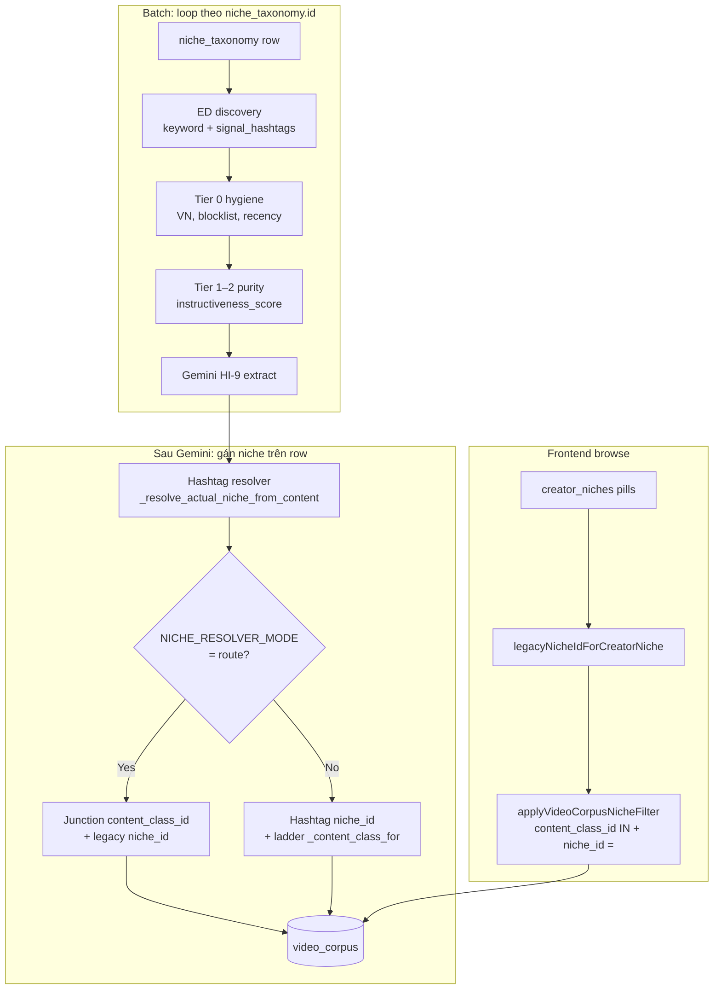

# Niche taxonomy · corpus ingest · UI — pipeline reference

**Status:** Living doc (2026-05-20)  
**Audience:** Tech Lead, backend/frontend agents  
**Related:** [`system-design.md`](system-design.md) §354 (two-axis model), §12.1 (ingest selection), [`corpus-ingest-criteria-v1.md`](corpus-ingest-criteria-v1.md), [`two-axis-niche-cutover-runbook.md`](two-axis-niche-cutover-runbook.md)

---

## 1. Tóm tắt

GetViews dùng **ba lớp “niche”** song song. Chúng **không trùng nhau 1:1**:

| Lớp | Bảng / cột | Ai dùng |
|-----|------------|---------|
| **UX bucket** | `creator_niches` → `profiles.creator_niche_id` | Onboarding, Settings, Trends pills — creator tự chọn **một** ngách |
| **Analysis sharp** | `content_classifications` → `video_corpus.content_class_id` | Diagnosis peers, hook stats two-axis, filter corpus sắc hơn topic×format |
| **Legacy ingest bucket** | `niche_taxonomy` → `video_corpus.niche_id` | Batch loop discovery, MV `niche_intelligence`, nhiều query Cloud Run cũ |

Hai pipeline **độc lập** nhưng gặp nhau khi upsert row:



**Corpus ingest criteria (purity)** quyết **video nào được extract** — dùng benchmark của **loop niche**. **HI-11 two-axis** quyết **row được ghi `niche_id` / `content_class_id` nào** — sau extract. Xem §6.

---

## 2. Phân chia niche — two-axis taxonomy

### 2.1 Trục UX: `creator_niches` (14–16 bucket active)

- Seed: `20260510000004_two_axis_niche_pr1_schema.sql` (+ PR6 music/real estate, retire comedy/pets 20260728).
- Mỗi user **một** `profiles.creator_niche_id` (onboarding / settings).
- Hiển thị: `name_vn`, sắp xếp `display_order` (Beauty → Fashion → Food → …).
- Slug canonical: `cloud-run/getviews_pipeline/two_axis_taxonomy.py` ↔ UI `useCreatorNiches()`.

**Retired UX buckets** (ẩn picker): `RETIRED_CREATOR_NICHE_IDS` — comedy, pets_home → gộp lifestyle.

### 2.2 Trục analysis: `content_classifications` (74) + junction

- Mỗi class = **topic × `format_axis`** (vd `beauty` × `tutorial`, `fashion` × `montage_highlights`).
- Junction `creator_niche_content_classes(creator_niche_id, content_class_id, is_primary)` — M:N, có tie-break `is_primary` + lowest id.
- Lookup runtime: `junction_content_class.content_class_id_for_creator_niche_format()`.
- Carousel có `format_axis` riêng (HI-16): `tutorial_carousel`, `listicle_carousel`, …

### 2.3 Legacy bridge: `niche_taxonomy` + `video_corpus.niche_id`

- Batch **không** loop `creator_niches` — loop **`niche_taxonomy`** (một row = một ingest bucket + `signal_hashtags[]`).
- Nhiều legacy id đã merge/retire (Shopee→5, Nấu ăn→4, Lifestyle cluster→27, Music→28) — xem `profileNiches.ts` / `profile_niches.py`.
- **Bridge bắt buộc** (Python ≡ TypeScript):

```
creator_niches.id  --legacyNicheIdForCreatorNiche()-->  niche_taxonomy.id
```

Ví dụ:

| creator_niches | UX label | Representative `niche_id` |
|----------------|----------|----------------------------|
| 1 | Làm đẹp · Skincare | 2 |
| 2 | Thời trang · Phụ kiện | 3 |
| 4 | Đời sống · Tâm sự | 27 |
| 15 | Âm nhạc · Vũ đạo | 28 |

### 2.4 HI-11 — gán niche sau Gemini

Env **`NICHE_RESOLVER_MODE`** (`config.py`, prod batch: **`route`**):

| Mode | `video_corpus.niche_id` | `content_class_id` | Telemetry |
|------|-------------------------|--------------------|-----------|
| `shadow` | Hashtag resolver (canonical) | Ladder `_content_class_for` | `niche_resolution_*`, `inferred_creator_niche_id` |
| `route` | Gemini + junction → representative legacy id | Junction id (bypass ladder) | + log `hi11 route gemini_two_axis` |

Điều kiện route (tất cả phải pass):

1. `analysis_json.niche_classification.confidence ≥ 0.6`
2. `creator_niche_slug` map được → `creator_niches.id`
3. `junction_has_pair(slug, format_axis)` — **TD-6**
4. Junction lookup trả về `content_class_id`

Fail → fallback hashtag + ladder; WARN `[corpus] junction miss` / `hi11 route skip`.

**Hashtag resolver** (trước route): `_resolve_actual_niche_from_content` — so caption/hook với `signal_hashtags` **mọi** niche; nếu niche khác thắng **≥2 hit** → đổi legacy `niche_id`.

---

## 3. Corpus ingest — discovery bằng hashtag

### 3.1 Vòng lặp batch

Entry: `POST /batch/ingest` → `run_batch_ingest()` → **một lần / niche_taxonomy row / đêm**.

Per niche (`ingest_niche`):

1. **Fetch pool** — `_fetch_niche_pool(niche)`
2. **Pre-pool gates** — VN, ER, views (purity: pre-pool min **3k**, legacy: **20k**)
3. **Purity select** — `select_purity_candidates()` khi `CORPUS_INGEST_MODE=purity`
4. **Gemini** — video + carousel paths
5. **Assign + upsert** — route/hashtag → `_build_corpus_row` → RPC `upsert_video_corpus_batch`

Dedup video: **global** theo `video_id` (không per-niche) — tránh extract trùng khi niche migrate.

### 3.2 Nguồn discovery (EnsembleData)

Mỗi `niche_taxonomy` row mang:

- `name_en` — term cho **keyword search** (paginated, `BATCH_KEYWORD_PAGES`, recency `BATCH_RECENCY_DAYS=30`)
- `signal_hashtags[]` — hashtag feeds (cap số lần gọi ED / đêm)

```text
pool = merge(
  keyword_search(name_en, pages=N),
  hashtag_search(each picked signal_hashtag)
)
→ dedupe aweme_id → filter_recency(30d)
```

**Carousel:** hashtag feeds → filter `aweme_type=2`; nếu feed thiếu metadata carousel → `fetch_post_multi_info` chunk.

### 3.3 Chọn hashtag nào để gọi ED (`_pick_hashtags_for_pool_fetch`)

Input:

- `signal_hashtags` từ row taxonomy
- **Yield 14 ngày** — RPC `corpus_hashtag_yields_14d` (batch-start prefetch per niche)
- Limit: `BATCH_HASHTAG_FETCH_LIMIT` (default 15), override per niche `BATCH_HASHTAG_FETCH_BY_NICHE` (vd `3:31`)

Logic:

1. Sort hashtag theo yield DESC
2. Ưu tiên tag có yield ≥ `HASHTAG_YIELD_THRESHOLD`
3. Nếu đủ ≥ `ADAPTIVE_HASHTAG_MIN_FETCH` tag “high yield” → chỉ fetch nhóm đó (tiết kiệm ED)
4. Ngược lại → top N tag từ list gốc

**Hashtag bonus trong instructiveness:** +5 điểm nếu caption match một `signal_hashtag` của **loop niche** (pre-Gemini).

### 3.4 Hashtag ↔ niche ngoài ingest loop

| Mechanism | Vai trò |
|-----------|---------|
| `niche_taxonomy.signal_hashtags` | Discovery + caption hit map (batch reassignment) |
| `hashtag_niche_map` | DB map hashtag→niche; `classify_from_hashtags()` — live/on-demand |
| `learn_hashtag_mappings()` | Sau batch upsert — học hashtag từ video vừa index (**không** học từ nguồn hashtag-only để tránh vòng) |
| `niche_candidates` / Layer0 | Admin freshness — hashtag chưa map |

Hashtag discovery **gắn với ingest bucket** (`niche_taxonomy`), **không** gắn trực tiếp `creator_niches` pill UI.

### 3.5 Cross-niche side effect

Video fetch dưới loop **Fashion (id=3)** có thể upsert **`niche_id=2` (Beauty)** nếu HI-11 route hoặc hashtag resolver thắng. Fashion tốn ED/Gemini; Beauty corpus tăng — xem §6.

---

## 4. Corpus ingest criteria (purity) — ảnh hưởng tới niche

**Production (2026-05-20):** `CORPUS_INGEST_MODE=purity`, VPN=15, `KEYWORD_SEARCH_AUTHOR_STATS=true`.

Criteria **không đổi** cơ chế discovery hashtag / không thay HI-11. Nó thay **ai được extract** trong pool đã fetch:

| Giai đoạn | Dùng `niche_id` nào? |
|-----------|----------------------|
| Prefetch p50/p75, boost percentiles | Legacy id từ **loop niche** |
| `trend_velocity` sound momentum | **Loop niche_id** |
| Tier 1 tiered view floors + breakout OR | Stats theo **loop niche** |
| Post-extract reject | Không đổi assignment |

**Hệ quả volume:** ít row hơn / legacy bucket / đêm; thin niche có R1 relaxation (`ingest_relaxation_tier` trên row).

Chi tiết formula: [`corpus-ingest-criteria-v1.md`](corpus-ingest-criteria-v1.md).

---

## 5. Hiển thị niche trên UI

### 5.1 Nguyên tắc

- **User-facing label** luôn từ **`creator_niches`** (`name_vn`, `display_order`).
- **Query `video_corpus`** khi browse theo UX pill (**production 2026-05-21+**):
  - **Default (`VITE_CORPUS_BROWSE_CLASS_ONLY=true`, opt-out `"false"`):** chỉ `content_class_id IN (...)` khi junction có class (bỏ `niche_id` AND).
  - **Phase 1 only (`CLASS_FIRST=true`, `CLASS_ONLY=false`):** chỉ `content_class_id IN (...)` khi tổng `content_class_intelligence.sample_size` trên junction ≥ 20; else legacy AND.
  - **Legacy rollback:** `content_class_id IN (...)` **AND** `niche_id = legacyNicheIdForCreatorNiche(pill)` — tách lifestyle (27) vs music (28).

Helper: `src/lib/corpusNicheFilter.ts` — `fetchContentClassIdsForCreatorNiche`, `shouldUseClassFirstBrowse`, `applyVideoCorpusNicheFilter`; aggregate qua `useContentClassIntelligence`.

**Không** dùng raw `niche_taxonomy.name_vn` trên pill Trends — label pill = `creator_niches.name_vn`.

### 5.2 Màn hình theo surface

| Surface | Niche state | Nguồn hiển thị | Filter corpus |
|---------|-------------|-----------------|---------------|
| **Onboarding** `/app/onboarding` | Ghi `creator_niche_id` | `useCreatorNiches()` grid | — |
| **Settings → Ngách** | Đổi `creator_niche_id` | Cùng list + confirm regen | — |
| **Home** `/app` | Cố định profile | `profileFirstNicheId` → legacy cho MV/stats; `creator_niche_id` cho BreakoutGrid | `useTopBreakouts(creatorNicheId)` — junction + legacy |
| **Trends** `/app/trends` | **Transient browse** — pill = `creator_niche_id`, default profile; remount reset | `TrendsNichePills` | Grid + rails: `selectedNicheId` + `contentClassIds` |
| **Answer / Chat** | Session `niche_id` legacy + profile fallback | Taxonomy name join | Cloud Run live resolver (khác batch loop) |

Trends comment (code): pill id = **`creator_niche_id`**; `selectedNicheId` = legacy cho `niche_intelligence`, pattern grid, sound trends.

### 5.3 Thứ tự pill / picker

`useCreatorNiches()`:

```sql
SELECT id, slug, name_vn, description_vn, display_order
FROM creator_niches
WHERE active = true
ORDER BY display_order, id
```

Retired buckets không có trong list (`active = false` hoặc không seed).

### 5.4 MV và claim tier

- `niche_intelligence` — keyed **`niche_taxonomy.id`** (legacy bridge); MV refresh **skipped** in batch when `REFRESH_NICHE_INTELLIGENCE_MV=false` (Phase 4 prod).
- `content_class_intelligence` — keyed **`content_class_id`** (two-axis sharper cohorts cho diagnosis benchmark + browse).

UI thin banner trên Trends: **ưu tiên** tổng `content_class_intelligence.sample_size` trên junction khi có class; **fallback** `niche_intelligence.sample_size` khi junction rỗng (sau khi query settle).

---

## 6. Tương tác hai chiều (criteria ↔ taxonomy)

| Chiều | Mô tả |
|-------|--------|
| **Criteria → taxonomy** | Purity giảm volume / legacy bucket; post-extract loại rác mọi `niche_id`; không set `content_class_id` |
| **Taxonomy → criteria** | Route/reassign có thể **dời row sang niche khác** sau khi đã score theo loop niche; thin-starvation ở bucket A có thể che bởi row routed sang B |
| **UI → ingest** | User chọn `creator_niche_id` **không** đổi batch loop (batch quét **toàn** taxonomy). Ritual/refs filter theo profile niche |
| **Ingest → UI** | Row mới vào `video_corpus` xuất hiện Trends/Home khi `applyVideoCorpusNicheFilter` match pill + junction |

**Gap đã biết:** instructiveness prefetch theo loop niche, row persist có thể khác — chưa rescore sau route (Wave 2).

---

## 7. File map

| Concern | Path |
|---------|------|
| Batch loop + hashtag pool | `cloud-run/getviews_pipeline/corpus_ingest.py` |
| Purity scoring | `cloud-run/getviews_pipeline/corpus_instructiveness.py` |
| HI-11 route / shadow | `corpus_ingest.py` — `_route_niche_and_class_override`, `_niche_resolution_shadow_fields` |
| Junction lookup | `cloud-run/getviews_pipeline/junction_content_class.py` |
| Legacy bridge PY | `cloud-run/getviews_pipeline/profile_niches.py` |
| Two-axis labels | `cloud-run/getviews_pipeline/two_axis_taxonomy.py` |
| Hashtag map learn | `cloud-run/getviews_pipeline/hashtag_niche_map.py` |
| Legacy bridge TS | `src/lib/profileNiches.ts` |
| Corpus filter TS | `src/lib/corpusNicheFilter.ts` |
| UX niche list | `src/hooks/useCreatorNiches.ts` |
| Trends pills | `src/routes/_app/trends/ExploreScreen.tsx` |
| Onboarding | `src/routes/_app/onboarding/OnboardingScreen.tsx` |
| Settings niche | `src/routes/_app/settings/SettingsScreen.tsx` |
| Runbook flip route | `artifacts/docs/two-axis-niche-cutover-runbook.md` Part B |

---

## 8. Verify sau manual ingest (checklist ngắn)

**Logs (batch pod):**

```text
[corpus] purity allocator — uniform VPN=15
[corpus] niche=… purity selected=N relaxation_tier=…
[corpus] hi11 route gemini_two_axis … legacy_niche=… content_class_id=… hashtag_baseline=…
```

**SQL:**

```sql
SELECT niche_id, content_class_id, niche_resolution_source,
       inferred_creator_niche_id, ingest_relaxation_tier, indexed_at
FROM video_corpus
WHERE indexed_at > now() - interval '3 hours'
ORDER BY indexed_at DESC
LIMIT 20;
```

So sánh `niche_id` với id loop trong log `[corpus] niche=… id=N` — đo tỷ lệ cross-route.

---

## 10. Content-class corpus pivot (Phase 0–4)

**Roadmap:** Canonical cohort moves from legacy `niche_taxonomy.id` loop to `content_class_id` (topic×format) + `creator_tier` peer band. UX pills (`creator_niches`) stay broad; backend + **ACQE** assign sharp class.

| Phase | Backend deliverable | Env / gate |
|-------|---------------------|------------|
| **0** | Provenance cols (`ingest_loop_*`, `class_assignment_*`, `score_cohort_mismatch`); `content_class_ingest_targets`; **ACQE** nightly; metrics SQL | 3-night baseline; Cross-Niche Migration Rate |
| **0b** | `hashtag_class_map` + spec | Learn deploy Phase 3 |
| **1** | `content_class_intelligence.claim_tier`; FE `VITE_CORPUS_BROWSE_CLASS_FIRST` | **Promoted 2026-05-21** (default on) |
| **1b** | `hi11_rolling_eval.py` rolling agreement/junction/outlier | Observation gate pre-promote |
| **2** | Class-keyed instructiveness (`CORPUS_SCORE_COHORT=class`); `content_class_tier_intelligence` MV; `LIVE_COHORT_CLASS_FIRST=true` | **Promoted 2026-05-21** |
| **3** | `CORPUS_INGEST_LOOP=class`; class dedup re-upsert; `CORPUS_DISCOVERY_RELAX` | **Promoted 2026-05-21** (was default `niche`) |
| **4** | `CORPUS_WRITE_NICHE_ID=false`; `REFRESH_NICHE_INTELLIGENCE_MV=false`; `content_class_channel_benchmarks`; FE `VITE_CORPUS_BROWSE_CLASS_ONLY=true` | **Promoted 2026-05-21**; column drop still future |

**ACQE cold-start:** Nights 1–3 use all rows + global percentiles; no red-alert escalation. Validated subset from night 4+.

**Peer band:** `(content_class_id, creator_tier)` — diagnosis yes; Trends browse no user-tier filter.

**SQL pack:** [`content-class-pivot-metrics.sql`](content-class-pivot-metrics.sql)

---

## 9. Amendment log

| Date | Change |
|------|--------|
| 2026-05-21 | Doc sync — production pivot defaults (Phase 1–4 promoted); browse + thin banner §5.1/§5.4; aligns with `system-design.md` §9 |
| 2026-05-21 | §10 — Phase 4 sunset env + class channel benchmarks RPC |
| 2026-05-21 | §10 — content-class pivot Phase 0–3 backend map + ACQE |
| 2026-05-20 | Initial doc — two-axis + ingest discovery + purity interaction + UI mapping |
