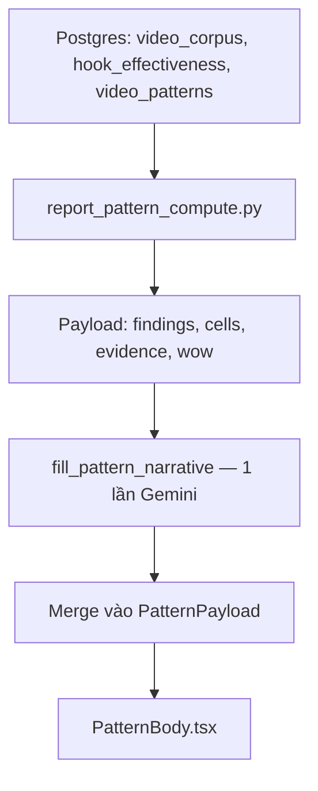

# Học video viral (Cơ bản / Chuyên sâu) — Handoff Marketing

> **⚠ Lịch sử (2026-05):** URL handoff từng dùng `depth=basic`. **Ship 2026-06-11:** không `?depth=`; video primary **2 credit** — xem [`system-design.md`](../system-design.md).

**Phiên bản:** as-built 2026-05 · **Độc lập:** file này mô tả đầy đủ mọi cách user “học từ video viral” trên GetViews.

---

## 1. Tính năng là gì? (định nghĩa sản phẩm)

“Học video viral” **không phải một nút duy nhất**. Trên sản phẩm là **ba mặt**:

| # | Tên trải nghiệm | User làm gì | Kết quả |
|---|-----------------|-------------|---------|
| **1** | **Giải mã 1 video hit** | Chọn 1 video từ Xu hướng / Home → “Mổ video” | Báo cáo video **Win** (giống phân tích video, khung tích cực) |
| **2** | **Bảng xu hướng tuần** | Hỏi “hook nào đang hot trong ngách?” (không URL) | Báo cáo **Pattern** — rank hook + video mẫu |
| **3** | **Thẻ công thức** (browse) | Mở card công thức trên Tab Xu hướng | Modal: structure / why / careful / angles (không tốn credit) |

**Cơ bản / Chuyên sâu** ~~đã bỏ 2026-06-11~~ — video primary luôn **2 credit** (một tier deep).  
**#2** không có toggle depth — “mỏng” khi corpus ít mẫu.  
**#3** là nội dung marketing trên Trends, refresh batch 7 ngày.

---

## 2. Ai dùng & JTBD

| JTBD | Luồng | Depth |
|------|-------|-------|
| “Video này viral vì sao — mình quay tiếp kiểu gì?” | #1 Giải mã URL | Cơ bản đủ; Chuyên sâu khi cần sound/editing/kênh |
| “Tuần này ngách skincare viral kiểu gì?” | #2 Pattern | Tự động theo sample corpus |
| “Công thức POV unbox đang chạy thế nào?” | #3 Modal | Browse free |

---

## 3. Luồng 1 — Giải mã một video viral (có URL)

### 3.1 Hành trình user

```
Tab Xu hướng / Home Breakout → [Chọn video] → /app/answer?url&depth=basic&mode=win
→ Trừ 1 credit (Cơ bản) → Báo cáo VideoBody → CTA “Tạo kịch bản” / “Soi kênh”
```

| Tham số URL | Ý nghĩa marketing |
|-------------|-------------------|
| `mode=win` | Giọng **học từ chỗ thắng**, không chẩn đoán flop |
| `depth=basic` | Default từ Trends — upsell Chuyên sâu trong báo cáo |
| `depth=deep` | 2 credit — full section pool |
| `from=trends` | Attribution nội bộ |

### 3.2 Cách bài phân tích được lắp ghép

**Cùng kiến trúc 4 lớp** như Phân tích video:

1. **KPI + tier `hit`** — breakout multiplier, ER vs ngách  
2. **Extract + signals** — vision + so corpus  
3. **Narrative V6** — sections (whitelist nếu Cơ bản)  
4. **CTA** — nhân bản hook sang Kịch bản

**Khác biệt duy nhất so Flop:** prompt và headline **bắt buộc khẳng định thắng** — hook chỉ là polish.

| Prompt note (trong `build_diagnosis_v6_user_prompt`) |
|------------------------------------------------------|
| *“headline_vi và diagnosis phải khẳng định thắng — chỉ nêu hook/cắt như polish, không viết như video flop”* |

### 3.3 Block tiêu biểu — Cơ bản (Win)

| Section | Câu hỏi trả lời cho “học viral” |
|---------|--------------------------------|
| `diagnosis` | Vì sao clip breakout (format + số so ngách) |
| `hook_analysis` | 3s đầu làm đúng gì — học để lặp lại |
| `niche_pattern` | Peer đang chạy cùng công thức — tiles |
| `next_video` | Biến thể nên quay tuần sau |

**Không có (teaser):** sound, editing, distribution, persona…

### 3.4 Block thêm — Chuyên sâu (Win)

| Section | Giá trị “học sâu” |
|---------|-------------------|
| `sound` | Nhạc nào đang được top video dùng |
| `editing` | Text overlay / nhịp cắt của viral |
| `script_structure` | Beat arc có thể copy |
| `channel_pattern` | Video này vs phong độ kênh |
| `distribution` | Có đăng đúng khung giờ không |
| `persona` | Persona creator viral |

### 3.5 Prompt synthesis (luồng 1)

**Giống hệt** Phân tích video — system + user V6 trong `phan-tich-video.md` mục **8**. Khác metadata: `performance_tier` thường `hit`, block Win framing ở cuối user prompt.

### 3.6 Skeleton bài — Giải mã viral (Cơ bản)

```text
[MỔ VIDEO VIEW CAO · Ngách Affiliate]

Headline: Hook “cảnh báo mua” + mặt 0.5s khớp top 18% ngách — 128K view, 2.4× median kênh

KPI · BREAKOUT chip

Section Đang làm tốt: Format POV + text vàng; ER p60 ngách
Section Phân tích hook: [peer tiles] Cùng cấu trúc 0-2s question + reveal
Section Công thức ngách: 62% hit dùng testimonial 28s
Section Video tiếp: Biến thể sản phẩm B, cùng hook frame

Format cards: “GRWM 30s · testimonial”

Upsell Chuyên sâu: Âm thanh, Editing, …

CTA: Tạo kịch bản từ video này
```

---

## 4. Luồng 2 — Bảng xu hướng / Pattern (không URL)

### 4.1 Tính năng là gì?

User hỏi câu dạng: *“Tuần này skincare viral kiểu gì?”*, *“Hook nào đang tăng?”*  
→ Báo cáo **aggregate** từ corpus 7 ngày (không phân tích 1 URL).

**Màn hình:** `/app/answer` · format `pattern`  
**Intent ví dụ:** `trend_spike`, `content_directions`, `subniche_breakdown`, `fatigue`

### 4.2 Pipeline — cách “bài” được tạo



| Bước | LLM? | Output |
|------|------|--------|
| SQL + rank hook | Không | Top 3 hook, stalled hooks, evidence videos |
| Pattern cells (duration, sound, CTA…) | Không | Chart data |
| WoW diff RPC | Không | Hook mới / tăng hạng |
| `fill_pattern_narrative` | **Có** | thesis, hook_narratives, related_questions… |
| FE render | Không | Thứ tự section cố định |

**Credit:** 1 credit / primary turn answer (giống turn video Cơ bản).

### 4.3 Cấu trúc bài Pattern — thứ tự trên màn hình

| # | Block UI | Phân tích gì | Nguồn | LLM? |
|---|----------|--------------|-------|------|
| 0 | Outlier story / A/B strip | 1 creator breakout tuần hoặc cùng kênh hook thắng vs thua | Compute | Một phần narrative |
| 1 | **WoW band** | Hook lên/xuống hạng tuần | `pattern_wow_diff_7d` | thesis nhắc WoW |
| 2 | **TLDR / Thesis** | “Kết luận nhanh:” + 1 finding số | `report.tldr.thesis` | **Có** (`thesis`) |
| 3 | Callouts 3 ô | Videos scanned, median retention, creators | Compute | Không |
| 4 | **HookFindingCard** × N | Mỗi hook: pattern label, retention delta, lifecycle, prerequisites | Compute + `hook_narratives[i]` | **Có** per hook |
| 5 | **WhatStalled** | Hook đang chết | `stalled_insights` | **Có** |
| 6 | **CrossPatternSynthesis** | “Tóm lại tuần này” 3–4 theme | `cross_pattern_synthesis` | **Có** |
| 7 | **PatternCellGrid** | Duration / hook timing / sound / CTA | Aggregates | Không |
| 8 | **EvidenceGrid** | 3–6 video chứng minh | `evidence_videos` | Không |
| 9 | **Action cards** | Mở Script, Soi kênh, Trends | Static routes | Không |
| 10 | Subreport Timing | Lịch đăng (intent calendar) | `report_timing` merge | Không / khác pipeline |
| 11 | Related questions | 4 pill follow-up | `related_questions` | **Có** |

### 4.4 “Cơ bản vs Chuyên sâu” (luồng 2)

**Không có** `analysis_depth` trên pattern.

| Trạng thái corpus | UX (= “độ sâu” thực tế) |
|-------------------|-------------------------|
| `sample_size` ≥ 30 | Full findings + WoW + narrative đầy đủ |
| `sample_size` < 30 (**thin**) | 1 hook finding, 3 evidence, ẩn WhatStalled, disclaimer |

### 4.5 Prompt synthesis — nguyên văn (luồng Pattern)

#### System instruction

### Pattern narrative — system_instruction

```text
Bạn là chuyên gia phân tích TikTok Việt Nam. Nhiệm vụ: trả lời user prompt bằng insight thực chiến. 
Trả về DUY NHẤT JSON (không markdown) đúng schema response.


- Tiếng Việt tự nhiên, không emoji, không mở đầu "Chào bạn".

- Không dùng: "chắc chắn", "hiệu quả", "bùng nổ", "công thức vàng".

- Số liệu chỉ được trích từ dữ liệu trong user prompt; không tự bịa ra %.

- hook_narratives là trường ưu tiên — viết đủ 500 ký tự nếu có dữ liệu. 
hook_insights chỉ là fallback ngắn.

- cultural_framing, why_it_works, micro_patterns, cross_pattern_synthesis — 
không bỏ qua bất kỳ trường nào.

- generated_prerequisites: bắt buộc đủ {n_top} sublist theo user prompt 
(có thể rỗng [] nếu không infer được — khi đó backend dùng chip mặc định theo hook).

- Khi phần Micro-element trong user prompt chỉ là đúng 
"(không có dữ liệu micro-element)", KHÔNG đưa số liệu hoặc chi tiết cụ thể 
về micro-element; không bịa micro-pattern.
```


#### User prompt template

Biến `{wow_block}` chèn trước khi có delta tuần; `{hook_narratives_rule}`, `{hook_insights_rule}`, `{why_it_works_rule}`, `{micro_patterns_rule}` build theo `n_top` / có top performers.

### User prompt (sau WOW block)

```text
{wow_block}Trả về DUY NHẤT một JSON object (không markdown) với các khóa:

- thesis: string ≤300 ký tự — BẮT ĐẦU BẰNG "Kết luận nhanh:" rồi 1 câu phát hiện CỤ THỂ NHẤT tuần này kèm số liệu thực. Nếu có WOW ALERT phía trên, ưu tiên đưa số đó vào câu mở (ví dụ: "Kết luận nhanh: Bằng chứng xã hội tăng 3 bậc so với tuần trước — đang là hook thắng tuyệt đối ngách {niche_label}."). Nếu không có WoW delta, mở bằng hook dẫn đầu + view trung bình cụ thể. Sau câu mở, nêu thêm 1 xu hướng bổ sung. KHÔNG bắt đầu bằng "Trong ngách..." hay câu generic.
{hook_narratives_rule}
{hook_insights_rule}
- stalled_insights: đúng {n_st} string ≤200 ký tự — vì sao hook suy liên quan câu hỏi.
- related_questions: đúng 4 string ngắn ≤80 ký tự — follow-up LIÊN TIẾP câu hỏi hiện tại.
- cultural_framing: đúng {n_top} string — QUAN TRỌNG. Mỗi string: nếu pattern này liên kết với văn hóa Việt Nam (mùa thi cử, văn hóa đám cưới, Vinglish/ngôn ngữ bản sắc, tâm lý Gen Z, thói quen tiêu dùng Shopee, v.v.), viết 1 câu giải thích TẠI SAO văn hóa đó làm hook này mạnh hơn ở VN so với thị trường khác. Câu phải cụ thể — không viết chung chung. Nếu KHÔNG có liên kết văn hóa rõ ràng với dữ liệu này, để "". Ví dụ tốt: "Văn hóa áp lực học thi ở VN khiến 'AI thầy giáo khắt khe' cộng hưởng sâu hơn với học sinh — không chỉ giải trí mà còn release tension thực sự." Ví dụ xấu: "Phù hợp với văn hóa Việt Nam."
{why_it_works_rule}
{micro_patterns_rule}
- cross_pattern_synthesis: đúng 3-4 string ≤120 ký tự — CHỦ ĐỀ XUYÊN SUỐT nhiều pattern CÙNG LÚC trong tuần này. Đây là "tóm lại tuần này" — không lặp lại insight từng hook. Mỗi string là 1 quy luật cụ thể có thể verify bằng số, ví dụ: "Text overlay vàng đang là chuẩn ngách — 4/5 video viral đều có", "Account nhỏ vẫn thắng — algorithm thưởng format, không thưởng follower count". PHẢI DỰA TRÊN dữ liệu micro-element và creator_count bên dưới.
- generated_prerequisites: đúng {n_top} sublists. Mỗi sublist: 2-4 yếu tố sản xuất CỤ THỂ và BẮT BUỘC cho hook đó, dựa trên micro-element data. KHÔNG CHUNG CHUNG.
  Tốt: ["Dưới 22 giây", "Không nhạc nền", "Filter biến dạng khuôn mặt", "Text tiếng Việt frame đầu"]
  Xấu: ["Khung hình ổn định", "Âm thanh rõ"] — quá generic, không derive từ data.
  Nếu micro-element data cho hook đó thiếu → dùng ["Khung hình 9:16", "Hook trong 1s đầu"].

--- DỮ LIỆU ĐẦU VÀO ---
Ngách: {niche_label}
Câu hỏi người dùng: "{query_clean or '(không nêu rõ — trả lời dựa trên xu hướng hook hiện tại)'}"
Hook đang thắng (xếp hạng): {top_hook_labels}
Hook suy (nếu có): {stalled_hook_labels}

Micro-element từ corpus (dùng để tăng độ cụ thể trong hook_narratives + hook_insights + cross_pattern_synthesis):
{micro_inject}

Creator count per pattern (dùng để framing cross-creator validation):
{counts_inject}
Khi creator_count >= 3: ghi rõ "pattern này giữ vững ở X creator — format là biến số, không phải creator"
{live_block}{performers_block}{ab_block}
```


### Quy tắc động hook_narratives / hook_insights (trích code)

```text
has_top_performers = bool((top_performers_str or "").strip())
        hook_insights_rule = (
            f"- hook_insights: đúng {n_top} string ≤200 ký tự — fallback ngắn cho hook_narratives (dùng khi narrative rỗng). PHẢI: (1) cite ≥1 creator cụ thể từ danh sách top performer với số view thực, (2) giải thích CƠ CHẾ TÂM LÝ (không chỉ mô tả), (3) liên hệ micro-element cụ thể (framing/overlay/nhịp) từ data."
            if has_top_performers
            else f"- hook_insights: đúng {n_top} string ≤200 ký tự — fallback ngắn. Đề cập yếu tố cụ thể (framing, overlay, nhịp cắt) khi có trong dữ liệu micro-element bên dưới."
        )
        hook_narratives_rule = (
            f"- hook_narratives: đúng {n_top} string ≤500 ký tự — đoạn văn KHAI CHUYỆN cho hook đó. "
            f"CẤU TRÚC BẮT BUỘC: (1) Mở bằng '@handle' cụ thể từ danh sách top performer, kèm số view thực và "
            f"1-2 câu MÔ TẢ CẢNH QUAY CỤ THỂ: creator làm gì trong 3 giây đầu, có nhạc không, text overlay thế nào. "
            f"(2) Nếu có view chênh lệch lớn so với video khác cùng kênh, PHẢI đề cập: 'gấp Nx trung bình kênh'. "
            f"(3) Nếu còn ký tự, thêm creator thứ 2 ngắn gọn (1 câu). "
            f"Không viết chung chung. Không dùng 'hiệu quả', 'viral', 'bùng nổ'. "
            f"Ví dụ tốt: '@hagiang.makeup đăng clip cầm serum nói thẳng vào máy \"tôi dùng 30 ngày — đây là kết quả\". "
            f"Không nhạc nền, close-up da tay, text vàng trên nền đen → 233K view, gấp 4× trung bình kênh.'"
            if has_top_performers
            else f"- hook_narratives: đúng {n_top} string ≤500 ký tự — mô tả cách hook này thường được thực hiện, "
                 f"loại cảnh quay phổ biến, và tại sao format đó kéo được view. Không cần cite @handle nếu không có dữ liệu."
        )
        why_it_works_rule = (
            f"- why_it_works: đúng {n_top} string ≤350 ký tự — giải thích CƠ CHẾ TÂM LÝ hoặc VĂN HÓA khiến hook này "
            f"hiệu quả ở thị trường Việt Nam tuần này. Viết như giải thích cho người mới — không dùng jargon marketing. "
            f"Được phép so sánh với hành vi người dùng thực tế (ví dụ: 'người xem đã quen bị quảng cáo che giấu sự thật'). "
            f"Kết bằng 1 câu chỉ ra điều tạo ra sự khác biệt cụ thể (góc máy, nhịp cắt, ngôn từ, v.v.)."
        )
        micro_patterns_rule = (
            f"- micro_patterns: đúng {n_top} string — nếu trong dữ liệu top performer hoặc scene mẫu có một biến thể "
            f"CỰC KỲ CỤ THỂ đang nổi (ví dụ: creator nam gọi khán giả là 'vợ', hay creator dùng da tay không makeup để "
            f"chứng minh), hãy đặt tên và mô tả ngắn gọn ≤220 ký tự: 'Biến thể đang nổi: [tên] — [mô tả + dấu hiệu]'. "
            f"Nếu KHÔNG thấy biến thể cụ thể đủ nổi bật, để chuỗi rỗng ''. KHÔNG bịa nếu không có bằng chứng trong dữ liệu."
        )
```


#### Luồng 1 (Giải mã URL Win)

Dùng **cùng prompt** như Phân tích video — xem `phan-tich-video.md` mục 8.

#### Luồng 3 — Pattern deck (`pattern_deck_synth._PROMPT_TEMPLATE`)

### Deck prompt template

```text
Bạn là biên tập TikTok tiếng Việt. {niche_clause}, hãy tổng hợp một bộ "deck" để creator hiểu nhanh và remix được.

PATTERN: {pattern_name}

Grounding (top {n} video thực tế tagged với pattern này, sắp theo view). {grounding_fields_note}
{grounding_json}

Trả về JSON theo schema:

- structure: ĐÚNG 4 chuỗi, mỗi chuỗi mô tả 1 đoạn của video pattern này (Hook / Setup / Body / Payoff) kèm khung giây gợi ý. Tiếng Việt, ngắn gọn, cụ thể.
  Ví dụ:
    "Mở: câu hỏi 'tôi đã dùng X trong N tháng' (0-2s)"
    "Setup: thử thách ban đầu / sự nghi ngờ (2-8s)"

- why: 1-2 câu tiếng Việt giải thích VÌ SAO pattern này hiệu quả — gắn với hành vi audience hoặc thuật toán. Cụ thể, ≤ 320 ký tự. Ví dụ: "Format thử-thách-thời-gian tạo curiosity. Audience muốn biết kết quả cuối — tỉ lệ xem hết cao, save cũng cao vì giống testimonial."

- careful: 1 câu cảnh báo ngắn (≤ 240 ký tự) về cách creator có thể "đập đầu" khi áp pattern (sao chép cứng, mất authenticity, dropout, etc.). Ví dụ: "Nếu chưa thực sự dùng X tháng, đừng giả. TikTok đẩy mạnh signal authenticity drop-off — comment sẽ phát hiện."

- angles: 4-8 góc nội dung CỤ THỂ trong pattern này. Mỗi góc:
  • angle: cụm danh từ tiếng Việt ≤ 80 ký tự, đặc trưng cho ngách (vd "Sản phẩm Apple", "AI tools", "Setup làm việc").
  • filled: số nguyên ≈ số video trong grounding dùng góc này. 0 = chưa creator nào.
  • gap: true nếu filled = 0 (cơ hội còn trống); false ngược lại.
  PHẢI có ít nhất 1 góc với gap=true (cơ hội chưa khai thác).

NGUYÊN TẮC:
- Văn phong tự nhiên tiếng Việt. KHÔNG dùng "bí mật", "công thức vàng", "triệu view", "đột phá".
- Số liệu cụ thể, không hứa hẹn "sẽ viral".
- Nếu grounding mỏng, chấp nhận angle đơn giản — đừng bịa thông tin.
{cross_niche_rule}
```


`{niche_clause}`, `{pattern_name}`, `{grounding_json}`, `{cross_niche_rule}` điền lúc runtime.

### 4.6 Skeleton bài — Pattern (đủ mẫu)

```text
[Đỉnh cao tuần này: @creatorX · 890K view · 4.2× median · hook Cảnh báo]

[WoW: Hook “Bằng chứng xã hội” lần đầu vào top-10]

Kết luận nhanh: Bằng chứng xã hội tăng 3 bậc — 214 video ngách Beauty 7 ngày

Callouts: 214 video · retention 72% ↑ · 18 creators

Hook #1 card: “Mình vừa test…” · +312% vs ngách · prerequisites chips
  narrative: @hagiang.makeup 233K, close-up 0-2s, text vàng…
  why_it_works: Người xem VN đã quen bị che giấu trong quảng cáo…

WhatStalled: Hook listicle 3 điều — rank giảm 4 bậc

Tóm lại tuần này:
→ Text vàng trên nền đen — 4/5 viral có
→ Account nhỏ vẫn thắng khi format đúng

Cells: Duration 28s · Hook 0.4s · Sound 60% orig · CTA Follow

Evidence grid: 6 thumbnails

CTA: Mở Xưởng Viết · Soi kênh · Theo dõi trend
```

---

## 5. Luồng 3 — Thẻ công thức (PatternModal — browse)

### 5.1 Không phải “bài phân tích” trả credit

User mở modal từ grid Xu hướng → đọc deck đã synth sẵn.

| Field | Ý nghĩa marketing |
|-------|-------------------|
| `structure[4]` | Hook / Setup / Body / Payoff + timing |
| `why` | Vì sao pattern work (tâm lý + algorithm) |
| `careful` | Pitfall cần tránh |
| `angles[]` | Góc nội dung + `filled` count + `gap` opportunity |

### 5.2 Prompt deck

Prompt nguyên văn: **mục 4.5** — khối `Deck prompt template` (`pattern_deck_synth._PROMPT_TEMPLATE`).

| | |
|---|---|
| **Model** | flash-lite |
| **Grounding** | ≤12 video corpus gắn pattern, min 3 video |
| **Refresh** | `deck_computed_at` — stale sau 7 ngày |

**Placeholder runtime:** `{niche_clause}`, `{pattern_name}`, `{grounding_json}`, `{cross_niche_rule}`.

---

## 6. Bảng tổng hợp billing

| Luồng | Credit | Ghi chú |
|-------|--------|---------|
| 1 — Video Win Cơ bản | 1 | |
| 1 — Video Win Chuyên sâu | 2 | |
| 2 — Pattern turn | 1 | |
| 3 — Modal / browse Trends | 0 | |

---

## 7. Marketing: việc có thể chỉnh theo luồng

| Luồng | Chỉnh prompt / copy ở đâu (trong doc này) |
|-------|---------------------------------------------|
| 1 | `phan-tich-video.md` mục **8** + Win note mục 3.5 |
| 2 | Mục **4.5** (system + user Pattern + hook rules động) |
| 3 | Mục **4.5** — Deck prompt template |
| KPI / label Trends | UI `TrendsPatternGrid` (eng) |

---

## 8. Copy rules (cả 3 luồng)

- Cấm “viral”, “bùng nổ”, “triệu view” trong **product UI** (rule DS) — trong narrative corpus-driven có thể nói “breakout”, “top ngách”.
- Pattern thesis **phải** có số hoặc WoW cụ thể — không mở “Trong ngách…”.
- Luồng 1 Win: không dùng giọng đồng lõa flop.
- Cite @handle + view khi có `top_performers_str` — không bịa creator.

---

## 9. Thuật ngữ

| Thuật ngữ | Nghĩa |
|-----------|--------|
| `mode=win` | Handoff framing học từ video hit |
| `PatternPayload` | Schema báo cáo pattern |
| `thin sample` | &lt;30 video — UX rút gọn |
| `hook_narratives` | Đoạn kể chuyện dài per hook |
| `video_patterns` | Bảng công thức aggregate (deck) |

---

## 10. Tham chiếu kỹ thuật

| Luồng | Path |
|-------|------|
| 1 Video | `report_video.py`, `VideoBody.tsx`, `answerHandoff.ts` |
| 2 Pattern | `report_pattern.py`, `report_pattern_gemini.py`, `PatternBody.tsx` |
| 3 Deck | `pattern_deck_synth.py`, `TrendsPatternGrid.tsx` |
