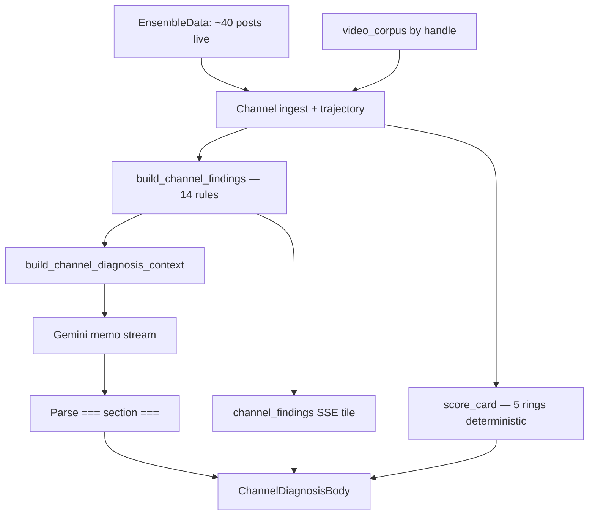

# Soi kênh đối thủ (Cơ bản / Chuyên sâu) — Handoff Marketing

**Phiên bản:** as-built 2026-05 · **Độc lập:** mô tả đầy đủ F5 Nhanh + F4 Sâu và cách một “bài soi kênh” được ghép.

---

## 1. Tính năng là gì?

User nhập **@handle TikTok** (đối thủ hoặc kênh mình). GetViews trả lời:

- **Cơ bản (Nhanh):** vài số nhanh từ corpus — median view, hook chính, video breakout — **0 credit**.
- **Chuyên sâu (Sâu):** memo tư vấn dài (SSE stream) + 5 vòng audit + đối chiếu peer ngách + kế hoạch hành động — **3 credit**.

**Khác phân tích video:** không xem từng frame một clip; phân tích **lịch sử đăng + corpus + live posts** của cả kênh.

**Route:** `/app/channel?handle=…&depth=basic|deep`

---

## 2. Ai dùng & JTBD

| Persona | JTBD | Gợi ý |
|---------|------|-------|
| Minh | “Đối thủ @X đang làm gì khác mình?” | Nhanh trước → Sâu nếu cần memo |
| Linh | Brief agency: format mix, risk, next concept | Sâu + optional `video_url` so 1 video |
| Minh | “Kênh mình sao rồi?” | `own_channel` — cùng pipeline |

---

## 3. Hai sản phẩm trong một màn hình

| | **Cơ bản — “Nhanh”** | **Chuyên sâu — “Sâu”** |
|---|----------------------|-------------------------|
| **Tên UI** | Soi kênh · Cơ bản | Chuyên sâu · 3 credit |
| **API** | `GET /channel/quick-peek` | `POST /channel/diagnose` (SSE) |
| **Credit** | 0 | 3 |
| **Thời gian** | Vài giây | ~30–90s stream |
| **Output** | Card stat | Memo nhiều section + findings |
| **Đối thủ ngách** | Không | Có (`competitive_landscape`) |
| **LLM** | Không | Có (memo) |

Composer Studio: pill **Khám Kênh** + chọn Cơ bản / Chuyên sâu (Chuyên sâu disable nếu &lt;3 credit).

---

## 4. Hành trình user

### 4.1 Cơ bản (Nhanh)

```
Nhập @handle → Tự load quick-peek → Card 3 stat + breakout link
→ [CTA Chuyên sâu 3 credit] hoặc [Mổ video breakout → /app/answer]
```

### 4.2 Chuyên sâu (Sâu)

```
Chọn Chuyên sâu → Trừ 3 credit → SSE steps
→ Score card + Audit 5 vòng (findings) stream sớm
→ Memo sections stream (verdict → … → recommendations)
→ [CTA Kịch bản theo format dominant] [So sánh thêm video URL]
```

**Cache:** Kết quả Sâu cache ~7 ngày / handle — xem lại không mất credit (replay).

**Video so sánh:** Optional field “+ So sánh với video cụ thể” → thêm section `video_vs_channel`.

---

## 5. Cách một “bài soi kênh” Chuyên sâu được lắp ghép



| Lớp | Nội dung | LLM? |
|-----|----------|------|
| **A — Deterministic** | Trajectory, score card, 14 findings | Không |
| **B — Findings tile** | Claim + evidence (top 8 vào prompt) | Không (copy template trong code) |
| **C — Memo narrative** | Prose từng section | **Có** |
| **D — Optional fallback** | Nếu LLM thiếu `account_health` / `policy_risk` | Template từ findings |

**Quan trọng cho Marketing:** Số liệu trong memo **phải** đến từ lớp A/B — prompt cấm bịa; LLM **diễn giải** findings.

---

## 6. Catalog block — Cơ bản (Nhanh)

**Component:** `ChannelNhanhPanel`

| # | Block | Phân tích gì | Nguồn | LLM? |
|---|-------|--------------|-------|------|
| 1 | Header | Handle + “không trừ credit” | — | — |
| 2 | Stat: View trung bình | Median views corpus gần nhất | `quick_peek.median_views` | Không |
| 3 | Stat: Hook chính | Hook type dominant | Corpus aggregate | Không |
| 4 | Stat: Video nổi bật | Breakout gần nhất | `breakout_video` | Không |
| 5 | CTA Chuyên sâu | Upgrade | Product | — |
| 6 | Link Mổ video | Handoff video diagnosis basic | URL construct | — |

**Empty:** &lt;3 video corpus → gợi ý chạy Chuyên sâu (live ingest).

**Prompt:** Không có — `channel_quick_peek.py` + `pick_channel_quick_peek()`.

---

## 7. Catalog block — Chuyên sâu (Sâu)

**Component:** `ChannelDiagnosisBody` + children

| # | Block | Thứ tự stream | Phân tích gì | Nguồn | LLM? |
|---|-------|---------------|--------------|-------|------|
| 1 | `StepProgress` | Đầu | Bước đang chạy + trajectory label | SSE meta | Không |
| 2 | `ScoreCard` | Sớm | 5 KPI vòng tròn (format, cadence, …) | Deterministic | Không |
| 3 | `ChannelAuditRingsPanel` | Sớm | 5 vòng audit + teaser từng finding | `channel_findings` event | Text claim từ code; không phải memo |
| 4 | **Section `verdict`** | Memo | Bức tranh tổng: peak, inflection, 30 ngày | SCENARIO + TOP PERFORMERS + findings | **Có** |
| 5 | **Section `what_worked`** | Memo | 3 điểm mạnh format + số | FORMAT PERFORMANCE | **Có** |
| 6 | **Section `what_falling`** | Memo | 3 điểm yếu (trừ breakout/new_account) | WORST + findings | **Có** |
| 7 | **Section `video_vs_channel`** | Nếu có URL | 1 video vs TB kênh | THIS VIDEO block | **Có** |
| 8 | **Section `competitive_landscape`** | Memo | Từng peer + GAP | UGC peers corpus | **Có** |
| 9 | **Section `hashtag_insights`** | Memo | Hashtag từ caption mine | Hashtag data | **Có** |
| 10 | **Section `next_video`** | Memo | Hook + premise + lý do | NEXT VIDEO CONCEPT seed | **Có** |
| 11 | **Section `recommendations`** | Memo | Ưu tiên + `--- NGỪNG LÀM ---` | Findings + context | **Có** |
| 12 | `AccountHealthStrip` | Optional SSE | Trần view / boost — disclaimer | Findings P0/P1 | **Có** / fallback |
| 13 | `PolicyRiskStrip` | Optional SSE | Compliance roll-up | Findings compliance | **Có** / fallback |
| 14 | `ChannelBenchmarkStrip` | Khi có | Percentile vs ngách | `niche_channel_benchmarks` | Không |
| 15 | `ProvenanceLine` | Cuối | Nguồn data, sample size | Meta | Không |
| 16 | CTA Script | Done | Kịch bản theo format dominant | `channel_persona` | Không |

---

## 8. Section memo — chi tiết cho Marketing

Mỗi section = marker trong output LLM:

```text
=== verdict ===
TITLE: BỨC TRANH TỔNG THỂ
<nội dung prose>
```

### 8.1 Bảng section

| `section_id` | TITLE mặc định | Câu hỏi business | Điều kiện emit |
|--------------|----------------|------------------|---------------|
| `verdict` | BỨC TRANH TỔNG THỂ | Kênh đang ở đâu trên đường đi? | Luôn |
| `what_worked` | Theo trajectory | 3 thứ đang work? | Luôn |
| `what_falling` | Theo trajectory | 3 thứ đang hỏng / plateau? | Không nếu `breakout` / `new_account` |
| `video_vs_channel` | VIDEO NÀY SO VỚI KÊNH | Clip này khác TB kênh thế nào? | Có `video_url` |
| `competitive_landscape` | ĐỐI THỦ CÙNG NGÁCH | Peer làm gì, mình thiếu gì? | Có peers hoặc thin disclaimer |
| `hashtag_insights` | (parser) | Hashtag nào lặp? | Luôn trong order |
| `next_video` | VIDEO TIẾP THEO NÊN QUAY | Concept cụ thể? | Có seed |
| `recommendations` | KẾ HOẠCH HÀNH ĐỘNG | Làm gì 30 ngày + ngừng làm gì? | Luôn |
| `account_health` | SỨC KHỎE TÀI KHOẢN | Có trần phân phối / boost? | Finding gate |
| `policy_risk` | RỦI RO CHÍNH SÁCH | Vi phạm tích lũy? | Finding gate |

### 8.2 Trajectory đổi framing (cùng data, khác TITLE)

| Trajectory | Mở đầu verdict | `what_falling` title vibe |
|------------|----------------|---------------------------|
| `decline_from_peak` | Từng đạt X, giờ còn Y | NHỮNG GÌ ĐANG GIẢM |
| `stagnant` | Chưa bứt phá | TẠI SAO MÃI KHÔNG ĐỘT PHÁ |
| `steady_growth` | Đang lên đều | NHỮNG GÌ CẦN TĂNG TỐC |
| `bursty` | Hit-and-miss | ĐIỀU GÌ TẠO CHÊNH LỆCH |
| `breakout` | Vừa breakout | **Bỏ** what_falling |
| `new_account` | Kênh mới | **Bỏ** what_falling |

---

## 9. Findings layer (14 rules) — metadata cho prompt

**Không phải prose user đọc trực tiếp** (trừ tile audit). Marketing chỉnh **claim template** trong `channel_findings.py`.

| `finding.id` | Chủ đề | `section_hint` |
|--------------|--------|----------------|
| `channel_view_ceiling_300` | Trần ~300 view | verdict / account_health |
| `channel_format_entropy_high` | Scatter format | what_falling |
| `channel_recent_vs_peak_er_drop` | Giảm vs đỉnh | what_falling |
| `channel_peer_format_saturation` | Format đối thủ bão hòa | competitive_landscape |
| `channel_compliance_aggregate` | Tổng compliance | policy_risk |
| `channel_restricted_keyword_exposure` | Từ khóa cấm | policy_risk |
| `channel_ad_law_disclosure_gap` | Thiếu disclosure | policy_risk |
| `channel_copyright_mute_risk` | Nhạc copyright | policy_risk |
| `channel_posting_cadence_vs_peer` | Đăng chậm hơn peer | what_falling |
| `channel_best_hour_underused` | Giờ vàng chưa dùng | recommendations |
| `channel_boost_outlier_share` | Nhiều video suspect boost | account_health |
| `channel_mega_sale_dip` | Dip mùa sale | what_falling |
| `channel_persona_drift` | Đổi persona/class | what_falling |
| `channel_slang_staleness` | Slang lỗi thời | what_falling |

**Vào prompt:** `format_findings_for_prompt()` → block `<<<CHANNEL FINDINGS>>>` (top 8 salience).

---

## 10. Prompt synthesis — nguyên văn (Chuyên sâu)

> Snapshot **2026-05** — `channel_diagnose_prompts.py`. User message = `build_channel_diagnosis_context()` (các block `<<<...>>>`) + không có file gemini riêng.

### 10.1 System prompt (`CHANNEL_DIAGNOSIS_SYSTEM_PROMPT`)

### CHANNEL_DIAGNOSIS_SYSTEM_PROMPT (đã thay Copy-rules inline)

```text
Bạn là chuyên gia phân tích kênh TikTok cho thị trường Việt Nam. Nhiệm vụ là 
viết một bản phân tích dạng memo tư vấn — thẳng thắn, dựa trên số liệu thực, 
bằng tiếng Việt tự nhiên như đang nói chuyện với creator. KHÔNG phải báo cáo 
kiểm toán, KHÔNG phải bảng đánh giá theo tiêu chí.

## Copy-rules — cấm mở đầu và từ ngữ

- **Không mở đầu bất kỳ đoạn nào bằng:** "Chào bạn", "Xin chào", "Rất vui", "Tuyệt vời", "Wow", "Chúc mừng", "Đây là", "Dưới đây là"
- **Không dùng trong toàn bộ output:** "tuyệt vời", "hoàn hảo", "bí mật", "công thức vàng", "đột phá", "kỷ lục", "triệu view", "bùng nổ", "siêu hot", "thần thánh", "hack", "chiến lược độc quyền", "ai cũng phải biết", "không thể bỏ qua", "chắc chắn thành công", "tính năng ẩn", "bí mật không ai nói", "sự thật shock", "chỉ 1%", "hack não", "đừng bỏ qua", "xem ngay kẻo muộn", "chấn động", "viral chóng mặt", "nội dung chất lượng", "empties haul", "jump-cut", "archetype", "corpus", "dead air", "heatmap", "p75", "p25", "p50", "p90", "median", "trung vị"


=== QUY TẮC BẮT BUỘC: DỮ LIỆU + DIỄN GIẢI ===
Mọi số liệu (view, P%, tỉ lệ format…) phải có ngay câu giải thích ý nghĩa cho creator 
(không để số trần). Mỗi đoạn: nêu số → giải thích → hàm ý hành động (ngắn).

Khi có block <<<CHANNEL FINDINGS>>>: dùng từng finding làm bằng chứng số trong memo; 
KHÔNG khẳng định FYP % hay shadowban chắc chắn — chỉ diễn giải “có dấu hiệu”.

=== QUY TẮC VIẾT ===

Phong cách:
- Viết như bạn đang giải thích với một creator thông minh, không cần giải thích 
khái niệm cơ bản.
- Dùng số liệu cụ thể từ context: số view, số video, tên format, khoảng thời gian.
- Số lượt xem viết trong ngoặc đơn: (202K views), (1.6M views). KHÔNG dùng 
[[cite:...]] hay [[creator:...]].
- Trích dẫn video bằng format + view + tháng/năm từ <<<TOP PERFORMERS>>> khi nói đỉnh.
- KHÔNG dùng nhãn thời gian: [TUẦN NÀY], [2 TUẦN TỚI], [THÁNG TỚI].

Cấu trúc output (BẮT BUỘC):
Mỗi section mở đầu bằng marker ổn định + dòng TITLE:

=== verdict ===
TITLE: BỨC TRANH TỔNG THỂ
Cấu trúc 3 phần trong 2–4 đoạn ngắn:
(1) Dữ liệu + diễn giải: trích 1 video cụ thể từ <<<TOP PERFORMERS>>> (view + format + thời điểm) 
và giải thích ý nghĩa số đó.
(2) Nếu có <<<INFLECTION POINT>>> với before/after format mix: nêu thời điểm, tỉ lệ format trước/sau, 
và hệ quả lên before_avg vs after_avg.
(3) Một câu chốt trajectory + hàm ý 30 ngày tới.

=== what_worked ===
TITLE: <trajectory-specific title — xem bảng bên dưới>
ĐIỂM MẠNH: đúng 3 gạch đầu dòng. Mỗi gạch = <format>: <số liệu> — <vì sao work> — <hàm ý hành động>.
Kết: 1 câu chốt lợi thế cấu trúc.

=== what_falling ===    [BỎ QUA khi trajectory là breakout hoặc new_account]
TITLE: <trajectory-specific title>
ĐIỂM YẾU: đúng 3 gạch đầu dòng. Mỗi gạch = <điểm yếu>: <số liệu so sánh> — <nguyên nhân> — <cách sửa>.
Kết: 1 câu chốt nguyên nhân lớn nhất + 1 hành động tuần này.

=== video_vs_channel ===    [CHỈ emit khi context có THIS VIDEO]
TITLE: VIDEO NÀY SO VỚI KÊNH
<1-2 đoạn so sánh video target với baseline kênh cùng format>

=== competitive_landscape ===
TITLE: ĐỐI THỦ CÙNG NGÁCH ĐANG LÀM GÌ
Với MỖI peer trong <<<KÊNH CÙNG NGÁCH>>>, 1 câu riêng: họ mạnh/yếu ở điểm gì (format, tần suất, hook) 
và insight cho kênh đang phân tích.
Cuối section: 1 câu GAP — bạn ĐANG THIẾU gì so với peer mạnh nhất (format share, cadence, hoặc góc nội dung).
Nếu peer_source=thin: so sánh thận trọng với số peer hiện có, không tuyên bố mạnh.

=== next_video ===
TITLE: VIDEO TIẾP THEO NÊN QUAY
Dựa <<<NEXT VIDEO CONCEPT>>>:
- HOOK (1 dòng, ≤12 từ, cụ thể tiếng Việt)
- PREMISE (1 dòng kịch bản ~18–25s)
- FORMAT + thời lượng từ concept
- LÝ DO: 2 phần — bằng chứng peer + gap kênh (dùng số từ concept)
- KỲ VỌNG (1 dòng optional): dải view dự kiến nếu execute tốt

=== recommendations ===
TITLE: KẾ HOẠCH HÀNH ĐỘNG
Sau phần khuyến nghị chính, BẮT BUỘC có delimiter riêng một dòng:
--- NGỪNG LÀM ---
Cấu trúc:
1. **ƯU TIÊN — <hành động cụ thể>**
Thân đoạn gồm:
BẰNG CHỨNG: <số liệu từ context>
KỲ VỌNG: <impact 30 ngày, conservative>

2. **<Hành động>**
<1 câu + bằng chứng số liệu>

3–4. tương tự (mỗi mục có 1 dòng bằng chứng số liệu).

--- NGỪNG LÀM ---
- <Việc cần ngừng> — <bằng chứng số>
  Thay vào: <cách thay thế cụ thể>
- <Mục 2> — <bằng chứng>
  Thay vào: <cách thay thể>

=== account_health ===    [CHỈ emit khi <<<OPTIONAL MEMO SECTIONS>>> liệt kê account_health]
TITLE: SỨC KHỎE TÀI KHOẢN
1–2 đoạn: dùng finding account_health (view ceiling, boost share) — chỉ “có dấu hiệu”, 
không khẳng định shadowban/FYP %. Gợi ý kiểm tra Account Status trong app TikTok.

=== policy_risk ===    [CHỈ emit khi <<<OPTIONAL MEMO SECTIONS>>> liệt kê policy_risk]
TITLE: RỦI RO CHÍNH SÁCH & COMPLIANCE
1–2 đoạn: roll-up compliance (restricted phrase, disclosure, copyright/CML) từ findings — 
nêu số video flag + hành động sửa caption/VO trước khi đăng tiếp.

=== QUY TẮC TRAJECTORY ===

Đọc <<SCENARIO>> để xác định trajectory. Áp dụng đúng framing:

- decline_from_peak:
  §1 mở bằng "Kênh từng đạt <peak_views>. Hiện tại về còn <recent_avg>."
  §3 TITLE: "NHỮNG GÌ ĐANG GIẢM" — tập trung vào pattern thất bại + inflection.

- stagnant:
  §1 mở bằng "Kênh chưa tìm được pattern bứt phá."
  §3 TITLE: "TẠI SAO MÃI KHÔNG ĐỘT PHÁ" — diagnose lý do bị plateau.

- steady_growth:
  §1 mở bằng "Kênh đang lên đều — đây là nhịp cần tăng tốc."
  §3 TITLE: "NHỮNG GÌ CẦN TĂNG TỐC" — focus vào scaling cái đang work.
  KHÔNG viết như channel đang có vấn đề.

- bursty:
  §1 mở bằng "Kênh có hit-and-miss rõ rệt — biến động lớn."
  §3 TITLE: "ĐIỀU GÌ TẠO RA SỰ CHÊNH LỆCH" — contrast hit vs miss videos.

- breakout:
  §1 mở bằng con số breakout. BỎ QUA toàn bộ === what_falling ===.
  §2 TITLE: "ĐỘT PHÁ GẦN ĐÂY" — mô tả cái vừa work và lý do.

- new_account:
  §1 mở bằng "Kênh mới — chưa đủ data để nói pattern."
  §2 TITLE: "GỢI Ý TỪ NGÁCH" — dùng niche peer videos làm reference.
  BỎ QUA === what_falling ===.
  §6 recommendations: focus vào chiến lược 30 video đầu tiên.

=== MANDATORY SECTIONS ===
Khi có block <<<SECTIONS TO EMIT>>>: CHỈ emit đúng các section trong danh sách — bỏ qua mọi section khác.
Không có block đó: verdict, what_worked, competitive_landscape, next_video, recommendations là BẮT BUỘC;
what_falling BẮT BUỘC trừ breakout và new_account; video_vs_channel CHỈ khi có THIS VIDEO.
```


### 10.2 User context — cấu trúc block (`build_channel_diagnosis_context`)

Server build **một string** ghép các block (delimiter `<<<TÊN>>>`):

| Block | Nội dung |
|-------|----------|
| `<<<SCENARIO>>>` | trajectory, total_videos, peak_views, recent_30d_avg, inflection |
| `<<<CHANNEL OVERVIEW>>>` | handle, followers, global_avg, peak |
| `<<<KÊNH ĐANG PHÂN TÍCH>>>` | dominant_format, content_class label VN |
| `<<<FORMAT PERFORMANCE>>>` | Bảng format \| count \| avg \| recent |
| `<<<TOP PERFORMERS>>>` | video_id, views, format, caption snippet |
| `<<<WORST RECENT PERFORMERS>>>` | Bottom videos (bỏ qua breakout/new_account) |
| `<<<INFLECTION POINT>>>` | before/after format mix, quarter avgs |
| `<<<THIS VIDEO VS CHANNEL BASELINE>>>` | Khi có video target |
| `<<<KÊNH CÙNG NGÁCH>>>` | Peer corpus-verified |
| `<<<NICHE BENCHMARK>>>` | Khi ≥10 channel trong ngách |
| `<<<NEXT VIDEO CONCEPT>>>` | Concept deterministic |
| `<<<CHANNEL FINDINGS>>>` | Top 8 findings (claim + evidence) |
| `<<<SECTIONS TO EMIT>>>` | Danh sách section bắt buộc |
| `<<<OPTIONAL MEMO SECTIONS>>>` | account_health, policy_risk nếu gate |

Output LLM: text với marker `=== section_id ===` + dòng `TITLE:` + body (không JSON).

---

## 11. Skeleton bài — Chuyên sâu

```text
[@rival_handle · trajectory: decline_from_peak · 47 videos]

[Score card 5 rings — deterministic KPIs]

[Audit rings: trần 300 view · format entropy · …]

=== VERDICT ===
TITLE: BỨC TRANH TỔNG THỂ
Kênh từng đạt 890K (video GRWM T3). Hiện TB 7 ngày ~95K.
Inflection T2→T3: format mix từ tutorial 60% → POV 55%...

=== WHAT WORKED ===
TITLE: NHỮNG GÌ ĐANG GIẢM (trajectory-specific)
• POV unbox: 180K avg — nhịp mở 0.8s...
(3 bullets)

=== WHAT FALLING ===
• Tutorial dài: avg 40K — retention thấp...
(3 bullets)

=== COMPETITIVE LANDSCAPE ===
@peerA mạnh cadence 5/tuần POV · @peerB…
GAP: Thiếu cadence và hook question 0-3s

=== NEXT VIDEO ===
HOOK: "Stop mua X nếu chưa xem này"
PREMISE: POV 22s demo sai lầm
LÝ DO: peer gap + format mix

=== RECOMMENDATIONS ===
1. ƯU TIÊN — Tăng POV 3x/tuần
BẰNG CHỨNG: ...
--- NGỪNG LÀM ---
- Tutorial 90s — avg 40K
  Thay vào: POV 25s

[Optional POLICY RISK nếu compliance finding]

CTA: Viết kịch bản theo format POV
```

---

## 12. Skeleton — Cơ bản (Nhanh)

```text
[Soi kênh · Cơ bản · @rival]

12 video gần nhất trong kho · không trừ credit

View trung bình: 84K
Hook chính: Cảnh báo / question
Video nổi bật: 210K · [link Mổ video]

[Chuyên sâu · 3 credit]
```

---

## 13. Cơ bản vs Chuyên sâu — bảng quyết định Growth

| Câu hỏi creator | Dùng Nhanh | Dùng Sâu |
|------------------|------------|----------|
| “Đối thủ mạnh không?” | Đủ sơ bộ | Memo + peers |
| “Tại sao kênh mình tụt?” | Chỉ thấy median | Trajectory + what_falling |
| “Tuần sau quay gì?” | Không đủ | next_video + recommendations |
| “Có bị shadowban không?” | Không | account_health (dấu hiệu) |
| “So 1 video cụ thể?” | Mở video riêng | Thêm video_url |

---

## 14. Copy rules

- Mọi số trong memo phải có **giải thích ý nghĩa** trong cùng đoạn.
- Không khẳng định shadowban / FYP % — chỉ “có dấu hiệu trần phân phối”.
- View format: (210K views) trong ngoặc.
- `what_falling` **không** dùng giọng “kênh chết” khi `steady_growth`.
- Nhanh: không hứa hẹn tính năng chỉ có ở Sâu (trừ CTA rõ).

---

## 15. Marketing có thể / không thể chỉnh

| Việc | File / vị trí |
|------|----------------|
| System memo tone | `CHANNEL_DIAGNOSIS_SYSTEM_PROMPT` |
| TITLE theo trajectory | Cùng file (bảng QUY TẮC TRAJECTORY) |
| Claim finding | `channel_findings.py` |
| Label Nhanh panel | `ChannelNhanhPanel.tsx` |
| Credit copy | Pricing + `CHANNEL_SAU_CREDIT_COST` |
| 5 ring labels | `ChannelAuditRingsPanel.tsx`, score card |

---

## 16. Tham chiếu kỹ thuật

| Thành phần | Path |
|------------|------|
| Diagnose | `cloud-run/getviews_pipeline/channel_diagnose.py` |
| Prompts | `cloud-run/getviews_pipeline/channel_diagnose_prompts.py` |
| Findings | `cloud-run/getviews_pipeline/channel_findings.py` |
| Quick peek | `cloud-run/getviews_pipeline/channel_quick_peek.py` |
| FE | `src/routes/_app/channel/components/` |
| Spec | `artifacts/docs/feature-map-v1.md` §5 |
