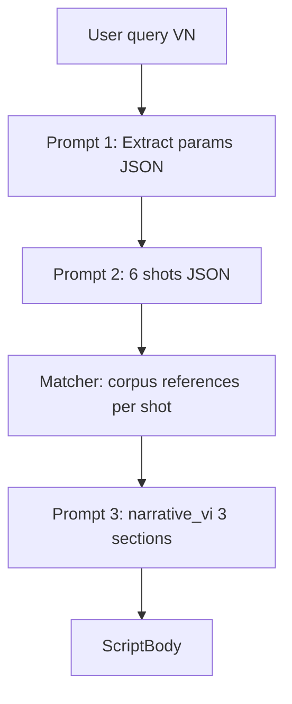

# Viết kịch bản (6 cảnh) — Handoff Marketing

**Phiên bản:** as-built 2026-05 · **Độc lập:** mô tả đầy đủ tính năng và cách một “bài kịch bản” được tạo.

---

## 1. Tính năng là gì?

User mô tả (tiếng Việt) **chủ đề / hook / tone / độ dài** → GetViews trả:

1. **6 cảnh quay** có timecode, lời thoại (VO), chỉ dẫn camera, overlay, và video tham chiếu từ corpus.
2. **3 mục narrative** giải thích vì sao cấu trúc này phù hợp ngách.

**Không** phải video editor — output là **kịch bản để quay**, copy được sang Zalo.

**Màn hình:** `/app/answer` · format `script`  
**Intent:** `shot_list` (+ từ khóa: kịch bản, viết hook, danh sách cảnh, ý tưởng nội dung…)

**Billing:** **3 credit** / lần chạy (một RPC `decrement_credit` ×3) — **không** có Cơ bản / Chuyên sâu.

---

## 2. Ai dùng & JTBD

| Persona | Tình huống |
|---------|------------|
| Minh | Sau khi mổ video flop — “viết lại kịch bản sửa hook” |
| Minh | Có ý tưởng tuần — “kịch bản 30s tone hài affiliate” |
| Linh | Brief creator: 6 shot + VO có timestamp |

**Entry:**
- Studio pill / composer (script intent)
- CTA từ báo cáo video (“Tạo kịch bản từ video này”)
- CTA từ channel Sâu (format dominant)
- Pattern action card “Mở Xưởng Viết”

---

## 3. Không có Cơ bản / Chuyên sâu — ý nghĩa cho Marketing

| Câu hỏi | Trả lời |
|---------|---------|
| User chọn depth trên composer? | **Không** — `answerHandoff` bỏ `depth` cho script |
| Có thể làm gói “chỉ 6 shot”? | Chưa ship — hiện luôn shots + narrative |
| So với video 1 credit? | Script = sản phẩm premium (3×) vì 2 lần Gemini + matcher |

Nếu Growth cần tiering sau này → spec mới (eng).

---

## 4. Hành trình user

```
[Nhập yêu cầu VN] → [Trừ 3 credit] → Step: Đang soạn 6 cảnh
→ Step: Đang viết phân tích → [ScriptBody]
→ [Xem từng shot · references · Scene intelligence]
→ [Copy / Export / Mở Script Shoot panel]
```

**Prefill:** Từ video report hoặc channel — điền `topic` + `hook` vào composer, user vẫn trả 3 credit khi submit.

---

## 5. Cách một “bài kịch bản” được lắp ghép



| Lớp | Deliverable | LLM calls |
|-----|-------------|-----------|
| **A — Params** | topic, hook, duration, tone | 1 (intent model) |
| **B — Shots** | 6 scenes cố định template | 1 (synthesis model) |
| **C — References** | 3 video/shot matcher | 0 |
| **D — Narrative** | headline + 3 sections | 1 (knowledge model) |
| **E — Scene intel** | Panel gợi ý thêm (optional) | 0 (DB nightly) |

**Tổng:** 3 lần Gemini (+ fallback deterministic nếu lỗi).

---

## 6. Catalog block — thứ tự trên màn hình (`ScriptBody`)

| # | Block UI | Phân tích / trả lời gì? | Nguồn | Prompt |
|---|----------|-------------------------|-------|--------|
| 1 | **Headline** (`headline_vi`) | Một câu góc quay | Prompt 3 | `script_narrative_vi` |
| 2 | **Kết luận nhanh** (`ket_luan_nhanh`) | 1–2 câu vì sao structure ăn ngách | Prompt 3 |同上 |
| 3 | **Section `hook_analysis`** | Hook 0–3s: cách mở, so corpus | Prompt 3 |同上 |
| 4 | **Section `script_structure`** | Dòng chảy 6 cảnh | Prompt 3 |同上 |
| 5 | **Section `next_video`** | Biến thể / video tiếp theo | Prompt 3 |同上 |
| 6 | **Shot rail** (6 cards) | Chi tiết quay từng cảnh | Prompt 2 | `script_generate` |
| 7 | Per-shot: **voice** | VO phẳng copy Zalo | Prompt 2 |同上 |
| 8 | Per-shot: **vo[]** | Timestamp + emphasis `*nhấn*` | Prompt 2 |同上 |
| 9 | Per-shot: **viz** | Chỉ dẫn hình | Prompt 2 |同上 |
| 10 | Per-shot: **references** | Clip corpus tương tự | Matcher | Không |
| 11 | **SceneIntelligencePanel** | Gợi ý scene type từ batch | `scene_intelligence` | Không |
| 12 | **ScriptActionsBar** | Copy / export / shoot | Product | Không |

**`DiagnosisSectionRenderer`** dùng chung component với video — 3 section narrative trông giống “mini báo cáo”.

---

## 7. Template 6 cảnh (cố định — Marketing không đổi thứ tự)

| Shot | Cam (cố định) | Overlay | Scene type | Vai trò narrative |
|------|---------------|---------|------------|-----------------|
| 1 | Cận mặt | BOLD CENTER | face_to_camera | Hook 3s đầu |
| 2 | Cắt nhanh b-roll | SUB-CAPTION | product_shot | Mở rộng context |
| 3 | Side-by-side | STAT BURST | demo | Demo / số liệu |
| 4 | POV nghe | LABEL | face_to_camera | Giải thích tone |
| 5 | Cận tay + texture | NONE | action | Chi tiết / texture |
| 6 | Cận mặt + câu hỏi | QUESTION XL | face_to_camera | CTA câu hỏi |

**Duration:** 15–90s user chọn (default 30s) — timecode chia đều 6 shot.

---

## 8. Ba prompt — nguyên văn

> Snapshot **2026-05** — `report_script.py`, `script_generate.py`. Không qua `gemini.py` (chỉ gọi helper generate).

### Prompt 1 — Trích tham số (`_extract_script_params_from_query`)

Model: `GEMINI_INTENT_MODEL` · temperature 0.2 · JSON schema.

### Prompt 1

```text
Trích xuất tham số kịch bản TikTok từ tin nhắn người dùng (tiếng Việt).

Tin nhắn:
---
{q[:8000]}
---

Trả về JSON:
- topic: chủ đề chính (ngắn gọn, ≤500 ký tự)
- hook: câu mở đầu / ý hook (≤200 ký tự)
- duration: số nguyên 15–90 (giây); nếu không rõ thì 30
- tone: MỘT trong: Hài | Chuyên gia | Tâm sự | Năng lượng | Mỉa mai (mặc định Chuyên gia)

Ưu tiên nội dung gợi ý sửa / shot-list / chẩn đoán trong tin nhắn để làm topic và hook.
```


Placeholder: `{q[:8000]}` = tin nhắn user.

### Prompt 2 — Sinh 6 shot (`_call_script_gemini`)

Model: `GEMINI_SYNTHESIS_MODEL` · temperature 0.7 · JSON schema `ScriptGenerateLLM`.

### Prompt 2

```text
Bạn là biên kịch TikTok tiếng Việt ngắn (dưới {body.duration}s). Viết kịch bản 6 shot cho video.

Chủ đề: {topic}
Hook (dùng cho shot 1): {hook}
Hook rơi lúc: {delay_s}s
Tone: {body.tone}
Thời lượng tổng: {body.duration}s
{hook_evidence}

Cấu trúc 6 shot CỐ ĐỊNH (phải giữ đúng overlay + intel_scene_type theo template):
1. cam="Cận mặt", overlay="BOLD CENTER", intel_scene_type="face_to_camera" — hook mạnh trong 3s đầu.
2. cam="Cắt nhanh b-roll", overlay="SUB-CAPTION", intel_scene_type="product_shot" — mở rộng ngữ cảnh.
3. cam="Side-by-side", overlay="STAT BURST", intel_scene_type="demo" — demo / so sánh có số liệu.
4. cam="POV nghe", overlay="LABEL", intel_scene_type="face_to_camera" — POV giải thích, giọng {body.tone}.
5. cam="Cận tay + texture", overlay="NONE", intel_scene_type="action" — chi tiết / texture, không text.
6. cam="Cận mặt + câu hỏi", overlay="QUESTION XL", intel_scene_type="face_to_camera" — CTA câu hỏi.

Với mỗi shot, viết:
- cam: giữ đúng như template ở trên.
- voice: voiceover dạng phẳng 1–2 câu tiếng Việt tự nhiên, tone={body.tone}, nhắc chủ đề hoặc hook (≤ 220 ký tự, dùng để export clipboard / Zalo).
- vo: voiceover *có cấu trúc*, danh sách 1–3 dòng `{{t, text, cue?}}`:
    • t: timestamp dạng "M:SS" trong khoảng shot (ví dụ "0:00", "0:14").
    • text: lời thoại — CÓ THỂ chèn `*từ_nhấn*` để FE in đậm cụm cần nhấn (vd: "Mình *vừa test* xong").
    • cue (optional): chỉ dẫn dàn dựng `[dừng 0.3s]` / `[CUT close-up]` / `[B-roll: zoom giá]` / `[SFX click]` — bỏ qua nếu không cần.
  Nội dung `vo` ghép lại nên trùng ý với `voice`; KHÔNG dài quá `voice`.
- viz: chỉ dẫn visual ngắn (< 20 từ) tiếng Việt.
- overlay: theo template — KHÔNG đổi.
- intel_scene_type: theo template — KHÔNG đổi.
- overlay_winner: gợi ý style overlay ngắn (có thể tiếng Anh) — ví dụ "white sans 28pt · bottom-center".

Thêm các dimension mô tả shot (dùng để matcher tìm video tham chiếu
tương tự trong corpus — enum phải trùng đúng taxonomy; nếu không chắc
để null):
- framing: close_up | medium | wide | extreme_close_up
- pace: static | slow | medium | fast | cut_heavy
- overlay_style: none | bold_center | sub_caption | chyron | sticker
- subject: face | product | text | action | ambient | mixed
- motion: static | handheld | slow_mo | time_lapse | match_cut

Quy tắc copy:
- Tự nhiên, đời thường; tránh "bí mật", "công thức vàng", "triệu view", "bùng nổ".
- Không mở bằng "Chào bạn" / "Tuyệt vời" / "Wow".
- Tôn trọng độ dài: voice ≤ 220 ký tự, viz ≤ 200 ký tự.
```


Placeholder: `{topic}`, `{hook}`, `{delay_s}`, `{body.tone}`, `{body.duration}`, `{hook_evidence}` (block optional từ hook_effectiveness).

### Prompt 3 — Narrative bọc (`synthesize_script_narrative_vi`)

Model: `GEMINI_KNOWLEDGE_MODEL` · temperature 0.35 · schema `script_v1`.

### Prompt 3

```text
Viết báo cáo kịch bản TikTok bằng tiếng Việt (peer creator, data-backed).

Chủ đề: {topic}
Hook mở: {hook}
Độ dài: {duration}s · Tone: {tone} · Ngách: {niche_line}

6 cảnh đã soạn:
{shots_block}

Trả về JSON:
- headline_vi: một câu headline (≤20 từ) — nêu góc quay rõ ràng
- ket_luan_nhanh: 1-2 câu tóm tắt vì sao cấu trúc này ăn trong ngách
- diagnosis_vi.sections: đúng 3 section theo thứ tự:
  1) section_id "hook_analysis" — title_vi + text_vi (phân tích hook 0-3s)
  2) section_id "script_structure" — title_vi + text_vi (dòng chảy 6 cảnh)
  3) section_id "next_video" — title_vi + text_vi (video tiếp theo nên quay gì)

Quy tắc: cite số cụ thể khi có; không dùng từ cấm (bí mật, công thức vàng, triệu view); không mở bằng "Chào bạn".
```


Placeholder: `{topic}`, `{hook}`, `{duration}`, `{tone}`, `{niche_line}`, `{shots_block}`.

---

## 9. Dữ liệu không qua LLM (nhưng có trong bài)

| Data | Vai trò trong bài |
|------|-------------------|
| `hook_effectiveness` | Evidence block Prompt 2 |
| Corpus matcher | `references[]` mỗi shot — thumbnail, handle, breakout |
| `scene_intelligence` | Panel “scene type” gợi ý quay |
| `niche_id` | Từ session/profile — scope matcher + hooks |

---

## 10. Skeleton bài — hoàn chỉnh

```text
[KỊCH BẢN 6 CẢNH · 30s · Tone: Chuyên gia · Ngách: Affiliate]

Headline: POV cảnh báo mua + demo 8s — hook hạng top ngách tuần này

Kết luận nhanh: Cấu trúc 6 shot bám hook question 0-2s; shot 3 đưa số liệu
trước khi CTA hỏi — khớp pattern testimonial 28s đang +312% vs TB ngách.

── Section: Hook 0–3 giây ──
Mở bằng «Stop mua X nếu chưa xem này» — khớp hook Cảnh báo (avg 180K view…)

── Section: Cấu trúc 6 cảnh ──
Shot 1 cận mặt hook · Shot 2 b-roll sản phẩm · … · Shot 6 câu hỏi CTA

── Section: Video tiếp theo ──
Test góc “sai lầm mua” vs “kết quả sau 7 ngày” — cùng hook frame

── SHOT 1 (0:00–0:05) ──
cam: Cận mặt · overlay: BOLD CENTER
voice: "Stop mua X nếu bạn chưa xem hết video này."
vo: 0:00 — line + cue
viz: Nhìn thẳng camera, text vàng giữa
references: [@peer1 220K] [@peer2 180K] [@peer3 95K]

… shots 2–6 …

[Scene intelligence: product_shot — 412 clip ngách]

[Copy · Export · Mở Script Shoot]
```

---

## 11. So sánh với Phân tích video (cho Growth)

| | Phân tích video | Viết kịch bản |
|---|-----------------|---------------|
| Input | URL TikTok | Text mô tả |
| Credit | 1 / 2 | 3 |
| Output chính | Chẩn đoán + peer tiles | 6 shot producible |
| Depth | Cơ bản / Chuyên sâu | Không |
| Section count | 3–12 | 3 narrative + 6 shot cards |
| Dùng extract vision | Có | Không (chỉ hook table ngách) |

---

## 12. Copy rules

1. **Zalo-ready:** `voice` là đoạn copy dán được ngay.
2. **Cấm từ** giống app-wide (bí mật, triệu view…).
3. **Tone nhất quán** xuyên 6 shot (field `tone`).
4. **Hook shot 1** phải lộ trong ~1s — prompt nhắc 3s đầu.
5. **Không hứa view** — có thể nói “pattern đã kiểm chứng ngách” khi có hook_evidence.

---

## 13. Marketing có thể / không thể chỉnh

| Việc | Vị trí |
|------|--------|
| Tone list / labels | UI select (eng: `_VALID_TONES`) |
| Template 6 shot mô tả | Mục **8** — Prompt 2 |
| 3 section titles / rules | Mục **8** — Prompt 3 |
| Trích topic/hook | Mục **8** — Prompt 1 |
| CTA ScriptActionsBar | `ScriptActionsBar.tsx` (eng) |
| Credit messaging | Pricing, composer (không hiện depth) |
| Đổi số shot (8 thay 6) | **Eng** — schema + FE rail |

---

## 14. Thuật ngữ

| Thuật ngữ | Nghĩa |
|-----------|--------|
| `ScriptGenerateBody` | Params gửi pipeline |
| `intel_scene_type` | Enum match corpus scene |
| `overlay_winner` | Gợi ý style chữ |
| `script_v1` | Schema narrative |
| Script Shoot | Panel quay / checklist (FE) |

---

## 15. Tham chiếu kỹ thuật

| Thành phần | Path |
|------------|------|
| Report | `cloud-run/getviews_pipeline/report_script.py` |
| Shots | `cloud-run/getviews_pipeline/script_generate.py` |
| Dispatch | `cloud-run/getviews_pipeline/answer_session.py` |
| FE | `src/components/v2/answer/script/ScriptBody.tsx` |
| Prefill | `src/lib/scriptPrefill.ts` |
| Intent | `src/routes/_app/intent-router.ts` |
