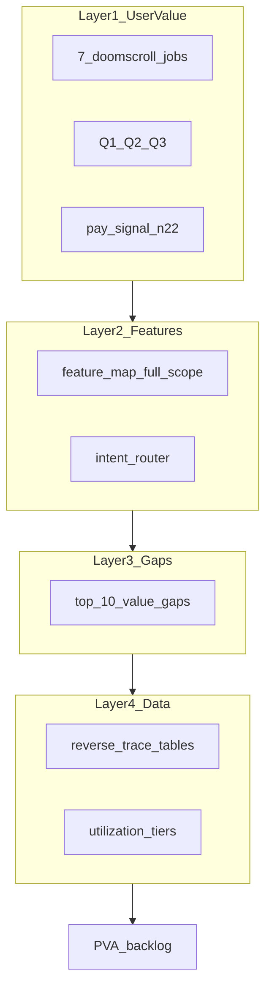

# Product Value Audit — value → data

**Last updated:** 2026-05-19 (code-accuracy pass)  
**Codebase ref:** `6d439c2` — spot-checked routes, billing RPCs, home/ticker/compare/channel  
**Status:** Audit complete (doc-only — no implementation scope)  
**Related:** [`feature-map.md`](feature-map.md) · [`feature-map-v1.md`](feature-map-v1.md) (V1 scope) · [`system-design.md`](system-design.md) · [`corpus-gemini-utilization-audit.md`](corpus-gemini-utilization-audit.md) · [`implementation-plan.md`](implementation-plan.md) · [`emotional-design-system.md`](emotional-design-system.md)

---

## Executive summary

GetViews **monetizes** the doomscroll job creators pay for most reliably in surveys — **“tại sao video này chạy / flop?”** (Q3) — via `/app/answer` video diagnosis. The product **partially serves** the job that consumes ~60% of doomscroll time — **“hôm nay quay gì?”** (Q1) — through home ritual, trends/explore, and pattern intents, but **does not replace passive FYP research** (no push feed, 24–48h discovery lag vs batch cadence).

**Strategic alignment:** Diagnosis-first GTM is **correct** for credits and differentiation. The gap is **habit + discovery**, not missing diagnosis depth.

**Top 3 data investments (ROI for Q1–Q3):**

1. **Corpus depth + claim tiers** — keep `hook_effectiveness`, `breakout_multiplier`, and `niche_insights` fresh per niche so Q1/Q3 claims stay authoritative (`/batch/analytics`, ingest, layer0).
2. **Utilization without trim risk** — signal fire-rate ablation before ingest cuts; promote `subject_matter` / `search_vector` for proximity (utilization audit §8).
3. **HI-11 route flip** (after 100-row audit) — align batch `niche_id` with two-axis UX so ritual/trends filters match creator mental model.

**Do not market or build in v1:** Shopee product ranking (Kalodata), competitor alert dashboard, Douyin **forecast** UI, passive FYP replacement.

**Corpus baseline:** Numbers in [`state-of-corpus.md`](state-of-corpus.md) (2026-04-22) are **stale**. Re-run [`artifacts/sql/corpus-health.sql`](artifacts/sql/corpus-health.sql) or `GET /admin/corpus-health` before go-to-market copy changes. Wave 0 snapshot (2026-05-09): ~1,558 corpus rows, 526 with `breakout_multiplier`, 123 `hook_effectiveness` rows — treat as directional, not current.

---

## Methodology (4 layers)



**Personas:** **Minh** (affiliate creator, primary) · **Linh** (agency lead, channel + creators) · **Ops** (admin/batch — enables creator value indirectly).

**Out of scope (hard):** Kalodata / Shopee analytics · competitor tracking **dashboard** (Wave 2) · Douyin trend **forecasting** (Wave 2) · English UI · recurring subscriptions · native apps.

---

## Layer 1 — User value map

### Three priority questions (north star)

From [`implementation-plan.md`](implementation-plan.md): *"Tell me what video to make next, and tell me why the last one worked or flopped."*

| ID | Question (Vietnamese) | Doomscroll share (qualitative) | Primary feeling (EDS) |
|----|------------------------|------------------------------|------------------------|
| **Q1** | Hôm nay nên quay gì? | ~60% of doomscroll time | Clarity + Authority |
| **Q2** | Làm như thế nào? (hook, script, sound, structure) | Embedded in Q1 + post-viral stop | Clarity |
| **Q3** | Tại sao video trước flop / video kia chạy? | Triggered by bad day or viral stop | Authority + Speed |

### Seven doomscroll jobs → questions → outcomes

| Job | Q | Outcome “done” for creator | GetViews v1 stance |
|-----|---|----------------------------|-------------------|
| **1** Ý tưởng quay gì | Q1 | 1–3 filmable directions today + why | **Partial** — ritual, trends, `content_directions` |
| **2** Giải phẫu viral | Q2, Q3 | Framework + niche benchmark, not “hook hay” | **Strong** — paste URL diagnosis |
| **3** Theo dõi đối thủ | Q1 | Alerts when rival breaks out + why | **Partial** — `/app/channel` on-demand; no watchlist |
| **4** Săn sound trending | Q1, Q2 | Sound + lifecycle + niche context | **Partial** — `trending_sounds`, Explore section |
| **5** Học kịch bản / hook | Q2 | Searchable hook library by niche | **Partial** — script + `hook_effectiveness`; weak vs Notes |
| **6** Sản phẩm affiliate | Q1 | What to review next (commerce) | **Out of scope** — Kalodata |
| **7** Douyin dự báo | Q1 | Lead-time before VN saturation | **Partial read** — `/app/douyin`; forecast Wave 2 |

### Pay-signal overlay (creator survey n≈22)

| Rank | Stated need | Maps to job / Q | Primary surface today |
|------|-------------|-----------------|------------------------|
| #1 32% | Phân tích viral/flop | Job 2 · Q3 | `/app/answer` video |
| #2 18% | Dự đoán dễ viral | Q1 (speculative) | **Deferred** — viral score ρ&lt;0.35 |
| #3 18% | Viết hook | Job 5 · Q2 | Answer ideas + `/app/script` |
| #4 14% | Gợi ý idea | Job 1 · Q1 | `content_directions`, ritual, trends |
| #5 5% | Viết script | Job 5 · Q2 | `/app/script`, `shot_list` intent |
| 82% | “5 video tiếp theo + hook” | Job 1 · Q1 | `brief_generation` → `answer:ideas` (Wave 2 shipped) |
| — | Compare two videos | Q3 comparative | `/app/compare` — **live** (`compare_videos` → `/stream`, 1 credit) |

**Insight:** Build order (diagnosis → ideas → compare) matches **pay-signal** more than **doomscroll time-share**. Closing the gap requires **Q1 habit surfaces**, not deprioritizing Q3.

---

## Layer 2 — Feature → value matrix

Schema: `surface` · `persona` · `job` · `Q` · `value_today` · `activation` · `monetization` · `status` · `evidence`

### Discovery & habit

| Surface | Persona | Job | Q | Value today | Activation | Monetization | Status | Evidence |
|---------|---------|-----|---|-------------|------------|--------------|--------|----------|
| `/` Landing | Minh | 1,2 | Q1,Q3 | Social proof hooks; CTA to try diagnosis | Pull | — | partial | `feature-map` §1; `api/landing-stats.ts` |
| `/app` Home shell | Minh | 1 | Q1 | Entry to ritual, composer, trends | Pull | — | delivers | `HomeScreen.tsx`, `feature-map` §2 |
| Home ticker | Minh | 1,5 | Q1,Q2 | Marquee (breakout, hook, sound, …) — **7-day** buckets | Pull | free | partial | `ticker.py` L6–7; `/home/ticker` |
| Home pulse | Minh | 1 | Q1 | Daily corpus snapshot mood for niche | Pull | free | partial | `/home/pulse` |
| Home “Gợi ý hôm nay” | Minh | 1,5 | Q1,Q2 | **Tier I:** 3 ritual scripts · **II:** hook patterns · **III:** breakout grid | Pull | free | partial | `HomeSuggestionsToday.tsx`, `/home/daily-ritual` |
| Home starter creators | Minh,Linh | 3 | Q1 | Seed accounts to study in niche | Pull | free | partial | `/home/starter-creators` |
| Home composer | Minh | 1–3 | all | Routes query → answer/channel/compare | User-initiated | per intent | delivers | `intent-router.ts` |
| `/app/trends` Explore | Minh | 1,2,4 | Q1,Q2 | Patterns, breakouts rail, trending sounds | Pull | free | partial | `ExploreScreen.tsx`, `useTrendsRailVideos.ts` |

### Core intelligence

| Surface | Persona | Job | Q | Value today | Activation | Monetization | Status | Evidence |
|---------|---------|-----|---|-------------|------------|--------------|--------|----------|
| `/app/answer` video turn | Minh | 2,3 | Q2,Q3 | v6 diagnosis: hook, sections, refs, embedded tiles | User-initiated | **1** `decrement_credit` (primary) | **delivers** | `answer_session.py` L465–466; `build_video_report` |
| `/app/answer` pattern turn | Minh | 1,2 | Q1,Q2 | Niche patterns, hook leaderboard, directions | User-initiated | varies | partial | `content_directions`, `trend_spike` |
| `/app/answer` ideas turn | Minh | 1,5 | Q1,Q2 | Next-5 style ideas + hooks | User-initiated | billable | partial | `brief_generation`, Wave 2 |
| `/app/answer` timing turn | Minh | 1 | Q1 | Timing + calendar slots | User-initiated | often free | partial | `content_calendar` → timing |
| `/app/answer` lifecycle turn | Minh | 1 | Q1 | Format lifecycle stage (disclaimer on thin data) | User-initiated | free tier | partial | `format_lifecycle_optimize` |
| `/app/answer` diagnostic turn | Minh | 3 | Q3 | URL-less flop verdict | User-initiated | billable | partial | `own_flop_no_url` |
| `/app/answer` generic / creators | Linh | 3 | Q1,Q3 | Creator search blocks (no /kol screen) | User-initiated | varies | partial | `creator_search` |
| `/app/answer` script turn | Minh | 5 | Q2 | Shot list in session | User-initiated | **3×** `decrement_credit` | partial | `answer_session.py` L460–464 |
| `/app/channel` | Minh,Linh | 2,3 | Q1–Q3 | Channel scorecard, peers, 7d cache | User-initiated | **see §Accuracy** | delivers | `ChannelScreen.tsx` `CREDIT_COST=3`; `channel_diagnose.py` |
| `/app/compare` | Minh | 2,3 | Q3 | Side-by-side + delta; fallback → answer | User-initiated | **1** credit via `/stream` | **delivers** | `CompareScreen.tsx`; `report_compare.py` L37–39 |
| `/app/script` | Minh | 5 | Q2 | Generate script, hook patterns, drafts, scene intel panel | Pull/User | billable on generate | partial | `useScriptSceneIntelligence.ts`; `/batch/scene-intelligence` live |
| `POST /api/chat` | Minh | 2 | Q2,Q3 | Edge fallback + `FREE_INTENTS` (not compare) | User-initiated | free cap / 1 credit | partial | `api/chat.ts` L32–37; compare uses `/stream` |

### Secondary & billing

| Surface | Persona | Job | Q | Value today | Activation | Monetization | Status | Evidence |
|---------|---------|-----|---|-------------|------------|--------------|--------|----------|
| `/app/history` | Minh | — | — | Resume past research (union) | Pull | — | delivers | `history_union` RPC |
| `/app/douyin` | Minh (adv) | 7 | Q1 | Read Douyin corpus/patterns | Pull | free | partial | `douyin.py`, batch ingest |
| `/app/onboarding` | Minh | — | — | Set niche for all personalization | Once | — | delivers | `creator_niche_id` |
| `/app/settings` | Minh | — | — | Profile, niche edit | Pull | — | delivers | `feature-map` §10 |
| Pricing / Checkout | Minh | — | — | Buy credit packs (PayOS) | Pull | — | delivers | PayOS one-time |
| Legacy `chat_sessions` | Minh | 2 | Q2,Q3 | Old threads in history only | — | — | **maintain** | No new surface; sunset later |

### Ops (indirect creator value)

| Surface | Persona | Enables job | Value to product | Status |
|---------|---------|-------------|------------------|--------|
| `/app/admin/*` | Ops | all | Corpus health, triggers, funnel | delivers |
| `/batch/*` jobs | Ops | 1–5 | Ingest, analytics, ritual, sounds, layer0 | live (scene intel WIP) |

### Intent cross-walk (composer → destination)

| Intent | Destination | Job | Q | Notes |
|--------|-------------|-----|---|-------|
| `video_diagnosis` | `answer:video` | 2 | Q3 | Primary pay signal |
| `compare_videos` | `compare` | 2 | Q3 | ≥2 URLs |
| `competitor_profile`, `own_channel` | `channel` | 3 | Q1,Q3 | |
| `content_directions`, `trend_spike`, `fatigue`, `subniche_breakdown` | `answer:pattern` | 1 | Q1 | |
| `brief_generation`, `hook_variants` | `answer:ideas` | 1,5 | Q1,Q2 | |
| `timing`, `content_calendar` | `answer:timing` | 1 | Q1 | |
| `format_lifecycle_optimize` | `answer:lifecycle` | 1 | Q1 | |
| `own_flop_no_url` | `answer:diagnostic` | 3 | Q3 | |
| `shot_list` | `answer:script` | 5 | Q2 | |
| `creator_search` | `answer:generic` | 3 | Q1 | Linh |
| `follow_up_unclassifiable` | `answer:generic` | — | — | Classifier fallback |

---

## Layer 3 — Value gap assessment

### Gap taxonomy (used in Top 10)

| Type | Definition |
|------|------------|
| **UX / discovery** | Capability exists but user must know to paste URL or open composer |
| **Freshness** | Batch/cron cadence vs FYP 24–48h |
| **Data thin** | `claim_tiers` below threshold for niche |
| **Promise vs reality** | Marketing/EDS copy vs measurable corpus |
| **Scope honesty** | Feature implied but Wave 2 / out of scope |
| **Utilization** | Extracted field not wired to aggregate or UI |

### Top 10 value gaps (ranked)

| # | Gap | Type | Jobs / Q | Why it matters |
|---|-----|------|----------|----------------|
| 1 | **No passive “sáng nay trong ngách” feed** replacing FYP | UX / discovery | 1 · Q1 | 60% doomscroll time; ritual is pull-only |
| 2 | **Diagnosis requires paste URL** (no in-TikTok bridge) | UX / discovery | 2 · Q2,Q3 | Strong value, high friction vs stopping on FYP |
| 3 | **Freshness: nightly batch vs 24–48h FYP** | Freshness | 1,2 · Q1 | `trend_velocity` weekly; breakouts use 30d window |
| 4 | **Thin niche → weak authority claims** | Data thin | all · Authority | EDS “46k+” vs actual corpus — run corpus-health |
| 5 | **Competitor watchlist + alerts** | Scope honesty | 3 · Q1 | Channel on-demand only; dashboard Wave 2 |
| 6 | **Sound radar incomplete** | Utilization + UX | 4 · Q1,Q2 | `trending_sounds` exists; no lifecycle UX like Creative Center + context |
| 7 | **Hook library ≠ Notes replacement** | UX | 5 · Q2 | `hook_phrase` in corpus; no searchable personal library |
| 8 | **Viral prediction score deferred** | Scope + data | pay #2 | ρ=0.35 gate failed; don’t market |
| 9 | **Affiliate product ranking** | Out of scope | 6 · Q1 | Kalodata territory |
| 10 | **Douyin forecast productized** | Scope honesty | 7 · Q1 | Read path live; forecast Wave 2 |

### Features: deliver vs hide vs defer

| Action | Surfaces |
|--------|----------|
| **Lead GTM** | `/app/answer` video, channel (agency), compare |
| **Habit bet (invest)** | Home ritual + Explore breakouts + unified “sáng nay” |
| **Don’t market yet** | Viral score, Douyin forecast, full competitor alerts |
| **Don’t build v1** | Shopee product rank, Kalodata parity |
| **Maintain only** | Legacy chat in `history_union` |

---

## Layer 4 — Data architecture (reverse trace)

### Corpus baseline (read-only instruction)

**Do not cite fabricated counts in UI.** Run before copy/legal review:

```bash
# Supabase SQL Editor — bookmark artifacts/sql/corpus-health.sql
# Or: GET /admin/corpus-health (X-Batch-Secret)
```

| Metric | Stale ref (2026-04-22) | Wave 0 ref (2026-05-09) | Use |
|--------|------------------------|-------------------------|-----|
| `video_corpus` rows | 1,220 | ~1,558 | Scale vs marketing |
| `breakout_multiplier` filled | 0 | 526 | Trends rail |
| `hook_effectiveness` rows | 0 | 123 | Pattern/ideas |
| `creator_velocity` rows | 0 | 133 | Channel peers |
| Claim tier example 90d | — | 1,840 (sample JSON Apr-18) | Per-niche authority |

### Primary product traces

#### Video diagnosis v6 (Q3 — pay signal #1)

```
Outcome: structured Win/Flop report + refs + embedded tiles
  → FE: useSessionStream(answer_turn) → POST /answer/sessions/{id}/turns
  → build_video_report() → run_video_analyze_pipeline | on_demand
  → finalize_video_narrative_layer() → synthesize_diagnosis_v2()
  → build_signal_manifest() → diagnose_sections (v6)
Tables: video_corpus, video_diagnostics, hook_effectiveness, signal_grades, video_patterns
Batch: ingest, analytics, pattern-decks, layer0
Extract: Tier A hook/scenes/transcript; Tier B manifest fields (utilization audit §2–3)
Gap labels: fix_synthesis (fire-rate), fix_UI_wiring (ContextStrip fields), fix_promote (proximity)
```

#### “5 video tiếp theo” / pattern (Q1 — pay #4 + 82% survey)

```
Outcome: ranked ideas + opening lines + angles
  → answer:ideas | answer:pattern turns; brief_generation intent
  → run_* in pipelines.py + layer0 injection
Tables: video_patterns, niche_insights, hook_effectiveness
Batch: /batch/analytics, /batch/layer0, /batch/pattern-decks
Extract: hook_type, hook_phrase, content_direction (pattern_fingerprint)
Gap: data thin below hook_effectiveness tier (50 videos/30d)
```

#### Home “Gợi ý hôm nay” (Q1 — doomscroll replacement candidate)

```
Outcome:
  Tier I — 3 ready-to-shoot scripts (daily_ritual.scripts JSONB)
  Tier II — hook patterns (HooksTable / hook_effectiveness)
  Tier III — breakout inspiration (BreakoutGrid / video_corpus.breakout_multiplier)
  → GET /home/daily-ritual (scripts only); Tier II/III separate FE queries
  → morning_ritual.py — exactly 3 RitualScript per user/niche/day
Tables: daily_ritual, starter_creators, video_corpus, hook_effectiveness
Batch: POST /batch/morning-ritual (pg_cron 15:00 UTC / 22:00 ICT)
Extract: subject_matter from analysis_json; sound from trend_velocity (ritual attach)
Gap: UX/discovery — pull-only; freshness daily not FYP-hourly
```

#### Trends / breakouts (Q1)

```
Outcome: Top breakout_multiplier videos in niche (30d window)
  → useTrendsRailVideos → video_corpus query
  → ExploreScreen + TrendingSoundsSection
Tables: video_corpus.breakout_multiplier, trending_sounds
Batch: /batch/analytics, /batch/sound-aggregate, /batch/trend-velocity (weekly)
Extract: ED views; sound_* columns; hook_phrase
Gap: freshness + no "why" narrative without opening answer
```

#### Channel diagnose (Q3 + job 3)

```
Outcome: score_card, peers, narrative v2 JSONB
  → POST /channel/diagnose (SSE)
Tables: channel_diagnoses (7d cache), creator_velocity, video_patterns
Batch: refresh, ingest (corpus peers)
Gap: no proactive alert; manual handle entry
```

#### Script workshop (Q2 — pay #5)

```
Outcome: generated script, hook patterns, drafts export, scene-intel overlays
  → GET /script/scene-intelligence, POST /script/generate, hook-patterns
Tables: draft_scripts, scene_intelligence, video_shots, hook_effectiveness
Batch: /batch/scene-intelligence (live nightly)
Extract: scenes[] (aggregate timing/type in batch refresh)
Gap: not a searchable personal hook library (Notes replacement)
```

#### Douyin read (job 7)

```
Outcome: feed + patterns from douyin_* tables
  → GET /douyin/feed, /douyin/patterns
Batch: douyin-ingest, douyin-synth, douyin-patterns
Separate pipeline (system-design §8); on-demand douyin_match on video diagnosis
Gap: forecast Wave 2; adoption stage not productized as lead-time
```

### Utilization → gap mapping

| Utilization follow-up | Serves gap # | Action tag |
|----------------------|--------------|------------|
| Signal fire-rate ablation | 4, 6 | fix_synthesis |
| `search_vector` + transcript/topics | 1, 2 | fix_promote |
| HI-11 `route` flip | 4, ritual/trends filter | defer_HI11_route |
| Trim `key_messages` only | cost | trim_safe |
| Do **not** trim commerce_intent, audio_track_role, text_overlays | — | (utilization §7) |

---

## Layer 5 — Prioritization

### 2×2 matrix (User value impact × Data readiness)

**High value + data ready → Invest**

- Video diagnosis v6 (monetize, polish fire-rate)
- Compare two URLs
- Explore breakouts + hook_effectiveness-backed pattern turns
- Channel diagnose (Linh + advanced Minh)

**High value + data not ready → Build data first**

- Q1 “outlier list + why” at scale (corpus depth, breakout fill, claim tiers)
- Ideas/pattern in thin niches (ingest + analytics per niche)
- Sound lifecycle narrative (sound-aggregate + niche context)

**Lower value or ready UX → UX only**

- Unified Home “Sáng nay trong ngách” (compose ritual + top 3 breakouts + 1 sound)
- Deep link / share-from-TikTok (future — not in repo)
- Hook library UX over existing `hook_phrase` corpus

**Defer / out of scope**

- Competitor alert dashboard (Wave 2)
- Douyin forecast UI (Wave 2)
- Viral alignment score (re-open on §11 triggers)
- Kalodata / Shopee product ranking

### PVA backlog (20 items)

| ID | Job·Q | Gap type | Direction | Depends on | Completeness | Wave |
|----|-------|----------|-----------|------------|--------------|------|
| PVA-001 | 1·Q1 | UX | Home block: ritual + top breakouts + 1 sound CTA | daily_ritual, breakout_multiplier, trending_sounds | 7/10 | 5+ |
| PVA-002 | 2·Q3 | UX | Composer default: paste URL hero on home | — | 7/10 | 5+ |
| PVA-003 | 1·Q1 | Freshness | Document SLA: ritual daily, breakouts post-analytics | cron-batch-analytics | 3/10 | audit-only |
| PVA-004 | all·Auth | Data thin | Run corpus-health monthly; gate marketing copy | claim_tiers.py | 10/10 | ops |
| PVA-005 | 2·Q3 | delivers | Keep diagnosis-first pricing; A/B ritual entry | credits | 10/10 | GTM |
| PVA-006 | 3·Q1 | Scope | Competitor alerts → Wave 2 spec only | creator_velocity | 3/10 | Wave 2 |
| PVA-007 | 4·Q1 | Utilization | Sound section: lifecycle label + niche usage count | trending_sounds, sound-aggregate | 7/10 | 5+ |
| PVA-008 | 5·Q2 | UX | Script: searchable hook corpus by niche | hook_effectiveness, hook_phrase | 7/10 | 5+ |
| PVA-009 | 1·Q1 | Data | Per-niche ingest quota until hook_effectiveness tier | ingest cron | 10/10 | data |
| PVA-010 | 2·Q3 | Utilization | Signal ablation harness + dashboard | registry.py | 7/10 | data |
| PVA-011 | 2·Q3 | Utilization | search_vector: transcript + topics | analysis_json | 7/10 | data |
| PVA-012 | all | HI-11 | Route mode flip after 100-row audit | two-axis runbook | 7/10 | data |
| PVA-013 | 2·Q3 | delivers | Compare dogfood + GTM (already shipped) | `CompareScreen.tsx`, `report_compare.py` | 10/10 | live |
| PVA-014 | pay#2 | Scope | Viral score remains off marketing | viral-alignment-score.md | 10/10 | defer |
| PVA-015 | 6·Q1 | Scope | Partner link Kalodata, no build | — | 10/10 | won't do |
| PVA-016 | 7·Q1 | Scope | Douyin forecast PRD Wave 2 | douyin_* | 3/10 | Wave 2 |
| PVA-017 | 1·Q1 | Freshness | trend_velocity: document weekly vs daily FYP | trend_velocity batch | 3/10 | audit-only |
| PVA-018 | 5·Q2 | Data | scene-intelligence batch → script references | scene_intelligence | 7/10 | 5+ |
| PVA-019 | legacy | UX | Plan chat sunset: answer-only new users | history_union | 3/10 | Wave 5+ |
| PVA-020 | 2·Q3 | Utilization | Trim key_messages only + diff v6 | gemini schema | 7/10 | cost |

---

## Strategic verdict

### Monetize the right job?

**Yes.** Survey #1 and credit model align on **video diagnosis (Q3)**. Channel fits **Linh** and serious Minh (UI advertises 3 credits; BE currently deducts 1 — see §Code accuracy). Ritual/trends are **top-of-funnel** for Q1, not yet primary revenue.

### Build order vs doomscroll?

**Correct for revenue, incomplete for habit.** Diagnosis-first avoids selling empty pattern reports. To attack doomscroll **without** flipping order: make Q1 surfaces **zero-click on open** (PVA-001) while keeping diagnosis as the **conversion** moment after a breakout click.

### Three data investments (confirmed)

1. **Scheduled corpus growth + analytics** — unblocks Q1/Q3 authority in thin niches.  
2. **Measured utilization** (ablation, search_vector, proximity) — more value per extraction dollar, not blind prompt cuts.  
3. **HI-11 route** when audited — aligns filters with creator niche picker.

### Alignment with utilization audit §8

| Follow-up | PVA IDs |
|-----------|---------|
| subject_matter proximity (partial shipped) | PVA-011 |
| search_vector expansion | PVA-011 |
| HI-11 route flip | PVA-012 |
| Signal fire-rate | PVA-010 |
| key_messages trim | PVA-020 |
| DeepSeek / provider | defer until synthesis volume ↑ |

### Human gate (Tech Lead)

- [ ] Sign off Top 10 ordering  
- [ ] Run live `corpus-health.sql` and paste `summary` into changelog or refresh `state-of-corpus.md`  
- [ ] Approve PVA-001 vs PVA-005 priority for next sprint  
- [ ] Confirm Wave 2 scope unchanged (competitor, Douyin forecast)

---

## Appendix — Input sources

| Source | Role in audit |
|--------|----------------|
| Doomscroll 7-job analysis (product discussion 2026-05) | Layer 1 jobs |
| [`emotional-design-system.md`](emotional-design-system.md) | Persona, emotional layers, 46k claim |
| [`implementation-plan.md`](implementation-plan.md) | Pay-signal, north star, waves |
| [`feature-map.md`](feature-map.md) | Layer 2 inventory |
| [`corpus-gemini-utilization-audit.md`](corpus-gemini-utilization-audit.md) | Layer 4 field tiers |
| [`.cursor/rules/project.mdc`](../../.cursor/rules/project.mdc) | Out of scope |
| [`state-of-corpus.md`](state-of-corpus.md) | Historical baseline (stale) |

**Maintenance:** When shipping a feature that changes user value, update this doc’s matrix row and bump **Last updated** in the same commit as `feature-map.md` if surfaces change.

---

## Code accuracy review (2026-05-19)

Verified against `6d439c2`. Corrections applied in this pass:

| Topic | Doc before | Code truth |
|-------|------------|------------|
| Home ritual | “3-tier scripts / channel / trend” (API) | **UI** tiers I–III: ritual scripts + `HooksTable` + `BreakoutGrid` (`HomeSuggestionsToday.tsx`). API `/home/daily-ritual` = **3 scripts** only (`morning_ritual.py`). |
| Ticker window | ~3 days | **7 days** (`cloud-run/.../ticker.py` L6–7). |
| Compare status | “Wave 4 planned/live” | **Shipped:** `/app/compare`, `compare_videos`, `POST /stream`, **1** `decrement_credit` at stream entry (`report_compare.py` L37–39, `intent.py` L298). |
| Answer video billing | “1 credit” | **1×** `decrement_credit` on `kind=primary` → debits `profiles.credits_remaining` (`answer_session.py` L465–466). |
| Answer script billing | “3 credits” | **3×** `decrement_credit` when `builder_fmt == "script"` (L460–464). |
| Channel billing | “3 credits” | **Mismatch:** FE `CREDIT_COST = 3` gates UI (`ChannelScreen.tsx` L22); BE calls `decrement_credit` **once** per diagnosis (`channel_diagnose.py` L41–54). Treat as **known FE/BE discrepancy** until aligned. |
| `/api/chat` | “legacy only” | Still active: Vercel fallback when no Cloud Run URL; `FREE_INTENTS` subset; **compare does not use this path**. |
| Scene intelligence | “batch WIP” | `/batch/scene-intelligence` + `GET /script/scene-intelligence` + `SceneIntelligencePanel` — **live**; thin niche data still limits value. |
| Billing column name | “credits” generic | All RPC billing uses `decrement_credit` → `credits_remaining` (not a separate `credits` column). |

**Stale external docs:** [`implementation-plan.md`](implementation-plan.md) still lists Wave 4 Compare as `planned`; repo code is **live** — prefer this audit + [`feature-map.md`](feature-map.md) over implementation-plan wave table for shipping status.

**Still requires live DB:** corpus row counts — run [`artifacts/sql/corpus-health.sql`](artifacts/sql/corpus-health.sql); do not copy numbers from [`state-of-corpus.md`](state-of-corpus.md) (2026-04-22).
