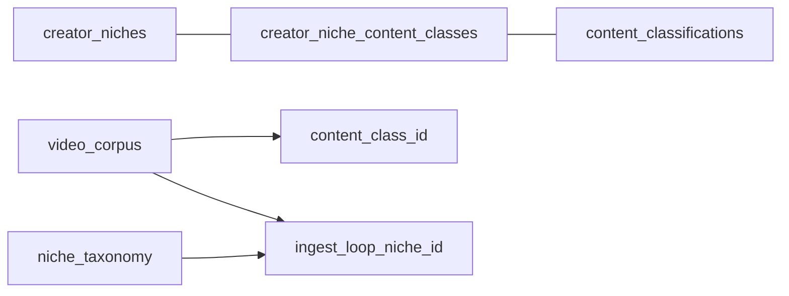

# Mô hình two-axis niche — GetViews.vn

**Status:** Canonical architecture doc (Wave D consolidated · 2026-05-22)  
**Audience:** Tech Lead, backend/frontend agents, QA  
**Taxonomy sign-off:** [`two-axis-taxonomy-final-v1.md`](two-axis-taxonomy-final-v1.md)  
**Product spec (Morning Signal):** [`class-intelligence-ui-spec.md`](class-intelligence-ui-spec.md)  
**Ops runbook:** [`two-axis-niche-cutover-runbook.md`](two-axis-niche-cutover-runbook.md) (architecture → doc này)

---

## TOC

1. [Overview & three layers](#1-overview--three-layers)
2. [Taxonomy final (14 active + 5 carousel)](#2-taxonomy-final)
3. [Junction & `is_primary` contract](#3-junction--is_primary-contract)
4. [`creator_tier` bands + Phase 2 peer percentile](#4-creator_tier-bands)
5. [HI-11 ingest assignment + TD-6](#5-hi-11-ingest-assignment--td-6)
6. [Phase C pivot (no `video_corpus.niche_id`)](#6-phase-c-pivot)
7. [MV catalog + §8.1 refresh chain](#7-mv-catalog--81-refresh-chain)
8. [Frontend browse → Home / Trends / Morning signal](#8-frontend-browse--home--trends--morning-signal)
9. [ACQE + junction proposal queue](#9-acqe--junction-proposal-queue)
10. [Audit criteria & junction-invalid triage](#10-audit-criteria--junction-invalid-triage)
11. [Related docs](#11-related-docs)

---

## 1. Overview & three layers

Một bảng `niche_taxonomy` duy nhất không phục vụ đồng thời UX picker (~14 bucket) và cohort analysis (~79 class).

| Lớp | Bảng | Vai trò |
|-----|------|---------|
| **UX bucket** | `creator_niches` (14 active) | Onboarding, Settings, Trends pills |
| **Analysis sharp** | `content_classifications` (79) | `video_corpus.content_class_id`, benchmark, Morning Signal |
| **Ingest loop** | `niche_taxonomy` + `ingest_loop_niche_id` | Batch ED discovery theo `signal_hashtags[]` |



**Cohort canonical (Phase C):** `(content_class_id, creator_tier)` — không còn `video_corpus.niche_id`.

Source of truth code: `cloud-run/getviews_pipeline/two_axis_taxonomy.py` ≡ TypeScript bridge in `src/lib/profileNiches.ts`.

---

## 2. Taxonomy final

**Outcome A (2026-05-22):** Giữ **14 active UX niches** + **79 content classes** (74 video + 5 carousel HI-16).

| Retired | Absorbed by |
|---------|-------------|
| `comedy` (id=5) | `lifestyle` (4) |
| `pets_home` (id=13) | `lifestyle` (4) — pets + home decor junction |

Chi tiết bảng slug, legacy bridge, carousel ids 75–79: [`two-axis-taxonomy-final-v1.md`](two-axis-taxonomy-final-v1.md).

---

## 3. Junction & `is_primary` contract

```sql
creator_niche_content_classes (creator_niche_id, content_class_id, is_primary)
```

- **M:N** — một creator niche chứa nhiều class; hiếm khi class thuộc nhiều niche.
- **`is_primary`:** tie-break lúc **ingest lookup** (`content_class_id_for_creator_niche_format`) — **không** filter FE browse.
- **FE browse:** `fetchContentClassIdsForCreatorNiche()` load **toàn bộ** junction rows — test: `corpusNicheFilter.test.ts`.
- **Morning Signal:** `fetchContentClassIdsForCreatorNiche(..., { primaryOnly: true })` — tránh lifestyle bị dilute bởi 20+ secondary edges.
- **120 union pairs** (50 video + 70 carousel) — CI `test_hi9_junction_seed.py`.

Cross-bucket misclassification (0,33% corpus) ≠ `is_primary` bug — xem §10.

---

## 4. `creator_tier` bands

Static bands at ingest (`corpus_instructiveness.py`):

| Band | Followers | Min views (ingest) |
|------|-----------|-------------------|
| nano | <1k | 3.000 |
| micro | 1k–10k | 5.000 |
| mid | 10k–100k | 15.000 |
| macro | 100k–1M | 25.000 |
| mega | ≥1M | 80.000 |

MV: `content_class_tier_intelligence` — grain `(content_class_id, creator_tier)`.

**Phase 2 (#1):** Hybrid `peer_percentile` at diagnosis time; full ntile replacement only when class×tier density ≥50. FE wires `peer_percentile_label` when BE returns it (`FlopDiagnosisStrip`).

---

## 5. HI-11 ingest assignment + TD-6

After Gemini HI-9:

| Mode | Prod | Behavior |
|------|------|----------|
| `shadow` | rollback | Ladder canonical; telemetry only |
| `route` | **batch + user** | Junction promote when confidence ≥0.6 + `junction_has_pair` |

**TD-6:** Route mode chỉ ghi `content_class_id` khi junction lookup thành công — else hashtag ladder.

Provenance: `niche_resolution_source`, `niche_resolution_confidence`, `inferred_creator_niche_id`, `ingest_loop_niche_id`.

---

## 6. Phase C pivot

Migration `20260822000001` — **DROP** `video_corpus.niche_id`.

Production flags: `CORPUS_SCORE_COHORT=class`, `CORPUS_INGEST_LOOP=class`, `CORPUS_WRITE_NICHE_ID=false`, `REFRESH_NICHE_INTELLIGENCE_MV=false`, `VITE_CORPUS_BROWSE_CLASS_ONLY=true`.

Legacy bridge `legacyNicheIdForCreatorNiche()` vẫn bắt buộc cho ingest loop + một số Cloud Run paths — **không** ghi `niche_id` lên corpus row.

---

## 7. MV catalog + §8.1 refresh chain

| MV | Grain | `lifecycle_stage` | Consumer |
|----|-------|-------------------|----------|
| `content_class_intelligence` | 79 classes | **Có** (Wave 3a) | Morning Signal, thin banner, diagnosis |
| `content_class_tier_intelligence` | class × tier | Không | Video/channel benchmark |
| `creator_niche_content_class_stats` | 14×79 junction | Không (Wave 3c) | Ritual anchor |

**Nightly chain (ICT, serial post-ingest via `run_ingest_post_processing`):**

> pg_cron stagger (04:00/04:15/04:30 ICT) is **not required** when nightly ingest completes — Cloud Run calls the three `refresh_*` RPCs inline after ingest. Separate cron slots are fallback-only if post-processing is skipped (e.g. wall-clock abort).

| Step | Job | ICT | UTC |
|------|-----|-----|-----|
| 1 | `cron-batch-ingest` | 03:00 | 20:00 prev |
| 2 | `refresh_content_class_intelligence()` | 04:00 | 21:00 |
| 3 | `refresh_content_class_tier_intelligence()` | 04:15 | 21:15 |
| 4 | `refresh_creator_niche_content_class_stats()` | 04:30 | 21:30 | *(Wave 3c)* |
| 5 | `cron-batch-morning-ritual` | 22:00 | 15:00 |

Velocity columns (migration `20260823000001`): `view_velocity`, `format_momentum`, `lifecycle_stage` (`new_class` | `emerging` | `growing` | `peak` | `declining`). Gates: `video_count_7d ≥ 5`, `claim_tier != thin`.

**Anti-patterns:** No `morning_signal JSONB` on MV; no rolling metrics on junction seed table.

---

## 8. Frontend browse → Home / Trends / Morning signal

```
profiles.creator_niche_id
  → fetchContentClassIdsForCreatorNiche()   // full junction, no is_primary filter
  → fetchContentClassIdsForCreatorNiche(..., { primaryOnly: true })  // Morning Signal only
  → applyVideoCorpusNicheFilter()           // content_class_id IN (...)
  → video_corpus
```

| Surface | Path | Notes |
|---------|------|-------|
| Browse / thin banner | `useContentClassIntelligence` | Sum junction `sample_size` — **no** `niche_intelligence` fallback |
| Morning Signal | `useClassMorningSignals` + `MorningSignalStrip` | Max-2-Card above `StudioHero` |
| Ritual scripts | `StudioHero` + `morning_ritual.py` | Unchanged below signal strip |
| Cross-niche lane | `CrossNicheBreakoutLane` on Explore | Cap 3, class NOT IN junction |
| Carousel diagnosis | `FlopDiagnosisStrip` | Save ≥3% threshold hint when carousel |

Spec: [`class-intelligence-ui-spec.md`](class-intelligence-ui-spec.md).

---

## 9. ACQE + junction proposal queue

Wave 1d: ACQE exports `proposed_junction` when `(creator_niche_id, content_class_id)` appears ≥5 videos / 3 nights without edge — **human approve only** (Wave 4).

Artifact: `artifacts/qa-reports/acqe-junction-proposals.json` (rolling).

---

## 10. Audit criteria & junction-invalid triage

**Junction-valid:** `content_class_id` ∈ junction(`map_legacy_niche_to_creator_niche(ingest_loop_niche_id)`).

Audit 2026-05-21: 6.772 video · **22 vi phạm (0,33%)** — triage: [`junction-invalid-triage-v1.json`](../qa-reports/junction-invalid-triage-v1.json).

Decision tree: **reclassify** (misclassification) vs **defer Wave 4** (valid cross-link → junction expansion).

---

## 11. Related docs

| Doc | Purpose |
|-----|---------|
| [`two-axis-taxonomy-final-v1.md`](two-axis-taxonomy-final-v1.md) | Taxonomy sign-off |
| [`class-intelligence-ui-spec.md`](class-intelligence-ui-spec.md) | Morning Signal UX |
| [`two-axis-niche-cutover-runbook.md`](two-axis-niche-cutover-runbook.md) | HI-11 flip / rollback ops |
| [`corpus-ingest-criteria-v1.md`](corpus-ingest-criteria-v1.md) | Purity gates |
| [`content-class-pivot-metrics.sql`](content-class-pivot-metrics.sql) | Observability |
| [`archive/niche-taxonomy-ingest-ui-pipeline.md`](archive/niche-taxonomy-ingest-ui-pipeline.md) | Archived — merged here |

**Code map:**

| Component | Path |
|-----------|------|
| Taxonomy | `two_axis_taxonomy.py` |
| Junction lookup | `junction_content_class.py` |
| Browse filter | `src/lib/corpusNicheFilter.ts` |
| Morning signals | `src/lib/classMorningSignals.ts`, `useClassMorningSignals.ts` |
| Phase C migration | `20260822000001_phase_c_drop_video_corpus_niche_id.sql` |
| Velocity MV | `20260823000001_content_class_intelligence_velocity.sql` |
