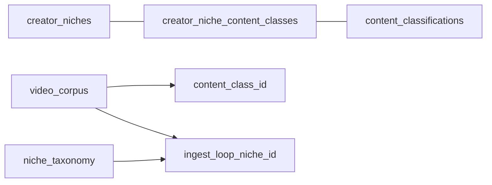

# Mô hình two-axis niche — GetViews.vn

**Status:** Canonical architecture + taxonomy doc (Wave D + Wave T + **v2 expansion** · 2026-05-22)  
**Wave T amended:** 16 active UX niches (restore `comedy`, add `art_craft`) · 82 content classes  
**Migrations:** `20260823000003` (feedback) · `20260824000000` (art/comedy/AI v2)  
**Audience:** Tech Lead, PD, backend/frontend agents, QA  
**Product spec (Morning Signal):** [`class-intelligence-ui-spec.md`](class-intelligence-ui-spec.md)  
**Ops runbook:** [`two-axis-niche-cutover-runbook.md`](two-axis-niche-cutover-runbook.md) (HI-11 rollback + ME-18)

---

## TOC

1. [Overview & three layers](#1-overview--three-layers)
2. [UX creator niches (16 active)](#2-ux-creator-niches-16-active)
3. [Content classes (77 video + 5 carousel)](#3-content-classes-77-video--5-carousel)
4. [Junction & `is_primary` contract](#4-junction--is_primary-contract)
5. [Format axis vocabulary](#5-format-axis-vocabulary)
6. [`creator_tier` bands + Phase 2 peer percentile](#6-creator_tier-bands--phase-2-peer-percentile)
7. [HI-11 ingest assignment + TD-6](#7-hi-11-ingest-assignment--td-6)
8. [Phase C pivot (no `video_corpus.niche_id`)](#8-phase-c-pivot)
9. [MV catalog + §8.1 refresh chain](#9-mv-catalog--81-refresh-chain)
10. [Frontend browse → Home / Trends / Morning signal](#10-frontend-browse--home--trends--morning-signal)
11. [ACQE + junction proposal queue](#11-acqe--junction-proposal-queue)
12. [Audit criteria & junction-invalid triage](#12-audit-criteria--junction-invalid-triage)
13. [Wave T sign-off](#13-wave-t-sign-off)
14. [Related docs](#14-related-docs)

---

## 1. Overview & three layers

Một bảng `niche_taxonomy` duy nhất không phục vụ đồng thời UX picker (~16 bucket) và cohort analysis (~82 class).

| Lớp | Bảng | Vai trò |
|-----|------|---------|
| **UX bucket** | `creator_niches` (16 active) | Onboarding, Settings, Trends pills |
| **Analysis sharp** | `content_classifications` (82) | `video_corpus.content_class_id`, benchmark, Morning Signal |
| **Ingest loop** | `niche_taxonomy` + `ingest_loop_niche_id` | Batch ED discovery theo `signal_hashtags[]` |



**Cohort canonical (Phase C):** `(content_class_id, creator_tier)` — không còn `video_corpus.niche_id`.

Source of truth code: [`cloud-run/getviews_pipeline/two_axis_taxonomy.py`](../../cloud-run/getviews_pipeline/two_axis_taxonomy.py) ≡ TypeScript bridge in [`src/lib/profileNiches.ts`](../../src/lib/profileNiches.ts).

---

## 2. UX creator niches (16 active)

| # | slug | name_vn | Legacy bridge `niche_taxonomy.id` |
|---|------|---------|----------------------------------|
| 1 | beauty | Làm đẹp · Skincare | 2 |
| 2 | fashion | Thời trang · Phụ kiện | 3 |
| 3 | food | Ẩm thực · Ăn uống | 4 |
| 4 | lifestyle | Đời sống · Tâm sự | 27 |
| 5 | comedy | Hài · Giải trí | **13** |
| 6 | family | Nuôi con · Gia đình | 6 |
| 7 | education | Giáo dục · Sự nghiệp | 7 |
| 8 | tech_gaming | Công nghệ · Gaming | 8 |
| 9 | business | Kinh doanh · Tài chính | 5 |
| 10 | wellness | Sức khoẻ · Wellness | **26** |
| 11 | travel | Du lịch · Thể thao | 11 |
| 12 | auto | Ô tô · Xe máy | 12 |
| 14 | gym_fitness | Gym · Fitness | 14 |
| 15 | music_dance | Âm nhạc · Vũ đạo | 28 |
| 16 | real_estate | Bất động sản · Nhà đất | **10** |
| 17 | art_craft | Nghệ thuật · Thủ công | **29** |

**Retirement map (20260728, amended v2):**

| Retired slug | DB id | Action |
|--------------|-------|--------|
| pets_home | 13 | `active=false` — pets/home classes primary under `lifestyle` (4) |

**v2 restore (20260824):** `comedy` (5) active again — classes 24–27 primary under comedy; secondary browse under lifestyle.

**Rubric:** 16 buckets — thêm Art/Craft (17) và Comedy (5) tách cohort khỏi lifestyle dilution.

---

## 3. Content classes (77 video + 5 carousel = 82)

### Video classes (ids 1–74)

| # | slug | name_vn | format_axis | topic_axis |
|---|------|---------|-------------|------------|
| 1 | beauty_skincare_routine | Skincare routine | tutorial | beauty |
| 2 | beauty_makeup_tutorial | Makeup tutorial | tutorial | beauty |
| 3 | beauty_product_review | Review mỹ phẩm | review_unboxing | beauty |
| 4 | beauty_haul | Haul mỹ phẩm | review_unboxing | beauty |
| 5 | beauty_problem_solution | Vấn đề da & cách trị | pov_storytelling | beauty |
| 6 | fashion_outfit_styling | Outfit phối đồ | pov_storytelling | fashion |
| 7 | fashion_haul_shopping | Haul thời trang | review_unboxing | fashion |
| 8 | fashion_accessory_review | Phụ kiện review | review_unboxing | fashion |
| 9 | fashion_lookbook_montage | Lookbook montage | montage_highlights | fashion |
| 10 | fashion_thrift_secondhand | Thrift / đồ secondhand | vlog_daily | fashion |
| 11 | food_restaurant_review | Review quán ăn | pov_storytelling | food |
| 12 | food_street_food_vlog | Ăn vặt / street food | vlog_daily | food |
| 13 | food_recipe_tutorial | Công thức nấu ăn | tutorial | food |
| 14 | food_challenge | Food challenge | react_commentary | food |
| 15 | food_drinks_cafe | Đồ uống & cafe | review_unboxing | food |
| 16 | lifestyle_morning_routine | Morning / night routine | vlog_daily | lifestyle |
| 17 | lifestyle_daily_vlog | Daily vlog | vlog_daily | lifestyle |
| 18 | lifestyle_minimalism | Minimalism / dọn dẹp | tutorial | lifestyle |
| 19 | lifestyle_self_improvement | Self-improvement | talking_head_advice | lifestyle |
| 20 | storytelling_relationship | POV tình yêu / quan hệ | pov_storytelling | storytelling |
| 21 | storytelling_workplace | POV công sở | pov_storytelling | storytelling |
| 22 | storytelling_late_night | Tâm sự đêm khuya | pov_storytelling | storytelling |
| 23 | lifestyle_aesthetic | Lifestyle aesthetic | montage_highlights | lifestyle |
| 24 | comedy_skit_scripted | Hài skit kịch bản | skit_scripted | comedy |
| 25 | comedy_parody_satire | Parody / châm biếm | skit_scripted | comedy |
| 26 | comedy_observational | Hài quan sát relatable | pov_storytelling | comedy |
| 27 | comedy_react_response | React / response | react_commentary | comedy |
| 28 | music_cover_singing | Cover hát / âm nhạc | music_performance | music |
| 29 | music_dance_choreography | Dance / choreography | dance_choreography | music |
| 30 | parenting_baby_milestone | Mốc phát triển em bé | vlog_daily | family |
| 31 | parenting_mom_humor | Mẹ bỉm relatable | observational_relatable | family |
| 32 | parenting_dad_content | Bố nuôi con | vlog_daily | family |
| 33 | parenting_tips_advice | Mẹo nuôi dạy | talking_head_advice | family |
| 34 | family_vlog_daily | Family vlog | vlog_daily | family |
| 35 | edu_academic_explain | Giải thích học thuật | talking_head_advice | education |
| 36 | edu_language_lesson | Học ngoại ngữ | tutorial | education |
| 37 | edu_life_skill | Kỹ năng sống | tutorial | education |
| 38 | edu_career_advice | Hướng nghiệp / sự nghiệp | talking_head_advice | education |
| 39 | edu_book_review | Review sách / BookTok | talking_head_advice | education |
| 40 | tech_gadget_unboxing | Mở hộp gadget | review_unboxing | tech |
| 41 | tech_software_tutorial | Hướng dẫn phần mềm | tutorial | tech |
| 42 | gaming_gameplay | Gameplay / highlights | montage_highlights | gaming |
| 43 | gaming_review_commentary | Review game / commentary | talking_head_advice | gaming |
| 44 | gaming_esports_news | Esports / tin tức game | talking_head_advice | gaming |
| 45 | finance_personal_advice | Tài chính cá nhân | talking_head_advice | finance |
| 46 | finance_investment | Đầu tư / chứng khoán | talking_head_advice | finance |
| 47 | finance_business_story | Kinh doanh storytelling | pov_storytelling | finance |
| 48 | mmo_affiliate_education | MMO / Affiliate education | talking_head_advice | business |
| 49 | ecommerce_shopee_review | Review Shopee / gia dụng | review_unboxing | business |
| 50 | ecommerce_live_commerce | Livestream bán hàng | live_commerce | business |
| 51 | real_estate_listing | Listing bất động sản | vlog_daily | real_estate |
| 52 | wellness_mindfulness | Mindfulness / thiền | talking_head_advice | wellness |
| 53 | wellness_sleep_recovery | Giấc ngủ / phục hồi | talking_head_advice | wellness |
| 54 | wellness_nutrition | Dinh dưỡng & supplement | talking_head_advice | wellness |
| 55 | wellness_holistic | Lifestyle holistic | vlog_daily | wellness |
| 56 | fitness_gym_tutorial | Gym workout tutorial | tutorial | fitness |
| 57 | fitness_yoga_pilates | Yoga / Pilates | tutorial | fitness |
| 58 | fitness_calisthenics | Calisthenics / bodyweight | tutorial | fitness |
| 59 | fitness_outdoor_running | Chạy bộ / marathon | vlog_daily | fitness |
| 60 | travel_destination | Điểm đến du lịch | vlog_daily | travel |
| 61 | travel_food_tour | Du lịch ẩm thực | vlog_daily | travel |
| 62 | travel_tips_planning | Mẹo du lịch / lên kế hoạch | talking_head_advice | travel |
| 63 | travel_adventure | Phiêu lưu / outdoor | montage_highlights | travel |
| 64 | sports_event_highlight | Highlight thể thao | montage_highlights | sports |
| 65 | auto_car_review | Review xe ô tô | review_unboxing | auto |
| 66 | auto_moto_culture | Văn hoá moto | vlog_daily | auto |
| 67 | auto_modification | Mod xe / tuning | tutorial | auto |
| 68 | auto_news_industry | Tin tức ngành xe | talking_head_advice | auto |
| ~~69~~ | ~~pets_cute_compilation~~ | **RETIRED 2026-05-27** — use 23 (lifestyle aesthetic) or 72 (pets storytelling) | — | — |
| 70 | pets_care_tips | Mẹo chăm pet | talking_head_advice | pets |
| 71 | pets_training | Huấn luyện pet | tutorial | pets |
| 72 | pets_owner_storytelling | POV chủ pet | pov_storytelling | pets |
| 73 | home_decor_inspiration | Decor / nội thất | montage_highlights | home |
| 74 | home_renovation_diy | Cải tạo / DIY | tutorial | home |
| 80 | art_process_tutorial | Quy trình làm nghệ thuật | tutorial | art_craft |
| 81 | craft_handmade_montage | Handmade montage | montage_highlights | art_craft |
| 82 | ai_tool_workflow_tutorial | Workflow công cụ AI | tutorial | ai_automation |

### Carousel classes (ids 75–79, HI-16)

| # | slug | name_vn | format_axis | topic_axis |
|---|------|---------|-------------|------------|
| 75 | carousel_format_tutorial | Carousel hướng dẫn | tutorial_carousel | carousel |
| 76 | carousel_format_listicle | Carousel list / tips | listicle_carousel | carousel |
| 77 | carousel_format_story | Carousel kể chuyện | story_carousel | carousel |
| 78 | carousel_format_comparison | Carousel so sánh | comparison_carousel | carousel |
| 79 | carousel_format_gallery | Carousel gallery | gallery_carousel | carousel |

**Seed:** video ids 1–74 in `20260510000004_two_axis_niche_pr1_schema.sql`; carousel ids 75–79 in `20260516190000_hi16_carousel_format_axis_junction.sql`.

### 3.1 — Taxonomy v2 expansion (implemented 2026-05-22)

Migration `20260824000000_taxonomy_v2_art_comedy_ai.sql`:

| Mảng | Implementation |
|------|----------------|
| **A. Art & Craft** | UX niche `art_craft` (17) · classes 80–81 primary · legacy ingest 29 |
| **B. Comedy & Skit** | Restore picker `comedy` (5) · classes 24–27 primary · legacy ingest 13 re-inserted |
| **C. AI / Automation** | Class 82 · primary `tech_gaming` (8) · secondary `business` (9) |

### 3.2 — Phase 2 resilience (algorithm drift, creative friction, active learning)

Scaffold only — không auto-promote vào taxonomy prod.

#### Algorithm drift defense (ACQE)

| | |
|---|---|
| **Vấn đề** | Closed enum 79 class + 12 `format_axis` — format mới bị ép vào cell cũ. |
| **Không làm** | `content_class_id = unclassified_unknown` trên MV chính. |
| **v1 scaffold** | ACQE `_export_taxonomy_drift_candidates()` → [`taxonomy-drift-candidates.json`](../qa-reports/taxonomy-drift-candidates.json). Alert khi drift_rate ≥ **5%** / 7 ngày. |
| **Wave 4+** | PD review cluster → đề xuất class/junction mới. |

#### Creative friction — Morning Signal (FE v0)

| | |
|---|---|
| **Vấn đề** | Morning Signal chỉ trả lời “quay gì” — không xét burnout creator. |
| **v1 scaffold** | `productionFriction.ts` + toggle **Quay nhẹ hôm nay** / **Tràn năng lượng** trên `MorningSignalStrip`. |
| **Wave 4+** | Cột `production_friction` trên `content_classifications` sau PD map. |

#### Active learning — hook caption markers (ACQE)

| | |
|---|---|
| **Vấn đề** | `_HOOK_MARKERS` regex hard-code — teencode VN lạc hậu nhanh. |
| **Không làm** | Auto-append regex mỗi đêm (không audit, không TD-7 test). |
| **v1 scaffold** | ACQE `_export_hook_marker_candidates()` → [`hook-marker-candidates.json`](../qa-reports/hook-marker-candidates.json). |
| **Wave 4+** | Human approve → merge markers (DB table hoặc artifact). |

---

## 4. Junction & `is_primary` contract

```sql
creator_niche_content_classes (creator_niche_id, content_class_id, is_primary)
```

- **M:N** — một creator niche chứa nhiều class; hiếm khi class thuộc nhiều niche.
- **`is_primary`:** tie-break lúc **ingest lookup** — **không** filter FE browse.
- **FE browse:** `fetchContentClassIdsForCreatorNiche()` load **toàn bộ** junction rows — test: `corpusNicheFilter.test.ts`.
- **Morning Signal:** `fetchContentClassIdsForCreatorNiche(..., { primaryOnly: true })`.
- **136 union pairs** (56 video + 80 carousel) — CI `test_hi9_junction_seed.py`.

**Carousel (HI-16):** Every active niche links to classes **75–79** (full 14×5 grid).

**Migration lineage:** PR1 seed → PR6 → `20260728000000` → `20260823000002` (Wave 4) → `20260823000003` (feedback fixes).

### 4.1 — Known v1 trade-offs

| Topic | v1 decision | Wave 4+ backlog |
|-------|-------------|-----------------|
| `music_dance` thin (2 classes) | Canonical home for 28–29 | Add lip-sync, reaction classes |
| `real_estate` single class | UX split from business; cohort = class 51 | Project review, market analysis |
| Lifestyle junction breadth | Browse = all; Morning Signal = primary only | Sub-lanes if signal weak |
| Comedy / pets / home under lifestyle | 24–27, 69–74 primary under lifestyle | Dedicated UX niche if density proves need |
| `ecommerce_live_commerce` (50) | Keeps `live_commerce` format_axis | Reframe if ingest mislabels |
| VN gaps (KOS, flex, ASMR) | Not in v1 | ACQE proposal queue |

### Per-niche junction tables

#### beauty (id 1)

| Class ids | Slugs | Primary |
|-----------|-------|---------|
| 1–5 | beauty_skincare_routine … beauty_problem_solution | ✓ |

#### fashion (id 2)

| Class ids | Slugs | Primary |
|-----------|-------|---------|
| 6–10 | fashion_outfit_styling … fashion_thrift_secondhand | ✓ |

#### food (id 3)

| Class ids | Slugs | Primary |
|-----------|-------|---------|
| 11–15 | food_restaurant_review … food_drinks_cafe | ✓ |
| 61 | travel_food_tour | secondary — food tour also surfaces under travel |

#### lifestyle (id 4) — absorbs retired comedy (5) + pets_home (13)

| Class ids | Slugs | Primary |
|-----------|-------|---------|
| 16–23 | lifestyle_morning_routine … lifestyle_aesthetic (+ storytelling POV 20–22) | ✓ |
| 24–27 | comedy_skit_scripted … comedy_react_response | ✓ — primary under lifestyle (ex-comedy) |
| 26 | comedy_observational (class slug) | ✓ — `format_axis = pov_storytelling`; not the observational format token |
| 28–29 | music_cover_singing, music_dance_choreography | secondary — canonical home is music_dance (15) |
| 49 | ecommerce_shopee_review | secondary — Wave 4; canonical home is business (9) |
| 70–74 | pets_care … home_renovation_diy | ✓ — primary under lifestyle (ex-pets_home); **69 retired** |
| 73 | home_decor_inspiration | ✓ primary lifestyle; also secondary business (9) via Wave 4 |

#### family (id 6)

| Class ids | Slugs | Primary |
|-----------|-------|---------|
| 30–34 | parenting_baby_milestone … family_vlog_daily | ✓ |

#### education (id 7)

| Class ids | Slugs | Primary |
|-----------|-------|---------|
| 35–39 | edu_academic_explain … edu_book_review | ✓ |

#### tech_gaming (id 8)

| Class ids | Slugs | Primary |
|-----------|-------|---------|
| 40–44 | tech_gadget_unboxing … gaming_esports_news | ✓ |

#### business (id 9)

| Class ids | Slugs | Primary |
|-----------|-------|---------|
| 45–50 | finance_personal_advice … ecommerce_live_commerce | ✓ |
| 49 | ecommerce_shopee_review | secondary — Wave 4 affiliate overlap with lifestyle |
| 51 | real_estate_listing | secondary — Wave 4; canonical home is real_estate (16) |
| 73 | home_decor_inspiration | secondary — Wave 4 decor overlap with lifestyle |

#### wellness (id 10)

| Class ids | Slugs | Primary |
|-----------|-------|---------|
| 52–55 | wellness_mindfulness … wellness_holistic | ✓ |
| 57 | fitness_yoga_pilates | secondary — canonical home is gym_fitness (14) |

#### travel (id 11)

| Class ids | Slugs | Primary |
|-----------|-------|---------|
| 60–64 | travel_destination … sports_event_highlight | ✓ |
| 59 | fitness_outdoor_running | secondary — canonical home is gym_fitness (14) |
| 61 | travel_food_tour | secondary — also food (3) |

#### auto (id 12)

| Class ids | Slugs | Primary |
|-----------|-------|---------|
| 65–68 | auto_car_review … auto_news_industry | ✓ |

#### gym_fitness (id 14)

| Class ids | Slugs | Primary |
|-----------|-------|---------|
| 56–59 | fitness_gym_tutorial … fitness_outdoor_running | ✓ |
| 57, 59 | yoga_pilates, outdoor_running | also secondary under wellness (10) and travel (11) respectively |

#### music_dance (id 15)

| Class ids | Slugs | Primary |
|-----------|-------|---------|
| 28–29 | music_cover_singing, music_dance_choreography | ✓ — also secondary under lifestyle (4) for browse |

#### real_estate (id 16)

| Class ids | Slugs | Primary |
|-----------|-------|---------|
| 51 | real_estate_listing | ✓ — also secondary under business (9) via Wave 4 |

### Cross-bucket classes (multi-niche)

| Class id | slug | Niches | Notes |
|----------|------|--------|-------|
| 49 | ecommerce_shopee_review | business (primary), lifestyle (secondary) | Shopee affiliate overlap |
| 51 | real_estate_listing | real_estate (primary), business (secondary) | BĐS vs finance bucket |
| 57 | fitness_yoga_pilates | gym_fitness (primary), wellness (secondary) | Mind-body crossover |
| 59 | fitness_outdoor_running | gym_fitness (primary), travel (secondary) | Marathon / outdoor |
| 61 | travel_food_tour | travel (primary), food (secondary) | Food tour dual home |
| 73 | home_decor_inspiration | lifestyle (primary), business (secondary) | Decor vs affiliate |
| 28–29 | music_* | music_dance (primary), lifestyle (secondary) | Entertainment browse |

Cross-bucket misclassification (0,33% corpus) ≠ `is_primary` bug — xem §12.

---

## 5. Format axis vocabulary

Canonical enum: `FORMAT_AXIS_SLUGS` in `two_axis_taxonomy.py`. **Distinct from class slug** — e.g. class 26 `comedy_observational` uses `format_axis = pov_storytelling`; class 31 uses `observational_relatable` (renamed in `20260823000003`).

### Video format_axis (12 values)

| format_axis | Definition (VN) |
|-------------|-----------------|
| `tutorial` | Hướng dẫn từng bước |
| `review_unboxing` | Review / mở hộp / đánh giá |
| `pov_storytelling` | POV kể chuyện / trải nghiệm cá nhân |
| `montage_highlights` | Montage highlight, lookbook, compilation |
| `vlog_daily` | Vlog đời sống / travel / routine |
| `react_commentary` | Reaction, commentary, challenge |
| `talking_head_advice` | Talking head — lời khuyên, chuyên gia |
| `music_performance` | Biểu diễn âm nhạc / cover |
| `dance_choreography` | Dance / choreography |
| `skit_scripted` | Skit kịch bản / parody |
| `live_commerce` | Livestream bán hàng / deal promo |
| `observational_relatable` | Hài quan sát / relatable — **not** class slug |

### Carousel format_axis (5 values, HI-16)

| format_axis | Definition (VN) |
|-------------|-----------------|
| `tutorial_carousel` | Carousel hướng dẫn slide-by-slide |
| `listicle_carousel` | Carousel list / tips |
| `story_carousel` | Carousel kể chuyện |
| `comparison_carousel` | Carousel so sánh / before-after |
| `gallery_carousel` | Carousel gallery / moodboard |

**Checklist:** 74 video cells populated; junction sanity 99,67% valid (22 rows triaged); VN gaps mapped to existing classes where possible.

---

## 6. `creator_tier` bands + Phase 2 peer percentile

Static bands at ingest (`corpus_instructiveness.py`):

| Band | Followers | Min views (ingest) |
|------|-----------|-------------------|
| nano | <1k | 3.000 |
| micro | 1k–10k | 5.000 |
| mid | 10k–100k | 15.000 |
| macro | 100k–1M | 25.000 |
| mega | ≥1M | 80.000 |

MV: `content_class_tier_intelligence` — grain `(content_class_id, creator_tier)`.

**Phase 2 (#1):** Hybrid `peer_percentile` at diagnosis time; full ntile replacement only when class×tier density ≥50. FE wires `peer_percentile_label` when BE returns it (`FlopDiagnosisStrip`).

---

## 7. HI-11 ingest assignment + TD-6

After Gemini HI-9:

| Mode | Prod | Behavior |
|------|------|----------|
| `shadow` | rollback | Ladder canonical; telemetry only |
| `route` | **batch + user** | Junction promote when confidence ≥0.6 + `junction_has_pair` |

**TD-6:** Route mode chỉ ghi `content_class_id` khi junction lookup thành công — else hashtag ladder.

Provenance: `niche_resolution_source`, `niche_resolution_confidence`, `inferred_creator_niche_id`, `ingest_loop_niche_id`.

---

## 8. Phase C pivot

Migration `20260822000001` — **DROP** `video_corpus.niche_id`.

Production flags: `CORPUS_SCORE_COHORT=class`, `CORPUS_INGEST_LOOP=class`, `CORPUS_WRITE_NICHE_ID=false`, `REFRESH_NICHE_INTELLIGENCE_MV=false`, `VITE_CORPUS_BROWSE_CLASS_ONLY=true`.

Legacy bridge `legacyNicheIdForCreatorNiche()` vẫn bắt buộc cho ingest loop + một số Cloud Run paths — **không** ghi `niche_id` lên corpus row.

---

## 9. MV catalog + §8.1 refresh chain

| MV | Grain | `lifecycle_stage` | Consumer |
|----|-------|-------------------|----------|
| `content_class_intelligence` | 82 classes | **Có** (Wave 3a) | Morning Signal, thin banner, diagnosis |
| `content_class_tier_intelligence` | class × tier | Không | Video/channel benchmark |
| `creator_niche_content_class_stats` | 16×82 junction | Không (Wave 3c) | Ritual anchor |

**Nightly chain (ICT, serial post-ingest via `run_ingest_post_processing`):**

> pg_cron stagger (04:00/04:15/04:30 ICT) is **not required** when nightly ingest completes — Cloud Run calls the three `refresh_*` RPCs inline after ingest.

| Step | Job | ICT | UTC |
|------|-----|-----|-----|
| 1 | `cron-batch-ingest` | 03:00 | 20:00 prev |
| 2 | `refresh_content_class_intelligence()` | 04:00 | 21:00 |
| 3 | `refresh_content_class_tier_intelligence()` | 04:15 | 21:15 |
| 4 | `refresh_creator_niche_content_class_stats()` | 04:30 | 21:30 |
| 5 | `cron-batch-morning-ritual` | 22:00 | 15:00 |

Velocity columns (migration `20260823000001`): `view_velocity`, `format_momentum`, `lifecycle_stage`. Gates: `video_count_7d ≥ 5`, `claim_tier != thin`.

**Anti-patterns:** No `morning_signal JSONB` on MV; no rolling metrics on junction seed table.

---

## 10. Frontend browse → Home / Trends / Morning signal

```
profiles.creator_niche_id
  → fetchContentClassIdsForCreatorNiche()   // full junction
  → fetchContentClassIdsForCreatorNiche(..., { primaryOnly: true })  // Morning Signal
  → applyVideoCorpusNicheFilter()           // content_class_id IN (...)
  → video_corpus
```

| Surface | Path | Notes |
|---------|------|-------|
| Browse / thin banner | `useContentClassIntelligence` | Sum junction `sample_size` |
| Morning Signal | `useClassMorningSignals` + `MorningSignalStrip` | Max-2-Card above `StudioHero` |
| Ritual scripts | `StudioHero` + `morning_ritual.py` | Unchanged below signal strip |
| Cross-niche lane | `CrossNicheBreakoutLane` on Explore | Cap 3, class NOT IN junction |
| Carousel diagnosis | `FlopDiagnosisStrip` | Save ≥3% threshold hint |

Spec: [`class-intelligence-ui-spec.md`](class-intelligence-ui-spec.md).

---

## 11. ACQE + junction proposal queue

Wave 1d: ACQE exports `proposed_junction` when `(creator_niche_id, content_class_id)` appears ≥5 videos / 3 nights without edge — **human approve only** (Wave 4).

Artifact: `artifacts/qa-reports/acqe-junction-proposals.json` (rolling).

---

## 12. Audit criteria & junction-invalid triage

**Junction-valid:** `content_class_id` ∈ junction(`map_legacy_niche_to_creator_niche(ingest_loop_niche_id)`).

Audit 2026-05-21: 6.772 video · **22 vi phạm (0,33%)** — triage: [`junction-invalid-triage-v1.json`](../qa-reports/junction-invalid-triage-v1.json).

Decision tree: **reclassify** (misclassification) vs **defer Wave 4** (valid cross-link → junction expansion).

---

## 13. Wave T sign-off

| Role | Decision | Date |
|------|----------|------|
| Tech Lead | Outcome A — keep 14 active UX niches; exceptions in §4.1 | 2026-05-22 |
| PD | Label/copy freeze + format_axis rename observational_relatable | 2026-05-22 |

**Wave T signed:** 2026-05-22 — taxonomy frozen for v1; junction-invalid triage queued for Wave 1a/4.

### Evidence artifacts

| Artifact | Purpose |
|----------|---------|
| [`two-axis-taxonomy-audit.json`](../qa-reports/two-axis-taxonomy-audit.json) | Code-truth counts; parity checks |
| [`junction-invalid-triage-v1.json`](../qa-reports/junction-invalid-triage-v1.json) | Wave 1a — 22-row decision tree |
| [`20260823000003_taxonomy_feedback_fixes.sql`](../../supabase/migrations/20260823000003_taxonomy_feedback_fixes.sql) | Post-review fixes |
| [`wave-t-baseline.json`](../qa-reports/wave-t-baseline.json) | QA gate baseline |

**Wave 4 gate:** Junction expansion only for rows marked `defer_wave4` in triage artifact after human review.

---

## 14. Related docs

| Doc | Purpose |
|-----|---------|
| [`class-intelligence-ui-spec.md`](class-intelligence-ui-spec.md) | Morning Signal UX |
| [`two-axis-niche-cutover-runbook.md`](two-axis-niche-cutover-runbook.md) | HI-11 rollback + ME-18 ops |
| [`corpus-ingest-criteria-v1.md`](corpus-ingest-criteria-v1.md) | Purity gates |
| [`content-class-pivot-metrics.sql`](content-class-pivot-metrics.sql) | Observability |
| [`archive/niche-taxonomy-ingest-ui-pipeline.md`](archive/niche-taxonomy-ingest-ui-pipeline.md) | Archived — merged here |
| [`archive/two-axis-niche-cutover-pr1-pr6.md`](archive/two-axis-niche-cutover-pr1-pr6.md) | PR1→PR6 cutover (archived) |

**Code map:**

| Component | Path |
|-----------|------|
| Taxonomy | `two_axis_taxonomy.py` |
| Junction lookup | `junction_content_class.py` |
| Browse filter | `src/lib/corpusNicheFilter.ts` |
| Morning signals | `src/lib/classMorningSignals.ts`, `useClassMorningSignals.ts` |
| Phase C migration | `20260822000001_phase_c_drop_video_corpus_niche_id.sql` |
| Velocity MV | `20260823000001_content_class_intelligence_velocity.sql` |
