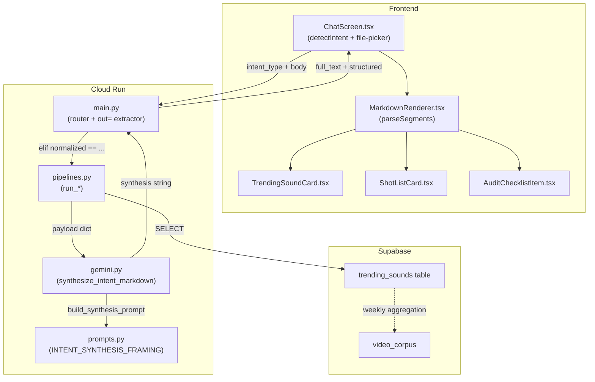

# Production Pipeline Upgrades — Revised Plan

**Date:** 2026-04-08 | **Last reviewed:** 2026-04-11 (post Wave 3 complete)
**Based on:** getviews-production-pipeline-plan.md + production-pipeline-downstream-updates.md
**Scope:** Three new pipeline intents — U3 Sound Intelligence, U2 Shot List Generator, U1 Pre-Publish Audit

## Wave 3 Gate Status (as of 2026-04-11)

| Gate | Status | Notes |
|---|---|---|
| Wave 3 P0 all QA PASS | ✅ | P0-1 through P0-6 complete; step_queue on all 5 pipelines (620a6aa) |
| Wave 3 P1 all QA PASS | ✅ | P1-6 through P1-10 complete |
| Wave 3 P2 all QA PASS | ✅ | P2-11, P2-12 complete; P2-13 deferred |
| **U2 dependency gate** | ✅ **CLEARED** | All Wave 3 P0 items are QA PASS — U2 can start now |
| **U1 dependency gate** | ✅ **CLEARED** (partial) | Wave 3 complete; still needs R2 bucket + billing decision |

---

## Architecture Map

---

## Build Priority (updated 2026-04-11)

| Upgrade | Status | When to build | Rationale |
|---|---|---|---|
| U3 Sound Intelligence | 🔲 Not started | **Now** | Additive, no new routing, sound fields already in video_corpus. Highest ROI. |
| U2 Shot List Generator | 🔲 Not started | **Now** ✅ Gate cleared | Wave 3 P0 all QA PASS — dependency gate lifted. Build immediately after U3. |
| U1 Pre-Publish Audit | 🔲 Deferred | After R2 infra + billing decision | Wave 3 complete ✅. Still needs: R2 `temp-audits` bucket + 24h lifecycle rule + credits decision. |

**Wave 3 P0 gate items** — all QA PASS ✅:
- P0-1: Corpus citations
- P0-2: Thumbnail reference cards
- P0-3: Hook formula templates
- P0-4: Recency tags + signal badges
- P0-6: Agentic Step Logger (SSE)

---

## Conflict Fixes (identified during plan review)

**Conflict 1 — Dual-file sound injection (Medium)**
Modifying the trend_spike synthesis requires edits in TWO places, not one:
- `cloud-run/getviews_pipeline/pipelines.py` — add `trending_sounds` key to the `payload` dict inside `run_trend_spike()`
- `cloud-run/getviews_pipeline/prompts.py` — update `INTENT_SYNTHESIS_FRAMING["trend_spike"]` to instruct the model to reference `trending_sounds` from the JSON

**Conflict 2 — MarkdownRenderer segment naming (Low)**
JSON emitted by the model uses `"type":"sound_card"` (wire format). Internal TypeScript `Segment` union uses `kind: "sound_card"`. New segments follow the same dual-naming pattern as `trend_card`. Parser scans for `{"type":"sound_card"...}`, replaces with a marker, emits `{ kind: "sound_card", data, cardIndex }`.

**Conflict 3 — New intents need 4 integration points each (High)**
Every new intent (`shot_list`, `pre_publish_audit`) requires changes in all 4 places:
1. `cloud-run/main.py` lines 400–431: `elif normalized == "shot_list"` dispatch block
2. `cloud-run/main.py` lines 482–519: `out =` extraction block (defines `full_text` + `structured`)
3. `src/routes/_app/ChatScreen.tsx` `detectIntent()`: keyword regex to route user query
4. `src/routes/_app/ChatScreen.tsx` `VIDEO_INTENTS` set: add `"pre_publish_audit"` if video URL is required

**Conflict 4 — Upload→Stream flow missing (High)**
No upload endpoint exists in `main.py`. `ChatScreen.tsx` has no file-picker. The integration requires:
- New `POST /upload` route in `main.py`: accepts `multipart/form-data`, uploads to R2 `temp-audits/` (24h lifecycle), returns `{ r2_url: string }`
- `ChatScreen.tsx`: file input `<input type="file" accept="video/*">`, calls `/upload` first, then calls `/stream` with the R2 URL injected as `urls[0]`
- `pre_publish_audit` is triggered by file drop/pick, not keyword detection — `detectIntent` returns `"pre_publish_audit"` only when a file is attached

**Conflict 5 — Migration numbering (Updated)**
Wave 3 consumed `000022`–`000025`. Next migration must be `20260411000026_create_trending_sounds.sql`.
Last existing: `20260411000025_video_dang_hoc.sql`.

---

## U3 — Sound Intelligence (Build Now)

**Status:** 🔲 Not started  
**Why now:** `video_corpus` has `sound_id`, `sound_name`, `is_original_sound` columns live (migration `20260411000020`), populated by `corpus_ingest.py` on every video ingest. No new intent routing. Purely additive — worst case is an empty sound section if the batch hasn't run yet.

### New files

- `supabase/migrations/20260411000026_create_trending_sounds.sql` — `trending_sounds` table + RLS *(was 000022 — taken by Wave 3)*
- `src/lib/batch/sound-aggregator.ts` — reads `video_corpus.sound_id/name/is_original_sound`, aggregates by niche + week, upserts `trending_sounds`
- `src/lib/batch/weekly-job.ts` — orchestrates corpus refresh + sound aggregation (runs after Sunday batch)
- `src/components/chat/TrendingSoundCard.tsx` — renders a sound card with name, usage count, commerce signal
- `src/components/explore/TrendingSoundsSection.tsx` — Explore tab section listing trending sounds

### Modified files

- `cloud-run/getviews_pipeline/pipelines.py` — `run_trend_spike()`: query `trending_sounds` table, add `trending_sounds` key to payload dict
- `cloud-run/getviews_pipeline/prompts.py` — update `INTENT_SYNTHESIS_FRAMING["trend_spike"]` with `SOUND_CONTEXT_INJECTION` instruction
- `src/components/chat/MarkdownRenderer.tsx` — add `sound_card` segment type: scanner + `SoundCardSegment` to the `Segment` union + render branch

### Integration notes

- No changes needed in `main.py` router (still uses `trend_spike`)
- No changes needed in `detectIntent()` (still detected as `trend_spike`)
- The extra `trending_sounds` key in the payload flows transparently through `synthesize_intent_markdown` → `build_synthesis_prompt` → JSON dump

---

## U2 — Shot List Generator (Build After U3)

**Status:** 🔲 Not started — dependency gate ✅ CLEARED  
**Why now:** Wave 3 P0 all QA PASS. `brief_generation` covers 80% of the use case but lacks structured shot-by-shot breakdown. U2 adds a new `shot_list` intent with its own pipeline, prompt framing, and card UI.

**Dependency gate:** ✅ All 5 Wave 3 P0 items QA PASS — start immediately after U3.

### New files

- `src/lib/batch/shot-list-generator.ts` — `generateShotList(analysis, format, nicheId)` function
- `src/lib/prompts/shot-list-system.ts` — system prompt for shot list generation
- `src/components/chat/ShotListCard.tsx` — renders a single shot card (beat number, duration, action, text overlay)
- `src/lib/prompts/knowledge-base.ts` — add `SHOT_LIST_FORMATS`, `FORMAT_SHOT_COUNTS`, `isFormatEligibleForShotList`

### Modified files

- `cloud-run/getviews_pipeline/pipelines.py` — add `run_shot_list(video_id_or_query, niche, session, questions)` function
- `cloud-run/main.py`:
  - Line ~431: add `elif normalized == "shot_list": pipeline_coro = run_shot_list(...)`
  - Line ~519: add `elif normalized == "shot_list": full_text = out.get("shot_list") or ""; structured = {k: out[k] for k in ("niche", "format") if k in out} or None`
- `cloud-run/getviews_pipeline/prompts.py` — add `INTENT_SYNTHESIS_FRAMING["shot_list"]` entry
- `src/routes/_app/ChatScreen.tsx`:
  - `detectIntent()`: add regex for shot list triggers (e.g., `/\b(shot list|danh sách cảnh quay|kịch bản quay)\b/i`)
  - `VIDEO_INTENTS`: do not add (shot list does not require a video URL)
- `src/components/chat/MarkdownRenderer.tsx` — add `shot_list` segment type

---

## U1 — Pre-Publish Audit (Deferred)

**Status:** 🔲 Deferred — Wave 3 gate ✅ cleared; R2 + billing still pending  
**Why deferred:** Highest creator value but highest complexity. Remaining blockers:
- R2 `temp-audits` bucket doesn't exist — provision before any code works
- Upload→stream two-step is a new interaction pattern in ChatScreen.tsx (file state, error handling, orphaned R2 objects on stream failure)
- 7-metric comparator requires simultaneous analysis of two videos — new Gemini call pattern not used in any existing pipeline
- Credit billing decision needed: does this consume credits? If no, it's abuseable

**Dependency gate:** ~~Wave 3 complete~~ ✅ + R2 `temp-audits` bucket provisioned + billing decision made.

### New files

- `src/lib/batch/pre-publish-comparator.ts` — 7-metric comparison engine (hook strength, pacing, face timing, text overlay density, CTA presence, duration fit, commerce signal)
- `src/lib/batch/pre-publish-upload.ts` — client-side upload helper: POST to `/upload`, returns R2 URL
- `src/components/chat/AuditChecklistItem.tsx` — renders a single audit metric row (pass/warn/fail + score)

### Modified files

- `cloud-run/main.py`:
  - Add `POST /upload` route: accepts `multipart/form-data` (`file` field), uploads to R2 `temp-audits/{uuid}.mp4` (24h lifecycle via R2 lifecycle rule), returns `{ r2_url: string }`
  - Line ~431: add `elif normalized == "pre_publish_audit": pipeline_coro = run_pre_publish_audit(urls[0], niche, session, questions)`
  - Line ~519: add `elif normalized == "pre_publish_audit": full_text = out.get("audit") or ""; structured = {k: out[k] for k in ("niche", "metrics", "reference_videos") if k in out} or None`
- `cloud-run/getviews_pipeline/pipelines.py` — add `run_pre_publish_audit(video_url, niche, session, questions)`
- `cloud-run/getviews_pipeline/prompts.py` — add `INTENT_SYNTHESIS_FRAMING["pre_publish_audit"]` entry
- `src/lib/prompts/knowledge-base.ts` — add `AUDIT_METRICS`
- `src/routes/_app/ChatScreen.tsx`:
  - Add `<input type="file" accept="video/*">` file picker (hidden, triggered by paperclip button)
  - File attach flow: `onFileAttach → uploadFile() → setAttachedR2Url(url)` — URL injected into the next stream call's `urls` array
  - `detectIntent()`: when `attachedR2Url` is set, return `"pre_publish_audit"` regardless of query text
  - `VIDEO_INTENTS`: add `"pre_publish_audit"` (requires video URL — the uploaded R2 URL)
- `src/components/chat/MarkdownRenderer.tsx` — add `audit_checklist` segment type

---

## Docs updates

- After U3: `artifacts/docs/emotional-design-system.md` — sound card design tokens
- After U2: `artifacts/docs/copy-rules.md` — shot list copy patterns
- After U1: `artifacts/docs/copy-rules.md`, `artifacts/docs/emotional-design-system.md` — audit checklist tokens
- After all three: `artifacts/docs/output-quality-plan.md` + `artifacts/docs/getviews-vn-northstar-v1_3.html`

---

## Pre-conditions checklist before starting U1

- [x] Wave 3 P0–P2 all QA PASS ✅ (2026-04-11)
- [ ] R2 `temp-audits` bucket created with 24h lifecycle rule configured
- [ ] Decision made: does `pre_publish_audit` consume credits? (yes = update billing gate; no = add rate-limit)
- [ ] Orphaned R2 object cleanup strategy defined (e.g. on stream failure, delete the uploaded file)
